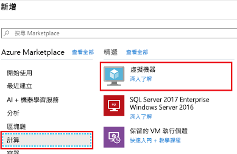
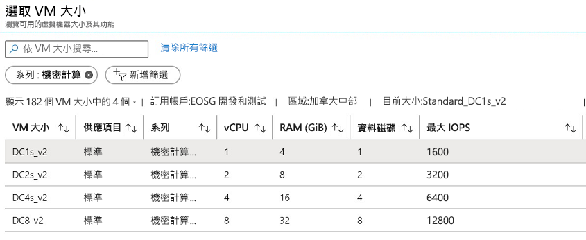
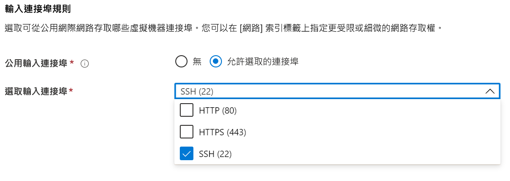
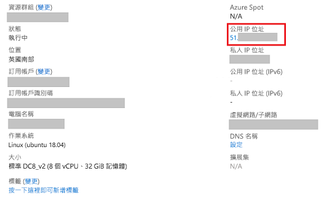

# <a name="quickstart-deploy-an-azure-confidential-computing-vm-in-the-azure-portal"></a>快速入門：在 Azure 入口網站中部署 Azure 機密運算 VM

使用 Azure 入口網站來建立 Intel SGX 所支援的虛擬機器 (VM)，以便開始使用 Azure 機密運算。 接著，您會安裝 Open Enclave 軟體開發套件 (SDK) 來設定您的開發環境。 

如果您想要使用自訂組態來部署機密運算虛擬機器，建議您使用本教學課程。 否則，我們建議您遵循 [Microsoft 商業市集的機密運算虛擬機器部署步驟](quick-create-marketplace.md)。


## <a name="prerequisites"></a>Prerequisites

如果您沒有 Azure 訂用帳戶，請先[建立帳戶](https://azure.microsoft.com/pricing/purchase-options/pay-as-you-go/)再開始。

> [!NOTE]
> 免費試用帳戶無法存取本教學課程中使用的虛擬機器。 請升級為隨用隨付訂用帳戶。


## <a name="sign-in-to-azure"></a>登入 Azure

1. 登入 [Azure 入口網站](https://portal.azure.com/)。

1. 在頂端選取 [建立資源]  。

1. 在 [Marketplace]  窗格中，選取左側的 [計算]  。

1. 尋找並選取 [虛擬機器]  。

    

1. 在虛擬機器登陸頁面上，選取 [建立]  。


## <a name="configure-a-confidential-computing-virtual-machine"></a>設定機密運算虛擬機器

1. 在 [基本]  索引標籤中，選取您的 [訂用帳戶]  和 [資源群組]  。

1. 針對 [虛擬機器名稱]  ，輸入新 VM 的名稱。

1. 輸入或選取下列值：

   * **區域**：選取適合您的 Azure 區域。

        > [!NOTE]
        > 機密運算虛擬機器只會在特定區域中可用的特殊硬體上執行。 如需 DCsv2 系列 VM 的最新可用區域，請參閱[可用區域](https://azure.microsoft.com/global-infrastructure/services/?products=virtual-machines)。

1. 設定您想要用於虛擬機器的作業系統映射。

    * **選擇影像**：在本教學課程中，請選取 Ubuntu 18.04 LTS。 您也可以選取 Windows Server 2019、Windows Server 2016 或 Ubuntu 16.04 LTS。 如果您選擇這麼做，本教學課程會據此將您重新導向。
    
    * **切換 Gen 2 的映像**：機密運算虛擬機器只會在 [Gen 2](../virtual-machines/linux/generation-2.md) 映像上執行。 確保您選取的映像是 Gen 2 映像。 按一下您要在其上設定虛擬機器的 [進階]  索引標籤。 向下捲動，直到您找到標示為「VM 世代」的區段為止。 選取 [Gen 2]，然後回到 [基本資料]  索引標籤。
    

        


        

    * **返回基本設定**：使用頂端的導覽，回到 [基本資料]  索引標籤。

1. 選擇 [變更大小]  ，以在大小選取器中選擇具有機密運算功能的虛擬機器。 在 [虛擬機器大小] 選取器中，按一下 [清除所有篩選條件]  。 選擇 [新增篩選條件]  ，針對篩選類型選取 [系列]  ，然後只選取 [機密運算]  。

    

    > [!TIP]
    > 您應會看到大小 **DC1s_v2**、**DC2s_v2**、**DC4s_V2** 和 **DC8_v2**。 這些是目前唯一支援機密運算的虛擬機器大小。 [深入了解](virtual-machine-solutions.md)。

1. 填寫下列資訊︰

   * **驗證類型**：如果您要建立 Linux VM，請選取 [SSH 公開金鑰]  。 

        > [!NOTE]
         > 您可以選擇使用 SSH 公開金鑰或密碼進行驗證。 SSH 較為安全。 如需有關如何產生 SSH 金鑰的指示，請參閱[在 Linux 和 Mac 上為 Azure 中的 Linux VM 建立 SSH 金鑰](https://docs.microsoft.com/azure/virtual-machines/virtual-machines-linux-mac-create-ssh-keys)。

    * **使用者名稱**：輸入 VM 的系統管理員名稱。

    * **SSH 公開金鑰**：如果適用的話，請輸入 RSA 公開金鑰。
    
    * **密碼**：如果適用的話，請輸入您的密碼進行驗證。

    * **公用輸入連接埠**：選擇 [允許選取的連接埠]  ，然後選取 [選取公用輸入連接埠]  清單中的 [SSH (22)]  和 [HTTP (80)]  。 如果您要部署 Windows VM，請選取 [HTTP (80)]  和 [RDP (3389)]  。 在本快速入門中，必須執行此步驟，才能連線至 VM 並完成 Open Enclave SDK 設定。 

     


1. 在 [磁碟]  索引標籤中進行變更。

   * 如果您選擇 **DC1s_v2**、**DC2s_v2**、**DC4s_V2** 虛擬機器，請選擇 [標準 SSD]  或 [進階 SSD]  磁碟類型。 
   * 如果您選擇 **DC8_v2** 虛擬機器，請選擇 [標準 SSD]  作為您的磁碟類型。

1. 對下列索引標籤中的設定進行您想要的任何變更，或保留預設設定。

    * **網路功能**
    * **管理**
    * **客體設定**
    * **Tags** (標籤)

1. 選取 [檢閱 + 建立]  。

1. 在 [檢閱 + 建立]  窗格中，選取 [建立]  。

> [!NOTE]
> 如果您已部署 Linux VM，請繼續下一節並繼續進行本教學課程。 如果您已部署 Windows VM，請[遵循這些步驟來連線到您的 Windows VM](../virtual-machines/windows/connect-logon.md)，然後 [在 Windows 上安裝 OE SDK](https://github.com/openenclave/openenclave/blob/master/docs/GettingStartedDocs/install_oe_sdk-Windows.md)。


## <a name="connect-to-the-linux-vm"></a>連線至 Linux VM

如果您已經使用 BASH 殼層，請使用 **ssh** 命令連線到 Azure VM。 在下列命令中，取代 VM 使用者名稱和 IP 位址以連線到您的 Linux VM。

```bash
ssh azureadmin@40.55.55.555
```

您可以在 Azure 入口網站中虛擬機器的 [概觀] 區段下，尋找 VM 的公用 IP 位址。

[!div class="mx-imgBorder"]


如果您是在 Windows 上執行且沒有 BASH 殼層，請安裝 SSH 用戶端，例如 PuTTY。

1. [下載並安裝 PuTTY](https://www.chiark.greenend.org.uk/~sgtatham/putty/download.html)。

1. 執行 PuTTY。

1. 在 [PuTTY 組態] 畫面上，輸入您 VM 的公用 IP 位址。

1. 選取 [開啟]  ，並在提示時輸入您的使用者名稱和密碼。

如需有關連線至 Linux VM 的詳細資訊，請參閱[使用入口網站在 Azure 上建立 Linux VM](../virtual-machines/linux/quick-create-portal.md)。

> [!NOTE]
> 如果您看到有關未將伺服器主機金鑰快取在登錄中的 PuTTY 安全性警示，請從下列選項中做選擇。 如果您信任此主機，請選取 [是]  以將金鑰新增至 PuTTy 的快取並繼續連線。 如果您只想要繼續連線一次，而不想要將金鑰新增至快取，請選取 [否]  。 如果您不信任此主機，請選取 [取消]  以放棄連線。

## <a name="install-the-open-enclave-sdk-oe-sdk"></a>安裝 Open Enclave SDK (OE SDK) <a id="Install"></a>

遵循逐步指示，在執行 Ubuntu 18.04 LTS Gen 2 映像的 DCsv2 系列虛擬機器上安裝 [OE SDK](https://github.com/openenclave/openenclave)。 

如果您的虛擬機器在 Ubuntu 16.04 LTS Gen 2 上執行，您必須遵循 [Ubuntu 16.04 的安裝指示](https://github.com/openenclave/openenclave/blob/master/docs/GettingStartedDocs/install_oe_sdk-Ubuntu_16.04.md)。

#### <a name="1-configure-the-intel-and-microsoft-apt-repositories"></a>1.設定 Intel 和 Microsoft APT 存放庫

```bash
echo 'deb [arch=amd64] https://download.01.org/intel-sgx/sgx_repo/ubuntu bionic main' | sudo tee /etc/apt/sources.list.d/intel-sgx.list
wget -qO - https://download.01.org/intel-sgx/sgx_repo/ubuntu/intel-sgx-deb.key | sudo apt-key add -

echo "deb http://apt.llvm.org/bionic/ llvm-toolchain-bionic-7 main" | sudo tee /etc/apt/sources.list.d/llvm-toolchain-bionic-7.list
wget -qO - https://apt.llvm.org/llvm-snapshot.gpg.key | sudo apt-key add -

echo "deb [arch=amd64] https://packages.microsoft.com/ubuntu/18.04/prod bionic main" | sudo tee /etc/apt/sources.list.d/msprod.list
wget -qO - https://packages.microsoft.com/keys/microsoft.asc | sudo apt-key add -
```

#### <a name="2-install-the-intel-sgx-dcap-driver"></a>2.安裝 Intel SGX DCAP 驅動程式

```bash
sudo apt update
sudo apt -y install dkms
wget https://download.01.org/intel-sgx/sgx-dcap/1.4/linux/distro/ubuntuServer18.04/sgx_linux_x64_driver_1.21.bin -O sgx_linux_x64_driver.bin
chmod +x sgx_linux_x64_driver.bin
sudo ./sgx_linux_x64_driver.bin
```

> [!WARNING]
> 請從 [Intel 的 SGX 網站](https://01.org/intel-software-guard-extensions/downloads)使用最新的 Intel SGX DCAP 驅動程式。

#### <a name="3-install-the-intel-and-open-enclave-packages-and-dependencies"></a>3.安裝 Intel 和 Open Enclave 套件和相依性

```bash
sudo apt -y install clang-7 libssl-dev gdb libsgx-enclave-common libsgx-enclave-common-dev libprotobuf10 libsgx-dcap-ql libsgx-dcap-ql-dev az-dcap-client open-enclave
```

> [!NOTE] 
> 此步驟也會安裝 [az-dcap-client](https://github.com/microsoft/azure-dcap-client)套件，這是在 Azure 中執行遠端證明所需的套件。

#### <a name="4-verify-the-open-enclave-sdk-install"></a>4.**確認 Open Enclave SDK 安裝**

請參閱 GitHub 上的[使用 Open Enclave SDK](https://github.com/openenclave/openenclave/blob/master/docs/GettingStartedDocs/Linux_using_oe_sdk.md)，以驗證和使用已安裝的 SDK。

## <a name="clean-up-resources"></a>清除資源

若不再需要，您可以刪除資源群組、虛擬機器和所有相關資源。 

請選取虛擬機器的資源群組，然後選取 [刪除]  。 確認要完成資源刪除作業的資源群組名稱。

## <a name="next-steps"></a>後續步驟

在本快速入門中，您已部署機密運算虛擬機器，並已安裝 Open Enclave SDK。 如需有關 Azure 上機密運算虛擬機器的詳細資訊，請參閱[虛擬機器的解決方案](virtual-machine-solutions.md)。 

如果您已部署 Windows VM，請了解如何使用 GitHub 上[適用於 Windows 的 OE SDK 範例](https://github.com/openenclave/openenclave/blob/master/samples/README_Windows.md)來建置應用程式。 

藉由繼續了解 GitHub 上的 Open Enclave SDK Linux 範例，探索如何在 Linux 上建置機密運算應用程式。 

> [!div class="nextstepaction"]
> [在 Linux 上建置 Open Enclave SDK 範例](https://github.com/openenclave/openenclave/blob/master/samples/README_Linux.md)
