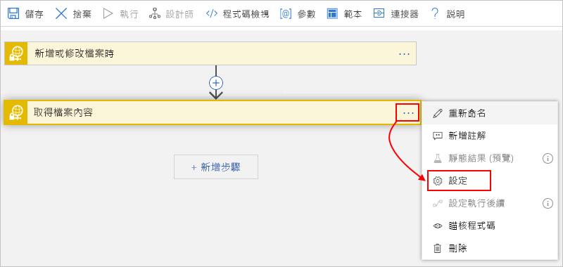

# 藉由使用 SSH 和 Azure Logic Apps 來監視、建立及管理 SFTP 檔案

若要使用 [Secure Shell (SSH)](https://www.ssh.com/ssh/protocol/) 通訊協定在[安全檔案傳輸通訊協定 (SFTP)](https://www.ssh.com/ssh/sftp/) \(英文\) 伺服器上，將監視、建立、傳送及接收檔案的工作自動化，您可以使用 Azure Logic Apps 和 SFTP-SSH 連接器來建置整合工作流程並自動化。 SFTP 是一個網路通訊協定，可透過任何可靠的資料流提供檔案存取、檔案傳輸和檔案管理。

> [!NOTE]
> SFTP SSH 連接器目前不支援這些 SFTP 伺服器：
> 
> * IBM DataPower
> * MessageWay
> * OpenText 安全的 MFT
> * OpenText GXS

以下是一些您可自動化的範例工作：

* 監視檔案何時新增或變更。
* 取得、建立、複製、重新命名、更新、列出及刪除檔案。
* 建立資料夾。
* 取得檔案內容與中繼資料。
* 將封存檔案解壓縮到資料夾。

您可以使用觸發程序來監視 SFTP 伺服器上的事件，並讓輸出可供其他動作使用。 您可以使用動作，在 SFTP 伺服器上執行各種工作。 您也可以讓邏輯應用程式中的其他動作使用 SFTP 動作的輸出。 例如，如果您定期從 SFTP 伺服器擷取檔案，可以藉由使用 Office 365 Outlook 連接器或 Outlook.com 連接器，傳送關於那些檔案及其內容的電子郵件警示。 如果您不熟悉邏輯應用程式，請檢閱[什麼是 Azure Logic Apps？](../logic-apps/logic-apps-overview.md)

如需 SFTP SSH 連接器和 SFTP 連接器之間的差異，請參閱本主題稍後的 [比較 SFTP-ssh 與 sftp](#comparison) 一節。

## 限制

* SFTP SSH 連接器支援私密金鑰驗證或密碼驗證，而不是兩者都支援。

* SFTP-支援 [區塊](../logic-apps/logic-apps-handle-large-messages.md) 處理的 ssh 動作可以處理高達 1 GB 的檔案，而不支援區塊處理的 sftp ssh 動作則可以處理高達 50 MB 的檔案。 雖然預設區塊大小為 15 MB，但此大小可動態變更（從 5 MB 開始），並根據網路延遲、伺服器回應時間等因素，逐漸增加到 50 MB 的最大值。

  > [!NOTE]
  > 若為 [整合服務環境 (ISE) ](../logic-apps/connect-virtual-network-vnet-isolated-environment-overview.md)中的邏輯應用程式，則此連接器的 ISE 標記版本需要區塊化才能改用 [ISE 訊息限制](../logic-apps/logic-apps-limits-and-config.md#message-size-limits) 。

  當您指定要改用 [的常數區塊大小時](#change-chunk-size) ，您可以覆寫這個調適型行為。 此大小的範圍可從 5 MB 到 50 MB。 例如，假設您有 45 MB 的檔案，以及可以支援該檔案大小而不需要延遲的網路。 彈性區塊化會導致數個呼叫，而不是呼叫一次。 若要減少呼叫的數目，您可以嘗試設定 50 MB 的區塊大小。 在不同的案例中，如果邏輯應用程式的執行時間（例如，使用 15 MB 區塊），您可以嘗試將大小縮減為 5 MB。

  區塊大小會與連接產生關聯，這表示您可以針對支援區塊化的動作使用相同的連接，然後針對不支援區塊化的動作使用相同的連接。 在此情況下，不支援區塊化的動作區塊大小範圍從 5 MB 到 50 MB。 下表顯示哪些 SFTP SSH 動作支援區塊化：

  | 動作 | 區塊化支援 | 覆寫區塊大小支援 |
  |--------|------------------|-----------------------------|
  | **複製檔案** | 否 | 不適用 |
  | **建立檔案** | 是 | 是 |
  | **建立資料夾** | 不適用 | 不適用 |
  | **刪除檔案** | 不適用 | 不適用 |
  | **將封存檔案解壓縮到資料夾** | 不適用 | 不適用 |
  | **取得檔案內容** | 是 | 是 |
  | **使用路徑來取得檔案內容** | 是 | 是 |
  | **取得檔案中繼資料** | 不適用 | 不適用 |
  | **使用路徑取得檔案中繼資料** | 不適用 | 不適用 |
  | **列出資料夾中的檔案** | 不適用 | 不適用 |
  | **重新命名檔案** | 不適用 | 不適用 |
  | **更新檔案** | 否 | 不適用 |
  ||||

* SFTP-SSH 觸發程式不支援訊息區塊處理。 在要求檔案內容時，觸發程式只會選取 15 MB 或更小的檔案。 若要取得大於 15 MB 的檔案，請改為遵循此模式：

  1. 使用只會傳回檔案屬性的 SFTP SSH 觸發程式，例如， **在新增或修改檔案時， (屬性只)** 。

  1. 遵循 [SFTP-SSH **取得檔案內容** ] 動作的觸發程式，它會讀取完整的檔案，並隱含地使用訊息區塊處理。

## 比較 SFTP-SSH 與 SFTP

以下是 SFTP-SSH 連接器與 SFTP 連接器之間的其他主要差異，其中 SFTP-SSH 連接器具備這些功能：

* 使用 [SSH.NET 程式庫](https://github.com/sshnet/SSH.NET)，這是可支援 .NET (SSH) 程式庫的開放原始碼安全殼層。

* 提供 **建立資料夾** 動作，可在 SFTP 伺服器上指定的路徑中建立資料夾。

* 提供 **重新命名檔案** 動作，可重新命名 SFTP 伺服器上的檔案。

* 可將連線快取至 SFTP 伺服器 *最多 1 小時* ，這可以改善效能並減少嘗試連線伺服器的次數。 若要設定此快取行為的持續期間，請編輯 SFTP 伺服器 SSH 組態中的 [**ClientAliveInterval**](https://man.openbsd.org/sshd_config#ClientAliveInterval) 屬性。

## 必要條件

* Azure 訂用帳戶。 如果您沒有 Azure 訂用帳戶，請先[註冊免費的 Azure 帳戶](https://azure.microsoft.com/free/)。

* 您的 SFTP 伺服器位址和帳戶認證，這讓您的邏輯應用程式能夠存取您的 SFTP 帳戶。 您也可以存取 SSH 私密金鑰和 SSH 私密金鑰密碼。 若要在上傳大型檔案時使用區塊處理，您需要 SFTP 伺服器上根資料夾的讀取和寫入權限。 否則，您會收到「401未經授權」錯誤。

  > [!IMPORTANT]
  >
  > SFTP-SSH 連接器 *只* 支援這些私密金鑰格式、演算法和指紋：
  >
  > * **私用金鑰格式** ： RSA (Rivest Shamir Adleman) 和 DSA (數位簽章演算法) OpenSSH 和 ssh.com 格式的金鑰。 如果您的私密金鑰是 ( PuTTY) 檔案格式，請先 [將金鑰轉換為 OpenSSH ( pem) 檔案格式](#convert-to-openssh)。
  >
  > * **加密演算法** ：DES-EDE3-CBC、DES-EDE3-CFB、 DES-CBC、AES-128-CBC、AES-192-CBC 和 AES-256-CBC
  >
  > * **指紋** ：MD5
  >
  > 將您想要的 SFTP SSH 觸發程式或動作新增至邏輯應用程式之後，您必須提供 SFTP 伺服器的連線資訊。 當您為此連線提供 SSH 私密金鑰時，* *_請勿手動輸入或編輯索引鍵_* _，這可能會導致連線失敗。 相反地，請確定您是從 SSH 私密金鑰檔案 _*_複製金鑰_*_ ，並將該金鑰 _*_貼入_*_ 連線詳細資料。 
  > 如需詳細資訊，請參閱本文稍後的 [使用 SSH 連接到 SFTP](#connect) 一節。

_[如何建立邏輯應用程式的](../logic-apps/quickstart-create-first-logic-app-workflow.md)基本知識

* 您要在其中存取 SFTP 帳戶的邏輯應用程式。 若要開始使用 SFTP-SSH 觸發程序，請[建立空白邏輯應用程式](../logic-apps/quickstart-create-first-logic-app-workflow.md)。 若要使用 SFTP-SSH 動作，請使用其他觸發程序來啟動邏輯應用程式，例如「週期」觸發程序。

## SFTP-SSH 觸發程序的運作方式

SFTP-SSH 觸發程式的運作方式是輪詢 SFTP 檔案系統，並尋找自上次輪詢後已變更的任何檔案。 某些工具可讓您在檔案變更時保留時間戳記。 在這些情況下，您必須停用此功能，以便讓您的觸發程序可以運作。 以下是一些常見的設定：

| SFTP 用戶端 | 動作 |
|-------------|--------|
| Winscp | 移至 **選項**  >  **喜好** 設定  >  **傳輸**  >  **編輯**  >  **保留時間戳**  >  **停** 用 |
| FileZilla | 移至 [ **傳輸**  >  **保留已傳輸檔案的時間戳記** ]  >  **停** 用 |
|||

當觸發程序找到新檔案時，觸發程序會確認該新檔案是完整檔案，而不是部分寫入的檔案。 例如，當觸發程序檢查檔案伺服器時，檔案可能正在進行變更。 為避免傳回部分寫入的檔案，觸發程序會備註最近發生變更之檔案的時間戳記，但不會立即傳回該檔案。 觸發程序只有在再次輪詢伺服器時，才會傳回該檔案。 有時，此行為可能會導致最長可達觸發程序輪詢間隔兩倍的延遲。

## 將以 PuTTY 為基礎的金鑰轉換為 OpenSSH

如果您的私密金鑰採用 PuTTY 格式，而該格式使用. ppk (PuTTY 私密金鑰) 副檔名，請先將金鑰轉換為 OpenSSH 格式，此格式使用 pem (隱私權增強郵件) 副檔名。

### 以 Unix 為基礎的作業系統

1. 如果您的系統上尚未安裝 PuTTY 工具，請立即這麼做，例如：

   `sudo apt-get install -y putty`

1. 執行此命令，它會建立可與 SFTP SSH 連接器搭配使用的檔案：

   `puttygen <path-to-private-key-file-in-PuTTY-format> -O private-openssh -o <path-to-private-key-file-in-OpenSSH-format>`

   例如：

   `puttygen /tmp/sftp/my-private-key-putty.ppk -O private-openssh -o /tmp/sftp/my-private-key-openssh.pem`

### Windows 作業系統

1. 如果您尚未這麼做，請 [下載最新的 PuTTY 產生器 ( # A0) 工具](https://www.chiark.greenend.org.uk/~sgtatham/putty/latest.html)，然後啟動該工具。

1. 在此畫面上，選取 [ **載入** ]。

   ![選取 [載入]](./media/connectors-sftp-ssh/puttygen-load.png)

1. 以 PuTTY 格式流覽至您的私密金鑰檔案，然後選取 [ **開啟** ]。

1. 從 [ **轉換** ] 功能表選取 [ **匯出 OpenSSH 金鑰** ]。

   ![選取 [匯出 OpenSSH 金鑰]](./media/connectors-sftp-ssh/export-openssh-key.png)

1. 使用副檔名儲存私密金鑰檔案 `.pem` 。

## 考量

本節說明要針對此連接器的觸發程式和動作進行審核的考慮。

### 建立檔案

若要在您的 SFTP 伺服器上建立檔案，您可以使用 [SFTP-SSH **建立** 檔案] 動作。 當此動作建立檔案時，Logic Apps 服務也會自動呼叫您的 SFTP 伺服器以取得檔案的中繼資料。 但是，如果您在 Logic Apps 服務可以進行呼叫以取得中繼資料之前移動新建立的檔案，則會收到 `404` 錯誤訊息 `'A reference was made to a file or folder which does not exist'` 。 若要在檔案建立後略過讀取檔案的中繼資料，請遵循下列步驟來 [新增 [ **取得所有檔案中繼資料** ] 屬性，並將其設定為 [ **否**](#file-does-not-exist)]。

## 使用 SSH 連線至 SFTP

[!INCLUDE [Create connection general intro](../../includes/connectors-create-connection-general-intro.md)]

1. 登入 [Azure 入口網站](https://portal.azure.com)，如果邏輯應用程式尚未開啟，請在邏輯應用程式設計工具中開啟邏輯應用程式。

1. 針對空白邏輯應用程式，請在 [搜尋] 方塊中輸入 `sftp ssh` 作為篩選準則。 在觸發程序清單底下，選取您想要的觸發程序。

   -或-

   針對現有的邏輯應用程式，請在您要新增動作的最後一個步驟底下，選取 [ **新增步驟** ]。 在搜尋方塊中，輸入 `sftp ssh` 作為篩選條件。 在動作清單底下，選取您想要的動作。

   若要在步驟之間新增動作，將指標移至步驟之間的箭號。 選擇所顯示的加號 ( **+** )，然後選取 [新增動作]。

1. 為您的連線提供必要的詳細資料。

   > [!IMPORTANT]
   >
   > 當您在 [SSH 私密金鑰] 屬性中輸入 SSH 私密金鑰之後，請執行這些額外的步驟，以協助確定您會為這個屬性提供完整且正確的值。 無效的金鑰會導致連線失敗。

   雖然您可以使用任何文字編輯器，但下列範例步驟會使用 Notepad.exe 作為範例，來示範如何正確地複製並貼上您的金鑰。

   1. 在文字編輯器中開啟您的 SSH 私密金鑰檔案。 這些步驟會使用記事本作為範例。

   1. 在 [記事本] 的 [ **編輯** ] 功能表上，選取 [ **全選** ]。

   1. 選取 [ **編輯**  >  **複本** ]。

   1. 在您新增的 SFTP-SSH 觸發程序或動作中，將所複製的「完整」金鑰貼到 [SSH 私密金鑰] 屬性中，此屬性支援多行。  **_請務必貼_* 上金鑰。 _*_請勿手動輸入或編輯金鑰_*_ 。

1. 當您完成輸入連線詳細資料時，請選取 [_ * 建立 * *]。

1. 現在請為您選取的觸發程序或動作提供必要的詳細資料，並且繼續建置邏輯應用程式的工作流程。

## 覆寫區塊大小

若要覆寫區塊使用的預設調適型行為，您可以將固定區塊大小從 5 MB 指定為 50 MB。

1. 在動作的右上角，選取省略號按鈕 ( **...** ) ，然後選取 [ **設定** ]。

   

1. 在 [ **內容傳輸** ] 下的 [ **區塊大小** ] 屬性中，輸入的整數值 `5` `50` ，例如： 

   

1. 完成之後，選取 [完成]。

## 範例

### SFTP - SSH 觸發程序：當新增或修改檔案時

此觸發程序會在 SFTP 伺服器上新增或變更了檔案時，啟動邏輯應用程式工作流程。 舉例來說，您可以新增條件來檢查檔案的內容，並根據內容是否符合指定條件來取得內容。 接著，您可以新增要取得檔案內容的動作，並將該內容放置於 SFTP 伺服器上的資料夾中。

**企業範例** ：您可以使用此觸發程序，來監視代表客戶訂單的新檔案 SFTP 資料夾。 然後，您可以使用 SFTP 動作 (例如 **取得檔案內容** )，來取得訂單的內容以進一步處理，並將該訂單儲存在訂單資料庫中。

### SFTP-SSH 動作：使用路徑取得檔案內容

此動作會藉由指定檔案路徑，從 SFTP 伺服器上的檔案取得內容。 舉例來說，您可以新增來自上一個範例中的觸發程序，以及新增檔案內容必須符合的條件。 如果條件為 true，則可以執行會取得內容的動作。

## 針對錯誤進行疑難排解

本節說明常見錯誤或問題的可能解決方案。

### 404錯誤：「對不存在的檔案或資料夾進行參考」

當您的邏輯應用程式透過 SFTP-SSH **建立** 檔案動作在您的 sftp 伺服器上建立新檔案時，就會發生此錯誤，但在 Logic Apps 服務可以取得檔案的中繼資料之前，會立即移動新建立的檔案。 當您的邏輯應用程式執行 [ **建立** 檔案] 動作時，Logic Apps 服務也會自動呼叫您的 SFTP 伺服器來取得檔案的中繼資料。 但是，如果移動檔案，Logic Apps 服務就無法再找到該檔案，因此您會收到 `404` 錯誤訊息。

如果您無法避免或延遲移動檔案，您可以在檔案建立之後略過讀取檔案的中繼資料，而不是遵循下列步驟：

1. 在 [ **建立** 檔案] 動作中，開啟 [ **加入新的參數** ] 清單，選取 [ **取得所有檔案中繼資料** ] 屬性，並將值設定為 [ **否** ]。

1. 如果您稍後需要此檔案中繼資料，您可以使用 [ **取得檔案中繼資料** ] 動作。

### 504錯誤：「連線嘗試失敗，因為連線的合作物件在一段時間後未正確回應，或是建立連線失敗，因為連線的主機無法回應」或「SFTP 伺服器的要求已超過 ' 00:00:30 ' 秒」

當您的邏輯應用程式無法成功建立與 SFTP 伺服器的連線時，就會發生此錯誤。 此問題可能有不同的原因，請嘗試下列疑難排解選項：

* 連接逾時為20秒。 檢查您的 SFTP 伺服器是否有良好的效能和中繼裝置，例如防火牆，不會增加額外負荷。 

* 如果您已設定防火牆，請確定您已將 **受管理的連接器 IP** 位址新增至核准的清單。 若要尋找邏輯應用程式區域的 IP 位址，請參閱 [Azure Logic Apps 的限制和](../logic-apps/logic-apps-limits-and-config.md#multi-tenant-azure---outbound-ip-addresses)設定。

* 如果此錯誤間歇性發生，請將 SFTP-SSH 動作上的 **重試原則** 設定變更為高於預設四次重試次數的重試計數。

* 檢查 SFTP 伺服器是否限制每個 IP 位址的連線數目。 如果有限制，您可能必須限制並行邏輯應用程式實例的數目。

* 若要減少連線建立成本，請在 SFTP 伺服器的 SSH 設定中，將 [**ClientAliveInterval**](https://man.openbsd.org/sshd_config#ClientAliveInterval) 屬性增加到大約一小時。

* 檢查 SFTP 伺服器記錄檔，以檢查來自邏輯應用程式的要求是否已到達 SFTP 伺服器。 若要取得連接問題的詳細資訊，您也可以在防火牆和 SFTP 伺服器上執行網路追蹤。

## 連接器參考

如需此連接器的更多技術詳細資料，如連接器的 Swagger 檔案所述的觸發程式、動作和限制，請參閱 [連接器的參考頁面](/connectors/sftpwithssh/)。

> [!NOTE]
> 若為 [整合服務環境 (ISE) ](../logic-apps/connect-virtual-network-vnet-isolated-environment-overview.md)中的邏輯應用程式，此連接器的 ISE 標記版本需要區塊處理，才能改用 [ISE 訊息限制](../logic-apps/logic-apps-limits-and-config.md#message-size-limits) 。

## 後續步驟

* 了解其他 [Logic Apps 連接器](../connectors/apis-list.md)
