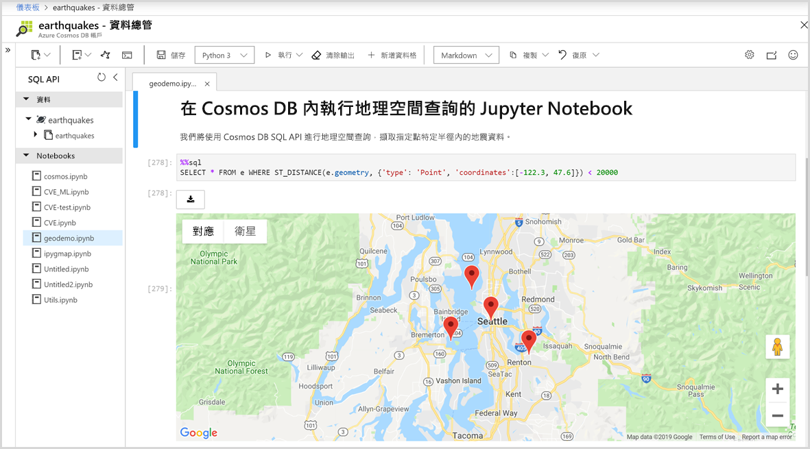

# Azure Cosmos DB 中的內建 Jupyter Notebook 支援 (預覽)

Jupyter 筆記本是開放原始碼的 Web 應用程式，可讓您建立及共用含有即時程式碼、方程式、視覺效果和敘述文字的文件。 Azure Cosmos DB 支援所有 API 的內建 Jupyter Notebook，例如 SQL、MongoDB、Cassandra、Gremlin 和資料表。 所有 Azure Cosmos DB API 和資料模型內建的 Notebook 支援可讓您以互動方式執行查詢。 Jupyter 筆記本會在 Azure Cosmos 帳戶內執行，並可讓開發人員執行資料探索、資料清理、資料轉換、數值模擬、統計建模、資料視覺效果，以及機器學習。

Jupyter 筆記本支援 magic 函式，可藉由支援其他命令來擴展核心的功能。 Cosmos magic 是一種命令，可在 Jupyter 筆記本中擴展 Python 核心的功能，讓您能執行除了 Apache Spark 以外的 Azure Cosmos SQL API 查詢。 您可以輕鬆地結合 Python 與 SQL API 查詢，使用與轉譯命令整合的豐富視覺效果程式庫來查詢和視覺化資料。
Azure 入口網站會以原生方式將 Jupyter 筆記本體驗整合到 Azure Cosmos 帳戶中，如下圖所示：

## Jupyter 筆記本的優點

Jupyter 筆記本最初是針對以 Python、R 撰寫的資料科學應用程式而開發。不過，其可針對不同種類的專案以各種方式使用，例如：

* ***資料視覺效果：** Jupyter 筆記本可讓您以共用筆記本的形式將資料視覺化，將某些資料集呈現為圖形。 Jupyter 筆記本可讓您撰寫視覺效果、加以共用，以及允許對共用程式碼和資料集進行互動式變更。

* **程式碼共用：** GitHub 之類的服務可提供一些共用程式碼的方式，但大部分不是互動式。 有了 Jupyter Notebbook，您可以檢視程式碼、加以執行，並直接在 Azure 入口網站中顯示結果。

* **與程式碼的即時互動：** Jupyter 筆記本程式碼是動態的；可以累加方式進行即時編輯和重新執行。 筆記本也可以內嵌使用者控制項 (例如滑杆或文字輸入欄位)，以作為程式碼、示範或概念證明 (POC) 的輸入來源。

* **程式碼範例的文件和資料探索的結果：** 如果您有一段程式碼，而且想要以即時方式逐行說明其在 Azure Cosmos DB 中的運作方式，您可以將它內嵌在 Jupyter 筆記本中。 此程式碼仍可完全正常運作。 您可以同時新增互動性和文件。

* **Cosmos magic 命令：** 在 Jupyter 筆記本中，您可以使用 Azure Cosmos DB 的自訂 magic 命令，讓互動式運算更加容易。 例如，可讓您直接在筆記本中使用 SQL API 查詢 Cosmos 容器的 %%sql magic。

* **集中管理環境：** Jupyter 筆記本將程式碼、RTF、影像、影片、動畫、數學方程式、繪圖、地圖、互動式圖表、小工具和圖形化使用者介面結合成單一文件。

## Jupyter 筆記本的元件

Jupyter 筆記本可以包含數種類型的元件，每個元件都會組織成不同的區塊：

* **文字和 HTML：** 在任何時間點，都可以將純文字或在 Markdown 語法中標註要產生 HTML 的文字插入文件中。 CSS 樣式也可以內嵌加入，或新增至用來產生筆記本的範本。

* **程式碼和輸出：** Jupyter 筆記本支援 Python 程式碼。 已執行程式碼的結果會緊接在程式碼區塊之後，而且程式碼區塊可依您想要的順序執行很多次。

* **視覺效果：** 您可以使用 Matplotlib、Plotly 或 Bokeh 等模組，從程式碼產生圖形和圖表。 這些視覺效果類似於輸出，會以內嵌方式出現在產生它們的程式碼旁邊。

* **多媒體：** 由於 Jupyter 筆記本是以 Web 技術為基礎，因此可以顯示網頁中支援的各種多媒體。 您可以 HTML 元素的形式將它們包含在筆記本中，也可以使用 `IPython.display` 模組以程式設計方式予以產生。

* **資料：** Azure Cosmos 容器中的資料和查詢的結果可透過程式設計方式匯入 Jupyter 筆記本。 例如，藉由在筆記本中包含程式碼，以使用任何 Cosmos DB API 或原生內建的 Apache Spark 來查詢資料。

## 後續步驟

若要開始使用 Azure Cosmos DB 中的內建 Jupyter 筆記本，請參閱下列文章：

* [啟用 Azure Cosmos 帳戶中的筆記本](enable-notebooks.md)
* [使用筆記本功能和命令](use-notebook-features-and-commands.md)

