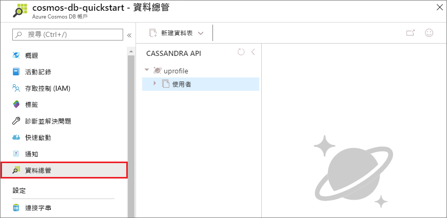

# <a name="quickstart-build-a-cassandra-app-with-nodejs-sdk-and-azure-cosmos-db"></a>快速入門：使用 Node.js SDK 和 Azure Cosmos DB 建置 Cassandra 應用程式

> [!div class="op_single_selector"]
> * [.NET](create-cassandra-dotnet.md)
> * [Java](create-cassandra-java.md)
> * [Node.js](create-cassandra-nodejs.md)
> * [Python](create-cassandra-python.md)
>  

在本快速入門中，您會建立 Azure Cosmos DB Cassandra API 帳戶，並使用從 GitHub 複製得到的 Cassandra Node.js 應用程式來建立 Cassandra 資料庫和容器。 Azure Cosmos DB 是多模型的資料庫服務，可讓您快速建立及查詢具有全域散發和水平調整功能的文件、資料表、索引鍵/值及圖形資料庫。

## <a name="prerequisites"></a>Prerequisites

[!INCLUDE [quickstarts-free-trial-note](../../includes/quickstarts-free-trial-note.md)]或者，您可以[免費試用 Azure Cosmos DB](https://azure.microsoft.com/try/cosmosdb/)，無須 Azure 訂用帳戶，也無須任何費用和約定付款。

此外，您需要：
* [Node.js](https://nodejs.org/dist/v0.10.29/x64/node-v0.10.29-x64.msi) v0.10.29 版或更高版本
* [Git](https://git-scm.com/)

## <a name="create-a-database-account"></a>建立資料庫帳戶

您必須先使用 Azure Cosmos DB 建立 Cassandra 帳戶，才可以建立文件資料庫。

[!INCLUDE [cosmos-db-create-dbaccount-cassandra](../../includes/cosmos-db-create-dbaccount-cassandra.md)]

## <a name="clone-the-sample-application"></a>複製範例應用程式

現在，我們將從 GitHub 複製 Cassandra API 應用程式、設定連接字串，然後加以執行。 您會看到，以程式設計方式來處理資料有多麼的容易。 

1. 開啟命令提示字元。 建立名為 `git-samples` 的新資料夾。 接著，關閉命令提示字元。

    ```bash
    md "C:\git-samples"
    ```

2. 開啟 Git 終端機視窗，例如 Git Bash。 使用 `cd` 命令變更至新資料夾，以安裝範例應用程式。

    ```bash
    cd "C:\git-samples"
    ```

3. 執行下列命令來複製範例存放庫。 此命令會在您的電腦上建立範例應用程式副本。

    ```bash
    git clone https://github.com/Azure-Samples/azure-cosmos-db-cassandra-nodejs-getting-started.git
    ```

## <a name="review-the-code"></a>檢閱程式碼

此為選用步驟。 如果您有興趣了解程式碼如何建立資料庫資源，您可以檢閱下列程式碼片段。 此程式碼片段全都取自 `C:\git-samples\azure-cosmos-db-cassandra-nodejs-getting-started` 資料夾中的 `uprofile.js` 檔案。 或者也可以直接跳至[更新您的連接字串](#update-your-connection-string)。 

* 使用者名稱與密碼值是使用 Azure 入口網站中的連接字串頁面所設定。 `path\to\cert` 提供 X509 憑證的路徑。 

   ```javascript
   var ssl_option = {
        cert : fs.readFileSync("path\to\cert"),
        rejectUnauthorized : true,
        secureProtocol: 'TLSv1_2_method'
        };
   const authProviderLocalCassandra = new cassandra.auth.PlainTextAuthProvider(config.username, config.password);
   ```

* 使用 contactPoint 資訊來初始化 `client`。 contactPoint 是從 Azure 入口網站來加以擷取。

    ```javascript
    const client = new cassandra.Client({contactPoints: [config.contactPoint], authProvider: authProviderLocalCassandra, sslOptions:ssl_option});
    ```

* `client` 會連線至 Azure Cosmos DB Cassandra API。

    ```javascript
    client.connect(next);
    ```

* 建立新的 keyspace。

    ```javascript
    function createKeyspace(next) {
        var query = "CREATE KEYSPACE IF NOT EXISTS uprofile WITH replication = {\'class\': \'NetworkTopologyStrategy\', \'datacenter1\' : \'1\' }";
        client.execute(query, next);
        console.log("created keyspace");    
  }
    ```

* 建立新的資料表。

   ```javascript
   function createTable(next) {
    var query = "CREATE TABLE IF NOT EXISTS uprofile.user (user_id int PRIMARY KEY, user_name text, user_bcity text)";
        client.execute(query, next);
        console.log("created table");
   },
   ```

* 插入索引鍵/值實體。

    ```javascript
        function insert(next) {
            console.log("\insert");
            const arr = ['INSERT INTO  uprofile.user (user_id, user_name , user_bcity) VALUES (1, \'AdrianaS\', \'Seattle\')',
                        'INSERT INTO  uprofile.user (user_id, user_name , user_bcity) VALUES (2, \'JiriK\', \'Toronto\')',
                        'INSERT INTO  uprofile.user (user_id, user_name , user_bcity) VALUES (3, \'IvanH\', \'Mumbai\')',
                        'INSERT INTO  uprofile.user (user_id, user_name , user_bcity) VALUES (4, \'IvanH\', \'Seattle\')',
                        'INSERT INTO  uprofile.user (user_id, user_name , user_bcity) VALUES (5, \'IvanaV\', \'Belgaum\')',
                        'INSERT INTO  uprofile.user (user_id, user_name , user_bcity) VALUES (6, \'LiliyaB\', \'Seattle\')',
                        'INSERT INTO  uprofile.user (user_id, user_name , user_bcity) VALUES (7, \'JindrichH\', \'Buenos Aires\')',
                        'INSERT INTO  uprofile.user (user_id, user_name , user_bcity) VALUES (8, \'AdrianaS\', \'Seattle\')',
                        'INSERT INTO  uprofile.user (user_id, user_name , user_bcity) VALUES (9, \'JozefM\', \'Seattle\')'];
            arr.forEach(element => {
            client.execute(element);
            });
            next();
        },
    ```

* 用來取得所有索引鍵值的查詢。

    ```javascript
        function selectAll(next) {
            console.log("\Select ALL");
            var query = 'SELECT * FROM uprofile.user';
            client.execute(query, function (err, result) {
            if (err) return next(err);
            result.rows.forEach(function(row) {
                console.log('Obtained row: %d | %s | %s ',row.user_id, row.user_name, row.user_bcity);
            }, this);
            next();
            });
        },
    ```  
    
* 用來取得索引鍵/值的查詢。

    ```javascript
        function selectById(next) {
            console.log("\Getting by id");
            var query = 'SELECT * FROM uprofile.user where user_id=1';
            client.execute(query, function (err, result) {
            if (err) return next(err);
            result.rows.forEach(function(row) {
                console.log('Obtained row: %d | %s | %s ',row.user_id, row.user_name, row.user_bcity);
            }, this);
            next();
            });
        }
    ```  

## <a name="update-your-connection-string"></a>更新您的連接字串

現在，返回 Azure 入口網站以取得連接字串資訊，並將它複製到應用程式中。 連接字串可讓您的應用程式與託管資料庫進行通訊。

1. 在 [Azure 入口網站](https://portal.azure.com/)中的 Azure Cosmos DB 帳戶中，選取 [連接字串]  。 

    使用 ![[複製] 按鈕](./media/create-cassandra-nodejs/copy.png) 按鈕 (畫面右方) 來複製最高值 ([連絡點])。

    ![從 Azure 入口網站的連接字串頁面檢視及複製 [連絡點]、[使用者名稱] 和 [密碼]](./media/create-cassandra-nodejs/keys.png)

2. 開啟 `config.js` 檔案。 

3. 從入口網站將 [連絡點] 值貼到 `<FillMEIN>` 的行 4。

    行 4 現在看起來應該會類似 

    `config.contactPoint = "cosmos-db-quickstarts.cassandra.cosmosdb.azure.com:10350"`

4. 從入口網站複製 [使用者名稱] 值，並將它貼到 `<FillMEIN>` 的行 2。

    行 2 現在看起來應該會類似 

    `config.username = 'cosmos-db-quickstart';`
    
5. 從入口網站複製 [密碼] 值，並將它貼到 `<FillMEIN>` 的行 3。

    行 3 現在看起來應該會類似

    `config.password = '2Ggkr662ifxz2Mg==';`

6. 儲存 `config.js` 檔案。
    
## <a name="use-the-x509-certificate"></a>使用 X509 憑證

1. 從 [https://cacert.omniroot.com/bc2025.crt](https://cacert.omniroot.com/bc2025.crt) 下載 Baltimore CyberTrust Root 憑證到本機。 將檔案重新命名為使用副檔名 `.cer`。

   憑證有序號 `02:00:00:b9` 和 SHA1 指紋 `d4🇩🇪20:d0:5e:66:fc:53:fe:1a:50:88:2c:78:db:28:52:ca:e4:74`。

2. 開啟 `uprofile.js` 並變更 `path\to\cert` 以指向您的新憑證。

3. 儲存 `uprofile.js`。

> [!NOTE]
> 如果您在後續步驟中遇到憑證相關錯誤，並且在 Windows 機器上執行，請確定您已遵循將 .crt 檔案正確轉換成下面 Microsoft .cer 格式的程序。
> 
> 按兩下 .crt 檔案，將其開啟到憑證顯示中。 
>
> 
>
> 在 [憑證精靈] 上按 [下一步]。 選取 [Base-64 編碼的 x.509] (.CER)，然後按 [下一步]。
>
> 
>
> 選取 [瀏覽] (尋找目的地) 並輸入檔案名稱。
> 選取 [下一步] 後即可完成。
>
> 您現在應該會有正確格式的 .cer 檔案。 確定 `uprofile.js` 中的路徑已指向此檔案。

## <a name="run-the-nodejs-app"></a>執行 Node.js 應用程式

1. 在 git 終端機視窗中，確定您位於稍早複製的範例目錄中：

    ```bash
    cd azure-cosmos-db-cassandra-nodejs-getting-started
    ```

2. 執行 `npm install` 以安裝必要的 npm 模組。

3. 執行 `node uprofile.js` 來啟動您的節點應用程式。

4. 從命令列確認結果符合預期。

    

    按 CTRL+C 來停止執行程式，並關閉主控台視窗。 

5. 在 Azure 入口網站中，開啟 [資料總管]  以查詢、修改及使用這個新資料。 

     

## <a name="review-slas-in-the-azure-portal"></a>在 Azure 入口網站中檢閱 SLA

[!INCLUDE [cosmosdb-tutorial-review-slas](../../includes/cosmos-db-tutorial-review-slas.md)]

## <a name="clean-up-resources"></a>清除資源

[!INCLUDE [cosmosdb-delete-resource-group](../../includes/cosmos-db-delete-resource-group.md)]

## <a name="next-steps"></a>後續步驟

在本快速入門中，您已了解如何使用 Cassandra API 建立 Azure Cosmos DB 帳戶，並已執行可建立 Cassandra 資料庫和容器的 Cassandra Node.js 應用程式。 您現在可以將其他資料匯入 Azure Cosmos DB 帳戶中。 

> [!div class="nextstepaction"]
> [將 Cassandra 資料匯入到 Azure Cosmos DB](cassandra-import-data.md)