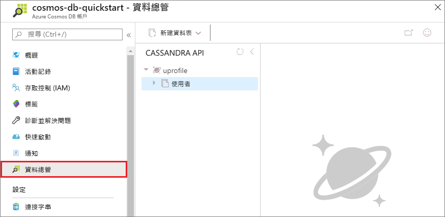

# <a name="quickstart-build-a-cassandra-app-with-python-sdk-and-azure-cosmos-db"></a>快速入門：使用 Python SDK 和 Azure Cosmos DB 建置 Cassandra 應用程式

> [!div class="op_single_selector"]
> * [.NET](create-cassandra-dotnet.md)
> * [.NET Core](create-cassandra-dotnet-core.md)
> * [Java v3](create-cassandra-java.md)
> * [Java v4](create-cassandra-java-v4.md)
> * [Node.js](create-cassandra-nodejs.md)
> * [Python](create-cassandra-python.md)
>  

在本快速入門中，您會建立 Azure Cosmos DB Cassandra API 帳戶，並使用從 GitHub 複製得到的 Cassandra Python 應用程式來建立 Cassandra 資料庫和容器。 Azure Cosmos DB 是多模型的資料庫服務，可讓您快速建立及查詢具有全域散發和水平調整功能的文件、資料表、索引鍵/值及圖形資料庫。

## <a name="prerequisites"></a>必要條件

- 具有有效訂用帳戶的 Azure 帳戶。 [建立免費帳戶](https://azure.microsoft.com/free/?ref=microsoft.com&utm_source=microsoft.com&utm_medium=docs&utm_campaign=visualstudio)。 或[免費試用 Azure Cosmos DB](https://azure.microsoft.com/try/cosmosdb/) (不需 Azure 訂用帳戶)。
- [Python 2.7.14+ 或 3.4+](https://www.python.org/downloads/)。
- [Git](https://git-scm.com/downloads)。
- [適用於 Apache Cassandra 的 Python 驅動程式](https://github.com/datastax/python-driver)。

## <a name="create-a-database-account"></a>建立資料庫帳戶

您必須先使用 Azure Cosmos DB 建立 Cassandra 帳戶，才可以建立文件資料庫。

[!INCLUDE [cosmos-db-create-dbaccount-cassandra](../../includes/cosmos-db-create-dbaccount-cassandra.md)]

## <a name="clone-the-sample-application"></a>複製範例應用程式

現在，我們將從 GitHub 複製 Cassandra API 應用程式、設定連接字串，然後加以執行。 您會看到，以程式設計方式來處理資料有多麼的容易。 

1. 開啟命令提示字元。 建立名為 `git-samples` 的新資料夾。 接著，關閉命令提示字元。

    ```bash
    md "C:\git-samples"
    ```

2. 開啟 git 終端機視窗 (例如 git bash)，並使用 `cd` 命令變更至要安裝範例應用程式的新資料夾。

    ```bash
    cd "C:\git-samples"
    ```

3. 執行下列命令來複製範例存放庫。 此命令會在您的電腦上建立範例應用程式副本。

    ```bash
    git clone https://github.com/Azure-Samples/azure-cosmos-db-cassandra-python-getting-started.git
    ```

## <a name="review-the-code"></a>檢閱程式碼

此為選用步驟。 如果您有興趣了解程式碼如何建立資料庫資源，您可以檢閱下列程式碼片段。 此程式碼片段全都取自 pyquickstart.py 檔案。 或者也可以直接跳至[更新您的連接字串](#update-your-connection-string)。 

* 使用者名稱與密碼值是使用 Azure 入口網站中的連接字串頁面所設定。 `path\to\cert` 提供 X509 憑證的路徑。 

   ```python
    ssl_opts = {
            'ca_certs': 'path\to\cert',
            'ssl_version': ssl.PROTOCOL_TLSv1_2
            }
    auth_provider = PlainTextAuthProvider( username=cfg.config['username'], password=cfg.config['password'])
    cluster = Cluster([cfg.config['contactPoint']], port = cfg.config['port'], auth_provider=auth_provider, ssl_options=ssl_opts)
    session = cluster.connect()
   
   ```

* 使用 contactPoint 資訊來初始化 `cluster`。 contactPoint 是從 Azure 入口網站來加以擷取。

    ```python
   cluster = Cluster([cfg.config['contactPoint']], port = cfg.config['port'], auth_provider=auth_provider)
    ```

* `cluster` 會連線至 Azure Cosmos DB Cassandra API。

    ```python
    session = cluster.connect()
    ```

* 建立新的 keyspace。

    ```python
   session.execute('CREATE KEYSPACE IF NOT EXISTS uprofile WITH replication = {\'class\': \'NetworkTopologyStrategy\', \'datacenter1\' : \'1\' }')
    ```

* 建立新的資料表。

   ```
   session.execute('CREATE TABLE IF NOT EXISTS uprofile.user (user_id int PRIMARY KEY, user_name text, user_bcity text)');
   ```

* 插入索引鍵/值實體。

    ```Python
    insert_data = session.prepare("INSERT INTO  uprofile.user  (user_id, user_name , user_bcity) VALUES (?,?,?)")
    session.execute(insert_data, [1,'Lybkov','Seattle'])
    session.execute(insert_data, [2,'Doniv','Dubai'])
    session.execute(insert_data, [3,'Keviv','Chennai'])
    session.execute(insert_data, [4,'Ehtevs','Pune'])
    session.execute(insert_data, [5,'Dnivog','Belgaum'])
    ....
    
    ```

* 用來取得所有索引鍵值的查詢。

    ```Python
    rows = session.execute('SELECT * FROM uprofile.user')
    ```  
    
* 用來取得索引鍵/值的查詢。

    ```Python
    
    rows = session.execute('SELECT * FROM uprofile.user where user_id=1')
    ```  

## <a name="update-your-connection-string"></a>更新您的連接字串

現在，返回 Azure 入口網站以取得連接字串資訊，並將它複製到應用程式中。 連接字串可讓您的應用程式與託管資料庫進行通訊。

1. 在 [Azure 入口網站](https://portal.azure.com/)中的 Azure Cosmos DB 帳戶中，選取 [連接字串]。 

    使用 ![[複製] 按鈕](./media/create-cassandra-python/copy.png) 按鈕 (畫面右方) 來複製最高值 ([連絡點])。

    ![在 Azure 入口網站的 [連接字串] 刀鋒視窗檢視及複製存取使用者名稱、密碼及連絡點](./media/create-cassandra-python/keys.png)

2. 開啟 config.py 檔案。 

3. 從入口網站將 [連絡點] 值貼到 `<FILLME>` 的行 10。

    行 10 現在看起來應該會類似 

    `'contactPoint': 'cosmos-db-quickstarts.cassandra.cosmosdb.azure.com:10350'`

4. 從入口網站複製 [使用者名稱] 值，並將它貼到 `<FILLME>` 的行 6。

    行 6 現在看起來應該會類似 

    `'username': 'cosmos-db-quickstart',`
    
5. 從入口網站複製 [密碼] 值，並將它貼到 `<FILLME>` 的行 8。

    行 8 現在看起來應該會類似

    `'password' = '2Ggkr662ifxz2Mg==`';`

6. 儲存 config.py 檔案。
    
## <a name="use-the-x509-certificate"></a>使用 X509 憑證

1. 從 [https://cacert.omniroot.com/bc2025.crt](https://cacert.omniroot.com/bc2025.crt) 下載 Baltimore CyberTrust Root 憑證到本機。 使用副檔名 .cer 來重新命名檔案。

   憑證有序號 `02:00:00:b9` 和 SHA1 指紋 `d4🇩🇪20:d0:5e:66:fc:53:fe:1a:50:88:2c:78:db:28:52:ca:e4:74`。

2. 開啟 pyquickstart.py，然後將 `path\to\cert` 變更為指向您的新憑證。

3. 儲存 pyquickstart.py。

## <a name="run-the-python-app"></a>執行 Python 應用程式

1. 在 Git 終端機中使用 cd 命令以變更到 `azure-cosmos-db-cassandra-python-getting-started` 資料夾。 

2. 執行下列命令來安裝所需的模組：

    ```python
    python -m pip install cassandra-driver
    python -m pip install prettytable
    python -m pip install requests
    python -m pip install pyopenssl
    ```

2. 執行下列命令來啟動 Python 應用程式：

    ```
    python pyquickstart.py
    ```

3. 從命令列確認結果符合預期。

    按 CTRL+C 來停止執行程式，並關閉主控台視窗。 

    
    
4. 在 Azure 入口網站中，開啟 [資料總管] 以查詢、修改及使用這個新資料。 

    

## <a name="review-slas-in-the-azure-portal"></a>在 Azure 入口網站中檢閱 SLA

[!INCLUDE [cosmosdb-tutorial-review-slas](../../includes/cosmos-db-tutorial-review-slas.md)]

## <a name="clean-up-resources"></a>清除資源

[!INCLUDE [cosmosdb-delete-resource-group](../../includes/cosmos-db-delete-resource-group.md)]

## <a name="next-steps"></a>後續步驟

在本快速入門中，您已了解如何使用 Cassandra API 建立 Azure Cosmos DB 帳戶，並已執行可建立 Cassandra 資料庫和容器的 Cassandra Python 應用程式。 您現在可以將其他資料匯入 Azure Cosmos DB 帳戶中。 

> [!div class="nextstepaction"]
> [將 Cassandra 資料匯入到 Azure Cosmos DB](cassandra-import-data.md)

