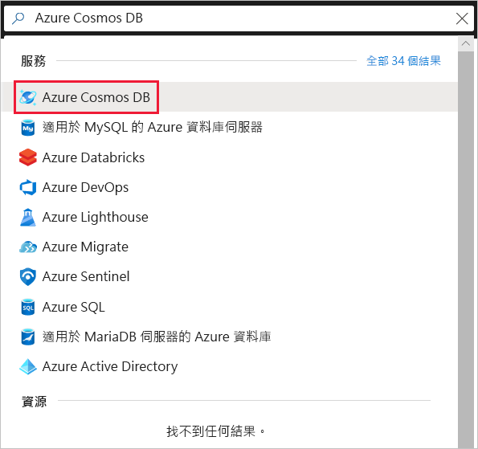
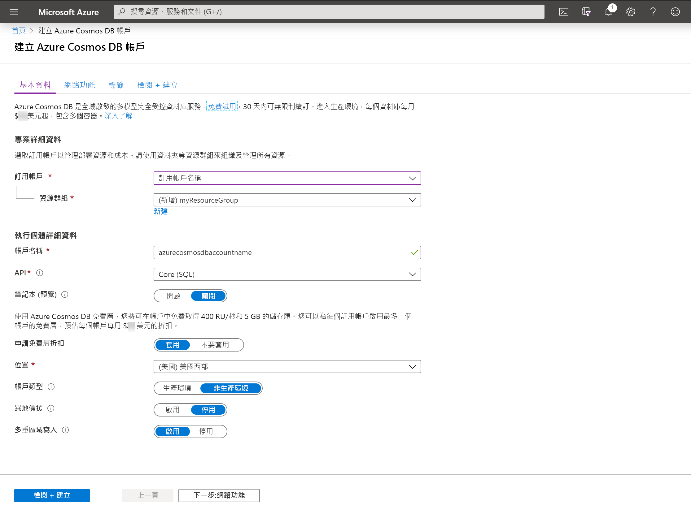
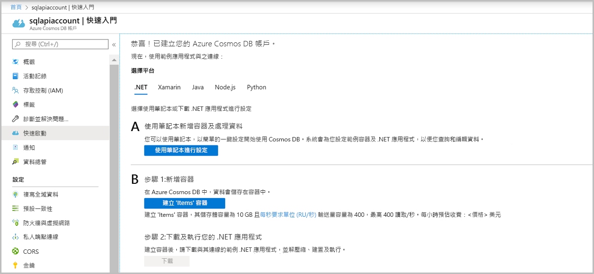

# <a name="quickstart-create-an-azure-cosmos-account-database-container-and-items-from-the-azure-portal"></a>快速入門：從 Azure 入口網站建立 Azure Cosmos 帳戶、資料庫、容器和項目

> [!div class="op_single_selector"]
> * [Azure 入口網站](create-cosmosdb-resources-portal.md)
> * [.NET](create-sql-api-dotnet.md)
> * [Java](create-sql-api-java.md)
> * [Node.js](create-sql-api-nodejs.md)
> * [Python](create-sql-api-python.md)
> * [Xamarin](create-sql-api-xamarin-dotnet.md)
>  

Azure Cosmos DB 是 Microsoft 的全域分散式多模型資料庫服務。 您可以使用 Azure Cosmos DB 來快速建立及查詢索引鍵/值資料庫、文件資料庫和圖形資料庫，這些資料庫全都受益於位於 Azure Cosmos DB 核心的全域散發和水平調整功能。 

本快速入門示範如何使用 Azure 入口網站來建立 Azure Cosmos DB [SQL API](sql-api-introduction.md) 帳戶、建立文件資料庫和容器，以及在容器中新增資料。 

## <a name="prerequisites"></a>必要條件

Azure 訂用帳戶或免費的 Azure Cosmos DB 試用帳戶
- [!INCLUDE [quickstarts-free-trial-note](../../includes/quickstarts-free-trial-note.md)] 

- [!INCLUDE [cosmos-db-emulator-docdb-api](../../includes/cosmos-db-emulator-docdb-api.md)]  

<a id="create-account"></a>
## <a name="create-an-azure-cosmos-db-account"></a>建立 Azure Cosmos DB 帳戶

移至 [Azure 入口網站](https://portal.azure.com/)來建立 Azure Cosmos DB 帳戶。 搜尋並選取 [Azure Cosmos DB]。

   

1. 選取 [新增]。
1. 在 [建立 Azure Cosmos DB 帳戶] 頁面上，輸入新 Azure Cosmos 帳戶的基本設定。 

    |設定|值|描述 |
    |---|---|---|
    |訂用帳戶|訂閱名稱|選取要用於此 Azure Cosmos 帳戶的 Azure 訂用帳戶。 |
    |資源群組|資源群組名稱|選取資源群組，或選取 [新建]，然後輸入新資源群組的唯一名稱。 |
    |帳戶名稱|唯一的名稱|輸入名稱來識別您的 Azure Cosmos 帳戶。 因為 documents.azure.com 會附加到您所提供的名稱以建立 URI，請使用唯一名稱。<br><br>名稱只能包含小寫字母、數字及連字號 (-) 字元。 其長度必須介於 3 到 31 個字元之間。|
    |API|要建立的帳戶類型|選取 [Core(SQL)]，以使用 SQL 語法建立文件資料庫並進行查詢。 <br><br>API 會決定要建立的帳戶類型。 Azure Cosmos DB 提供五個 API：Core(SQL) 和 MongoDB (適用於文件資料)、Gremlin (適用於圖形資料)、Azure 資料表及 Cassandra。 目前，您必須為每個 API 建立個別個帳戶。 <br><br>[進一步了解 SQL API](introduction.md)。|
    |申請免費層折扣|適用或不適用|使用 Azure Cosmos DB 免費層，您將可在帳戶中免費取得前 400 RU/秒和 5 GB 的儲存體。 深入了解[免費層](https://azure.microsoft.com/pricing/details/cosmos-db/)。|
    |Location|最接近使用者的區域|選取用來裝載 Azure Cosmos DB 帳戶的地理位置。 使用最接近使用者的位置，讓他們能以最快速度存取資料。|
    |帳戶類型|生產或非生產|如果帳戶將用於生產工作負載，請選取 [生產]。 如果帳戶將用於非生產工作負載 (例如開發、測試、QA 或預備)，請選取 [非生產]。 這是一種 Azure 資源標記設定，可調整入口網站體驗，但不會影響基礎 Azure Cosmos DB 帳戶。 您可以隨時變更此值。|
    |異地備援|啟用或停用|藉由將您的區域與配對區域進行配對，在您的帳戶上啟用或停用全域散發。 您可以在稍後將更多區域新增至您的帳戶。|
    |多重區域寫入|啟用或停用|多重區域寫入功能可讓您利用在全球為資料庫及容器佈建的輸送量。|
    |可用性區域|啟用或停用|可用性區域可協助您進一步改善應用程式的可用性和復原能力。|


> [!NOTE]
> 每個 Azure 訂用帳戶最多可以有一個免費層的 Azure Cosmos DB 帳戶，而且必須在建立帳戶時選擇加入。 如果您看不到套用免費層折扣的選項，這表示訂用帳戶中的另一個帳戶已透過免費層啟用。
   
   

1. 選取 [檢閱 + 建立]。 您可以略過 [網路] 和 [標記] 區段。

1. 檢閱帳戶設定，然後選取 [建立]。 建立帳戶需要幾分鐘的時間。 等候入口網站頁面顯示 [您的部署已完成] 訊息。 

    ![Azure 入口網站的 [通知] 窗格](./media/create-cosmosdb-resources-portal/azure-cosmos-db-account-deployment-successful.png)

1. 選取 [移至資源] 以移至 Azure Cosmos DB 帳戶頁面。 

    

<a id="create-container-database"></a>
## <a name="add-a-database-and-a-container"></a>新增資料庫和容器 

您可以在 Azure 入口網站中使用資料總管，建立資料庫和容器。 

1.  在 Azure Cosmos DB 帳戶頁面上的左側導覽中選取 [資料總管]，然後選取 [新增容器]。 
    
    您可能需要向右捲動才能看到 [新增集合] 視窗。
    
    ![Azure 入口網站資料總管，[新增容器] 窗格](./media/create-sql-api-dotnet/azure-cosmosdb-data-explorer-dotnet.png)
    
1.  在 [新增容器] 窗格上，輸入新容器的設定。
    
    |設定|建議的值|描述
    |---|---|---|
    |**資料庫識別碼**|ToDoList|輸入 *ToDoList* 作為新資料庫的名稱。 資料庫名稱必須包含從 1 到 255 個字元，且不能包含 `/, \\, #, ?` 或尾端空格。 核取 [佈建資料庫輸送量] 選項，它可讓您在資料庫中的所有容器內共用佈建到資料庫的輸送量。 此選項也有助於節省成本。 |
    |**輸送量**|400|讓輸送量保持在每秒 400 個要求單位 (RU/秒)。 如果您想要降低延遲，稍後可以擴大輸送量。| 
    |**容器識別碼**|項目|輸入 *Items* 作為新容器的名稱。 容器識別碼與資料庫名稱具有相同的字元需求。|
    |**分割區索引鍵**| /類別| 本文中所述的範例使用 */category* 作為分割區索引鍵。|

    
    在此範例中，請勿新增**唯一索引鍵**。 唯一索引鍵可讓您藉由確保每個分割索引鍵有一或多個唯一值，來對資料庫新增一層資料完整性。 如需詳細資訊，請參閱 [Azure Cosmos DB 中的唯一索引鍵](unique-keys.md)。
    
1.  選取 [確定]。 [資料總管] 會顯示您建立的新資料庫和容器。

## <a name="add-data-to-your-database"></a>將資料新增至資料庫

使用資料總管將資料新增至新的資料庫。

1. 在 [資料總管] 中，展開 **ToDoList** 資料庫，然後展開 **Items** 容器。 接下來，選取 [Items]，然後選取 [新增項目]。 
   
   ![在 Azure 入口網站的 [資料總管] 中建立新文件](./media/create-sql-api-dotnet/azure-cosmosdb-new-document.png)
   
1. 在 [文件] 窗格右邊的文件中新增下列結構：

     ```json
     {
         "id": "1",
         "category": "personal",
         "name": "groceries",
         "description": "Pick up apples and strawberries.",
         "isComplete": false
     }
     ```

1. 選取 [儲存]。
   
   ![將 json 資料複製在 Azure 入口網站的 [資料總管] 中並選取 [儲存]](./media/create-sql-api-dotnet/azure-cosmosdb-save-document.png)
   
1. 再次選取 [新增文件]，然後使用唯一 `id` 以及任何其他您想要的屬性和值來建立和儲存另一個文件。 文件可擁有任何結構，因為 Azure Cosmos DB 不會對您的資料強加任何結構描述。

## <a name="query-your-data"></a>查詢資料

[!INCLUDE [cosmos-db-create-sql-api-query-data](../../includes/cosmos-db-create-sql-api-query-data.md)] 

## <a name="clean-up-resources"></a>清除資源

[!INCLUDE [cosmosdb-delete-resource-group](../../includes/cosmos-db-delete-resource-group.md)]

如果您想要只刪除資料庫，並在未來繼續使用 Azure Cosmos 帳戶，則可以使用下列步驟刪除資料庫：

* 移至 Azure Cosmos 帳戶。
* 開啟**資料總管**，以滑鼠右鍵按一下您想要刪除的資料庫，然後選取 [刪除資料庫]。
* 輸入資料庫識別碼/資料庫名稱，以確認刪除作業。 

## <a name="next-steps"></a>後續步驟

在本快速入門中，您已了解如何使用 [資料總管] 來建立 Azure Cosmos DB 帳戶，並建立資料庫和容器。 您現在可以將其他資料匯入 Azure Cosmos DB 帳戶中。 

> [!div class="nextstepaction"]
> [將資料匯入到 Azure Cosmos DB](import-data.md)
