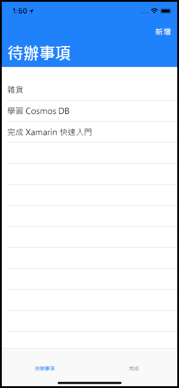
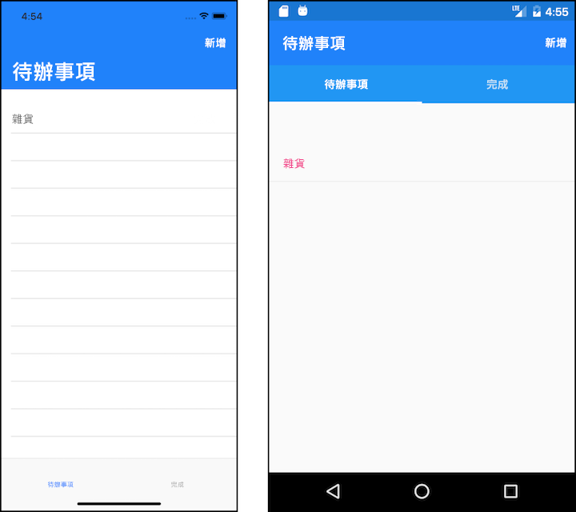
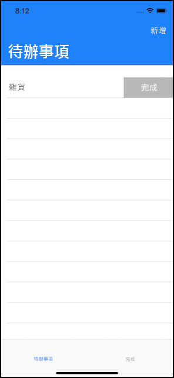
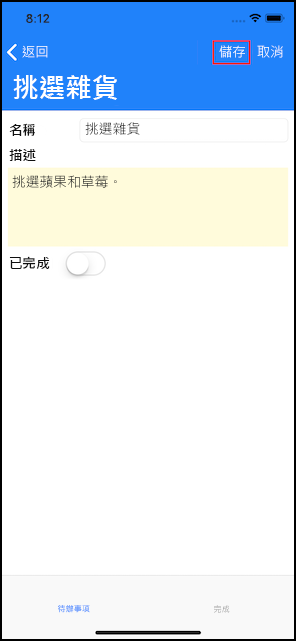
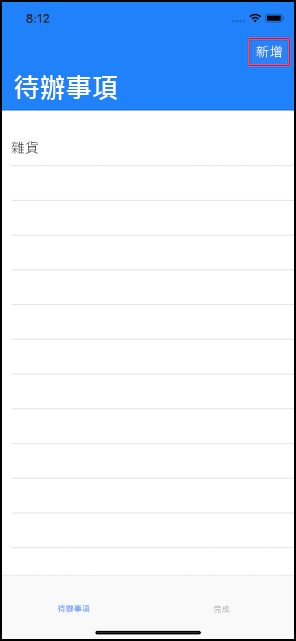

# <a name="quickstart-build-a-todo-app-with-xamarin-using-azure-cosmos-db-sql-api-account"></a>快速入門：使用 Azure Cosmos DB SQL API 帳戶透過 Xamarin 建置待辦事項應用程式

> [!div class="op_single_selector"]
> * [.NET V3](create-sql-api-dotnet.md)
> * [.NET V4](create-sql-api-dotnet-V4.md)
> * [Java](create-sql-api-java.md)
> * [Node.js](create-sql-api-nodejs.md)
> * [Python](create-sql-api-python.md)
> * [Xamarin](create-sql-api-xamarin-dotnet.md)

Azure Cosmos DB 是 Microsoft 的全域分散式多模型資料庫服務。 您可以快速建立及查詢文件、索引鍵/值及圖形資料庫，所有這些都受惠於位於 Azure Cosmos DB 核心的全域散發和水平調整功能。

> [!NOTE]
> 在 GitHub 上 ([這裡](https://github.com/xamarinhq/app-geocontacts)) 可找到整個標準範例 Xamarin 應用程式的範例程式碼，該範例程式碼會展示多個 Azure 供應項目 (包括 CosmosDB)。 此應用程式會示範如何檢視分散各地的連絡人，並且讓這些連絡人更新其位置。

此快速入門示範如何使用 Azure 入口網站建立 Azure Cosmos DB SQL API 帳戶、文件資料庫和容器。 接著，您會建置並部署以 [SQL .NET API](sql-api-sdk-dotnet.md) 和採用 [Xamarin.Forms](https://docs.microsoft.com/xamarin/) 與 [MVVM 架構模式](https://docs.microsoft.com/xamarin/xamarin-forms/xaml/xaml-basics/data-bindings-to-mvvm)的 [Xamarin](https://docs.microsoft.com/xamarin/) 為基礎的待辦事項清單行動應用程式。



## <a name="prerequisites"></a>Prerequisites

如果您使用 Windows 進行開發，且尚未安裝 Visual Studio 2019，可以下載並使用**免費的** [Visual Studio 2019 Community 版本](https://www.visualstudio.com/downloads/)。 請務必在 Visual Studio 設定期間啟用 **Azure 開發**和**使用 .NET 的行動開發**工作負載。

如果您使用 Mac，您可以下載**免費的** [Visual Studio for Mac](https://www.visualstudio.com/vs/mac/)。

[!INCLUDE [quickstarts-free-trial-note](../../includes/quickstarts-free-trial-note.md)]
[!INCLUDE [cosmos-db-emulator-docdb-api](../../includes/cosmos-db-emulator-docdb-api.md)]

## <a name="create-a-database-account"></a>建立資料庫帳戶

[!INCLUDE [cosmos-db-create-dbaccount](../../includes/cosmos-db-create-dbaccount.md)]

## <a name="add-a-container"></a>新增容器

[!INCLUDE [cosmos-db-create-collection](../../includes/cosmos-db-create-collection.md)]

## <a name="add-sample-data"></a>新增範例資料

[!INCLUDE [cosmos-db-create-sql-api-add-sample-data](../../includes/cosmos-db-create-sql-api-add-sample-data.md)]

## <a name="query-your-data"></a>查詢資料

[!INCLUDE [cosmos-db-create-sql-api-query-data](../../includes/cosmos-db-create-sql-api-query-data.md)]

## <a name="clone-the-sample-application"></a>複製範例應用程式

現在，我們要從 GitHub 複製 Xamarin SQL API 應用程式、檢閱程式碼、取得 API 金鑰，並加以執行。 您會看到，以程式設計方式來處理資料有多麼的容易。

1. 開啟命令提示字元，建立名為 git-samples 的新資料夾，然後關閉命令提示字元。

    ```bash
    md "C:\git-samples"
    ```

2. 開啟 git 終端機視窗 (例如 git bash)，並使用 `cd` 命令變更至要安裝範例應用程式的新資料夾。

    ```bash
    cd "C:\git-samples"
    ```

3. 執行下列命令來複製範例存放庫。 此命令會在您的電腦上建立範例應用程式副本。

    ```bash
    git clone https://github.com/Azure-Samples/azure-cosmos-db-sql-xamarin-getting-started.git
    ```

4. 然後，從 Visual Studio 中的 samples/xamarin/ToDoItems 資料夾開啟 ToDoItems.sln 檔案。

## <a name="obtain-your-api-keys"></a>取得您的 API 金鑰

返回 Azure 入口網站以取得您的 API 金鑰資訊，並將其複製到應用程式中。

1. 進入 [Azure 入口網站](https://portal.azure.com/)，在您的 Azure Cosmos DB SQL API 帳戶的左側瀏覽區中按一下 [金鑰]  ，然後按一下 [讀寫金鑰]  。 在下一個步驟中，您將使用畫面右側的複製按鈕，將 URI 和主要金鑰複製到 APIKeys.cs 檔案中。

    ![在 Azure 入口網站的 [金鑰] 刀鋒視窗中檢視並複製存取金鑰](./media/create-sql-api-xamarin-dotnet/keys.png)

2. 在 Visual Studio 2019 或 Visual Studio for Mac 中，開啟位於 azure-cosmos-db-sql-xamarin-getting-started/src/ToDoItems.Core/Helpers 資料夾中的 APIKeys.cs 檔案。

3. 從入口網站複製您的 URI 值 (使用 [複製] 按鈕)，並使它成為 APIKeys.cs 中的 `CosmosEndpointUrl` 變數值。

    `public static readonly string CosmosEndpointUrl = "";`

4. 然後，從入口網站複製您的主要金鑰值，並使它成為 APIKeys.cs 中的 `Cosmos Auth Key` 值。

    `public static readonly string CosmosAuthKey = "";`

[!INCLUDE [cosmos-db-auth-key-info](../../includes/cosmos-db-auth-key-info.md)]

## <a name="review-the-code"></a>檢閱程式碼

這個解決方案會示範如何使用 Azure Cosmos DB SQL API 和 Xamarin.Forms 建立待辦事項應用程式。 此應用程式有兩個索引標籤，第一個索引標籤所包含的清單檢視會顯示尚未完成的待辦事項項目。 第二個索引標籤會顯示已完成的待辦事項項目。 除了在第一個索引標籤中檢視未完成的待辦事項項目以外，您也可以新增待辦事項項目、編輯現有的項目，以及將項目標示為已完成。

![將 json 資料複製在 Azure 入口網站的 [資料總管] 中並按一下 [儲存]](./media/create-sql-api-xamarin-dotnet/android-todo-screen.png)

ToDoItems 解決方案中的程式碼包含：

* ToDoItems.Core：這是 .NET Standard 專案，其中包含 Xamarin.Forms 專案，以及可在 Azure Cosmos DB 內維護待辦事項項目的共用應用程式邏輯程式碼。
* ToDoItems.Android：此專案包含 Android 應用程式。
* ToDoItems.iOS：此專案包含 iOS 應用程式。

現在，我們將快速回顧應用程式與 Azure Cosmos DB 的通訊方式。

* [Microsoft.Azure.DocumentDb.Core](https://www.nuget.org/packages/Microsoft.Azure.DocumentDB.Core/) NuGet 套件必須新增至所有專案。
* azure-documentdb-dotnet/samples/xamarin/ToDoItems/ToDoItems.Core/Models 資料夾中的 `ToDoItem` 類別是上方建立的**項目**容器中各個文件的模型。 請注意，屬性的命名會區分大小寫。
* azure-documentdb-dotnet/samples/xamarin/ToDoItems/ToDoItems.Core/Services 資料夾中的 `CosmosDBService` 類別會封裝對 Azure Cosmos DB 的通訊。
* `CosmosDBService` 類別內有一個 `DocumentClient` 類型變數。 `DocumentClient` 會用來設定和執行對 Azure Cosmos DB 帳戶的要求，且會進行具現化：

    ```csharp
    docClient = new DocumentClient(new Uri(APIKeys.CosmosEndpointUrl), APIKeys.CosmosAuthKey);
    ```

* 查詢文件的容器時會使用 `DocumentClient.CreateDocumentQuery<T>` 方法，如此處的 `CosmosDBService.GetToDoItems` 函式所示：

   [!code-csharp[](~/samples-cosmosdb-xamarin/src/ToDoItems.Core/Services/CosmosDBService.cs?name=GetToDoItems)] 

    `CreateDocumentQuery<T>` 使用的 URI 會指向在上一節中建立的容器。 您也可以指定 LINQ 運算子，例如 `Where` 子句。 在此案例中，只會傳回未完成的待辦事項項目。

    `CreateDocumentQuery<T>` 函式會同步執行，並傳回 `IQueryable<T>`。 不過，`AsDocumentQuery` 方法會將 `IQueryable<T>` 轉換為可以非同步執行的 `IDocumentQuery<T>` 物件。 因此，不會封鎖行動裝置應用程式的 UI 執行緒。

    `IDocumentQuery<T>.ExecuteNextAsync<T>` 函式會從 Azure Cosmos DB 擷取結果頁面，而 `HasMoreResults` 會加以檢查，確認是否還有其他結果待傳回。

> [!TIP]
> 有數個對 Azure Cosmos 容器和文件運作的函式會以 URI 作為參數，用以指定容器或文件的位址。 此 URI 會使用 `URIFactory` 類別來建構。 資料庫、容器和文件的 URI 都可使用此類別來建立。

* `ComsmosDBService.InsertToDoItem` 函式會示範如何插入新的文件：

   [!code-csharp[](~/samples-cosmosdb-xamarin/src/ToDoItems.Core/Services/CosmosDBService.cs?name=InsertToDoItem)] 

    指定項目 URI 及要插入的項目。

* `CosmosDBService.UpdateToDoItem` 函式會示範如何將現有文件取代為新文件：

   [!code-csharp[](~/samples-cosmosdb-xamarin/src/ToDoItems.Core/Services/CosmosDBService.cs?name=UpdateToDoItem)] 

    在此必須要有新的 URI 用來唯一識別要取代的文件，因此會使用 `UriFactory.CreateDocumentUri`，並傳入資料庫和容器名稱以及文件的識別碼，來取得此 URI。

    `DocumentClient.ReplaceDocumentAsync` 會將此 URI 所識別的文件取代為指定為參數的文件。

* `CosmosDBService.DeleteToDoItem` 函式會示範如何刪除項目：

   [!code-csharp[](~/samples-cosmosdb-xamarin/src/ToDoItems.Core/Services/CosmosDBService.cs?name=DeleteToDoItem)] 

    同樣請注意，此時會建立唯一文件 URI，並傳至 `DocumentClient.DeleteDocumentAsync` 函式。

## <a name="run-the-app"></a>執行應用程式

您現已更新應用程式，使其具有與 Azure Cosmos DB 通訊所需的所有資訊。

下列步驟將示範如何使用 Visual Studio for Mac 偵錯工具執行應用程式。

> [!NOTE]
> Android 版應用程式的使用方式幾乎完全相同，若有任何差異，將會在下列步驟中指出。 如果您想要在 Windows 上使用 Visual Studio 進行偵錯，您可以在[這裡 (iOS)](https://docs.microsoft.com/xamarin/ios/deploy-test/debugging-in-xamarin-ios?tabs=vswin) 和[這裡 (Android)](https://docs.microsoft.com/xamarin/android/deploy-test/debugging/) 找到適用的待辦事項文件。

1. 首先，按一下下拉式反白清單，並選取 ToDoItems.iOS (適用於 iOS) 或 ToDoItems.Android (適用於 Android)，以選取要作為目標的平台。

    

2. 若要開始對應用程式偵錯，請按 cmd+Enter 鍵，或按一下 [播放] 按鈕。

    

3. IOS 模擬器或 Android 模擬器完成啟動時，應用程式將會顯示 2 個索引標籤；在 iOS 的畫面上顯示於底部，在 Android 的畫面上顯示於頂端。 第一個索引標籤會顯示尚未完成的待辦事項項目，第二個會顯示已完成的待辦事項項目。

    

4. 若要在 iOS 上完成待辦事項項目，請將其滑到左側，然後點選 [完成]  按鈕。 若要在 Android 上完成待辦事項項目，請長按該項目，然後點選 [完成] 按鈕。

    

5. 若要編輯待辦事項項目，請點選該項目，新畫面會隨即出現，讓您輸入新值。 點選 [儲存] 按鈕會將變更保存至 Azure Cosmos DB。

    

6. 若要新增待辦事項項目，請點選主畫面右上方的 [新增]  按鈕，新的空白編輯頁面會隨即出現。

    

## <a name="review-slas-in-the-azure-portal"></a>在 Azure 入口網站中檢閱 SLA

[!INCLUDE [cosmosdb-tutorial-review-slas](../../includes/cosmos-db-tutorial-review-slas.md)]

## <a name="clean-up-resources"></a>清除資源

[!INCLUDE [cosmosdb-delete-resource-group](../../includes/cosmos-db-delete-resource-group.md)]

## <a name="next-steps"></a>後續步驟

在本快速入門中，您已了解如何建立 Azure Cosmos 帳戶、如何使用 [資料總管] 建立容器，以及如何建置和部署 Xamarin 應用程式。 您現在可以將其他資料匯入 Azure Cosmos 帳戶中。

> [!div class="nextstepaction"]
> [將資料匯入到 Azure Cosmos DB](import-data.md)
