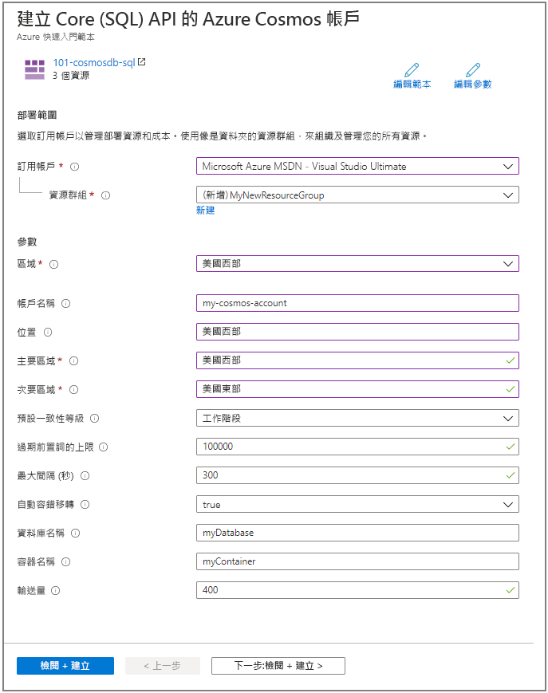
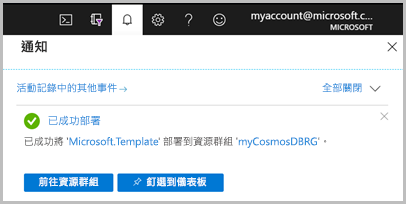

# <a name="quickstart-create-an-azure-cosmos-db-and-a-container-by-using-azure-resource-manager-template"></a>快速入門：使用 Azure Resource Manager 範本來建立 Azure Cosmos DB 和容器

Azure Cosmos DB 是 Microsoft 的全域分散式多模型資料庫服務。 您可以使用 Azure Cosmos DB 快速地建立及查詢機碼/值資料庫、文件資料庫與圖形資料庫。 本快速入門所著重的程序可讓您部署 Resource Manager 範本以建立 Azure Cosmos 資料庫並於該資料庫內建立容器。 您稍後可以在此容器中儲存資料。

[!INCLUDE [About Azure Resource Manager](../../includes/resource-manager-quickstart-introduction.md)]

如果您沒有 Azure 訂用帳戶，請在開始前建立[免費帳戶](https://azure.microsoft.com/free/?WT.mc_id=A261C142F)。

## <a name="prerequisites"></a>Prerequisites

Azure 訂用帳戶或免費的 Azure Cosmos DB 試用帳戶

- [!INCLUDE [quickstarts-free-trial-note](../../includes/quickstarts-free-trial-note.md)]

- [!INCLUDE [cosmos-db-emulator-docdb-api](../../includes/cosmos-db-emulator-docdb-api.md)]

## <a name="create-an-azure-cosmos-account-database-container"></a>建立 Azure Cosmos 帳戶、資料庫和容器

### <a name="review-the-template"></a>檢閱範本

本快速入門中使用的範本是來自 [Azure 快速入門範本](https://azure.microsoft.com/resources/templates/101-cosmosdb-create/)。

:::code language="json" source="~/quickstart-templates/101-cosmosdb-create/azuredeploy.json":::

範本中定義了三個 Azure 資源：

* [Microsoft.DocumentDB/databaseAccounts](/azure/templates/microsoft.documentdb/databaseaccounts)：建立 Azure Cosmos 帳戶。

* [Microsoft.DocumentDB/databaseAccounts/sqlDatabases](/azure/templates/microsoft.documentdb/databaseaccounts/sqldatabases)：建立 Azure Cosmos 資料庫。

* [Microsoft.DocumentDB/databaseAccounts/sqlDatabases/containers](/azure/templates/microsoft.documentdb/databaseaccounts/sqldatabases/containers)：建立 Azure Cosmos 容器。

您可以在[快速入門範本資源庫](https://azure.microsoft.com/resources/templates/?resourceType=Microsoft.Documentdb)中找到更多 Azure Cosmos DB 範本的範例。

### <a name="deploy-the-template"></a>部署範本

1. 選取以下影像來登入 Azure 並開啟範本。 此範本會建立 Azure Cosmos 帳戶、資料庫和容器。

   [](https://portal.azure.com/#create/Microsoft.Template/uri/https%3A%2F%2Fraw.githubusercontent.com%2FAzure%2Fazure-quickstart-templates%2Fmaster%2F101-cosmosdb-create%2Fazuredeploy.json)

2. 選取或輸入下列值。

   

    除非有指定，否則請使用預設值來建立 Azure Cosmos 資源。

    * **訂用帳戶**：選取 Azure 訂用帳戶。
    * [資源群組]  選取 [新建]  ，輸入資源群組的唯一名稱，然後按一下 [確認]  。
    * **位置**：選取位置。  例如，**美國中部**。
    * **帳戶名稱**：輸入 Azure Cosmos 帳戶的名稱。 此名稱必須是全域唯一的。
    * **位置**：輸入您想要在其中建立 Azure Cosmos 帳戶的位置。 Azure Cosmos 帳戶可以位於和資源群組相同的位置。
    * **主要區域**：Azure Cosmos 帳戶的主要複本區域。
    * **次要區域**：Azure Cosmos 帳戶的次要複本區域。
    * **資料庫名稱**：Azure Cosmos 資料庫的名稱。
    * **容器名稱**：Azure Cosmos 容器的名稱。
    * **輸送量**：容器的輸送量，輸送量的最小值為 400 RU/秒。
    * **我同意上方所述的條款及條件**：選取。

3. 選取 [購買]  。 成功部署 Azure Cosmos 帳戶之後，您會收到通知：

   

Azure 入口網站用於部署範本。 除了 Azure 入口網站以外，您也可以使用 Azure PowerShell、Azure CLI 和 REST API。 若要了解其他部署方法，請參閱[部署範本](../azure-resource-manager/templates/deploy-powershell.md)。

## <a name="validate-the-deployment"></a>驗證部署

您可以使用 Azure 入口網站來檢查 Azure Cosmos 帳戶、資料庫和容器，或使用下列 Azure CLI 或 Azure PowerShell 指令碼來列出已建立的祕密。

# <a name="cli"></a>[CLI](#tab/CLI)

```azurecli-interactive
echo "Enter your Azure Cosmos account name:" &&
read cosmosAccountName &&
echo "Enter the resource group where the Azure Cosmos account exists:" &&
read resourcegroupName &&
az cosmosdb show -g $resourcegroupName -n $cosmosAccountName
```

# <a name="powershell"></a>[PowerShell](#tab/PowerShell)

```azurepowershell-interactive
$resourceGroupName = Read-Host -Prompt "Enter the resource group name where your Azure Cosmos account exists"
(Get-AzResource -ResourceType "Microsoft.DocumentDB/databaseAccounts" -ResourceGroupName $resourceGroupName).Name
 Write-Host "Press [ENTER] to continue..."
```

---

## <a name="clean-up-resources"></a>清除資源

如果您打算繼續進行後續的教學課程，您可以讓這些資源留在原處。
如果不再需要，請刪除資源群組，這會刪除 Azure Cosmos 帳戶和相關資源。 若要使用 Azure CLI 或 Azure Powershell 刪除資源群組：

# <a name="cli"></a>[CLI](#tab/CLI)

```azurecli-interactive
echo "Enter the Resource Group name:" &&
read resourceGroupName &&
az group delete --name $resourceGroupName &&
echo "Press [ENTER] to continue ..."
```

# <a name="powershell"></a>[PowerShell](#tab/PowerShell)

```azurepowershell-interactive
$resourceGroupName = Read-Host -Prompt "Enter the Resource Group name"
Remove-AzResourceGroup -Name $resourceGroupName
Write-Host "Press [ENTER] to continue..."
```

---

## <a name="next-steps"></a>後續步驟

在本快速入門中，您已使用 Azure Resource Manager 範本建立 Azure Cosmos 帳戶、資料庫和容器，並已驗證過部署。 若要深入了解 Azure Cosmos DB 和 Azure Resource Manager，請繼續閱讀下列文章。

- 閱讀 [Azure Cosmos DB 的概觀](introduction.md)
- 深入了解 [Azure Resource Manager](../azure-resource-manager/management/overview.md)
- 取得其他的 [Azure Cosmos DB Resource Manager 範本](resource-manager-samples.md)