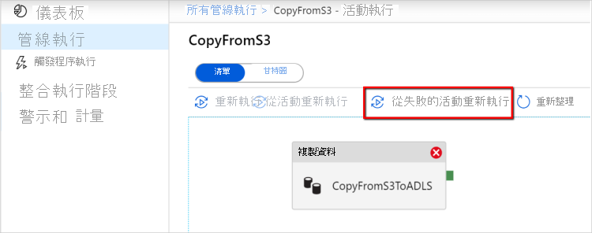

# <a name="copy-activity-in-azure-data-factory"></a>在 Azure 資料工廠中複製活動

> [!div class="op_single_selector" title1="選擇您正在使用的資料工廠版本："]
> * [版本 1](v1/data-factory-data-movement-activities.md)
> * [當前版本](copy-activity-overview.md)

在 Azure 資料工廠中，可以使用"複製"活動在位於本地和雲中的資料存儲之間複製資料。 複製資料後，可以使用其他活動進一步轉換和分析資料。 您還可以使用 Copy 活動發佈轉換和分析結果，用於商業智慧 （BI） 和應用程式使用。


Copy 活動在[集成運行時](concepts-integration-runtime.md)執行。 對於不同的資料複製方案，可以使用不同類型的集成運行時：

* 當您從任何 IP 在兩個通過互聯網公開訪問的資料存儲之間複製資料時，可以使用 Azure 集成運行時進行複製活動。 此集成運行時安全、可靠、可擴展且[全域可用](concepts-integration-runtime.md#integration-runtime-location)。
* 將資料複製到本地或具有存取控制的網路中的資料存儲（例如，Azure 虛擬網路）時，需要設置自託管集成運行時。

集成運行時需要與每個源和接收器資料存儲相關聯。 有關如何複製活動確定要使用的集成運行時的資訊，請參閱[確定要使用的 IR。](concepts-integration-runtime.md#determining-which-ir-to-use)

要將資料從源複製到接收器，運行 Copy 活動的服務將執行以下步驟：

1. 從來源資料存放區讀取資料。
2. 執行序列化/反序列化、壓縮/解壓縮、列映射等。 它根據輸入資料集、輸出資料集和複製活動的配置執行這些操作。
3. 將資料寫入接收/目的地資料存放區。


## <a name="supported-data-stores-and-formats"></a>支援的資料存放區和格式

[!INCLUDE [data-factory-v2-supported-data-stores](../../includes/data-factory-v2-supported-data-stores.md)]

### <a name="supported-file-formats"></a>支援的檔案格式

[!INCLUDE [data-factory-v2-file-formats](../../includes/data-factory-v2-file-formats.md)] 

您可以使用 Copy 活動在兩個基於檔的資料存儲之間按大小報方式複製檔，在這種情況下，資料可以有效地複製，而無需任何序列化或反序列化。 此外，您還可以分析或生成給定格式的檔，例如，您可以執行以下操作：

* 從本地 SQL Server 資料庫複製資料，以 Parquet 格式寫入 Azure 資料湖存儲 Gen2。
* 從本地檔案系統複製文本 （CSV） 格式的檔，然後以 Avro 格式寫入 Azure Blob 存儲。
* 從本地檔案系統複製壓縮檔，動態解壓縮這些檔，並將提取的檔寫入 Azure 資料湖存儲 Gen2。
* 從 Azure Blob 存儲以 Gzip 壓縮文本 （CSV） 格式複製資料並將其寫入 Azure SQL 資料庫。
* 需要序列化/反序列化或壓縮/解壓縮的更多活動。

## <a name="supported-regions"></a>支援區域

啟用 Copy 活動的服務在[Azure 集成運行時位置](concepts-integration-runtime.md#integration-runtime-location)中列出的區域和地理位置中全域可用。 全域可用的拓撲可確保進行有效率的資料移動，通常可避免發生跨區域躍點的情況。 請參閱[按區域查看產品](https://azure.microsoft.com/regions/#services)，以檢查特定區域中資料工廠的可用性和資料移動。

## <a name="configuration"></a>組態

[!INCLUDE [data-factory-v2-connector-get-started](../../includes/data-factory-v2-connector-get-started.md)]

通常，要在 Azure 資料工廠中使用"複製"活動，您需要：

1. **為來源資料存儲和接收器資料存儲創建連結服務。** 您可以在本文的["支援資料存儲和格式](#supported-data-stores-and-formats)"部分找到受支援的連接器清單。 有關配置資訊和支援的屬性，請參閱連接器文章的"連結服務屬性"部分。 
2. **為源和接收器創建資料集。** 有關配置資訊和支援的屬性，請參閱源和接收器連接器文章的"資料集屬性"部分。
3. **使用"複製"活動創建管道。** 下一節提供範例。

### <a name="syntax"></a>語法

Copy 活動的以下範本包含支援屬性的完整清單。 請指定適合您案例的屬性。

```json
"activities":[
    {
        "name": "CopyActivityTemplate",
        "type": "Copy",
        "inputs": [
            {
                "referenceName": "<source dataset name>",
                "type": "DatasetReference"
            }
        ],
        "outputs": [
            {
                "referenceName": "<sink dataset name>",
                "type": "DatasetReference"
            }
        ],
        "typeProperties": {
            "source": {
                "type": "<source type>",
                <properties>
            },
            "sink": {
                "type": "<sink type>"
                <properties>
            },
            "translator":
            {
                "type": "TabularTranslator",
                "columnMappings": "<column mapping>"
            },
            "dataIntegrationUnits": <number>,
            "parallelCopies": <number>,
            "enableStaging": true/false,
            "stagingSettings": {
                <properties>
            },
            "enableSkipIncompatibleRow": true/false,
            "redirectIncompatibleRowSettings": {
                <properties>
            }
        }
    }
]
```

#### <a name="syntax-details"></a>語法詳細資料

| 屬性 | 描述 | 必要項？ |
|:--- |:--- |:--- |
| type | 對於複製活動，設置為`Copy` | 是 |
| 輸入 | 指定您創建的指向來源資料的資料集。 複製活動僅支援單個輸入。 | 是 |
| 輸出 | 指定您創建的指向接收器資料的資料集。 複製活動僅支援單個輸出。 | 是 |
| typeProperties | 指定屬性以配置複製活動。 | 是 |
| source | 指定用於檢索資料的複製源類型和相應的屬性。<br/>有關詳細資訊，請參閱[在"支援資料存儲和格式](#supported-data-stores-and-formats)"中列出的連接器文章中的"複製活動屬性"部分。 | 是 |
| 接收 | 指定複製接收器類型和用於寫入資料的相應屬性。<br/>有關詳細資訊，請參閱[在"支援資料存儲和格式](#supported-data-stores-and-formats)"中列出的連接器文章中的"複製活動屬性"部分。 | 是 |
| 轉譯程式 | 指定從來源到接收的明確資料行對應。 當預設複製行為不能滿足您的需要時，此屬性將適用。<br/>有關詳細資訊，請參閱[複製活動中的架構映射](copy-activity-schema-and-type-mapping.md)。 | 否 |
| dataIntegrationUnits | 指定表示[Azure 集成運行時](concepts-integration-runtime.md)用於資料複製的功率量的度量值。 這些單元以前稱為雲資料移動單元 （DMU）。 <br/>有關詳細資訊，請參閱[資料整合單元](copy-activity-performance.md#data-integration-units)。 | 否 |
| parallelCopies | 指定在從源讀取資料和將資料寫入接收器時希望"複製"活動使用的並行性。<br/>有關詳細資訊，請參閱[並行副本](copy-activity-performance.md#parallel-copy)。 | 否 |
| 保留 | 指定是否在資料複製期間保留中繼資料/ACL。 <br/>有關詳細資訊，請參閱[保留中繼資料](copy-activity-preserve-metadata.md)。 |否 |
| enableStaging<br/>stagingSettings | 指定是在 Blob 存儲中暫存臨時資料，而不是將資料從源複製到接收器。<br/>有關有用方案和配置詳細資訊的資訊，請參閱[暫存副本](copy-activity-performance.md#staged-copy)。 | 否 |
| enableSkipIncompatibleRow<br/>redirectIncompatibleRowSettings| 選擇在將資料從源複製到接收器時如何處理不相容的行。<br/>有關詳細資訊，請參閱[容錯](copy-activity-fault-tolerance.md)。 | 否 |

## <a name="monitoring"></a>監視

可以以可視方式和程式設計方式監視 Azure 資料工廠中運行的複製活動。 有關詳細資訊，請參閱[監視複製活動](copy-activity-monitoring.md)。

## <a name="incremental-copy"></a>增量複製

資料工廠使您能夠增量地將增量資料從來源資料存儲複製到接收器資料存儲。 有關詳細資訊，請參閱[教程：增量複製資料](tutorial-incremental-copy-overview.md)。

## <a name="performance-and-tuning"></a>效能和微調

[複製活動監視](copy-activity-monitoring.md)體驗顯示每個活動運行的複製性能統計資訊。 ["複製活動性能和可伸縮性"指南](copy-activity-performance.md)描述了通過 Azure 資料工廠中的複製活動影響資料移動性能的關鍵因素。 它還列出了測試期間觀察到的性能值，並討論了如何優化 Copy 活動的性能。

## <a name="resume-from-last-failed-run"></a>從上次失敗運行中恢復

複製活動支援從上次失敗運行恢復，當您在檔案為儲存基礎之間以二進位格式複製大量檔，並選擇將資料夾/檔層次結構從源保留到接收器時，例如將資料從 Amazon S3 遷移到 Azure 資料湖存儲 Gen2。 它適用于以下基於檔的連接器：[亞馬遜S3、Azure](connector-amazon-simple-storage-service.md) [Blob、Azure](connector-azure-blob-storage.md)[資料存儲第1代](connector-azure-data-lake-store.md)[、Azure資料存儲第2代](connector-azure-data-lake-storage.md)[、Azure檔存儲](connector-azure-file-storage.md)、[檔案系統](connector-file-system.md)[、FTP、](connector-ftp.md)[谷歌雲存儲](connector-google-cloud-storage.md)[、HDFS](connector-hdfs.md)和[SFTP。](connector-sftp.md)

您可以通過以下兩種方式利用複製活動恢復：

- **活動級別重試：** 您可以對複製活動設置重試計數。 在管道執行期間，如果此複製活動運行失敗，則下一次自動重試將從上次試用的失敗點開始。
- **從失敗活動重新運行：** 管道執行完成後，您還可以從 ADF UI 監視視圖中的失敗活動或以程式設計方式觸發重新運行。 如果失敗的活動是複製活動，則管道不僅將從此活動重新運行，而且還將從上一個運行的失敗點恢復。

    

需要注意的幾點：

- 恢復在檔級別進行。 如果在複製檔時複製活動失敗，則在下一次運行中，將重新複製此特定檔。
- 要使恢復正常工作，請不要更改重新運行之間的複製活動設置。
- 當您從 Amazon S3、Azure Blob、Azure 資料存儲第 2 代和 Google 雲存儲複製資料時，複製活動可以從任意數量的複製檔案修復。 而對於其餘基於檔的連接器作為源，當前複製活動支援從數量有限的檔案修復，通常在數萬個檔範圍內，並且根據檔路徑的長度而變化;此編號以外的檔將在重播期間重新複製。

對於除二進位檔案副本以外的其他方案，複製活動從一開始就開始。

## <a name="preserve-metadata-along-with-data"></a>保留中繼資料和資料

在將資料從源複製到接收器時，在資料湖遷移等方案中，還可以選擇使用複製活動保留中繼資料和 ACL 以及資料。 有關詳細資訊[，請參閱保留中繼資料](copy-activity-preserve-metadata.md)。

## <a name="schema-and-data-type-mapping"></a>結構描述和資料類型對應

有關"複製"活動如何將源資料對應到接收器的資訊，請參閱[架構和資料類型映射](copy-activity-schema-and-type-mapping.md)。

## <a name="add-additional-columns-during-copy"></a>在複製期間添加其他列

除了將資料從來源資料存儲複製到接收器外，還可以配置為添加其他資料列以沿接收器複製。 例如：

- 從基於檔的源複製時，將相對檔路徑存儲為一個附加列，以跟蹤資料來自哪個檔。
- 添加具有 ADF 運算式的列，以附加 ADF 系統變數（如管道名稱/管道 ID）或從上游活動的輸出存儲其他動態值。
- 添加具有靜態值的列，以滿足下游消費需求。

您可以在複製活動源選項卡上找到以下配置： 


>[!TIP]
>此功能與最新的資料集模型配合使用。 如果從 UI 看不到此選項，請嘗試創建新資料集。

要以程式設計方式配置它，請`additionalColumns`在複製活動源中添加該屬性：

| 屬性 | 描述 | 必要 |
| --- | --- | --- |
| 其他列 | 添加要複製到接收器的其他資料列。<br><br>`additionalColumns`陣列下的每個物件表示一個額外的列。 定義`name`列名稱，並`value`指示該列的資料值。<br><br>允許的資料值包括：<br>- **`$$FILEPATH`**- 保留變數指示將原始檔案的相對路徑存儲到資料集中指定的資料夾路徑。 應用於基於檔的源。<br>- **表達**<br>- **靜態值** | 否 |

**例子：**

```json
"activities":[
    {
        "name": "CopyWithAdditionalColumns",
        "type": "Copy",
        "inputs": [...],
        "outputs": [...],
        "typeProperties": {
            "source": {
                "type": "<source type>",
                "additionalColumns": [
                    {
                        "name": "filePath",
                        "value": "$$FILEPATH"
                    },
                    {
                        "name": "pipelineName",
                        "value": {
                            "value": "@pipeline().Pipeline",
                            "type": "Expression"
                        }
                    },
                    {
                        "name": "staticValue",
                        "value": "sampleValue"
                    }
                ],
                ...
            },
            "sink": {
                "type": "<sink type>"
            }
        }
    }
]
```

## <a name="fault-tolerance"></a>容錯

預設情況下，Copy 活動停止複製資料，並在來源資料行與接收器資料行不相容時返回失敗。 要使複製成功，可以將"複製"活動配置為跳過並記錄不相容的行，並僅複製相容的資料。 有關詳細資訊，請參閱[複製活動容錯容差](copy-activity-fault-tolerance.md)。

## <a name="next-steps"></a>後續步驟
請參閱下列快速入門、教學課程和範例：

- [將資料從一個位置複製到同一 Azure Blob 存儲帳戶中的另一個位置](quickstart-create-data-factory-dot-net.md)
- [將資料從 Azure Blob 存儲複製到 Azure SQL 資料庫](tutorial-copy-data-dot-net.md)
- [將資料從本地 SQL Server 資料庫複製到 Azure](tutorial-hybrid-copy-powershell.md)
