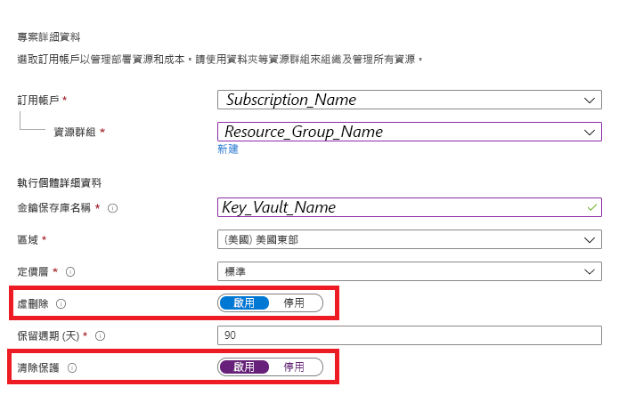
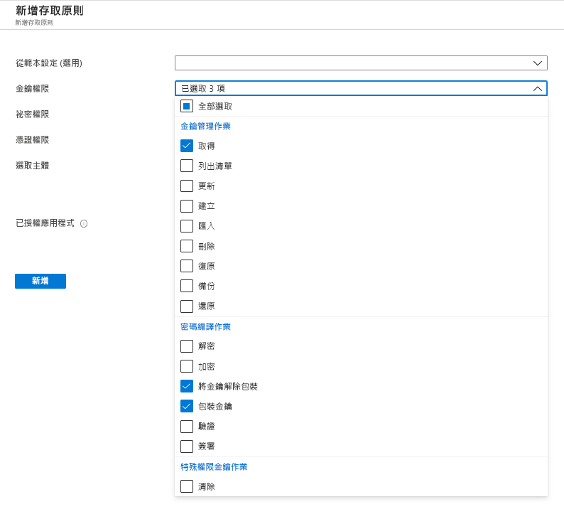
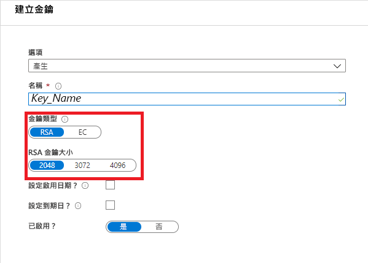
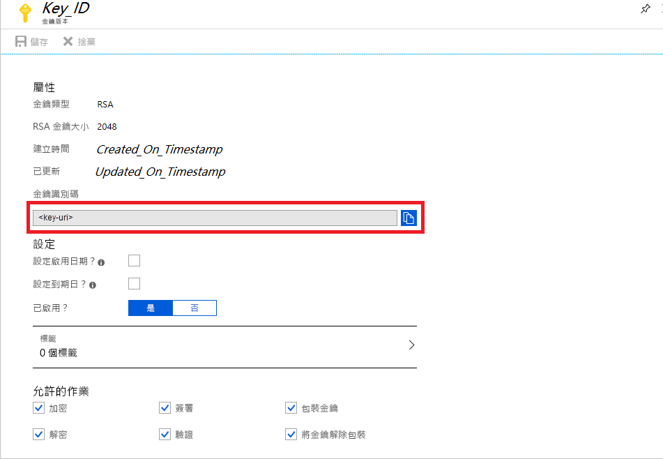
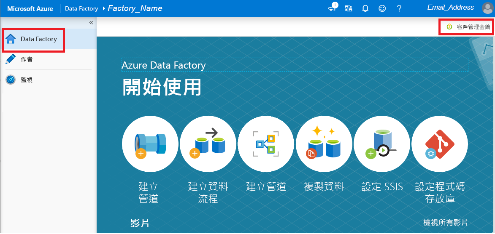

# 使用客戶管理的金鑰來加密 Azure Data Factory

[!INCLUDE[appliesto-adf-xxx-md](includes/appliesto-adf-xxx-md.md)]

Azure Data Factory 會加密待用資料，包括實體定義、在執行期間快取的任何資料，以及針對資料預覽而快取的資料。 根據預設，資料會使用隨機產生、由 Microsoft 管理的金鑰進行加密，且該金鑰會唯一指派給您的資料處理站。 若要確保能有更高的安全性，您現在可以在 Azure Data Factory 中使用客戶管理的金鑰功能啟用自備金鑰 (BYOK)。 當您指定客戶管理的金鑰時，Data Factory 會__同時__使用處理站系統金鑰和 CMK 來加密客戶資料。 若缺少金鑰，可能會導致存取資料和處理站時遭到拒絕。

必須要有 Azure Key Vault 才能儲存客戶管理的金鑰。 您可以建立自己的金鑰並將其儲存在金鑰保存庫中，或是使用 Azure Key Vault API 來產生金鑰。 金鑰保存庫和 Data Factory 必須位於相同的 Azure Active Directory (Azure AD) 租用戶和相同區域中，但兩者可位於不同的訂用帳戶中。 如需 Azure 金鑰保存庫的詳細資訊，請參閱 [什麼是 Azure 金鑰保存庫？](../key-vault/general/overview.md)

> [!NOTE]
> 客戶管理的金鑰只能設定於空的資料處理站中。 資料處理站不可包含任何像是連結服務、管線和資料流程的資源。 建議您在建立處理站之後立即啟用客戶管理的金鑰。

## 關於客戶管理的金鑰

下圖顯示 Data Factory 如何透過 Azure Active Directory 和 Azure Key Vault 使用客戶管理的金鑰提出要求：

  

下列清單說明圖表中編號的步驟：

1. Azure Key Vault 管理員為與 Data Factory 相關聯的受控識別授與加密金鑰的權限
1. Data Factory 管理員在處理站中啟用客戶管理的金鑰功能
1. Data Factory 使用與處理站相關聯的受控識別，透過 Azure Active Directory 驗證對 Azure Key Vault 的存取
1. Data Factory 在 Azure Key Vault 中包裝處理站加密金鑰與客戶金鑰
1. 針對讀取/寫入作業，Data Factory 將要求傳送至 Azure Key Vault 以解除包裝帳戶加密金鑰，並執行加密和解密作業

## 必要條件 - 設定 Azure Key Vault 並產生金鑰

### 在 Azure Key Vault 上啟用「虛刪除」和「不要清除」

要將客戶管理的金鑰用於 Data Factory，必須在 Key Vault 上設定兩個屬性：__虛刪除__和__不要清除__。 這些屬性可以使用 PowerShell 或 Azure CLI 在新的或現有的金鑰保存庫上啟用。 若要了解如何在現有的金鑰保存庫上啟用這些屬性，請參閱下列其中一篇文章中的_啟用虛刪除_和_啟用清除保護_小節：

- [透過 PowerShell 使用虛刪除](../key-vault/general/soft-delete-powershell.md)
- [如何透過 CLI 使用虛刪除](../key-vault/general/soft-delete-cli.md)

如果您要透過 Azure 入口網站建立新的 Azure Key Vault，可以依照下列方式啟用__虛刪除__和__不要清除__：

  

### 為 Data Factory 授與對 Azure Key Vault 的存取權

請確定 Azure Key Vault 與 Azure Data Factory 位於相同的 Azure Active Directory (Azure AD) 租用戶和_相同區域_中。 透過 Azure Key Vault 存取控制，為資料處理站的受控服務識別 (MSI) 授與下列權限：_取得_、_解除包裝金鑰_和_包裝金鑰_。 必須要有這些權限，才能在 Data Factory 中啟用客戶管理的金鑰。

  

### 產生客戶管理的金鑰或將其上傳至 Azure Key Vault

您可以建立自己的金鑰並將其儲存在金鑰保存庫中，或是使用 Azure Key Vault API 來產生金鑰。 Data Factory 加密僅支援 2048 位元的 RSA 金鑰。 如需詳細資訊，請參閱[關於金鑰、祕密和憑證](../key-vault/general/about-keys-secrets-certificates.md)。

  

## 啟用客戶管理的金鑰

1. 確定 Data Factory 是空的。 資料處理站不可包含任何像是連結服務、管線和資料流程的資源。 目前，將客戶管理的金鑰部署至非空白的處理站將會導致錯誤。

1. 若要在 Azure 入口網站中找出金鑰 URI，請瀏覽至 Azure Key Vault，然後選取 [金鑰] 設定。 選取所需的金鑰，然後按一下金鑰以檢視其版本。 選取金鑰版本以檢視設定

1. 複製 [金鑰識別碼] 欄位的值，以提供 URI

    

1. 啟動 Azure Data Factory 入口網站，並使用左側的導覽列跳至 Data Factory 首頁

1. 按一下 [客戶管理的金鑰] 圖示

    

1. 輸入您先前複製的客戶管理金鑰的 URI

1. 按一下 [儲存]，就會為 Data Factory 啟用客戶管理的金鑰加密

## 更新金鑰版本

當您建立新版本的金鑰時，請將資料處理站更新為使用新版本。 請依照_啟用客戶管理的金鑰_一節中說明的類似步驟操作，包括：

1. 透過 Azure Key Vault 入口網站找出新金鑰版本的 URI

1. 瀏覽至 [客戶管理的金鑰] 設定

1. 取代並貼上新金鑰的 URI

1. 按一下 [儲存]，Data Factory 現在將會使用新的金鑰版本進行加密

## 使用不同的金鑰

若要變更 Data Factory 加密所使用的金鑰，您必須手動更新 Data Factory 中的設定。 請依照_啟用客戶管理的金鑰_一節中說明的類似步驟操作，包括：

1. 透過 Azure Key Vault 入口網站找出新金鑰的 URI

1. 瀏覽至 [客戶管理的金鑰] 設定

1. 取代並貼上新金鑰的 URI

1. 按一下 [儲存]，Data Factory 現在將會使用新的金鑰進行加密

## 停用客戶管理的金鑰

根據設計，在啟用客戶管理的金鑰功能後，即無法移除額外的安全性步驟。 我們將預期一律會以客戶提供的金鑰加密處理站和資料。

## 後續步驟

瀏覽[教學課程](tutorial-copy-data-dot-net.md)以了解使用 Data Factory 的更多案例。
