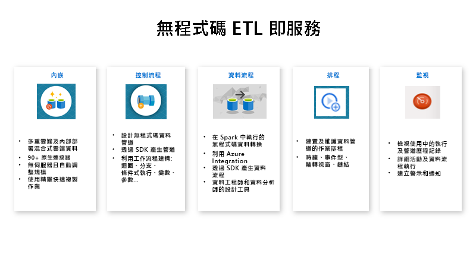

# Azure 資料處理站是什麼？

[!INCLUDE[appliesto-adf-xxx-md](includes/appliesto-adf-xxx-md.md)]

在巨量資料的世界中，未經處理、未經組織的資料通常是儲存在關聯式、非關聯式及其他儲存體系統中。 不過，未經處理資料本身並沒有適當的內容或意義，因此無法為分析人員、資料科學人員或業務決策者提供有意義的深入解析。 

巨量資料需要以下服務：可協調和運作程序，將這些龐大的未經處理資料存放區精簡成可操作的業務見解。 Azure Data Factory 是一個針對這些複雜的混合式「擷取、轉換和載入」(ELT)、「擷取、載入和轉換」(ELT) 及資料整合專案建立的受控雲端服務。

例如，想像有一個收集雲端遊戲所產生之數 PB 遊戲記錄的遊戲公司。 該公司想要分析這些記錄，深入了解客戶喜好設定、人口統計和使用行為。 這家公司也想要識別向上銷售和交叉銷售機會，開發強大的新功能來推動業務成長，以及為客戶提供更好的體驗。

為了分析這些記錄，此公司必須使用參考資料，例如內部部署資料存放區中的客戶資訊、遊戲資訊及行銷活動資訊。 此公司想要利用這份來自內部部署資料存放區的資料，將其與雲端資料存放區中的額外記錄資料結合。 

為了擷取深入解析，它希望使用雲端中的 Spark 叢集 (Azure HDInsight) 來處理聯結的資料，然後將轉換後的資料發佈到雲端資料倉儲 (例如 Azure SQL 資料倉儲)，來輕鬆地以該資料建立報告。 他們想要自動執行此工作流程，並且每日按照排程監視和管理此工作流程。 他們也想要在檔案進入 Blob 存放區容器時執行該工作流程。

Azure Data Factory 就是解決這類資料案例的平台。 這是一項*雲端式 ETL 和資料整合服務，可讓您在建立資料驅動工作流程，以便協調資料移動和大規模轉換資料*。 使用 Azure Data Factory，可以建立並排程資料驅動的工作流程 (稱為管線)，它可以從不同的資料存放區擷取資料。 您可以建立複雜的 ETL 程序，透過資料流程或使用計算服務 (例如 Azure HDInsight Hadoop、Azure Databricks 和 Azure SQL Database) 以視覺化方式轉換資料。 

此外，您可以將已轉換的資料發佈至資料存放區，例如 Azure SQL 資料倉儲，讓商業智慧 (BI) 應用程式取用。 最後，透過 Azure Data Factory，即可將未經處理資料組織到有意義的資料存放區和資料湖中，以供做出更好的業務決策。

## 運作方式

Data Factory 包含一系列的互連系統，可為資料工程師提供完整的端對端平台。

### 連線及收集

企業有位於內部部署環境和雲端中截然不同來源的各種類型資料 (結構化、非結構化及半結構化)，全都以不同的間隔和速度抵達。 

建置資訊生產系統的第一步，就是連線到所有必要的資料和處理來源 (例如軟體即服務 (SaaS) 服務、資料庫、檔案共用和 FTP Web 服務)。 下一個步驟為視需要將資料移至集中式位置進行後續處理。

沒有 Data Factory，企業必須建置自訂的資料移動元件或撰寫自訂服務，以整合這些資料來源和處理。 整合和維護這類系統相當耗費成本而且困難。 此外，這些系統經常會缺少企業等級監視、警示與完全受控服務可以提供的控制項。

有了 Data Factory，您就可以使用資料管線中的[複製活動](copy-activity-overview.md)，將內部部署和雲端來源資料存放區內的資料都移到雲端中的集中資料存放區，以供進一步分析。 例如，您可以收集 Azure Data Lake Storage 中的資料，之後使用 Azure Data Lake Analytics 計算服務來轉換資料。 您也可以收集 Azure Blob 儲存體中的資料，之後使用 Azure HDInsight Hadoop 叢集來轉換資料。

### 轉換及擴充
在資料存在於雲端的集中式資料存放區之後，請使用 ADF 對應資料流程來處理或轉換所收集的資料。 資料流程可讓資料工程師建立和維護在 Spark 上執行的資料轉換圖表，而不需了解 Spark 叢集或 Spark 程式設計。

如果您想要手動編寫轉換的程式碼，ADF 支援外部活動，可供在 HDInsight Hadoop、Spark、Data Lake Analytics 和 Machine Learning 等計算服務上執行轉換。

### CI/CD 和發佈
Data Factory 使用 Azure DevOps 和 GitHub，為資料管線的 CI/CD 提供完整的支援。 這可讓您在發佈成品之前，以累加方式開發和傳遞您的 ETL 程序。 在未經處理資料已精簡成符合業務需求的可取用形式之後，將該資料載入到 Azure 資料倉儲、Azure SQL Database、Azure CosmosDB，或業務使用者可從其商業智慧工具指向的任何分析引擎。

### 監視
在您順利建置並部署資料整合管線之後 (從精簡資料提供業務價值)，請監視所排定活動和管線的成功和失敗率。 Azure Data Factory 提供內建支援，可讓您透過 Azure 監視器、API、PowerShell、Azure 監視器記錄及 Azure 入口網站上的健康情況面板監視管線。

## 最上層概念
Azure 訂用帳戶可能會有一或多個 Azure Data Factory 執行個體 (或資料處理站)。 Azure Data Factory 是由四個主要元件所組成。 這些元件會一起運作，以提供平台讓您撰寫具有資料移動和轉換步驟的資料驅動工作流程。

### 管線
資料處理站可以有一或多個管線。 管線是一個執行某個單位工作的活動邏輯群組。 管線中的活動會合作執行一項工作。 例如，管線可以包含一組活動，以從 Azure Blob 內嵌資料，然後對 HDInsight 叢集執行 Hive 查詢來分割資料。 

這麼做的好處是，您可以將這些活動作為一個集合來進行管線，而不是個別管理每個活動。 管線中的活動可以鏈結在一起以循序方式運作，或是以平行方式獨立運作。

### 對應資料流程
建立和管理資料轉換邏輯的圖表，您可以用來轉換任何大小的資料。 您可以建置資料轉換常式的可重複使用程式庫，並從 ADF 管線以相應放大的方式執行這些程序。 Data Factory 會在 Spark 叢集上執行您的邏輯，根據您的需要進行向上和向下微調。 您不需要管理或維護叢集。

### 活動
活動代表管線中的處理步驟。 例如，您可以使用複製活動將資料從某個資料存放區複製到另一個資料存放區。 同樣地，您可以使用在 Azure HDInsight 叢集上執行 Hive 查詢的 Hive 活動，來轉換或分析您的資料。 Data Factory 支援三種類型的活動︰資料移動活動、資料轉換活動，以及控制活動。

### 資料集
資料集代表資料存放區中的資料結構，其只會指出或參考您要在活動中作為輸入或輸出的資料。 

### 連結的服務
已連結的服務非常類似連接字串，可定義 Data Factory 連接到外部資源所需的連線資訊。 這麼說吧：連結的服務會定義與資料來源的連線，而資料集代表資料的結構。 例如，Azure 儲存體連結的服務會指定連接字串以連線到 Azure 儲存體帳戶。 此外，Azure Blob 資料集會指定包含資料的 Blob 容器和資料夾。

Data Factory 中的連結服務，有兩個用途：

- 用來代表**資料存放區**，其中包含 (但不限於) 內部部署 SQL Server 資料庫、Oracle 資料庫、檔案共用或 Azure Blob 儲存體帳戶。 如需所支援資料存放區的清單，請參閱[複製活動](copy-activity-overview.md)一文。

- 用來代表可裝載活動執行的 **計算資源** 。 例如，HDInsightHive 活動會在 HDInsight Hadoop 叢集上執行。 如需轉換活動和所支援計算環境的清單，請參閱[轉換資料](transform-data.md)一文。

### 觸發程序
觸發程序是一種處理單位，可用來決定何時需要開始執行管線。 針對不同類型的事件，有不同類型的觸發程序。

### 管線執行
管線執行是執行管線的執行個體。 「管線執行」通常是藉由將引數傳遞給管線中定義的參數來具現化。 傳遞引數時，可以藉由手動方式傳遞，或在觸發程序定義內傳遞。

### 參數
參數是唯讀設定的鍵值組。  參數定義於管線中。 傳遞所定義參數的引數時，則是在從觸發程序或手動執行之管線所建立的執行內容中執行時傳遞。 管線內的活動會取用參數值。

資料集是一種強型別參數，也是可重複使用/可參考的實體。 活動可以參考資料集，而且可以取用資料集定義中所定義的屬性。

連結服務也是一種強型別參數，其中包含資料存放區或計算環境的連線資訊。 它也是可重複使用/可參考的實體。

### 控制流程
控制流程是管線活動的協調流程，其中包括將活動循序鏈結、分支、在管線層級定義參數，以及在依需求或從觸發程序叫用管線時傳遞引數。 此外，也包括自訂狀態傳遞和迴圈容器，亦即 For-each 列舉程式。

### 變數
變數可以在管線內用來儲存暫存值，也可以與參數搭配使用，在管線、資料流程和其他活動之間傳遞值。

## 後續步驟
以下是可探索的重要後續步驟文件：

- [資料集和連結服務](concepts-datasets-linked-services.md)
- [管線和活動](concepts-pipelines-activities.md)
- [整合執行階段](concepts-integration-runtime.md)
- [對應資料流程](concepts-data-flow-overview.md)
- [Azure 入口網站中的 Data Factory 使用者介面](quickstart-create-data-factory-portal.md)
- [Azure 入口網站中的複製資料工具](quickstart-create-data-factory-copy-data-tool.md)
- [PowerShell](quickstart-create-data-factory-powershell.md)
- [.NET](quickstart-create-data-factory-dot-net.md)
- [Python](quickstart-create-data-factory-python.md)
- [REST](quickstart-create-data-factory-rest-api.md)
- [Azure Resource Manager 範本](quickstart-create-data-factory-resource-manager-template.md)
 
