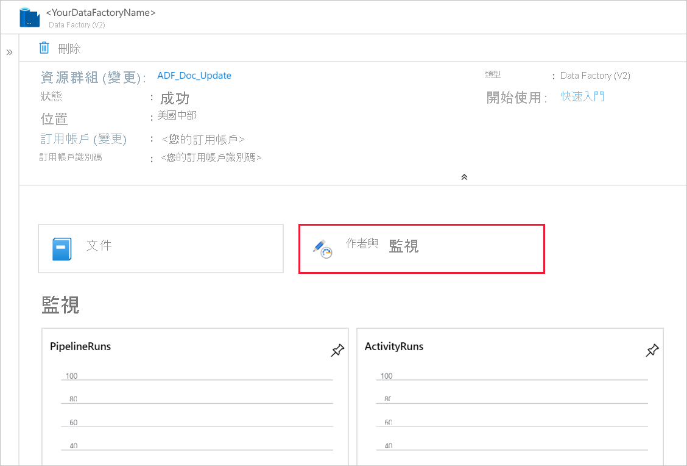

# 使用 Azure Data Factory 將資料載入 Azure Data Lake Storage Gen2 中

[!INCLUDE[appliesto-adf-xxx-md](includes/appliesto-adf-xxx-md.md)]

Azure Data Lake Storage Gen2 是一組巨量資料分析的專屬功能，內建於 [Azure Blob 儲存體](../storage/blobs/storage-blobs-introduction.md)。 此功能可讓您使用檔案系統和物件儲存範例連接您的資料。

Azure Data Factory (ADF) 是完全受控的雲端式資料整合服務。 您可以使用此服務，在建置分析解決方案時，於 Lake 中置入來自豐富的內部部署集合和雲端式資料存放區的資料，並節省時間。 如需受支援連接器的詳細清單，請參閱[支援的資料存放區](copy-activity-overview.md#supported-data-stores-and-formats)資料表。

Azure Data Factory 提供可向外延展的受控資料移動解決方案。 由於 ADF 具有相應放大架構，因此能以高輸送量來內嵌資料。 如需詳細資料，請參閱[複製活動效能](copy-activity-performance.md)。

本文將示範如何使用 Data Factory 資料複製工具，將資料從 _Amazon Web Services S3 服務_ 載入 _Azure Data Lake Storage Gen2_ 中。 您可以依照類似的步驟，從其他類型的資料存放區複製資料。

>[!TIP]
>若要將資料從 Azure Data Lake Storage Gen1 複製到 Gen2，請參閱[此特定逐步解說](load-azure-data-lake-storage-gen2-from-gen1.md)。

## 必要條件

* Azure 訂用帳戶：如果您沒有 Azure 訂用帳戶，請在開始前建立[免費帳戶](https://azure.microsoft.com/free/)。
* Azure 儲存體已啟用 Data Lake Storage Gen2 的帳戶：如果您沒有儲存體帳戶，請 [建立帳戶](https://ms.portal.azure.com/#create/Microsoft.StorageAccount-ARM)。
* AWS 帳戶，具有包含資料的 S3 貯體：本文示範如何從 Amazon S3 複製資料。 您可以依照類似的步驟來使用其他資料存放區。

## 建立 Data Factory

1. 在左側功能表中，選取 [ **建立資源**  >  **整合**  >  **Data Factory** ：
   
   ![在 [新增] 窗格中選取資料處理站](./media/doc-common-process/new-azure-data-factory-menu.png)

2. 在 [ **新增 data factory** ] 頁面中，提供下欄欄位的值：
 
    * **Name** ：輸入 Azure 資料處理站的全域唯一名稱。 如果您收到「Data factory 名稱 *>yourdatafactoryname* 無法使用」錯誤，請為資料處理站輸入不同的名稱。 例如，您可以使用 _**您的名稱**_**ADFTutorialDataFactory** 。 請嘗試再次建立資料處理站。 如需 Data Factory 成品的命名規則，請參閱 [Data Factory 命名規則](naming-rules.md)。
    * 訂用帳戶：選取用來在其中建立資料處理站的 Azure 訂用帳戶。 
    * **資源群組** ：從下拉式清單中選取現有的資源群組，或選取 [新建] 選項，然後輸入資源群組的名稱。 若要了解資源群組，請參閱 [使用資源群組管理您的 Azure 資源](../azure-resource-manager/management/overview.md)。  
    * **版本** ：選取 [V2]。
    * **位置** ：選取資料處理站的位置。 只有受到支援的位置會顯示在下拉式清單中。 資料處理站所使用的資料存放區可位於其他位置和區域。 

3. 選取 [建立]。

4. 建立完成後，請移至資料處理站。 您會看到如下圖所示的 [Data Factory] 首頁： 
   
   

   選取 [編寫與監視] 圖格，以在另一個索引標籤中啟動資料整合應用程式。

## 將資料載入 Azure Data Lake Storage Gen2 中

1. 在 [ **開始使用] 頁面中** ，選取 [ **資料複製** ] 圖格，以啟動資料複製工具。

2. 在 [ **屬性** ] 頁面的 [工作 **名稱** ] 欄位中指定 **[Copyfromamazons3toadls** ，然後選取 **[下一步]** 。

    
3. 在 [ **來源資料存放區** ] 頁面中，按一下 [ **+ 建立新連接** ]。 從連接器資源庫選取 [ **Amazon S3** ]，然後選取 [ **繼續** ]。
    
    
    
4. 在 **新的連結服務 (Amazon S3)** ] 頁面上，執行下列步驟：

   1. 指定 [存取金鑰識別碼] 值。
   2. 指定 [祕密存取金鑰] 值。
   3. 按一下 [測試連線] 以驗證設定，然後選取 [建立]。

      
   4. 您會看到新的 AmazonS3 連接已建立。 選取 [下一步]。 

5. 在 [選擇輸入檔案或資料夾] 頁面中，瀏覽至您要複製過去的資料夾和檔案。 選取資料夾/檔案，然後選取 **[選擇** ]。

    

6. 藉由檢查 **遞迴** 和 **二進位複製** 選項來指定複製行為。 選取 [下一步]。

    
    
7. 在 [ **目的地資料存放區** ] 頁面上，按一下 [ **+ 建立新** 連線]，然後選取 **Azure Data Lake Storage Gen2** ，然後選取 [ **繼續** ]。

    

8. 在 [ **新增連結服務] (Azure Data Lake Storage Gen2)** ] 頁面中，執行下列步驟：

   1. 從 [儲存體帳戶名稱] 下拉式清單中，選取您的 Data Lake Storage Gen2 可使用帳戶。
   2. 選取 [ **建立** ] 以建立連接。 然後，選取 [下一步]。   

        

9. 在 [ **選擇輸出檔案或資料夾** ] 頁面中，輸入 **[copyfroms3** 作為輸出檔案夾名稱，然後選取 **[下一步]** 。 ADF 會在複製期間建立對應的 ADLS Gen2 檔案系統和子資料夾（如果不存在的話）。

    

10. 在 [ **設定** ] 頁面中，選取 **[下一步]** 以使用預設設定。

    

11. 在 [ **摘要** ] 頁面中，檢查設定，然後選取 **[下一步]** 。

    

12. 在 **部署頁面** 上選取 [監視] 來監視管線 (工作)。 
 
13. 當管線執行成功完成時，您會看到由手動觸發程式所觸發的管線執行。 您可以使用 [管線名稱] 資料行下的連結來檢視活動詳細資料，以及重新執行管線。

    

14. 若要查看與管線執行相關聯的活動執行，請選取 [管線名稱] 資料行底下的 [ **[copyfromamazons3toadls** ] 連結。 如需複製作業的詳細資訊，請選取 [活動名稱] 資料行底下的 [ **詳細資料** ] 連結 (眼鏡圖示) 。 您可以監視詳細資料，例如從來源複製到接收的資料量、資料輸送量、執行步驟與對應的持續時間，以及使用的設定。
 
    
    
    

15. 若要重新整理檢視，請選取 [重新整理]。 選取頂端的 [所有管線執行] 以回到管線執行檢視。

16. 確認資料已複製到 Data Lake Storage Gen2 帳戶中。

## 後續步驟

* [複製活動概觀](copy-activity-overview.md)
* [Azure Data Lake Storage Gen2 連接器](connector-azure-data-lake-storage.md)
