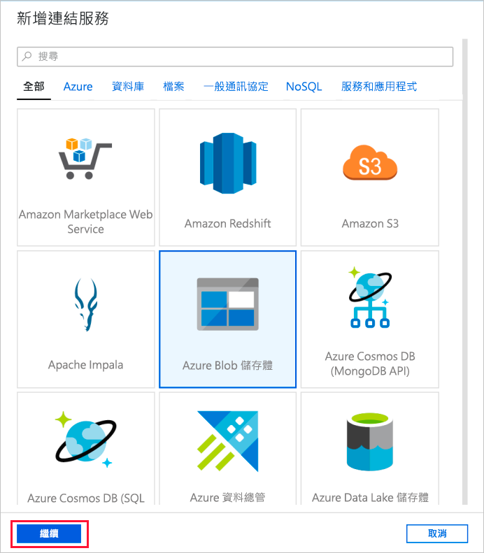
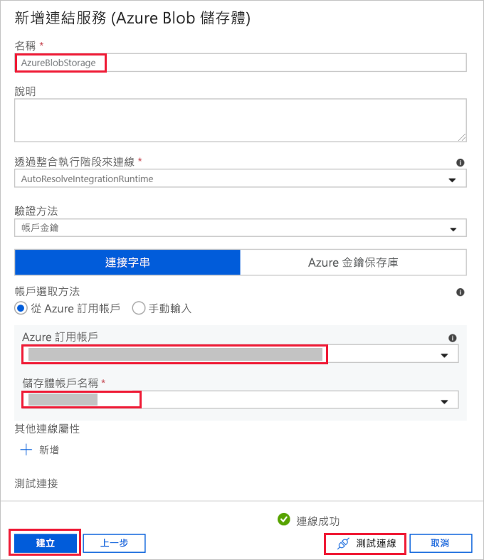
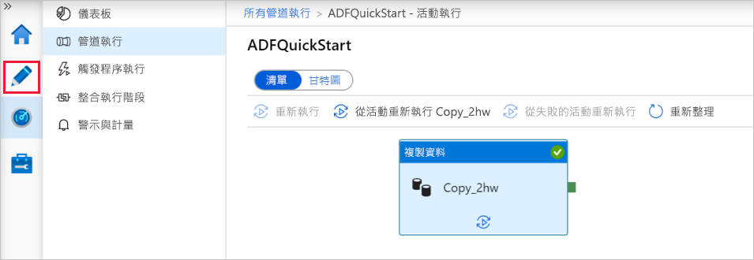

# 快速入門：使用複製資料工具複製資料

> [!div class="op_single_selector" title1="選取您目前使用的 Data Factory 服務版本："]
> * [第 1 版](v1/data-factory-copy-data-from-azure-blob-storage-to-sql-database.md)
> * [目前的版本](quickstart-create-data-factory-copy-data-tool.md)

[!INCLUDE[appliesto-adf-xxx-md](includes/appliesto-adf-xxx-md.md)]

在此快速入門中，您會使用 Azure 入口網站建立資料處理站。 接著，您會使用「複製資料」工具建立管線，將資料從 Azure Blob 儲存體的一個資料夾複製到另一個資料夾。 

> [!NOTE]
> 如果您不熟悉 Azure Data Factory，在執行此快速入門之前，請先參閱 [Azure Data Factory 簡介](introduction.md)。 

[!INCLUDE [data-factory-quickstart-prerequisites](../../includes/data-factory-quickstart-prerequisites.md)] 

## 建立 Data Factory

1. 啟動 **Microsoft Edge** 或 **Google Chrome** 網頁瀏覽器。 目前，只有 Microsoft Edge 和 Google Chrome 網頁瀏覽器支援 Data Factory UI。
1. 移至 [Azure 入口網站](https://portal.azure.com)。 
1. 在 Azure 入口網站功能表中，選取 [建立資源] > [整合] > [Data Factory]：

    

1. 在 [新增資料處理站]  頁面上，輸入 **ADFTutorialDataFactory** 作為 [名稱]  。 
 
   Azure Data Factory 的名稱必須是「全域唯一的」。 如果您看到下列錯誤，請變更資料處理站的名稱 (例如 **&lt;yourname&gt;ADFTutorialDataFactory**)，然後試著重新建立。 如需 Data Factory 成品的命名規則，請參閱 [Data Factory - 命名規則](naming-rules.md)一文。
  
   
1. 針對 [訂用帳戶]  ，選取您要用來建立資料處理站的 Azure 訂用帳戶。 
1. 針對 [資源群組]  ，使用下列其中一個步驟︰
     
   - 選取 [使用現有的]  ，然後從清單中選取現有的資源群組。 
   - 選取 [建立新的]  ，然後輸入資源群組的名稱。   
         
   若要了解資源群組，請參閱 [使用資源群組管理您的 Azure 資源](../azure-resource-manager/management/overview.md)。  
1. 針對 [版本]  ，選取 [V2]  。
1. 針對 [位置]  ，選取資料處理站的位置。

   清單只會顯示 Data Factory 支援的位置，以及儲存您 Azure Data Factory 中繼資料的位置。 Data Factory 所使用的相關聯資料存放區 (如 Azure 儲存體和 Azure SQL Database) 和計算 (如 Azure HDInsight) 可在其他區域中執行。

1. 選取 [建立]  。

1. 建立完成之後，您會看到 [Data Factory]  頁面。 選取 [編寫與監視]  圖格，以在個別的索引標籤上啟動 Azure Data Factory 使用者介面 (UI) 應用程式。
   
   ![資料處理站的首頁，具有 [編寫與監視] 圖格](./media/doc-common-process/data-factory-home-page.png)

## 啟動複製資料工具

1. 在 [現在就開始吧]  頁面上選取 [複製資料]  圖格，以啟動複製資料工具。 

   ![[複製資料] 圖格](./media/doc-common-process/get-started-page.png)

1. 在 [複製資料] 工具的 [屬性]  頁面上 ，您可以指定管線的名稱和描述，然後選擇 [下一步]  。 

   ![[屬性] 頁面](./media/quickstart-create-data-factory-copy-data-tool/copy-data-tool-properties-page.png)
1. 在 [來源資料存放區]  頁面上，完成下列步驟：

    a. 按一下 [+ 建立新連線]  以新增連線。

    b. 選取您要為來源連線建立的連結服務類型。 在本教學課程中，我們會使用 **Azure Blob 儲存體**。 請從資源庫中選取，然後選取 [繼續]  。
    
    

    c. 在 [新增連結服務 (Azure Blob 儲存體)]  頁面上，指定連結服務的名稱。 從 [儲存體帳戶名稱]  清單中選取您的儲存體帳戶，並測試連線，然後選取 [建立]  。 

    

    d. 選取新建立的連結服務作為來源，然後按 [下一步]  。

1. 在 [選擇輸入檔案或資料夾]  頁面上，完成下列步驟︰

   a. 按一下 [瀏覽]  以瀏覽至 [adftutorial/input]  資料夾，選取 **emp.txt** 檔案，然後按一下 [選擇]  。 

   d. 選取 [二進位複製]  核取方塊以依原狀複製檔案，然後選取 [下一步]  。 

   ![[選擇輸入檔案或資料夾] 頁面](./media/quickstart-create-data-factory-copy-data-tool/select-binary-copy.png)

1. 在 [目的地資料存放區]  頁面上，選取您所建立的 [Azure Blob 儲存體]  連結服務，然後選取 [下一步]  。 

1. 在 [選擇輸出檔案或資料夾]  頁面上，輸入 **adftutorial/output** 作為資料夾路徑，然後選取 [下一步]  。 

   ![[選擇輸出檔案或資料夾] 頁面](./media/quickstart-create-data-factory-copy-data-tool/configure-sink-path.png) 

1. 在 [設定]  頁面上選取 [下一步]  ，以使用預設組態。 

1. 檢閱 [摘要]  頁面上的所有設定，然後選取 [下一步]  。 

1. 在 [部署完成]  頁面上選取 [監視]  ，以監視您建立的管線。 

    ![[部署完成] 頁面](./media/quickstart-create-data-factory-copy-data-tool/deployment-page.png)

1. 應用程式會切換至 [監視]  索引標籤。您會在此索引標籤上看到管線的狀態。選取 [重新整理]  可重新整理清單。 按一下 [管線名稱]  下方的連結，以檢視活動執行詳細資料，或重新執行管線。 
   
    

1. 在活動執行頁面上，選取 [活動名稱]  資料行下的 [詳細資料]  連結 (眼鏡圖示)，以取得複製作業的詳細資訊。 如需屬性的詳細資訊，請參閱[複製活動概觀](copy-activity-overview.md)。 

1. 若要回到管線執行檢視，請選取階層連結功能表中的 [所有管線執行]  連結。 若要重新整理檢視，請選取 [重新整理]  。 

1. 確認已在 **adftutorial** 容器的 **output** 資料夾中建立 **emp.txt** 檔案。 如果 output 資料夾不存在，Data Factory 服務會自動加以建立。 

1. 在左側面板上，切換至 [監視器]  索引標籤上方的 [編寫]  索引標籤，即可編輯連結服務、資料集和管線。 若要深入了解如何在 Data Factory UI 中加以編輯，請參閱[使用 Azure 入口網站建立資料處理站](quickstart-create-data-factory-portal.md)。

    

## 後續步驟
此範例中的管線會將資料從 Azure Blob 儲存體中的一個位置複製到其他位置。 若想了解使用 Data Factory 的更多案例，請瀏覽[教學課程](tutorial-copy-data-portal.md)。 
