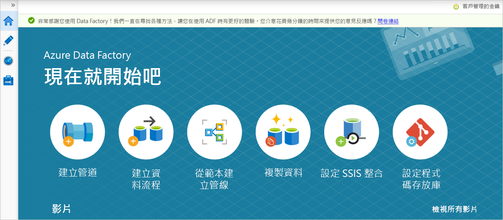

# <a name="copy-data-from-azure-blob-storage-to-a-sql-database-by-using-the-copy-data-tool"></a>使用複製資料工具將資料從 Azure Blob 儲存體複製到 SQL Database

> [!div class="op_single_selector" title1="選取您要使用的 Data Factory 服務版本："]
> * [第 1 版](v1/data-factory-copy-data-from-azure-blob-storage-to-sql-database.md)
> * [目前的版本](tutorial-copy-data-tool.md)

[!INCLUDE[appliesto-adf-xxx-md](includes/appliesto-adf-xxx-md.md)]

在這個教學課程中，您會使用 Azure 入口網站來建立資料處理站。 接著，您會使用複製資料工具來建立管線，以將資料從 Azure Blob 儲存體複製到 SQL Database。

> [!NOTE]
> 如果您不熟悉 Azure Data Factory，請參閱 [Azure Data Factory 簡介](introduction.md)。

在本教學課程中，您會執行下列步驟：
> [!div class="checklist"]
> * 建立資料處理站。
> * 使用複製資料工具建立管線。
> * 監視管線和活動執行。

## <a name="prerequisites"></a>必要條件

* **Azure 訂用帳戶**：如果您沒有 Azure 訂用帳戶，請在開始前建立 [免費帳戶](https://azure.microsoft.com/free/)。
* **Azure 儲存體帳戶**：使用 Blob 儲存體作為「來源」資料存放區。 如果您沒有 Azure 儲存體帳戶，請參閱[建立儲存體帳戶](../storage/common/storage-account-create.md)中的指示。
* **Azure SQL Database**：使用 SQL Database 作為「接收」資料存放區。 如果您沒有 SQL Database，請參閱[建立 SQL Database](../azure-sql/database/single-database-create-quickstart.md) 中的指示。

### <a name="create-a-blob-and-a-sql-table"></a>建立 Blob 和 SQL 資料表

請執行下列步驟，為本教學課程準備 Blob 儲存體和您的 SQL Database。

#### <a name="create-a-source-blob"></a>建立來源 Blob

1. 啟動 [記事本]。 複製下列文字，並將其儲存在磁碟上名為 **inputEmp.txt** 的檔案：

    ```
    FirstName|LastName
    John|Doe
    Jane|Doe
    ```

1. 建立名為 **adfv2tutorial** 的容器，並將 inputEmp.txt 檔案上傳至該容器。 您可以使用 Azure 入口網站或各種工具來執行這些工作，例如 [Azure 儲存體總管](https://storageexplorer.com/)。

#### <a name="create-a-sink-sql-table"></a>建立接收 SQL 資料表

1. 使用以下 SQL 指令碼，在您的 SQL Database 中建立名為 **dbo.emp** 的資料表：

    ```sql
    CREATE TABLE dbo.emp
    (
        ID int IDENTITY(1,1) NOT NULL,
        FirstName varchar(50),
        LastName varchar(50)
    )
    GO

    CREATE CLUSTERED INDEX IX_emp_ID ON dbo.emp (ID);
    ```

2. 允許 Azure 服務存取 SQL Server。 確認已為執行 SQL Database 的伺服器啟用 [允許 Azure 服務和資源存取此伺服器] 設定。 此設定可讓 Data Factory 將資料寫入您的資料庫執行個體。 若要確認並開啟此設定，請移至邏輯 SQL Server > [安全性] > [防火牆與虛擬網路] > 將 **[允許 Azure 服務和資源存取此伺服器]** 選項設定為 **[開啟]** 。

## <a name="create-a-data-factory"></a>建立 Data Factory

1. 在左側功能表上，選取 [建立資源] > [整合] > [Data Factory]：

    
1. 在 [新增資料處理站] 頁面的 [名稱] 下，輸入 **ADFTutorialDataFactory**。

    資料處理站的名稱必須是「全域唯一」的名稱。 您可能會收到下列錯誤訊息：

    

    如果您收到有關名稱值的錯誤訊息，請輸入不同的資料處理站名稱。 例如，使用 **您的名稱****ADFTutorialDataFactory**。 如需 Data Factory 成品的命名規則，請參閱 [Data Factory 命名規則](naming-rules.md)。
1. 選取要在其中建立新資料處理站的 Azure **訂用帳戶**。
1. 針對 [資源群組]，採取下列其中一個步驟︰

    a. 選取 [使用現有的] ，然後從下拉式清單選取現有的資源群組。

    b. 選取 [建立新的] ，然後輸入資源群組的名稱。
    
    若要了解資源群組，請參閱[使用資源群組管理您的 Azure 資源](../azure-resource-manager/management/overview.md)。

1. 在 [版本] 下，選取 [V2] 作為版本。
1. 在 [位置] 下，選取資料處理站的位置。 只有受到支援的位置會顯示在下拉式清單中。 資料處理站所使用的資料存放區 (例如 Azure 儲存體和 SQL Database) 和計算 (例如 Azure HDInsight) 可位於其他地區和區域。
1. 選取 [建立]。

1. 建立完成後，隨即會顯示 **Data Factory** 首頁。

    
1. 選取 [編寫與監視] 圖格，可在另一個索引標籤中啟動 Azure Data Factory 使用者介面 (UI)。

## <a name="use-the-copy-data-tool-to-create-a-pipeline"></a>使用複製資料工具建立管線

1. 在 [現在就開始吧] 頁面上選取 [複製資料] 圖格，以啟動複製資料工具。

    
1. 在 [屬性] 頁面的 [工作名稱] 下，輸入 **CopyFromBlobToSqlPipeline**。 然後選取 [下一步]。 Data Factory 使用者介面會使用指定的工作名稱建立管線。
    

1. 在 [來源資料存放區]  頁面上，完成下列步驟：

    a. 按一下 [+ 建立新連線] 以新增連線

    b. 從資源庫選取 [Azure Blob 儲存體]，然後選取 [繼續]。

    c. 在 [新增連結服務] 頁面上選取您的 Azure 訂用帳戶，然後從 [儲存體帳戶名稱] 清單中選取您的儲存體帳戶。 測試 [連線]，然後選取 [建立]。

    d. 選取新建立的連結服務作為來源，然後按 [下一步]。

    

1. 在 [選擇輸入檔案或資料夾] 頁面上，完成下列步驟︰

    a. 按一下 [瀏覽] 以瀏覽至 **adfv2tutorial/input** 資料夾，選取 **inputEmp.txt** 檔案，然後按一下 [選擇]。

    b. 按 [下一步] 移至下一個步驟。

1. 在 [檔案格式設定] 頁面上，啟用 [第一個資料列作為標題] 的核取方塊。 請注意到此工具會自動偵測資料行和資料列分隔符號。 選取 [下一步] 。 您也可以預覽資料，並檢視這個頁面上輸入資料的結構描述。

    
1. 在 [目的地資料存放區] 頁面上，完成下列步驟：

    a. 按一下 [+ 建立新連線] 以新增連線

    b. 從資源庫選取 [Azure SQL Database]，然後選取 [繼續]。

    c. 在 [新增連結服務] 頁面上，從下拉式清單中選取您的伺服器名稱和資料庫名稱，並指定使用者名稱和密碼，然後選取 [建立]。

    

    d. 選取新建立的連結服務作為接收端，然後按 [下一步]。

1. 在 [資料表對應] 頁面上，選取 **[dbo].[emp]** 資料表，然後選取 [下一步]。

1. 在 [資料行對應] 頁面上，請注意系統會將輸入檔案中的第二個和第三個資料行對應至 **emp** 資料表的 **FirstName** 和 **LastName** 資料行。 調整對應以確保不會發生錯誤，然後選取 [下一步]。

    

1. 在 [設定] 頁面上，選取 [下一步]。

1. 在 [摘要] 頁面上檢閱設定，然後選取 [下一步]。

1. 在 **部署頁面** 上選取 [監視] 來監視管線 (工作)。

    
    
1. 在管線執行頁面上，選取 [重新整理] 以重新整理清單。 按一下 [管線名稱] 下方的連結，以檢視活動執行詳細資料，或重新執行管線。 
    

1. 在活動執行頁面上，選取 [活動名稱] 資料行下的 [詳細資料] 連結 (眼鏡圖示)，以取得複製作業的詳細資訊。 若要回到管線執行檢視，請選取階層連結功能表中的 [所有管線執行] 連結。 若要重新整理檢視，請選取 [重新整理]。

    

1. 確認資料已插入 SQL Database 中的 **dbo.emp** 資料表。

1. 選取左側的 [作者] 索引標籤以切換至編輯器模式。 您可以使用編輯器更新透過此工具建立的連結服務、資料集和管線。 如需在 Data Factory 使用者介面中編輯這些實體的詳細資訊，請參閱[本教學課程的 Azure 入口網站版本](tutorial-copy-data-portal.md)。

    

## <a name="next-steps"></a>後續步驟
在此範例中，管線會將資料從 Blob 儲存體複製到SQL Database。 您已了解如何︰

> [!div class="checklist"]
> * 建立資料處理站。
> * 使用複製資料工具建立管線。
> * 監視管線和活動執行。

若要了解如何將資料從內部部署複製到雲端，請進入下列教學課程：

>[!div class="nextstepaction"]
>[將資料從內部部署複製到雲端](tutorial-hybrid-copy-data-tool.md)
