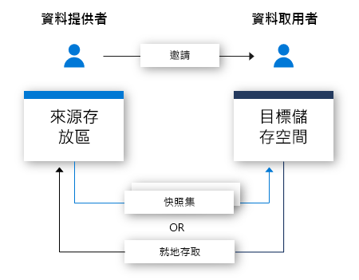

# 什麼是 Azure Data Share？

現今的世界認為，資料是重要的策略性資產，因此組織必須能夠輕鬆安全地與客戶和合作夥伴共用資料。 今天，客戶使用了許多方法來實現這一點，包括 FTP、電子郵件和 API 等等。 組織很容易就會失去其資料共用對象的追蹤。 透過 FTP 共用資料或建立自己的 API 基礎結構所需的佈建和管理成本通常很高。 使用這些方法來大規模共用資料會產生相關管理負擔。 

許多組織必須對其所共用的資料負責。 除了應負的責任，許多組織還想要能夠控制、管理及監視所有以簡單方式共用的資料。 在今日的世界裡，資料應該會不斷急遽成長，因此組織需要簡單的方式來共用巨量資料。 客戶需要最新的資料來確保其能夠得出即時見解。

Azure Data Share 可讓組織輕鬆安全地與多個客戶和合作夥伴共用資料。 只要點幾下，您就可以佈建新的資料共用帳戶、新增資料集，以及邀請客戶和合作夥伴加入資料共用。 資料提供者永遠可以控制其所共用的資料。 Azure Data Share 可讓您輕鬆地管理及監視所共用的資料，以及共用時間和由誰共用的。 

資料提供者可以隨時掌控其資料的處理方法，只要為其資料共用指定使用規定即可。 資料取用者必須先接受這些規定才能接收資料。 資料提供者可以指定資料取用者收到更新的頻率。 資料提供者可以隨時撤銷新更新的存取權。 

Azure Data Share 可藉由讓您輕鬆地結合第三方的資料來豐富分析和 AI 案例而強化見解。 請輕鬆地使用 Azure 分析工具的強大能力，來準備、處理和分析使用 Azure Data Share 所共用的資料。 

資料提供者和資料取用者都必須具有 Azure 訂用帳戶，才能共用和接收資料。 如果您沒有 Azure 訂用帳戶，請建立[免費帳戶](https://azure.microsoft.com/free/)。

## Azure Data Share 的案例

Azure Data Share 可用於許多不同產業。 例如，零售商可能會想要與他們的供應商共用最新的銷售點資料。 使用 Azure Data Share，零售商便可以為他們的所有供應商設定含有銷售點資料的資料共用，並共用每小時或每日的銷售量。 

Azure Data Share 也可用來建立特定產業的資料市集。 例如，與第三方定期共用人口成長匿名資料的政府或研究機構。 

Azure Data Share 的另一個使用案例是建立資料協會。 例如，一些不同的研究機構可以與單一受信任主體共用資料。 資料會使用 Azure 分析工具來分析、彙總或處理，再與感興趣的合作對象共用。 

## 運作方式

Azure Data Share 目前提供以快照集為基礎的共用和就地共用。 

在以快照集為基礎的共用中，資料會從資料提供者的 Azure 訂用帳戶移至資料取用者的 Azure 訂用帳戶中。 身為資料提供者，您可以佈建資料共用，並邀請收件者加入資料共用。 資料取用者會透過電子郵件收到資料共用邀請。 資料取用者接受邀請後，就可以觸發與他們共用資料的完整快照集。 此資料會接收到資料取用者的儲存體帳戶中。 資料取用者可以定期收到其所共用資料的累加更新，因此會永遠能夠擁有最新版的資料。 

資料提供者可以透過快照集排程，來為其資料取用者提供他們所能共用資料的累加更新。 快照集排程會以每小時或每日的頻率來提供。 當資料取用者接受並設定其資料共用時，便可以訂閱快照集排程。 在共用資料會定期更新，而資料取用者需要最新資料的情況下，訂閱快照集排程會很有用。 

資料取用者接受資料共用時，才可以在所選資料儲存區中接收資料。 例如，如果資料提供者使用 Azure Blob 儲存體共用資料，則資料取用者可以在 Azure Data Lake Store 中接收這項資料。 同樣地，如果資料提供者共用 Azure SQL 資料倉儲的資料，資料取用者可以選擇要將資料接收到 Azure Data Lake Store、Azure SQL Database 還是 Azure SQL 資料倉儲。 在從 SQL 型來源共用的情況下，資料取用者也可以選擇是否要在 parquet 或 csv 中接收資料。 

使用就地共用時，資料提供者可直接在資料的所在位置共用資料，而無須加以複製。 透過邀請流程建立共用關聯性之後，將會在資料提供者的來源資料存放區與資料取用者的目標資料存放區之間建立符號連結。 資料取用者可以使用其本身的資料存放區，即時讀取和查詢資料。 對來源資料存放區所做的變更會立即提供給資料取用者。 Azure 資料總管的就地共用目前處於預覽狀態。

## 主要功能

Azure Data Share 可讓資料提供者：

* 從貴組織外部客戶和合作夥伴[支援資料存放區](supported-data-stores.md)的清單共用資料

* 持續追蹤獲得您邀請共用資料的人員

* 快照集或就地共用的選擇

* 資料取用者接收資料更新的頻率

* 讓客戶視需要提取您資料的最新版本，或讓客戶以您所定義的間隔自動接收資料的累加變更

Azure Data Share 可讓資料取用者： 

* 檢視所共用資料類型的說明

* 檢視資料的使用規定

* 接受或拒絕 Azure Data Share 邀請

* 將與您共用的資料接受到[支援資料存放區](supported-data-stores.md)。

* 觸發某個組織與您共用的完整或累加 Data Share 快照集

* 訂閱資料共用以透過累加快照集接收最新的資料複本

上述所有重要功能均透過 Azure 入口網站或透過 REST API 來支援。 如需如何透過 REST API 來使用 Azure Data Share 的詳細資訊，請參閱我們的參考文件。 

## 安全性

Azure Data Share 會利用 Azure 提供的基礎安全性來保護待用資料和傳輸中資料。 資料在待用情況下會加密，基礎資料存放區有這方面的支援。 傳輸中的資料也會加密。 資料共用的相關中繼資料也會在待用情況下和傳輸過程中加密。 

您可以在 Azure Data Share 資源層級設定存取控制，以確保資料存取者有獲得授權。 

Azure Data Share 會利用 Azure 資源的受控身分識別 (先前稱為 MSI) 來自動管理 Azure Active Directory 中的身分識別。 Azure 資源的受控身分識別可用來存取要用於資料共用的資料存放區。 資料提供者與資料取用者之間不會交換認證。 如需詳細資訊，請參閱 [Azure 資源的受控身分識別頁面](https://docs.microsoft.com/azure/active-directory/managed-identities-azure-resources/services-support-managed-identities)。 

## 支援區域

如需有提供 Azure Data Share 的 Azure 區域清單，請參閱[依區域提供的產品](https://azure.microsoft.com/global-infrastructure/services/?products=data-share)頁面，並搜尋 Azure Data Share。 

Azure Data Share 本身並不會儲存資料複本。 資料會儲存在要共用的基礎資料存放區中。 例如，如果資料產生者將其資料儲存在位於美國西部的 Azure Data Lake Store 帳戶中，資料便會儲存在該處。 如果資料產生者透過快照集與位於歐洲西部的 Azure 儲存體帳戶共用資料，則資料通常會直接傳輸至位於歐洲西部的 Azure 儲存體帳戶。

您所在的區域即使沒有提供 Azure Data Share 服務也能利用該服務。 例如，如果您將資料儲存在某個 Azure 儲存體帳戶中，但該帳戶所位於的區域卻尚未提供 Azure Data Share，您仍可利用該服務來共用資料。 

## 後續步驟

若要了解如何開始共用資料，請繼續進行[共用資料](share-your-data.md)教學課程。
