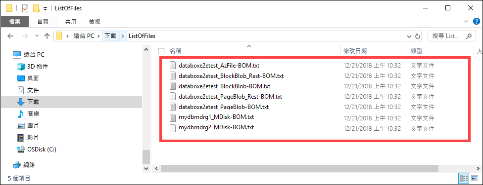

# <a name="use-the-local-web-ui-to-administer-your-data-box-and-data-box-heavy"></a>使用本機 web UI 來管理您的資料箱和 Data Box Heavy

本文說明在 Data Box 和 Data Box Heavy 裝置上執行的一些設定和管理工作。 您可以透過 Azure 入口網站 UI 和裝置的本機 web UI 來管理資料箱和 Data Box Heavy 裝置。 本文將焦點放在使用本機 web UI 執行的工作。

適用于資料箱和 Data Box Heavy 的本機 web UI 可用於裝置的初始設定。 您也可以使用本機 web UI 來關閉或重新開機裝置、執行診斷測試、更新軟體、查看複製記錄，以及產生 Microsoft 支援服務的記錄套件。 在具有兩個獨立節點的 Data Box Heavy 裝置上，您可以存取兩個對應至裝置每個節點的不同本機 web Ui。

本文包含下列教學課程：

- 產生支援套件
- 關閉或重新啟動您的裝置
- 下載物料清單 (BOM) 或資訊清單檔案
- 檢視裝置的可用容量
- 跳過總和檢查碼驗證

[!INCLUDE [Data Box feature is in preview](../../includes/data-box-feature-is-preview-info.md)]

## <a name="generate-support-package"></a>產生支援套件

如果您遇到任何裝置問題，您可以從系統記錄建立支援套件。 Microsoft 支援服務會使用此套件來針對問題進行疑難排解。 若要產生支援封裝，請執行下列步驟：

1. 在本機 web UI 中，移至 [ **連絡人支援** ]，然後選取 [ **建立支援套件**]。

    

2. 已收集支援套件。 此作業需要幾分鐘的時間。

    

3. 當支援封裝建立完成後，請選取 [ **下載支援套件**]。

    

4. 瀏覽並選擇下載位置。 開啟資料夾以檢視內容。

    

## <a name="shut-down-or-restart-your-device"></a>關閉或重新啟動您的裝置

您可以使用本機 web UI 關閉或重新開機您的裝置。 我們建議在重新開機之前，先讓主機上的共用離線，然後再讓裝置離線。 這樣做可將資料損毀的可能性降至最低。 當您關閉裝置時，請確定資料複製不在進行中。

若要關閉您的裝置，請執行下列步驟。

1. 在本機 Web UI 中，移至 [關機或重新啟動]****。
2. 選取 [關機]。

    

3. 當系統提示您確認時，請選取 **[確定]** 以繼續。

    

裝置關機之後，請使用前端面板上的電源按鈕來開啟裝置電源。

若要將資料箱重新啟動，請執行下列步驟。

1. 在本機 Web UI 中，移至 [關機或重新啟動]****。
2. 選取 [重新啟動]****。

    

3. 當系統提示您確認時，請選取 **[確定]** 以繼續。

   裝置將會關機並重新啟動。

## <a name="download-bom-or-manifest-files"></a>下載 BOM 或資訊清單檔

BOM 或資訊清單檔包含複製到資料箱或 Data Box Heavy 的檔案清單。 當您準備要寄送的裝置時，系統會針對匯入順序產生這些檔案。

開始之前，請遵循下列步驟來下載您匯入順序的 BOM 或資訊清單檔案：

1. 移至您裝置的本機 web UI。 確認您的裝置已完成 **寄送準備** 步驟。 當裝置準備完成時，您的裝置狀態會顯示為 [準備好寄送]****。

    

2. 選取 [ **下載檔案清單** ]，以下載資料箱上複製的檔案清單。

    <!--  -->

3. 在檔案總管中，您會看到根據用來連接到裝置的通訊協定和使用的 Azure 儲存體類型，產生不同的檔案清單。

    <!--  -->
    

   下表將檔案名稱對應至使用的 Azure 儲存體類型和連接通訊協定。

    |檔案名稱  |Azure 儲存體類型  |使用的連線通訊協定 |
    |---------|---------|---------|
    |utSAC1_202006051000_BlockBlob-BOM.txt     |區塊 Blob         |SMB/NFS         |
    |utSAC1_202006051000_PageBlob-BOM.txt     |分頁 Blob         |SMB/NFS         |
    |utSAC1_202006051000_AzFile-BOM.txt    |Azure 檔案         |SMB/NFS         |
    |utsac1_PageBlock_Rest-BOM.txt     |分頁 Blob         |REST        |
    |utsac1_BlockBlock_Rest-BOM.txt    |區塊 Blob         |REST         |

在資料箱返回 Azure 資料中心之後，您可使用這份清單來確認已上傳到 Azure 儲存體帳戶的檔案。 範例資訊清單檔如下所示。

> [!NOTE]
> 在 Data Box Heavy 上， (BOM 檔案) 的兩組檔案，其對應于裝置上的兩個節點。

```xml
<file size="52689" crc64="0x95a62e3f2095181e">\databox\media\data-box-deploy-copy-data\prepare-to-ship2.png</file>
<file size="22117" crc64="0x9b160c2c43ab6869">\databox\media\data-box-deploy-copy-data\connect-shares-file-explorer2.png</file>
<file size="57159" crc64="0x1caa82004e0053a4">\databox\media\data-box-deploy-copy-data\verify-used-space-dashboard.png</file>
<file size="24777" crc64="0x3e0db0cd1ad438e0">\databox\media\data-box-deploy-copy-data\prepare-to-ship5.png</file>
<file size="162006" crc64="0x9ceacb612ecb59d6">\databox\media\data-box-cable-options\cabling-dhcp-data-only.png</file>
<file size="155066" crc64="0x051a08d36980f5bc">\databox\media\data-box-cable-options\cabling-2-port-setup.png</file>
<file size="150399" crc64="0x66c5894ff328c0b1">\databox\media\data-box-cable-options\cabling-with-switch-static-ip.png</file>
<file size="158082" crc64="0xbd4b4c5103a783ea">\databox\media\data-box-cable-options\cabling-mgmt-only.png</file>
<file size="148456" crc64="0xa461ad24c8e4344a">\databox\media\data-box-cable-options\cabling-with-static-ip.png</file>
<file size="40417" crc64="0x637f59dd10d032b3">\databox\media\data-box-portal-admin\delete-order1.png</file>
<file size="33704" crc64="0x388546569ea9a29f">\databox\media\data-box-portal-admin\clone-order1.png</file>
<file size="5757" crc64="0x9979df75ee9be91e">\databox\media\data-box-safety\japan.png</file>
<file size="998" crc64="0xc10c5a1863c5f88f">\databox\media\data-box-safety\overload_tip_hazard_icon.png</file>
<file size="5870" crc64="0x4aec2377bb16136d">\databox\media\data-box-safety\south-korea.png</file>
<file size="16572" crc64="0x05b13500a1385a87">\databox\media\data-box-safety\taiwan.png</file>
<file size="999" crc64="0x3f3f1c5c596a4920">\databox\media\data-box-safety\warning_icon.png</file>
<file size="1054" crc64="0x24911140d7487311">\databox\media\data-box-safety\read_safety_and_health_information_icon.png</file>
<file size="1258" crc64="0xc00a2d5480f4fcec">\databox\media\data-box-safety\heavy_weight_hazard_icon.png</file>
<file size="1672" crc64="0x4ae5cfa67c0e895a">\databox\media\data-box-safety\no_user_serviceable_parts_icon.png</file>
<file size="3577" crc64="0x99e3d9df341b62eb">\databox\media\data-box-safety\battery_disposal_icon.png</file>
<file size="993" crc64="0x5a1a78a399840a17">\databox\media\data-box-safety\tip_hazard_icon.png</file>
<file size="1028" crc64="0xffe332400278f013">\databox\media\data-box-safety\electrical_shock_hazard_icon.png</file>
<file size="58699" crc64="0x2c411d5202c78a95">\databox\media\data-box-deploy-ordered\data-box-ordered.png</file>
<file size="46816" crc64="0x31e48aa9ca76bd05">\databox\media\data-box-deploy-ordered\search-azure-data-box1.png</file>
<file size="24160" crc64="0x978fc0c6e0c4c16d">\databox\media\data-box-deploy-ordered\select-data-box-option1.png</file>
<file size="115954" crc64="0x0b42449312086227">\databox\media\data-box-disk-deploy-copy-data\data-box-disk-validation-tool-output.png</file>
<file size="6093" crc64="0xadb61d0d7c6d4deb">\databox\data-box-cable-options.md</file>
<file size="6499" crc64="0x080add29add367d9">\databox\data-box-deploy-copy-data-via-nfs.md</file>
<file size="11089" crc64="0xc3ce6b13a4fe3001">\databox\data-box-deploy-copy-data-via-rest.md</file>
<file size="9126" crc64="0x820856b5a54321ad">\databox\data-box-overview.md</file>
<file size="10963" crc64="0x5e9a14f9f4784fd8">\databox\data-box-safety.md</file>
<file size="5941" crc64="0x8631d62fbc038760">\databox\data-box-security.md</file>
<file size="12536" crc64="0x8c8ff93e73d665ec">\databox\data-box-system-requirements-rest.md</file>
<file size="3220" crc64="0x7257a263c434839a">\databox\data-box-system-requirements.md</file>
<file size="2823" crc64="0x63db1ada6fcdc672">\databox\index.yml</file>
<file size="4364" crc64="0x62b5710f58f00b8b">\databox\data-box-local-web-ui-admin.md</file>
<file size="3603" crc64="0x7e34c25d5606693f">\databox\TOC.yml</file>
```

此檔案包含已複製到資料箱或 Data Box Heavy 的所有檔案清單。 在此檔案中，*crc64* 值與針對對應檔案產生的總和檢查碼有關。

## <a name="view-available-capacity-of-the-device"></a>檢視裝置的可用容量

您可以使用裝置儀表板來檢視裝置的可用與已使用容量。

1. 在本機 Web UI 中，移至 [檢視儀表板]****。
2. 在 [連線並複製]**** 下，將會顯示裝置上的可用與已使用空間。

    

## <a name="skip-checksum-validation"></a>跳過總和檢查碼驗證

在您準備寄送時，系統預設會針對您的資料產生總和檢查碼。 在某些罕見的情況下，根據資料類型的不同 (小型檔案)，效能可能很緩慢。 在這種情況下，您可以跳過總和檢查碼。

準備寄送期間的總和檢查碼計算只適用于匯入順序，而不是針對匯出訂單進行。 

我們強烈建議您不要停用總和檢查碼，除非效能已嚴重受到影響。

1. 在裝置本機 web UI 的右上角，移至 [ **設定**]。

    

2. [停用]**** 總和檢查碼驗證
3. 選取 [套用]。

> [!NOTE]
> 只有當 Azure 資料箱已解除鎖定時，才可以使用 [略過總和檢查碼計算] 選項。 當裝置鎖定時，您將不會看到此選項。

## <a name="enable-smb-signing"></a>啟用 SMB 簽署

伺服器訊息區 (SMB) 簽署是一項功能，可透過此功能，使用 SMB 進行通訊，以在封包層級進行數位簽署。 這項簽署可防止修改傳輸中 SMB 封包的攻擊。

如需有關 SMB 簽署的詳細資訊，請參閱 [伺服器訊息區簽署的總覽](https://support.microsoft.com/help/887429/overview-of-server-message-block-signing)。

若要在您的 Azure 裝置中啟用 SMB 簽署：

1. 在裝置本機 web UI 的右上角，選取 [ **設定**]。

    ![開啟 \[設定\]](media/data-box-local-web-ui-admin/data-box-settings-1.png)

2. **啟用** SMB 簽署。

    

3. 選取 [套用]。
4. 在本機 Web UI 中，移至 [關機或重新啟動]****。
5. 選取 [重新啟動]****。

## <a name="enable-backup-operator-privileges"></a>啟用備份操作員許可權

根據預設，您的 web UI 使用者在 SMB 共用上有備份操作員許可權。 如果您不想要這樣做，請使用 **Enable Back 操作員許可權** 來停用或啟用許可權。

如需詳細資訊，請參閱 [Active Directory 安全性群組](https://docs.microsoft.com/windows/security/identity-protection/access-control/active-directory-security-groups#backup-operators)中的備份操作員。

若要在您的 Azure 裝置中啟用備份操作員許可權：

1. 在裝置本機 web UI 的右上角，選取 [ **設定**]。

   

2. **啟用** 備份操作員許可權。

   

3. **選取**[套用]。
4. 在本機 Web UI 中，移至 [關機或重新啟動]****。
5. 選取 [重新啟動]****。

## <a name="enable-acls-for-azure-files"></a>啟用 Azure 檔案儲存體的 Acl

當使用者透過 SMB 將資料上傳至您的資料箱時，預設會傳輸檔案的中繼資料。 中繼資料包含 (Acl) 、檔案屬性和時間戳記的存取控制清單。 如果您不想要這樣做，請使用 Azure 檔案儲存體 **的 acl** 來停用或啟用此功能。

<!--For more information about metadata that is transferred, see [Preserving the ACLs and metadata with Azure Data Box](./data-box-local-web-ui-admin.md#enable-backup-operator-privileges) - IN DEVELOPMENT-->

> [!Note]
> 若要傳送具有檔案的中繼資料，您必須是備份操作員。 當您使用這項功能時，請確定 web UI 的本機使用者是備份操作員。 請參閱 [啟用備份操作員許可權](#enable-backup-operator-privileges)。

若要啟用 Azure 檔案儲存體的 Acl 傳輸：

1. 在裝置本機 web UI 的右上角，選取 [ **設定**]。

    

2. **啟用** Azure 檔案儲存體的 Acl。

     
  
3. 選取 [套用]。
4. 在本機 Web UI 中，移至 [關機或重新啟動]****。
5. 選取 [重新啟動]****。

## <a name="enable-tls-11"></a>啟用 TLS 1。1

根據預設，Azure 資料箱會使用傳輸層安全性 (TLS) 1.2 進行加密，因為它比 TSL 1.1 更安全。 但是，如果您或您的用戶端使用瀏覽器來存取不支援 TLS 1.2 的資料，您可能會啟用 TLS 1.1。

如需與 TLS 相關的詳細資訊，請參閱 [Azure 資料箱閘道安全性](../databox-online/data-box-gateway-security.md)。

若要在您的 Azure 裝置中啟用 TLS 1.1：

1. 在裝置本機 web UI 的右上角，選取 [ **設定**]。

    

2. **啟用** TLS 1.1。

    

3. 選取 [套用]。
4. 在本機 Web UI 中，移至 [關機或重新啟動]****。
5. 選取 [重新啟動]****。

## <a name="next-steps"></a>後續步驟

- 瞭解如何透過 [Azure 入口網站管理資料箱及 Data Box Heavy](data-box-portal-admin.md)。
