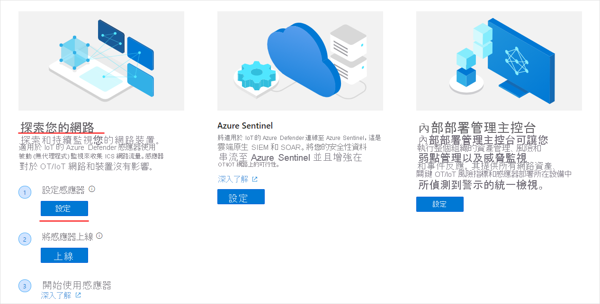
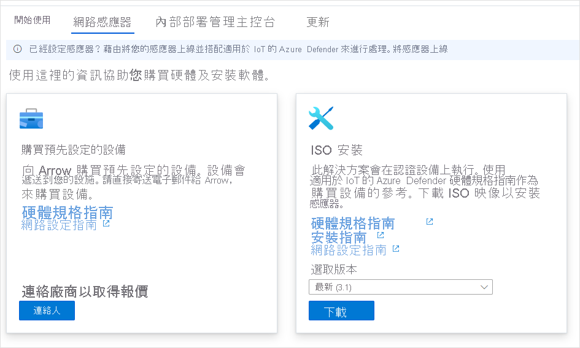
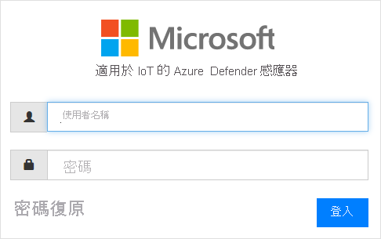
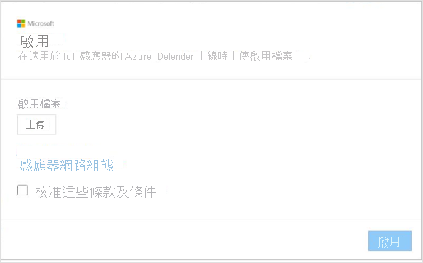

# 快速入門：部署感應器並將其上線

本文提供感應器部署流程的概觀。 感應器必須上線至適用於 Azure Defender 的 IoT 入口網站。

此流程需要取得預先設定好的感應器，或取得認證感應器設備，並自行安裝感應器軟體。

如果您使用認證感應器設備，則建議您在開始之前，先檢閱[適用於 Azure Defender 的 IoT 硬體規格指南](https://aka.ms/AzureDefenderforIoTBareMetalAppliance)。

> [!NOTE]
> 適用於 Azure Defender 的 IoT 內部部署管理主控台不需要上線。

將感應器上線可讓您：

|||
|------ | ----------- |
| **定義感應器名稱** | 為您要上線的感應器命名，並讓其與 IoT 中樞或訂用帳戶建立關聯。  如需詳細資訊，請參閱 **將感應器上線** 。|
|**選擇訂用帳戶和認可的裝置數目**|選取訂用帳戶和訂用帳戶所涵蓋的裝置數目。 以 1000 個為單位輸入數目。|
| **定義感應器管理模式** | 定義要在哪裡顯示感應器所偵測到的資產、警示和其他資訊。 決定方式取決於您定義的 **感應器管理模式** 。  **本機管理模式** ：感應器偵測到的資訊會顯示在感應器主控台中。 如果感應器連線到內部部署管理主控台，則也會與其共用偵測資訊。  **雲端管理模式** ：感應器偵測到的資訊會顯示在感應器主控台中。 此外，警示資訊也會透過 IoT 中樞傳遞，並可與其他 Azure 服務共用，例如 Azure Sentinel。 如需詳細資訊，請參閱 **將感應器上線** 。 |
| **取得感應器啟用檔案** | **本機管理** 感應器會使用啟用檔案來管理授權感應器的啟用期間。  **雲端管理** 感應器會使用啟用檔案作為感應器和 IoT 中樞之間的連結。 如需詳細資訊，請參閱 **將感應器上線** 。 |
| **將啟用檔案上傳到您的感應器** | 您必須將啟用檔案上傳至企業的感應器。 上傳啟用檔案之後，才能使用網路監視和存取感應器主控台功能。 如需詳細資訊，請參閱 **上傳感應器啟用檔案** 。 |
| **啟用之前先更新感應器網路參數** | 請更新您在安裝感應器期間所定義的參數。 如需詳細資訊，請參閱 **錯誤！找不到參考來源** 。|

**若要部署感應器：**

1. 從 Azure 入口網站移至適用於 Azure Defender 的 IoT。

2. 選取 [開始使用]。

3. 在 [探索您的網路] 區段中，選取 [設定]。

   

4. 選取用來取得感應器的選項。

   

  - **購買預先設定好的感應器** ：Microsoft 和 Arrow 已合作提供預先設定好的感應器。 若要購買預先設定好的感應器，請透過下列信箱連絡 Arrow：<hardware.sales@arrow.com>。 感應器會寄送至您的設施。 所安裝的會是最新版本。

  - **設備設備 (ISO 安裝)** ：此解決方案會在認證設備上執行。 在購買認證設備時，請使用[適用於 Azure Defender 的 IoT 硬體規格指南](https://aka.ms/AzureDefenderforIoTBareMetalAppliance)作為參考。

    - 從 [選取版本] 功能表中選取版本。

    - 選取 [下載] 並儲存檔案。 如需如何下載 ISO 映像和安裝感應器軟體的詳細資訊，請參閱 **適用於 Azure Defender 的 IoT 安裝指南** 。

5. 在軟體已安裝到感應器上，或您收到預先設定好的感應器之後，請進行網路設定工作。 如需詳細資訊，請參閱[網路設定指南](https://aka.ms/AzureDefenderForIoTNetworkSetup)。

## 將感應器上線

感應器必須上線至適用於 Azure Defender 的 IoT 入口網站。 上線會分兩階段來進行：

1. 向適用於 Azure Defender 的 IoT 入口網站註冊感應器。

2. 下載感應器的啟用檔案。 此檔案稍後將上傳至您的感應器。

**若要存取上線頁面：**

1. 瀏覽至適用於 Microsoft Azure Defender 的 IoT [開始使用] 頁面。

2. 從適用於 Azure Defender 的 IoT 選取 [2) 上線]。

   ![[上線] 網頁檢視的螢幕擷取畫面](media/updates/image7.png)

3. [將感應器上線] 頁面隨即開啟。 其會提供用來註冊感應器和下載啟用檔案的選項。

   ![[將感應器上線] 網頁檢視的螢幕擷取畫面](media/quickstart/onboard-sensors.png)

**若要註冊感應器：**

1. 選擇感應器名稱。 若為雲端管理感應器，此處定義的名稱會套用至顯示在感應器主控台中的名稱：此名稱無法從主控台變更。 若為本機管理感應器，此處套用的名稱會儲存在 Azure 中，但可在感應器主控台中更新。 建議您在名稱中包含所安裝感應器的 IP 位址，或使用容易辨識的名稱。 這可確保適用於 Azure Defender 的 IoT 入口網站中的註冊名稱，與感應器主控台中所顯示的已部署感應器 IP 之間，有更容易追蹤且一致的命名。

2. 從 [訂用帳戶] 下拉式清單中選取訂用帳戶。
3. 在 [認可的裝置] 欄位中，輸入訂用帳戶所涵蓋的裝置數目。 請針對與相同訂用帳戶相關聯的每個要上線的感應器，重新輸入此數目。  例如，如果訂用帳戶 "A" 與 6000 個裝置相關聯，請針對與訂用帳戶 "A" 相關聯的每個感應器輸入 6000。   
4. 使用 [雲端連線] 開關，選擇感應器管理模式。 如果開啟開關，則感應器為 **雲端管理** 模式。 如果關閉開關，則感應器為 **本機管理** 模式。

| 感應器管理模式 | 說明                                                |
| ---------------------- | ---------------------------------------------------------  |
| **雲端管理**          | 感應器偵測到的資訊會顯示在感應器主控台中。 此外，警示資訊也會透過 IoT 中樞傳遞，並可與其他 Azure 服務共用，例如 Azure Sentinel。  選擇要與此感應器建立關聯的 IoT 中樞。  您必須將雲端管理模式的啟用檔案上傳到雲端管理感應器。  如需詳細資訊，請參閱 **上傳感應器啟用檔案** 。 |
| **本機管理**        | 本機管理感應器所偵測到的資訊會顯示在感應器主控台中。 如果您使用的是隔離網路，而且想要統一檢視多個本機管理感應器所偵測到的所有資訊，請使用內部部署管理主控台。  *本機管理* 感應器會與 Azure 訂用帳戶建立關聯，並包含有關感應器啟用到期期限的指示。  選擇要與此感應器建立關聯的訂用帳戶。  您必須將本機管理模式的啟用檔案上傳到每個感應器。如需詳細資訊，請參閱 **上傳感應器啟用檔案** 。 |

5. 選取 [註冊]。

6. 在 [下載啟用檔案] 頁面中，選取 [下載啟用檔案]。

   ![[將感應器上線] 檢視的螢幕擷取畫面](media/updates/image9.png)

7. 儲存檔案。 檔案名稱的格式為：`<hub_name>_<sensor_name>`。 感應器名稱是指您在上面定義的名稱。

8. 選取 [完成]。

9. 若要完成感應器上線流程，請從適用於 Azure Defender 的 IoT 主控台將檔案上傳到您的感應器。
 
## 上傳感應器啟用檔案

本文說明如何將啟用檔案上傳到感應器。 您應該已在將感應器上線時收到啟用檔案。

**本機管理模式的啟用檔案**

本機管理感應器會與 Azure 訂用帳戶建立關聯。  本機管理感應器的啟用檔案包含到期日。 在此日期之前的一個月時，感應器主控台頂端會出現一則警告訊息。 在您更新啟用檔案之前，此警告會一直存在。

啟用檔案到期後，您可以繼續使用適用於 Azure Defender 的 IoT 功能。

**雲端管理模式的啟用檔案**

雲端管理感應器會與 Azure IoT 中樞建立關聯。 這些感應器不會受到啟用檔案時間週期所限制。 雲端管理感應器的啟用檔案可用來確保感應器與 IoT 中樞的連結。

如需有關 IoT 中樞的詳細資訊，請參閱[關於 IoT 中樞](../iot-hub/about-iot-hub.md)。

**若要上傳啟用檔案：**

1. 確認您有：

   - 感應器的 IP 位址 - 會於安裝期間定義

   - 感應器所需的使用者登入認證

2. 使用此感應器的 IP 位址，從瀏覽器存取適用於 Azure Defender 的 IoT 主控台。

3. 登入適用於 Azure Defender 的 IoT 感應器主控台。

   

4. 登入成功後，便會開啟 [啟用] 畫面。 選取 [上傳]，然後選擇您所儲存的啟用檔案。

   

5. 核准條款及條件。

6. 選取 [啟用]  。 感應器網路設定參數會在安裝軟體期間或在購買預先設定好的感應器時加以定義。 所定義的參數如下：
   - IP 位址
   - DNS  
   - 預設閘道
   - 子網路遮罩
   - 主機名稱
 
   在啟用感應器之前，您可能會因為下列原因而想要更新此資訊：
   - 您需要變更已定義的預先設定參數  
   - 您想要在安裝後重新設定網路參數。您也可以在啟用感應器之前定義 Proxy 設定。

7. 從 [啟用] 對話方塊中選取 [感應器網路設定] 連結。  

   ![[編輯網路設定] 檢視的螢幕擷取畫面](media/updates/image13.png)

8. 隨即會顯示安裝期間所定義的參數。 也會有選項可供定義 Proxy。 視需要加以更新，然後選取 [儲存]。
 
 
## 後續步驟

在本文中，您已了解如何部署感應器並將其上線。 若要深入了解如何開始使用，請參閱下列文章：

- [快速入門](getting-started.md)