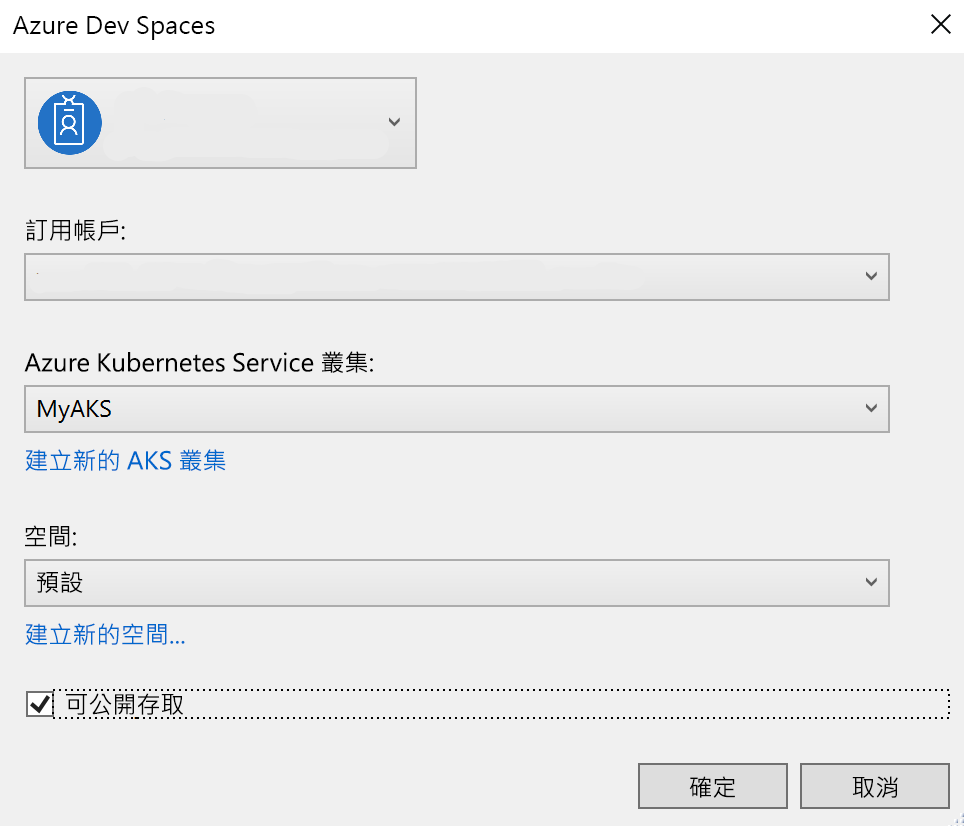

# <a name="create-a-kubernetes-dev-space-visual-studio-and-net-core-with-azure-dev-spaces"></a>建立 Kubernetes 開發人員空間：搭配 Azure Dev Spaces 使用 Visual Studio 和 .NET Core

在本指南中，您將了解如何：

- 使用 Azure 中受管理的 Kubernetes 叢集，設定 Azure Dev Spaces。
- 使用 Visual Studio 在容器中反覆開發程式碼。
- 獨立開發兩種不同的服務，並且使用 Kubernetes 的 DNS 服務探索來呼叫另一個服務。
- 在小組環境中有效率地開發及測試您的程式碼。

> [!NOTE]
> **如果作業出現停滯的情況**，請參閱[疑難排解](troubleshooting.md)一節。

## <a name="install-the-azure-cli"></a>安裝 Azure CLI
Azure 開發人員空間需要基本的本機電腦設定。 大部分開發人員空間的組態都會儲存在雲端，而且可與其他使用者共用。 從下載和執行 [Azure CLI](/cli/azure/install-azure-cli?view=azure-cli-latest) 著手。

### <a name="sign-in-to-azure-cli"></a>登入 Azure CLI
登入 Azure。 在終端機視窗中輸入下列命令：

```azurecli
az login
```

> [!NOTE]
> 如果您沒有 Azure 訂用帳戶，您可以建立[免費帳戶](https://azure.microsoft.com/free)。

#### <a name="if-you-have-multiple-azure-subscriptions"></a>如果您有多個 Azure 訂用帳戶...
您可以執行下列命令以檢視訂用帳戶： 

```azurecli
az account list --output table
```

尋找 *IsDefault* 為 *True* 的訂用帳戶。
如果這不是您要使用的訂用帳戶，您可以變更預設訂用帳戶：

```azurecli
az account set --subscription <subscription ID>
```

## <a name="create-a-kubernetes-cluster-enabled-for-azure-dev-spaces"></a>建立已針對 Azure Dev Spaces 啟用的 Kubernetes 叢集

在命令提示字元中，於[支援 Azure Dev Spaces 的區域][supported-regions]建立資源群組。

```azurecli
az group create --name MyResourceGroup --location <region>
```

使用下列命令來建立 Kubernetes 叢集：

```azurecli
az aks create -g MyResourceGroup -n MyAKS --location <region> --generate-ssh-keys
```

建立叢集需要幾分鐘的時間。

### <a name="configure-your-aks-cluster-to-use-azure-dev-spaces"></a>設定您的 AKS 叢集以使用 Azure Dev Spaces

使用其中包含您 AKS 叢集和 AKS 叢集名稱的資源群組，輸入下列 Azure CLI 命令。 命令會使用 Azure Dev Spaces 的支援來設定您的叢集。

   ```azurecli
   az aks use-dev-spaces -g MyResourceGroup -n MyAKS
   ```
   
> [!IMPORTANT]
> Azure Dev Spaces 設定程序會移除叢集中的 `azds` 命名空間 (如果存在的話)。

## <a name="get-the-visual-studio-tools"></a>取得 Visual Studio 工具
在具有 Azure 開發工作負載的 Windows 上安裝最新版的 [Visual Studio 2019](https://www.visualstudio.com/vs/)。

## <a name="create-a-web-app-running-in-a-container"></a>建立在容器中執行的 Web 應用程式

在本節中，您將建立 ASP.NET Core Web 應用程式，並使其在 Kubernetes 的容器中執行。

### <a name="create-an-aspnet-web-app"></a>建立 ASP.NET Web 應用程式

在 Visual Studio 中，建立新的專案。 目前，此專案必須是 **ASP.NET Core Web 應用程式**。 將專案命名為 '**webfrontend**'。


選取 [Web 應用程式 (Model-View-Controller)] 範本，並確定您的目標是對話方塊頂端的兩個下拉式清單中的 **.NET Core** 和 **ASP.NET Core 2.0**。 按一下 [確定]  以建立專案。


### <a name="enable-dev-spaces-for-an-aks-cluster"></a>針對 AKS 叢集啟用 Dev Spaces

使用您剛建立的專案，然後從啟動設定下拉式清單中選取 [Azure Dev Spaces]，如下所示。


在接下來顯示的對話方塊中，請確定您以適當的帳戶登入，然後選取現有的 Kubernetes 叢集。



現在讓 [空間] 下拉式清單預設為 `default`。 稍後，您將深入了解這個選項。 請核取 [可公開存取] 核取方塊，以便透過公用端點存取 Web 應用程式。 這不是必要的設定，但是對於稍後在本逐步解說中示範一些概念很有幫助。 請別擔心，在任一情況下，您都能夠使用 Visual Studio 進行您的網站偵錯。


按一下 [確定] 以選取或建立叢集。

如果您選擇尚無法與 Azure 開發人員空間搭配使用的叢集，您會看到訊息詢問您是否要加以設定。


選擇 [確定]。

> [!IMPORTANT]
> Azure Dev Spaces 設定程序會移除叢集中的 `azds` 命名空間 (如果存在的話)。

 將啟動背景工作，以完成這項作業。 這需要幾分鐘才能完成。 若要查看它是否仍在建立中，請將指標停留在狀態列左下角的 [背景工作] 圖示上，如下圖所示。


> [!NOTE]
> 在成功建立開發人員空間前，您無法進行應用程式偵錯。

### <a name="look-at-the-files-added-to-project"></a>查看已新增至專案的檔案
等待建立開發人員空間時，查看當您在選擇使用開發人員空間時新增至專案的檔案。

首先，您可以看到已新增名為 `charts` 的資料夾，而此資料夾內已建構適用於您的應用程式的 [Helm 圖表](https://docs.helm.sh)。 這些檔案可用來將您的應用程式部署到開發人員空間中。

您會看到已新增名為 `Dockerfile` 的檔案。 此檔案包含以標準 Docker 格式封裝應用程式所需的資訊。

最後，您會看見名為 `azds.yaml` 的檔案，其中包含開發人員空間所需的開發階段組態。

![在 [方案總管] 視窗中，"webfrontend" 解決方案中會出現 "azds.yaml" 檔案。](media/get-started-netcore-visualstudio/ProjectFiles.png)

## <a name="debug-a-container-in-kubernetes"></a>在 Kubernetes 中進行容器偵錯
在成功建立開發人員空間後，您即可進行應用程式偵錯。 在程式碼中設定中斷點，例如在 `Message` 變數設定所在 `HomeController.cs` 檔案中的第 20 行上。 按一下 **F5** 開始偵錯。 

Visual Studio 會與開發人員空間通訊，以建置和部署應用程式，然後以執行中的 Web 應用程式開啟瀏覽器。 容器可能看起來像在本機執行，但實際是在 Azure 的開發人員空間中執行。 localhost 位址的原因是因為 Azure 開發人員空間會對在 AKS 中執行的容器建立暫存 SSH 通道。

按一下頁面頂端的 [關於] 連結，以觸發中斷點。 就如同已在本機執行程式碼一樣，您擁有偵錯資訊的完整存取權，例如呼叫堆疊、區域變數、例外狀況資訊等等。

## <a name="iteratively-develop-code"></a>反覆開發程式碼

Azure 開發人員空間不只讓程式碼中在 Kubernetes 中執行 - 還可讓您快速地反覆查看您的程式碼變更是否在雲端 Kubernetes 環境中生效。

### <a name="update-a-content-file"></a>更新內容檔案


1. 找出檔案 `./Views/Home/Index.cshtml` 並進行 HTML 編輯。 例如，將[第 73 行 `<h2>Application uses</h2>`](https://github.com/Azure/dev-spaces/blob/master/samples/dotnetcore/getting-started/webfrontend/Views/Home/Index.cshtml#L73) 變更如下： 
  
    ```html
    <h2>Hello k8s in Azure!</h2>`
    ```

2. 儲存檔案。
3. 移至您的瀏覽器並重新整理頁面。 您應該會看到網頁顯示更新後的 HTML。

發生什麼情形？ 編輯內容檔案 (例如 HTML 和 CSS) 時，不需要在 .NET Core Web 應用程式中重新編譯，所以作用中 F5 工作階段會自動將任何修改過的內容檔案，直接同步處理到 AKS 中的執行中容器，您即可立即查看內容編輯。

### <a name="update-a-code-file"></a>更新程式碼檔案
更新程式碼檔案需要更多的工作，因為.NET Core 應用程式需要重建及產生更新後的應用程式二進位檔。

1. 在 Visual Studio 中停止偵錯工具。
1. 開啟名為 `Controllers/HomeController.cs` 的程式碼檔案，然後編輯 [關於] 頁面將顯示的訊息：`ViewData["Message"] = "Your application description page.";`
1. 儲存檔案。
1. 按 **F5** 再次開始偵錯。 

Azure 開發人員空間會以累加方式重新編譯現有容器中的程式碼，以提供更快的編輯/偵錯迴圈，而不是在每次進行程式碼編輯時重新建置及重新部署新的容器映像 (這通常要花費相當長的時間)。

請在瀏覽器中重新整理 Web 應用程式，並移至 [關於] 頁面。 您應會看到自訂訊息出現在 UI 中。

## <a name="next-steps"></a>後續步驟

深入了解 Azure Dev Spaces 的運作方式。

> [!div class="nextstepaction"]
> [Azure Dev Spaces 如何運作](how-dev-spaces-works.md)


[supported-regions]: https://azure.microsoft.com/global-infrastructure/services/?products=kubernetes-service
