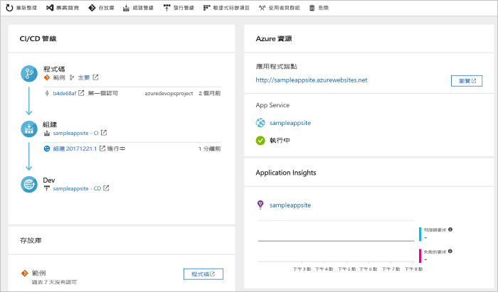

# 使用 Azure DevOps Starter 設定適用於 Java 應用程式的 CI/CD 管線

在本快速入門中，您會使用簡化的 Azure DevOps 入門版體驗，在 Azure Pipelines 中為 Java 應用程式設定持續整合 (CI) 與持續傳遞 (CD) 管線。 您可以使用 Azure DevOps 入門版來設定您在開發、部署及監控應用程式時所需的一切。 

## Prerequisites

- 具有有效訂用帳戶的 Azure 帳戶。 [免費建立帳戶](https://azure.microsoft.com/free/?ref=microsoft.com&utm_source=microsoft.com&utm_medium=docs&utm_campaign=visualstudio)。 
- [Azure DevOps](https://azure.microsoft.com/services/devops/) 帳戶和組織。

## 登入 Azure 入口網站

DevOps 入門版會在 Azure Pipelines 中建立 CI/CD 管線。 您可以建立新的 Azure DevOps 組織或使用現有組織。 DevOps 入門版也會在您選擇的 Azure 訂用帳戶中建立 Azure 資源。

1. 登入 [Azure 入口網站](https://portal.azure.com)。

1. 在搜尋方塊中，鍵入並選取 **DevOps 入門版**。 按一下 [新增] 以建立新項目。

    

## 選取應用程式範例和 Azure 服務

1. 選取 Java 應用程式範例。 Java 範例包含數種應用程式架構的選擇。

1. 預設範例架構為 Spring。 保留預設設定，然後選取 [下一步]。  適用於容器的 Web 應用程式是預設的部署目標。 您先前選擇的應用程式架構，會指出這裡可用的 Azure 服務部署目標類型。 

2. 保留預設的服務，然後選取 [下一步]。
 
## 設定 Azure DevOps 與 Azure 訂用帳戶 

1. 建立新的 Azure DevOps 組織或選擇現有組織。 
   
   1. 選擇專案的名稱。 
   
   1. 選取 Azure 訂用帳戶和位置、選擇應用程式名稱，然後選取 [完成]。  
   在幾分鐘後，Azure 入口網站中便會顯示 DevOps Starter 儀表板。 系統會在您 Azure DevOps 組織中的存放庫中設定範例應用程式、執行建置，然後將您的應用程式部署到 Azure。 此儀表板可顯示您的程式碼存放庫、CI/CD 管線，和您在 Azure 中的應用程式。
   
2. 選取 [瀏覽]以檢視執行中應用程式。
   
    

DevOps Starter 會自動設定 CI 建置和發行觸發程序。  您現在已準備好利用 CI/CD 程序與小組共同進行 Java 應用程式的作業，這個程序會自動將您的最新工作部署到網站上。

## 認可程式碼變更並執行 CI/CD

DevOps 入門版會在 Azure Repos 或 GitHub 中建立 Git 存放庫。 若要檢視存放庫並變更您應用程式的程式碼，請執行下列作業：

1. 在 DevOps Starter 儀表板的左側，選取您主要分支的連結。 此連結會開啟新建立 Git 存放庫的檢視。

1. 若要檢視存放庫複製 URL，請在瀏覽器右上方選取 [複製]。 您可以在最愛的 IDE 中複製 Git 存放庫。 在接下來的幾個步驟中，您可以使用網頁瀏覽器，直接進行和認可主要分支的程式碼變更。

1. 在瀏覽器的左側，移至 **src/main/webapp/index.html** 檔案。

1. 選取 [編輯]，然後進行部分文字的變更。
    例如，變更其中一個 div 標籤的部分文字。

1. 選取 [認可]，然後儲存您的變更。

1. 在瀏覽器中，移至 DevOps 入門版儀表板。   
您現在應該會看到正在進行中的建置。 您剛才所做的變更會透過 CI/CD 管線自動建置及部署。

## 檢查 CI/CD 管線

 在上一個步驟中，DevOps 入門版已自動設定完整的 CI/CD 管線。 瀏覽管線，並視需要進行自訂。 請採取下列步驟，讓您自己熟悉組建和發行管線。

1. 在 DevOps 入門版儀表板頂端選取 [建置管線]。 此連結會開啟瀏覽器索引標籤和新專案的建置管線。

1. 指向 [狀態] 欄位，然後選取省略符號 (...)。此動作會開啟功能表，您可以用它來啟動數個活動，例如將新的建置排入佇列、暫停建置，以及編輯建置管線。

1. 選取 [編輯]  。

1. 在此窗格中，您可以檢查建置管線的各種工作。 建置會執行各種工作，例如從 Git 存放庫擷取來源、還原相依性，以及發佈用來進行部署的輸出。

1. 在建置管線的頂端，選取建置管線名稱。

1. 將建置管線的名稱變更成較具描述性的名稱，並選取 [儲存並排入佇列]  ，然後選取 [儲存]  。

1. 在建置管線名稱下，選取 [記錄]  。   
在 [記錄]  窗格中，您可以看到近期建置變更的稽核線索。  Azure Pipelines 會追蹤對建置管線進行的任何變更，且可讓您比較版本。

1. 選取 [觸發程序]  。  DevOps Starter 已自動建立 CI 觸發程序，且每次對存放庫的認可都會啟動新的組建。  您可以選擇性地選擇要在 CI 程序中包含還是排除分支。

1. 選取 [保留期]  。 根據案例，您可以指定原則來保留或移除特定數目的組建。

1. 選取 [建置及發行]  ，然後選取 [版本]  。  
 DevOps Starter 會建立發行管線來管理對 Azure 的部署。

1. 從左側選取發行管線旁邊的省略符號 (...)，然後選取 [編輯]  。 發行管線中包含管線，用來定義發行程序。  
    
12. 在 [成品]  下，選取 [置放]  。 您在先前步驟中檢查的建置管線會產生用於成品的輸出。 

1. 在 [置放]  圖示旁邊，選取 [持續部署觸發程序]  。 這個發行管線已啟用 CD 觸發程序，每次有新的建置成品可用時，它就會執行部署。 您可以選擇性地停用觸發程序，因此需要手動執行部署。 

1. 從左側選取 [工作]  。 工作是您部署程序所執行的活動。 在此範例中，會建立一個工作來部署到 Azure App Service。

1. 從右側選取 [檢視版本]  。 此檢視會顯示版本的歷程記錄。

1. 選取其中一個版本旁的省略符號 (...)，然後選取 [開啟]  。 您可以瀏覽數個功能表，例如版本摘要、相關聯的工作項目及測試。

1. 選取 [認可]  。 此檢視會顯示與特定部署相關聯的程式碼認可。 

1. 選取 [記錄]  。 記錄包含關於部署程序的實用資訊。 您可以在部署期間和部署之後加以檢視。

## 清除資源

當您不再需要 Azure App Service 和其他相關的資源時，可將其刪除。 請使用 DevOps 入門版儀表板的 [刪除] 功能。

## 後續步驟

當您設定好 CI/CD 程序後，建置和發行管線會自動建立。 您可以修改這些建置和發行管線，以符合小組的需求。 若要深入了解 CI/CD 管線，請參閱：

> [!div class="nextstepaction"]
> [自訂 CD 程序](https://docs.microsoft.com/azure/devops/pipelines/release/define-multistage-release-process?view=vsts)
