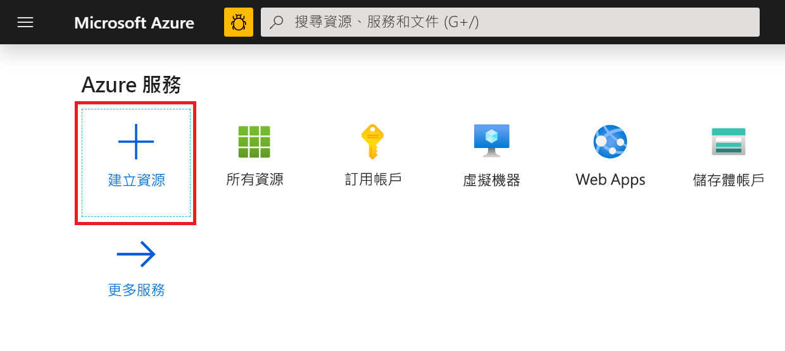
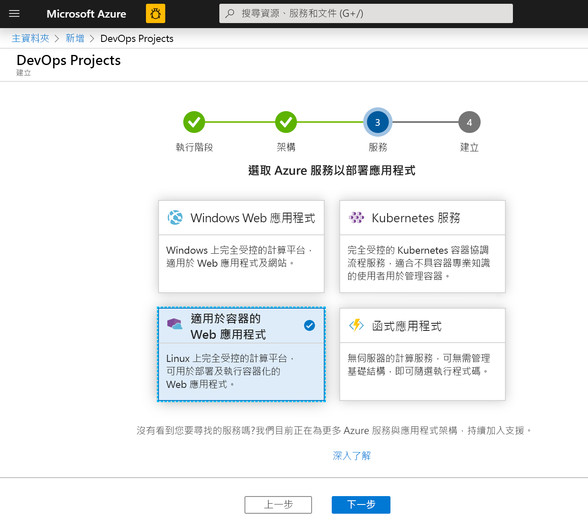
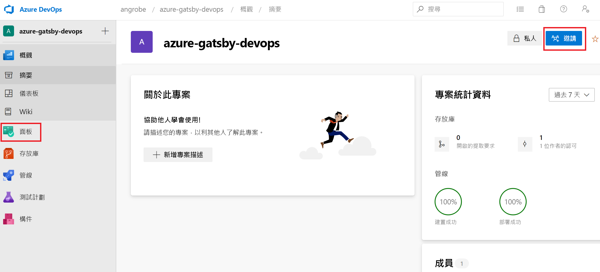
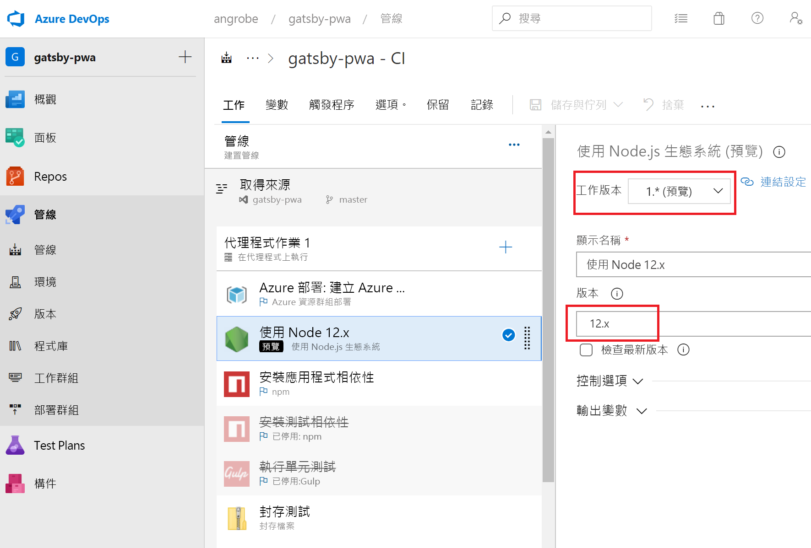
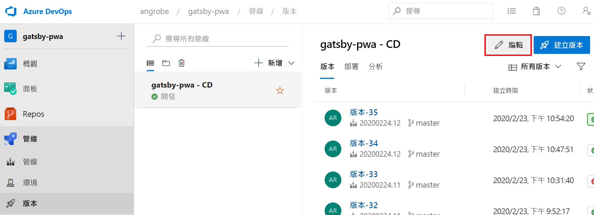

# <a name="create-a-cicd-pipeline-in-azure-pipelines-for-nodejs-with-azure-devops-starter"></a>使用 Azure DevOps Starter 在 Node.js 的 Azure Pipelines 中建立 CI/CD 管線

在本快速入門中，您會使用[GatsbyJS](https://www.gatsbyjs.org/)建立 NodeJS 漸進式 web 應用程式（PWA）和簡化的 Azure DevOps 入門建立體驗。 完成後，您 Azure Pipelines 中的 PWA 就會有可用的持續整合 (CI) 和持續傳遞 (CD) 管線。 Azure DevOps Starter 會設定開發、部署和監視所需的功能。

## <a name="prerequisites"></a>Prerequisites

- 具有有效訂用帳戶的 Azure 帳戶。 [免費建立帳戶](https://azure.microsoft.com/free/?ref=microsoft.com&utm_source=microsoft.com&utm_medium=docs&utm_campaign=visualstudio)。 
- [Azure DevOps](https://azure.microsoft.com/services/devops/) 組織。

## <a name="sign-in-to-the-azure-portal"></a>登入 Azure 入口網站

DevOps 入門版會在 Azure Pipelines 中建立 CI/CD 管線。 您可以建立新的 Azure DevOps 組織或使用現有組織。 DevOps 入門版也會在您選擇的 Azure 訂用帳戶中建立 Azure 資源。

1. 登入 [Azure 入口網站](https://portal.azure.com)，然後在左窗格中選取 [建立資源]  。 

   

1. 在搜尋方塊中，鍵入並選取 **DevOps 入門版**。 按一下 [新增] 以建立新項目。

    

## <a name="select-a-sample-application-and-azure-service"></a>選取應用程式範例和 Azure 服務

1. 選取 Node.js 應用程式範例。   

     

1. 預設範例架構為**Express.js**。 將選取專案變更為 [**簡單 Node.js 應用程式**]，然後選取 **[下一步]**。 

     

1. 此步驟中所提供的部署目標，是由步驟2中選取的應用程式架構所決定。 在此範例中， **Windows Web 應用程式**是預設的部署目標。 保留**用於容器的 Web App**設定，然後選取 **[下一步]**。

    

## <a name="configure-a-project-name-and-an-azure-subscription"></a>設定專案名稱和 Azure 訂用帳戶

1. 在 DevOps 入門建立工作流程的最後一個步驟中，您會指派專案名稱、選取 Azure 訂用帳戶，然後選取 [**完成**]。  

    

1. 當您的專案已建立，且您的應用程式部署至 Azure 時，會顯示摘要頁面。 一小段時間之後，就會在您的[Azure DevOps 組織](https://dev.azure.com/)中建立專案，其中包含 git 存放庫、一個儀表板面板、部署管線、測試計劃，以及您的應用程式所需的成品。  

## <a name="managing-your-project"></a>管理您的專案

1. 流覽至 [**所有資源**]，然後尋找您的 DevOps Starter。 選取您的**DevOps Starter**。

    

1. 系統會將您導向至儀表板，以查看您的專案首頁、程式碼存放庫、CI/CD 管線，以及執行中應用程式的連結。 選取**專案首頁**以在**Azure DevOps**中查看您的應用程式，然後在另一個瀏覽器索引標籤中選取**應用程式端點**，以查看即時範例應用程式。 我們會在稍後變更此範例，以使用 GatsbyJS 產生的 PWA。

     

1. 從您的 Azure DevOps 專案，您可以邀請小組成員進行共同作業，並建立一個可開始追蹤您工作的「儀表板」面板。 如需詳細資訊，請參閱[這裡](https://docs.microsoft.com/azure/devops/user-guide/what-is-azure-devops?view=azure-devops)。



## <a name="clone-the-repo-and-install-your-gatsby-pwa"></a>複製存放庫並安裝您的 Gatsby PWA

DevOps Starter 會在 Azure Repos 或 GitHub 中建立 git 存放庫。 此範例已建立 Azure 存放庫。 下一步是複製存放庫並進行變更。

1. 從您的**DevOps 專案**中選取 [**存放庫**]，然後按一下 [**複製**]。  有各種機制可將 git 存放庫複製到您的桌面。  選擇適合您的開發體驗的帳戶。  

    

1. 將存放庫複製到您的桌面之後，請對入門範本進行一些變更。 從您的終端機安裝 GatsbyJS CLI 開始。

   ```powershell
    npm install -g gatsby
   ```

1. 從終端機，流覽至存放庫的根目錄。 它應該包含如下所示的三個資料夾：

    ```powershell
    Mode                LastWriteTime         Length Name
    ----                -------------         ------ ----
    d-----        2/23/2020  10:42 PM                Application
    d-----        2/23/2020   3:05 PM                ArmTemplates
    d-----        2/23/2020   3:05 PM                Tests
    ```
    
1. 我們不想要在應用程式資料夾中的所有檔案，因為我們要將它取代為 Gatsby starter。 依序執行下列命令，以將其修剪。
    
    ```powershell
    cp .\Application\Dockerfile .
    rmdir Application
    ```

1. 使用 Gatsby CLI 來產生範例 PWA。 `gatsby new`從終端機執行以開始 PWA wizard，並 `gatsby-starter-blog` 為您的入門範本選取。 它應該類似此範例：

    ```powershell
    c:\myproject> gatsby new
    √ What is your project called? ... my-gatsby-project
    ? What starter would you like to use? » - Use arrow-keys. Return to submit.
        gatsby-starter-default
        gatsby-starter-hello-world
    >   gatsby-starter-blog
        (Use a different starter)
    ```
    
1. 您現在有一個名為的資料夾 `my-gatsby-project` 。 將它重新命名為 `Application` ，並將複製 `Dockerfile` 到其中。
    
    ```powershell
    mv my-gatsby-project Application
    mv Dockerfile Application
    ```
    
1. 在您慣用的編輯器中，開啟 Dockerfile，並將第一行從變更 `FROM node:8` 為 `FROM node:12` 。 這項變更可確保您的容器使用 Node.js 版本8.x，而不是2.x 版。 GatsbyJS 需要較新版本的 Node.js。

1. 接下來，在應用程式資料夾中開啟檔案上的 package.js並編輯 [[腳本] 欄位](https://docs.npmjs.com/files/package.json#scripts)，以確保您的開發和實際執行伺服器會接聽所有可用的網路介面（例如0.0.0.0）和埠80。 如果沒有這些設定，容器應用程式服務就無法將流量路由傳送至在您的容器內執行的 Node.js 應用程式。 `scripts`欄位應該類似下面的內容。 具體而言，您會想要 `develop` `serve` `start` 從預設值變更、和目標。

    ```json
      "scripts": {
        "build": "gatsby build",
        "develop": "gatsby develop  -H 0.0.0.0 -p 80",
        "format": "prettier --write \"**/*.{js,jsx,json,md}\"",
        "start": "npm run serve",
        "serve": "npm run build && gatsby serve -H 0.0.0.0 -p 80",
        "clean": "gatsby clean",
        "test": "echo \"Write tests! -> https://gatsby.dev/unit-testing\" && exit 1"
      }
    ```
    
## <a name="edit-your-cicd-pipelines"></a>編輯您的 CI/CD 管線

1. 在您認可上一節中的程式碼之前，請先對組建和發行管線進行一些變更。 編輯您的「組建管線」並更新 Node 工作，以使用 Node.js 版本 12. x。 將 [工作**版本**] 欄位設為1.x，並將 [**版本**] 欄位設定為 [12. x]。

    

1. 在本快速入門中，我們不會建立單元測試，而是在我們的組建管線中停用這些步驟。 當您撰寫測試時，您可以重新啟用這些步驟。 以滑鼠右鍵按一下以選取標示為 [**安裝測試**相依性] 和 [**執行單元測試**] 的工作，然後停用它們。

    

1. 編輯您的發行管線。

    

1. 如同組建管線，請將 Node 工作變更為使用5.x，並停用這兩項測試工作。 您的版本應該與這個螢幕擷取畫面類似。

    

1. 在瀏覽器的左側，移至 **views/index.pug** 檔案。

1. 選取 [編輯]****，並進行 h2 標題的變更。  例如，輸入立即**開始使用 Azure DevOps Starter**或進行其他變更。

1. 選取 [認可]，然後儲存您的變更。

1. 在瀏覽器中，移至 DevOps 入門版儀表板。   
您現在應該會看到正在進行中的建置。 您所做的變更會透過 CI/CD 管線自動建立和部署。

## <a name="commit-your-changes-and-examine-the-azure-cicd-pipeline"></a>認可您的變更，並檢查 Azure CI/CD 管線

在前兩個步驟中，您已將 Gatsby 產生的 PWA 新增至您的 git 存放庫，並已編輯管線以建立和部署程式碼。 我們可以認可程式碼，並透過組建和發行管線觀看其進度。

1. 從終端機中專案 git 存放庫的根目錄，執行下列命令，將您的程式碼推送至 Azure DevOps 專案：

    ```powershell
    git add .
    git commit -m "My first Gatsby PWA"
    git push
    ```
    
1. 組建會在完成時立即啟動 `git push` 。 您可以從 [ **Azure DevOps] 儀表板**追蹤進度。

3. 您的組建和發行管線應該會在幾分鐘後完成，且您的 PWA 應會部署至容器。 從上方的儀表板按一下 [應用程式端點]  連結，您應該會看到部落格的 Gatsby 起始專案。

## <a name="clean-up-resources"></a>清除資源

當您不再需要已建立的 Azure App Service 和其他相關資源時，可以將其刪除。 請使用 DevOps 入門版儀表板的 [刪除] 功能。

## <a name="next-steps"></a>後續步驟

在設定 CI/CD 程序後，組建和發行管線會自動建立。 您可以變更這些組建和發行管線，以符合小組的需求。 若要深入了解 CI/CD 管線，請參閱：

> [!div class="nextstepaction"]
> [自訂 CD 程序](https://docs.microsoft.com/azure/devops/pipelines/release/define-multistage-release-process?view=vsts)

