# 快速入門：使用 Azure 入口網站將 Blob 儲存體事件路由傳送至 Web 端點

Azure Event Grid 是一項雲端事件服務。 在本文中，您會使用 Azure 入口網站建立 Blob 儲存體帳戶、訂閱該 Blob 儲存體的事件，以及觸發事件以檢視結果。 通常，您會將事件傳送至可處理事件資料及採取行動的端點。 不過，若要簡化這篇文章，您可將事件傳送至可收集及顯示訊息的 Web 應用程式。

[!INCLUDE [quickstarts-free-trial-note.md](../../includes/quickstarts-free-trial-note.md)]

當您完成時，您會看到事件資料已傳送至 Web 應用程式。

## 建立儲存體帳戶

1. 登入 [Azure 入口網站](https://portal.azure.com/)。

1. 若要建立 Blob 儲存體，請選取 [建立資源]。 

1. 選取要篩選可用選項的 [儲存體]，然後選取 [儲存體帳戶 - Blob、檔案、資料表、佇列]。

   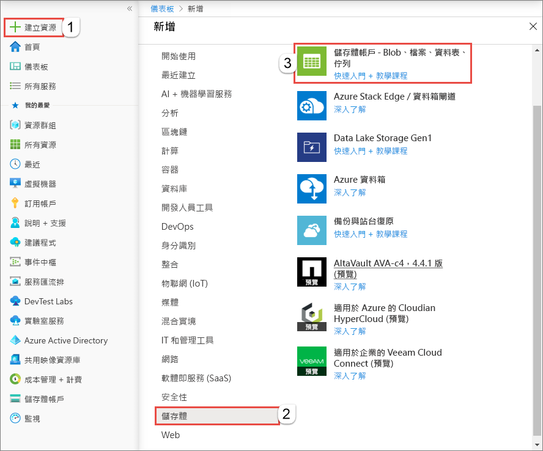

   若要訂閱事件，請建立一般用途 v2 儲存體帳戶或 Blob 儲存體帳戶。
   
1. 在 [建立儲存體帳戶] 頁面上，執行以下步驟︰
    1. 選取 Azure 訂用帳戶。 
    2. 針對 [資源群組]，建立新的資源群組，或選取現有的資源群組。 
    3. 輸入儲存體帳戶的名稱。 
    4. 選取 [檢閱 + 建立]。 

       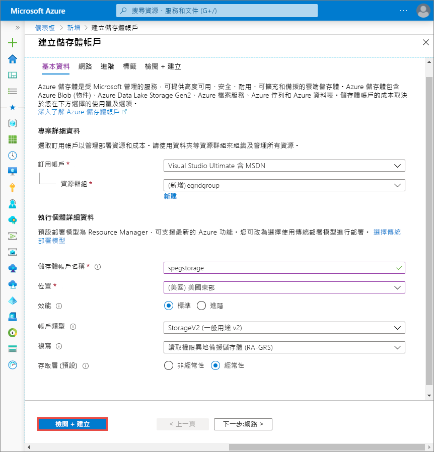    
    5. 在 [檢閱 + 建立] 頁面上檢閱設定，然後選取 [建立]。 

        >[!NOTE]
        > 只有種類為 [StorageV2 (一般用途 v2)] 和 [BlobStorage] 的儲存體帳戶支援事件整合。 **儲存體 (一般用途 v1)** 不支援與事件方格整合。

## 建立訊息端點

在訂閱 Blob 儲存體的事件之前，我們要先建立事件訊息的端點。 通常，端點會根據事件資料採取動作。 若要簡化此快速入門，請部署[預先建置的 Web 應用程式](https://github.com/Azure-Samples/azure-event-grid-viewer)以顯示事件訊息。 已部署的解決方案包含 App Service 方案、App Service Web 應用程式，以及 GitHub 中的原始程式碼。

1. 選取 [部署至 Azure]，將解決方案部署至您的訂用帳戶。 

   
2. 在 [自訂部署] 頁面上，執行下列步驟： 
    1. [資源群組] 請選取您在建立儲存體帳戶時所建立的資源群組。 當您完成本教學課程之後，您可以藉由刪除資源群組，更輕鬆地進行清除。  
    2. 在 [網站名稱] 輸入 Web 應用程式的名稱。
    3. 在 [裝載方案名稱] 輸入要用來裝載 Web 應用程式的 App Service 方案名稱。
    4. 選取 [我同意上方所述的條款及條件] 核取方塊。 
    5. 選取 [購買]。 

       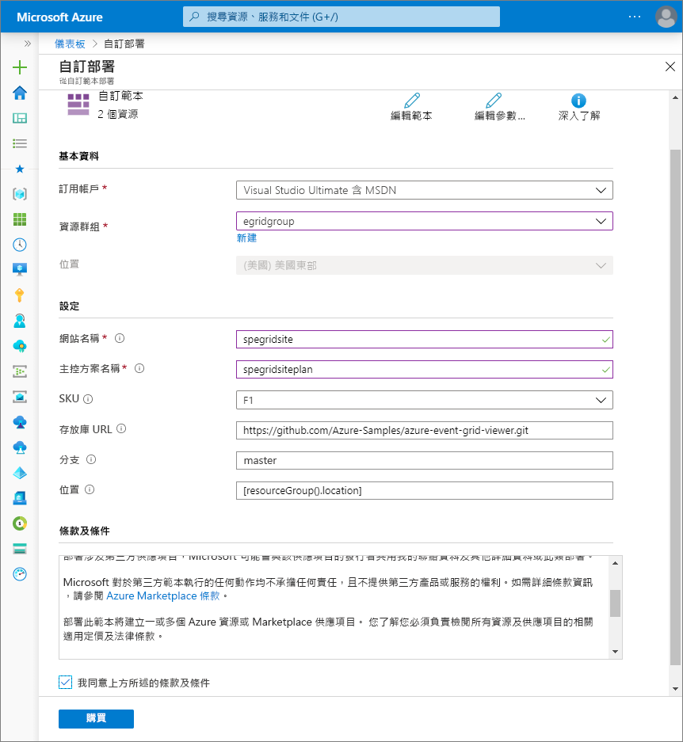
1. 部署需要幾分鐘的時間才能完成。 選取入口網站中的警示 (鐘圖示)，然後選取 [移至資源群組]。 

    
4. 在 [資源群組] 頁面上的資源清單中，選取您所建立的 Web 應用程式。 您也會在此清單中看到 App Service 方案和儲存體帳戶。 

    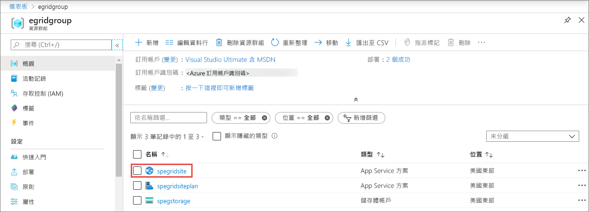
5. 在 Web 應用程式的 [App Service] 頁面上，選取瀏覽至網站的 URL。 URL 應該是此格式：`https://<your-site-name>.azurewebsites.net`。
    
    

6. 確認您看到網站，但其中尚未發佈任何事件。

   

[!INCLUDE [event-grid-register-provider-portal.md](../../includes/event-grid-register-provider-portal.md)]

## 訂閱 Blob 儲存體

您可訂閱主題，告知 Event Grid 您想要追蹤的事件，以及要將事件傳送至何處。

1. 在入口網站中，瀏覽至您稍早建立的 Azure 儲存體帳戶。 在左側功能表上，選取 [所有資源]，然後選取您的儲存體帳戶。 
2. 在 [儲存體帳戶] 頁面上，選取左側功能表中的 [事件]。 
1. 選取 [更多選項]，再選取 [Web Hook]。 您正在使用端點的 Webhook 將事件傳送至您的檢視器應用程式。 

   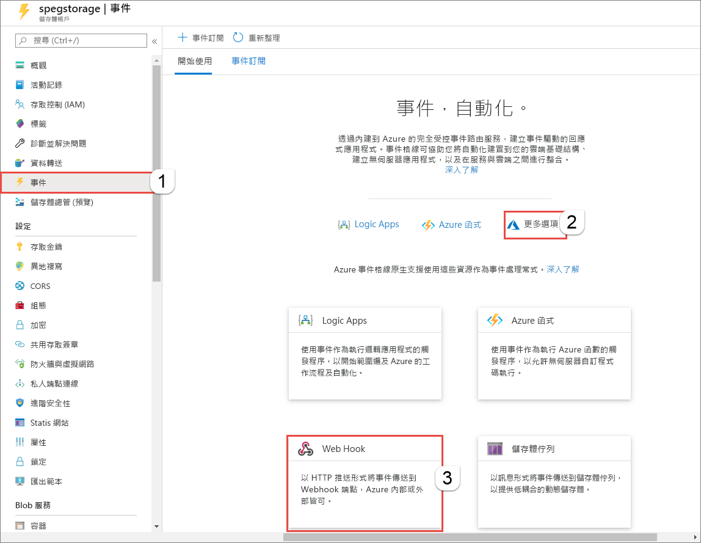
3. 在 [建立事件訂用帳戶] 頁面上，執行下列步驟： 
    1. 輸入事件訂閱的 [名稱]。
    2. 輸入**系統主題**的**名稱**。 若要了解系統主題，請參閱[系統主題概觀](system-topics.md)。

       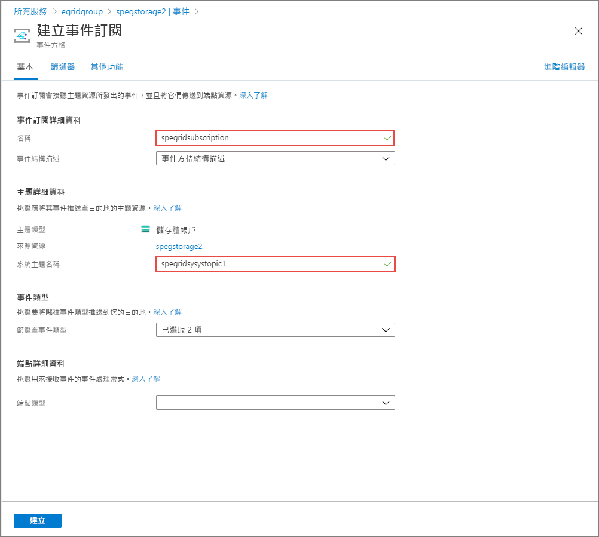
    2. 選取 [WebHook] 作為 [端點類型]。 

       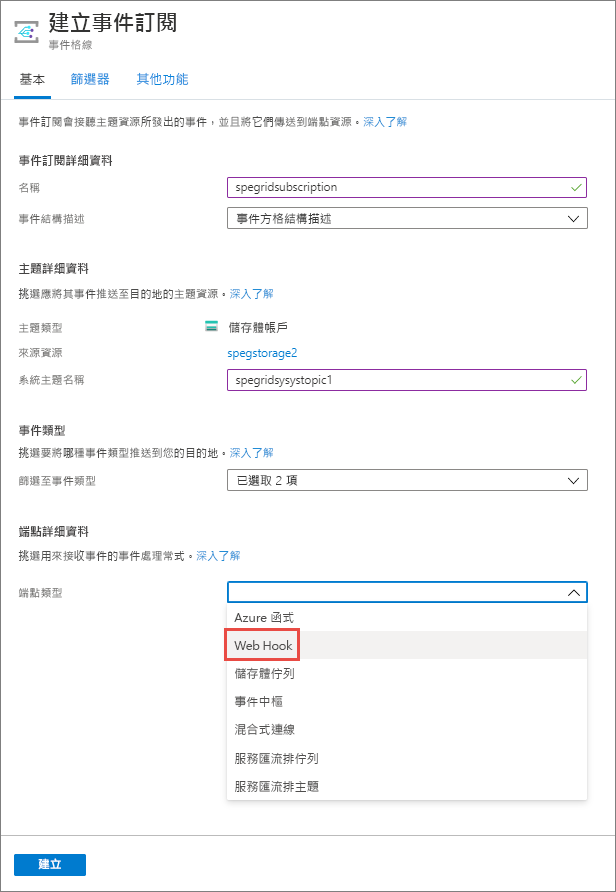
4. 在 [端點] 處，按一下 [選取端點] 並輸入您 Web 應用程式的 URL，將 `api/updates` 加入首頁 URL (例如：`https://spegridsite.azurewebsites.net/api/updates`)，然後選取 [確認選取]。

   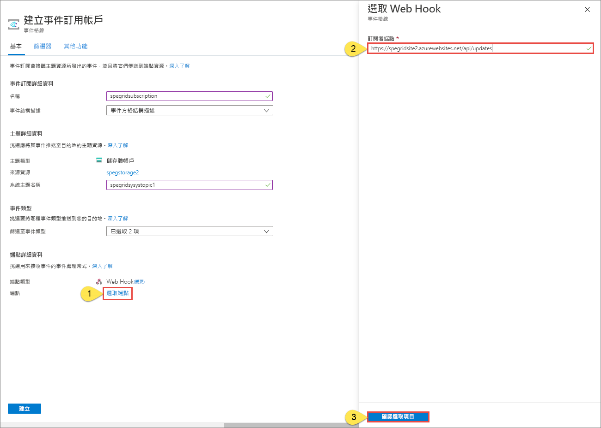
5. 現在，在 [建立事件訂閱] 頁面上，選取 [建立] 以建立事件訂閱。 

   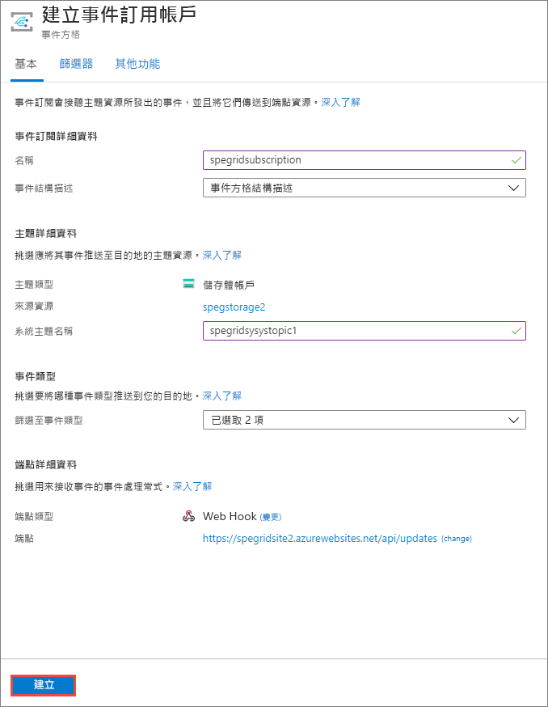

1. 再次檢視 Web 應用程式，並注意訂用帳戶的驗證事件已傳送給它。 選取眼睛圖示來展開事件資料。 Event Grid 會傳送驗證事件，以便端點確認它要接收事件資料。 Web 應用程式包含用來驗證訂用帳戶的程式碼。

   

現在，讓我們觸發事件以了解 Event Grid 如何將訊息散發至您的端點。

## 將事件傳送至端點

您可以藉由上傳檔案來觸發 Blob 儲存體的事件。 此檔案不需要任何特定內容。 相關文章假設您具有名為 testfile.txt 的檔案，但是您可以使用任何檔案。

1. 在 Azure 入口網站中，瀏覽至您的 Blob 儲存體帳戶，然後在 [概觀] 頁面上選取 [容器]。

   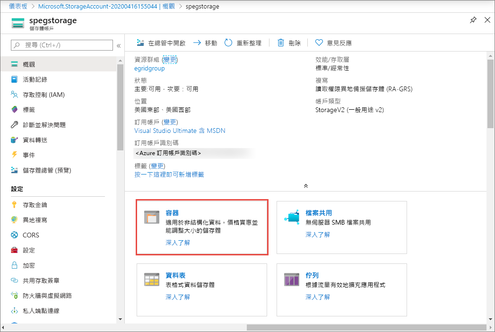

1. 選取 [+ 容器]。 請為您的容器指定名稱，可使用任何存取層級，然後選取 [建立]。 

   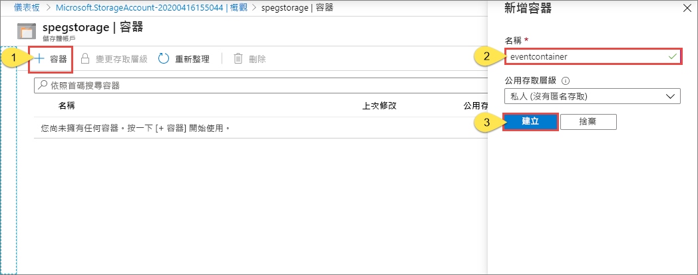

1. 選取您的新容器。

   

1. 若要上傳檔案，請選取 [上傳]。 在 [上傳 Blob] 頁面上，瀏覽並選取您想要上傳以進行測試的檔案，然後在該頁面上選取 [上傳]。 

   

1. 瀏覽至您的測試檔案，並加以上傳。

1. 您已觸發此事件，而 Event Grid 會將訊息傳送至您在訂閱時設定的端點。 訊息為 JSON 格式，且其包含具有一或多個事件的陣列。 在下列範例中，JSON 訊息會包含具有單一事件的陣列。 檢視您的 Web 應用程式，並留意已接收到 **Blob 所建立**的事件。 

   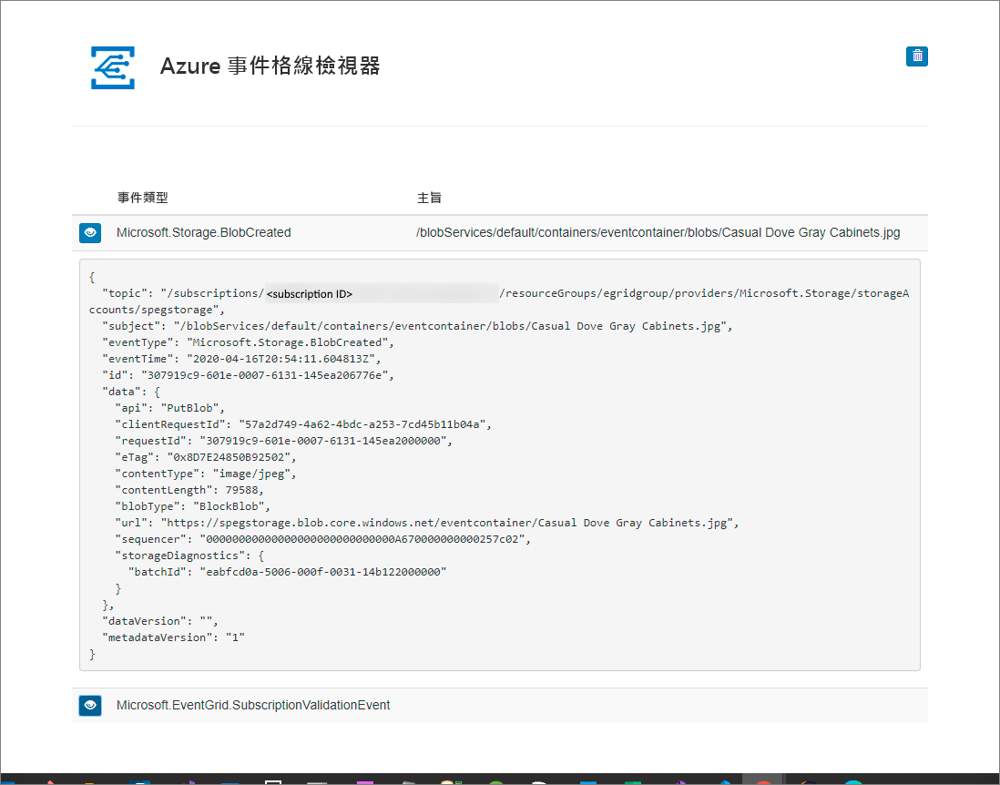

## 清除資源

如果您打算繼續使用此事件，請勿清除在本文中建立的資源。 否則，請刪除您在本文建立的資源。

選取資源群組，然後選取 [刪除資源群組]。

## 後續步驟

您現在知道如何建立自訂主題和事件訂閱，深入了解 Event Grid 可協助您：

- [關於 Event Grid](overview.md)
- [將 Blob 儲存體事件路由至自訂的 Web 端點](../storage/blobs/storage-blob-event-quickstart.md?toc=%2fazure%2fevent-grid%2ftoc.json)
- [使用 Azure Event Grid 和 Logic Apps 監視虛擬機器變更](monitor-virtual-machine-changes-event-grid-logic-app.md)
- [將巨量資料串流處理至資料倉儲](event-grid-event-hubs-integration.md)
