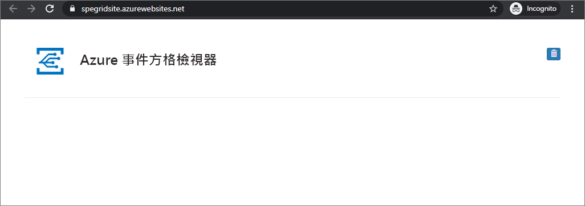

# <a name="build-your-own-disaster-recovery-for-custom-topics-in-event-grid"></a>為事件方格中的自訂主題建置您自己的災害復原
災害復原著重在從應用程式功能的嚴重損失中復原。 本教學課程將逐步說明如何設定您的事件架構，以便在特定區域中的事件方格服務狀況不良時進行復原。

在本教學課程中，您將了解如何為事件方格中的自訂主題建立主動-被動容錯移轉架構。 您會在兩個區域間建立主題和訂用帳戶的鏡像，然後在主題狀況不良時進行容錯移轉，以完成容錯移轉。 本教學課程中的架構容錯移轉所有的新流量。 請務必留意，使用這項設定時，必須在有問題的區域恢復良好狀況後，已開始傳輸的事件才會復原。

> [!NOTE]
> 事件方格現在支援伺服器端上的自動異地災害復原 (GeoDR)。 如果您想要更充分地控管容錯移轉程序，仍可實作用戶端災害復原邏輯。 如需有關自動 GeoDR 的詳細資訊，請參閱 [Azure 事件方格中的伺服器端異地災害復原](geo-disaster-recovery.md)。

## <a name="create-a-message-endpoint"></a>建立訊息端點

若要測試容錯移轉組態，您必須要有用來接收事件的端點。 端點並不是容錯移轉基礎結構的一部分，但將作為我們的事件處理常式，以利測試的進行。

為了簡化測試，請部署[預先建置的 Web 應用程式](https://github.com/Azure-Samples/azure-event-grid-viewer)以顯示事件訊息。 已部署的解決方案包含 App Service 方案、App Service Web 應用程式，以及 GitHub 中的原始程式碼。

1. 選取 [部署至 Azure]  ，將解決方案部署至您的訂用帳戶。 在 Azure 入口網站中，提供參數的值。

   <a href="https://portal.azure.com/#create/Microsoft.Template/uri/https%3A%2F%2Fraw.githubusercontent.com%2FAzure-Samples%2Fazure-event-grid-viewer%2Fmaster%2Fazuredeploy.json" target="_blank"></a>

1. 部署需要幾分鐘的時間才能完成。 成功部署之後，檢視 Web 應用程式，確定它正在執行。 在網頁瀏覽器中，瀏覽至：`https://<your-site-name>.azurewebsites.net`
請確實記下此 URL，稍後您將會用到此資訊。

1. 您看到網站，但其中尚未發佈任何事件。

   

[!INCLUDE [event-grid-register-provider-portal.md](../../includes/event-grid-register-provider-portal.md)]


## <a name="create-your-primary-and-secondary-topics"></a>建立主要和次要主題

首先，請建立兩個事件方格主題。 這兩個主題將作為主要和次要主題。 根據預設，您的事件將透過主要主題傳送。 如果主要區域發生服務中斷的狀況，將會由次要區域接管。

1. 登入 [Azure 入口網站](https://portal.azure.com)。 

1. 在主要 Azure 功能表中的左上角，選擇 [所有服務]  > 搜尋 [事件方格]  > 選取 [事件方格主題]  。

   

    選取事件方格主題旁的星號，將該主題新增至資源功能表，以方便日後存取。

1. 在 [事件方格主題] 功能表中選取 [+新增]  ，以建立主要主題。

   * 為主題指定邏輯名稱，並新增 "-primary" 尾碼，以方便追蹤。
   * 此主題的區域將是您的主要區域。

     

1. 主題建立後，請瀏覽至該主題並複製 [主題端點]  。 您稍後將會用到此 URI。

    

1. 取得主題的存取金鑰，您後續也會用到此金鑰。 按一下資源功能表中的 [存取金鑰]  ，並複製 [金鑰 1]。

    

1. 在 [主題] 刀鋒視窗中，按一下 [+事件訂用帳戶]  以建立訂用帳戶，用以訂閱您在本教學課程的必要條件中建立的事件接收器網站。

   * 為事件訂用帳戶指定邏輯名稱，並新增 "-primary" 尾碼，以方便追蹤。
   * 選取端點類型 Web Hook。
   * 將端點設為您事件接收器的事件 URL，應會顯示如下：`https://<your-event-reciever>.azurewebsites.net/api/updates`

     ![顯示 [建立事件訂用帳戶 - 基本] 頁面的螢幕擷取畫面，其中已反白顯示 [名稱]、[端點類型] 和 [端點] 值。](./media/custom-disaster-recovery/create-primary-es.png)

1. 重複相同的流程以建立次要主題和訂用帳戶。 這次請將 "-primary" 尾碼取代為 "-secondary"，以方便追蹤。 最後，請確實將其放在不同的 Azure 區域中。 雖然您可以將其放在您想要的任何位置，但建議您使用 [Azure 配對區域](../best-practices-availability-paired-regions.md)。 將次要主題和訂用帳戶放在不同的區域中，可確保即使主要區域中斷運作，您的新事件仍會傳送。

您現在應該會有：

   * 測試用的事件接收器網站。
   * 主要區域中的主要主題。
   * 將主要主題連線至事件接收器網站的主要事件訂用帳戶。
   * 次要區域中的次要主題。
   * 將主要主題連線至事件接收器網站的次要事件訂用帳戶。

## <a name="implement-client-side-failover"></a>實作用戶端容錯移轉

現在，您已設定主題和訂用帳戶的區域備援配對，接下來您可以實作用戶端容錯移轉。 這可以透過數種方式來完成，但所有容錯移轉實作將有一項共同的功能：如果某個主題不再處於良好狀況，流量將會重新導向至其他主題。

### <a name="basic-client-side-implementation"></a>基本用戶端實作

下列範例程式碼說明一律會先嘗試發佈至主要主題的簡單 .NET 發行者。 如果不成功，則會容錯移轉至次要主題。 在任一情況下，它也都會在 `https://<topic-name>.<topic-region>.eventgrid.azure.net/api/health` 上執行 GET，以檢查其他主題的健康情況 API。 在 **/api/health** 端點上進行 GET 時，狀況良好的主題應一律會回應 **200 確定**。

```csharp
using System;
using System.Net.Http;
using System.Collections.Generic;
using Microsoft.Azure.EventGrid;
using Microsoft.Azure.EventGrid.Models;
using Newtonsoft.Json;

namespace EventGridFailoverPublisher
{
    // This captures the "Data" portion of an EventGridEvent on a custom topic
    class FailoverEventData
    {
        [JsonProperty(PropertyName = "teststatus")]
        public string TestStatus { get; set; }
    }

    class Program
    {
        static void Main(string[] args)
        {
            // TODO: Enter the endpoint each topic. You can find this topic endpoint value
            // in the "Overview" section in the "Event Grid Topics" blade in Azure Portal..
            string primaryTopic = "https://<primary-topic-name>.<primary-topic-region>.eventgrid.azure.net/api/events";
            string secondaryTopic = "https://<secondary-topic-name>.<secondary-topic-region>.eventgrid.azure.net/api/events";

            // TODO: Enter topic key for each topic. You can find this in the "Access Keys" section in the
            // "Event Grid Topics" blade in Azure Portal.
            string primaryTopicKey = "<your-primary-topic-key>";
            string secondaryTopicKey = "<your-secondary-topic-key>";

            string primaryTopicHostname = new Uri( primaryTopic).Host;
            string secondaryTopicHostname = new Uri(secondaryTopic).Host;

            Uri primaryTopicHealthProbe = new Uri("https://" + primaryTopicHostname + "/api/health");
            Uri secondaryTopicHealthProbe = new Uri("https://" + secondaryTopicHostname + "/api/health");

            var httpClient = new HttpClient();

            try
            {
                TopicCredentials topicCredentials = new TopicCredentials(primaryTopicKey);
                EventGridClient client = new EventGridClient(topicCredentials);

                client.PublishEventsAsync(primaryTopicHostname, GetEventsList()).GetAwaiter().GetResult();
                Console.Write("Published events to primary Event Grid topic.");

                HttpResponseMessage health = httpClient.GetAsync(secondaryTopicHealthProbe).Result;
                Console.Write("\n\nSecondary Topic health " + health);
            }
            catch (Microsoft.Rest.Azure.CloudException e)
            {
                TopicCredentials topicCredentials = new TopicCredentials(secondaryTopicKey);
                EventGridClient client = new EventGridClient(topicCredentials);

                client.PublishEventsAsync(secondaryTopicHostname, GetEventsList()).GetAwaiter().GetResult();
                Console.Write("Published events to secondary Event Grid topic. Reason for primary topic failure:\n\n" + e);

                HttpResponseMessage health = httpClient.GetAsync(primaryTopicHealthProbe).Result;
                Console.Write("\n\nPrimary Topic health " + health);
            }

            Console.ReadLine();
        }

        static IList<EventGridEvent> GetEventsList()
        {
            List<EventGridEvent> eventsList = new List<EventGridEvent>();

            for (int i = 0; i < 5; i++)
            {
                eventsList.Add(new EventGridEvent()
                {
                    Id = Guid.NewGuid().ToString(),
                    EventType = "Contoso.Failover.Test",
                    Data = new FailoverEventData()
                    {
                        TestStatus = "success"
                    },
                    EventTime = DateTime.Now,
                    Subject = "test" + i,
                    DataVersion = "2.0"
                });
            }

            return eventsList;
        }
    }
}
```

### <a name="try-it-out"></a>試做

現在，您所有的元件皆已準備就緒，接下來即可測試容錯移轉實作。 請以 Visual Studio Code 或您慣用的環境執行上述範例。 請將以下四個值取代為您主題中的端點和金鑰：

   * primaryTopic - 主要主題的端點。
   * secondaryTopic - 次要主題的端點。
   * primaryTopicKey - 主要主題的金鑰。
   * secondaryTopicKey - 次要主題的金鑰。

嘗試執行事件發行者。 您應該會看到測試事件顯示在事件方格檢視器中，如下所示。


若要確定容錯移轉可運作，您可以變更主要主題金鑰中的幾個字元，使金鑰失效。 再次嘗試執行發行者。 您應該也會看到新的事件顯示在事件方格檢視器中，但當您查看主控台時，會發現事件此時是透過次要主題發佈的。

### <a name="possible-extensions"></a>可能的擴充

您可以透過多種方式根據本身的需求擴充此範例。 針對高容量的案例，您可以個別定期檢查主題的健康情況 API。 如此，當主題停止運作時，您將無須在每一次發佈時檢查主題。 一旦您知道某個主題的狀況不良，您就可以預設為發佈至次要主題。

同樣地，您也可以根據本身的特定需求實作容錯回復邏輯。 如果您必須發佈至最接近的資料中心以降低延遲，您可以定期對已容錯移轉的主題探查健康情況 API。 在其狀況恢復正常後，您將確知已可安全地容錯回復至最接近的資料中心。

## <a name="next-steps"></a>後續步驟

- 了解如何[在 HTTP 端點接收事件](./receive-events.md)
- 探索如何[將事件路由至混合式連線](./custom-event-to-hybrid-connection.md)
- 了解如何[使用 Azure DNS 和流量管理員進行災害復原](../networking/disaster-recovery-dns-traffic-manager.md)
