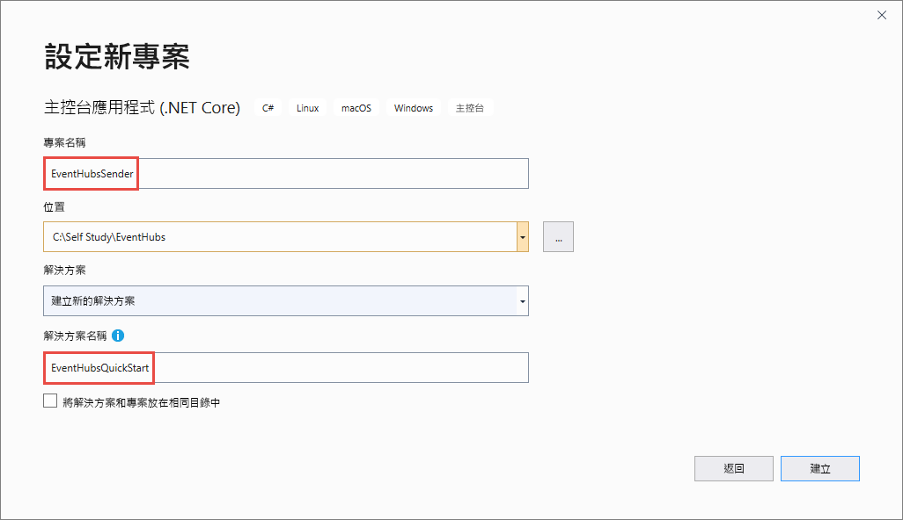

# <a name="send-events-to-and-receive-events-from-azure-event-hubs---net-core-azuremessagingeventhubs"></a>將事件傳送至 Azure 事件中樞及從中接收事件 - .NET Core (Azure.Messaging.EventHubs) 
本快速入門說明如何使用 **Azure.Messaging.EventHubs** .NET Core 程式庫，將事件傳送至事件中樞，以及從中接收事件。 

> [!IMPORTANT]
> 本快速入門使用新的 **Azure.Messaging.EventHubs** 程式庫。 如需使用舊版 **Microsoft.Azure.EventHubs** 程式庫的快速入門，請參閱[使用 Microsoft.Azure.EventHubs 程式庫傳送和接收事件](event-hubs-dotnet-standard-getstarted-send.md)。 


## <a name="prerequisites"></a>Prerequisites
如果您對 Azure 事件中樞並不熟悉，在進行此快速入門之前，請先參閱[事件中樞概述](event-hubs-about.md)。 

若要完成本快速入門，您必須符合下列必要條件：

- **Microsoft Azure 訂用帳戶**。 若要使用 Azure 服務 (包括 Azure 事件中樞)，您需要訂用帳戶。  如果您沒有現有的 Azure 帳戶，您可以申請[免費試用](https://azure.microsoft.com/free/)，或是在[建立帳戶](https://azure.microsoft.com)時使用 MSDN 訂閱者權益。
- **Microsoft Visual Studio 2019**。 Azure 事件中樞用戶端程式庫會使用 C# 8.0 中引進的新功能。  您仍然可以搭配舊版 C# 使用程式庫，但部分功能將無法使用。  若要啟用這些功能，您必須[以 .NET Core 3.0 為目標](/dotnet/standard/frameworks#how-to-specify-target-frameworks)或[指定您想要使用的語言版本](/dotnet/csharp/language-reference/configure-language-version#override-a-default) (8.0 或更新版本)。 如果您使用的是 Visual Studio，Visual Studio 2019 之前的版本與建立 C# 8.0 專案所需的工具不相容。 Visual Studio 2019 (包括免費的 Community 版) 可以在[這裡](https://visualstudio.microsoft.com/vs/)下載
- **建立事件中樞命名空間和事件中樞**。 第一個步驟是使用 [Azure 入口網站](https://portal.azure.com)來建立「事件中樞」類型的命名空間，然後取得您應用程式與「事件中樞」進行通訊所需的管理認證。 若要建立命名空間和事件中樞，請依照[這篇文章](event-hubs-create.md)中的程序操作。 然後，依照下列文章中的指示，取得**事件中樞命名空間的連接字串**：[取得連接字串](event-hubs-get-connection-string.md#get-connection-string-from-the-portal)。 您稍後會在本快速入門中使用連接字串。

## <a name="send-events"></a>傳送事件 
本節說明如何建立可將事件傳送至事件中樞的 .NET Core 主控台應用程式。 

### <a name="create-a-console-application"></a>建立主控台應用程式

1. 啟動 Visual Studio 2019。 
1. 選取 [建立新專案]  。 
1. 在 [建立新專案]  對話方塊中，執行下列步驟：如果您看不到此對話方塊，請在功能表上選取 [檔案]  ，然後依序選取 [新增]  和 [專案]  。 
    1. 選取 [C#]  作為程式設計語言。
    1. 選取 [主控台]  作為應用程式的類型。 
    1. 從結果清單中選取 [主控台應用程式 (.NET Core)]  。 
    1. 然後，選取 [下一步]  。 

        ![[新增專案] 對話方塊](./media/getstarted-dotnet-standard-send-v2/new-send-project.png)    
1. 輸入 **EventHubsSender** 作為專案名稱、輸入 **EventHubsQuickStart** 作為解決方案名稱，然後選取 [確定]  以建立專案。 

    

### <a name="add-the-event-hubs-nuget-package"></a>新增事件中樞 NuGet 封裝

1. 從功能表選取 [工具]   > [NuGet 套件管理員]   > [套件管理員主控台]  。 
1. 執行以下命令來安裝 **Azure.Messaging.EventHubs** NuGet 套件：

    ```cmd
    Install-Package Azure.Messaging.EventHubs
    ```


### <a name="write-code-to-send-messages-to-the-event-hub"></a>撰寫程式碼以將訊息傳送到事件中樞

1. 在 Program.cs  檔案開頭處加入 `using` 陳述式：

    ```csharp
    using System.Text;
    using System.Threading.Tasks;
    using Azure.Messaging.EventHubs;
    using Azure.Messaging.EventHubs.Producer;
    ```

2. 針對「事件中樞」連接字串和事件中樞名稱，將常數新增到 `Program` 類別。 以建立事件中樞時所取得的適當值取代括號中的預留位置。 請確定 `{Event Hubs namespace connection string}` 是命名空間層級的連接字串，而不是事件中樞字串。 

    ```csharp
    private const string connectionString = "<EVENT HUBS NAMESPACE - CONNECTION STRING>";
    private const string eventHubName = "<EVENT HUB NAME>";
    ```

3. 以下列 `async Main` 取代 `Main` 方法。 如需詳細資訊，請參閱程式碼註解。 

    ```csharp
        static async Task Main()
        {
            // Create a producer client that you can use to send events to an event hub
            await using (var producerClient = new EventHubProducerClient(connectionString, eventHubName))
            {
                // Create a batch of events 
                using EventDataBatch eventBatch = await producerClient.CreateBatchAsync();

                // Add events to the batch. An event is a represented by a collection of bytes and metadata. 
                eventBatch.TryAdd(new EventData(Encoding.UTF8.GetBytes("First event")));
                eventBatch.TryAdd(new EventData(Encoding.UTF8.GetBytes("Second event")));
                eventBatch.TryAdd(new EventData(Encoding.UTF8.GetBytes("Third event")));

                // Use the producer client to send the batch of events to the event hub
                await producerClient.SendAsync(eventBatch);
                Console.WriteLine("A batch of 3 events has been published.");
            }
        }
    ```
5. 建置專案，並確定沒有任何錯誤。
6. 執行程式，並等候確認訊息。 
7. 在 Azure 入口網站中，您可以確認事件中樞是否已收到訊息。 切換至 [計量]  區段中的 [訊息]  檢視。 請重新整理頁面來更新圖表。 可能需要幾秒鐘的時間，頁面才會顯示已收到訊息。 

    [](./media/getstarted-dotnet-standard-send-v2/verify-messages-portal.png#lightbox)

    > [!NOTE]
    > 如需完整的原始程式碼和更多資訊註解，請參閱 [GitHub 上的此檔案](https://github.com/Azure/azure-sdk-for-net/blob/master/sdk/eventhub/Azure.Messaging.EventHubs/samples/Sample03_PublishAnEventBatch.cs)

## <a name="receive-events"></a>接收事件
本節將說明如何撰寫一個使用事件處理器從事件中樞接收訊息的 .NET Core 主控台應用程式。 事件處理器可透過管理持續檢查點以及來自事件中樞的平行接收，簡化來自事件中樞事件的接收作業。 事件處理器可與特定事件中樞和取用者群組相關聯。 也可以從事件中樞內的多個分割區接收事件，並將其傳遞至處理常式委派，以使用您提供的程式碼進行處理。 


> [!NOTE]
> 如果您在 Azure Stack Hub 上執行，該平台可能支援不同版本的儲存體 Blob SDK，而不是 Azure 上一般可用的版本。 例如，如果您在 [Azure Stack Hub 2002 版](https://docs.microsoft.com/azure-stack/user/event-hubs-overview)上執行 ，儲存體服務的最高可用版本為 2017-11-09。 在此情況下，除了本節中的以下步驟外，您還需要新增程式碼，以將儲存體服務 API 版本設為 2017-11-09 為目標。 如需如何設定特定儲存體 API 版本目標的範例，請參閱 [GitHub 上的此範例](https://github.com/Azure/azure-sdk-for-net/tree/master/sdk/eventhub/Azure.Messaging.EventHubs.Processor/samples/Sample10_RunningWithDifferentStorageVersion.cs)。 如需 Azure Stack Hub 支援的 Azure 儲存體服務版本詳細資訊，請參閱 [Azure Stack Hub 儲存體：差異與注意事項](https://docs.microsoft.com/azure-stack/user/azure-stack-acs-differences)。

### <a name="create-an-azure-storage-and-a-blob-container"></a>建立 Azure 儲存體 Blob 容器
在本快速入門中，您會使用 Azure 儲存體作為檢查點存放區。 請遵循這些步驟來建立 Azure 儲存體帳戶。 

1. [建立 Azure 儲存體帳戶](/azure/storage/common/storage-account-create?tabs=azure-portal)
2. [建立 Blob 容器](../storage/blobs/storage-quickstart-blobs-portal.md#create-a-container)
3. [取得儲存體帳戶的連接字串](../storage/common/storage-configure-connection-string.md?#view-and-copy-a-connection-string)

    記下連接字串和容器名稱。 您會在接收程式碼中用到這些項目。 


### <a name="create-a-project-for-the-receiver"></a>為接收者建立專案

1. 在 [方案總管] 視窗中，以滑鼠右鍵按一下 [EventHubQuickStart]  解決方案，並指向 [新增]  ，然後選取 [新增專案]  。 
1. 選取 [主控台應用程式 (.NET Core)]  ，然後選取 [下一步]  。 
1. 輸入 **EventHubsReceiver** 作為**專案名稱**，然後選取 [建立]  。 

### <a name="add-the-event-hubs-nuget-package"></a>新增事件中樞 NuGet 封裝

1. 從功能表選取 [工具]   > [NuGet 套件管理員]   > [套件管理員主控台]  。 
1. 執行以下命令來安裝 **Azure.Messaging.EventHubs** NuGet 套件：

    ```cmd
    Install-Package Azure.Messaging.EventHubs
    ```
1. 執行以下命令來安裝 **Azure.Messaging.EventHubs.Processor** NuGet 套件：

    ```cmd
    Install-Package Azure.Messaging.EventHubs.Processor
    ```    

### <a name="update-the-main-method"></a>更新 Main 方法 

1. 在 **Program.cs** 檔案開頭處新增下列 `using` 陳述式。

    ```csharp
    using System.Text;
    using System.Threading.Tasks;
    using Azure.Storage.Blobs;
    using Azure.Messaging.EventHubs;
    using Azure.Messaging.EventHubs.Consumer;
    using Azure.Messaging.EventHubs.Processor;
    ```
1. 針對「事件中樞」連接字串和事件中樞名稱，將常數新增到 `Program` 類別。 以建立事件中樞時所取得的適當值取代括號中的預留位置。 將括弧中的預留位置取代為您在建立事件中樞和儲存體帳戶時取得的適當值 (存取金鑰 - 主要連接字串)。 請確定 `{Event Hubs namespace connection string}` 是命名空間層級的連接字串，而不是事件中樞字串。

    ```csharp
        private const string ehubNamespaceConnectionString = "<EVENT HUBS NAMESPACE - CONNECTION STRING>";
        private const string eventHubName = "<EVENT HUB NAME>";
        private const string blobStorageConnectionString = "<AZURE STORAGE CONNECTION STRING>";
        private const string blobContainerName = "<BLOB CONTAINER NAME>";
    ```
3. 以下列 `async Main` 取代 `Main` 方法。 如需詳細資訊，請參閱程式碼註解。 

    ```csharp
        static async Task Main()
        {
            // Read from the default consumer group: $Default
            string consumerGroup = EventHubConsumerClient.DefaultConsumerGroupName;

            // Create a blob container client that the event processor will use 
            BlobContainerClient storageClient = new BlobContainerClient(blobStorageConnectionString, blobContainerName);

            // Create an event processor client to process events in the event hub
            EventProcessorClient processor = new EventProcessorClient(storageClient, consumerGroup, ehubNamespaceConnectionString, eventHubName);

            // Register handlers for processing events and handling errors
            processor.ProcessEventAsync += ProcessEventHandler;
            processor.ProcessErrorAsync += ProcessErrorHandler;

            // Start the processing
            await processor.StartProcessingAsync();

            // Wait for 10 seconds for the events to be processed
            await Task.Delay(TimeSpan.FromSeconds(10));

            // Stop the processing
            await processor.StopProcessingAsync();
        }    
    ```
1. 現在，將下列事件和錯誤處理常式方法新增至類別。 

    ```csharp
        static Task ProcessEventHandler(ProcessEventArgs eventArgs)
        { 
            // Write the body of the event to the console window
            Console.WriteLine("\tReceived event: {0}", Encoding.UTF8.GetString(eventArgs.Data.Body.ToArray())); 
            return Task.CompletedTask; 
        }

        static Task ProcessErrorHandler(ProcessErrorEventArgs eventArgs)
        {
            // Write details about the error to the console window
            Console.WriteLine($"\tPartition '{ eventArgs.PartitionId}': an unhandled exception was encountered. This was not expected to happen.");
            Console.WriteLine(eventArgs.Exception.Message);
            return Task.CompletedTask;
        }    
    ```
1. 建置專案，並確定沒有任何錯誤。

    > [!NOTE]
    > 如需完整的原始程式碼和更多資訊註解，請參閱 [GitHub 上的此檔案](https://github.com/Azure/azure-sdk-for-net/blob/master/sdk/eventhub/Azure.Messaging.EventHubs.Processor/samples/Sample01_HelloWorld.cs)。
6. 執行接收者應用程式。 
1. 您應該會看到一則訊息，指出已收到事件。 

    

    這些事件是您稍早透過執行寄件者程式傳送至事件中樞的三個事件。 


## <a name="next-steps"></a>後續步驟
查看 GitHub 上的範例。 

- [GitHub 上的事件中樞範例](https://github.com/Azure/azure-sdk-for-net/tree/master/sdk/eventhub/Azure.Messaging.EventHubs/samples)
- [GitHub 上的事件處理器範例](https://github.com/Azure/azure-sdk-for-net/tree/master/sdk/eventhub/Azure.Messaging.EventHubs.Processor/samples)
- [角色型存取控制 (RBAC) 範例](https://github.com/Azure/azure-event-hubs/tree/master/samples/DotNet/Azure.Messaging.EventHubs/ManagedIdentityWebApp)
