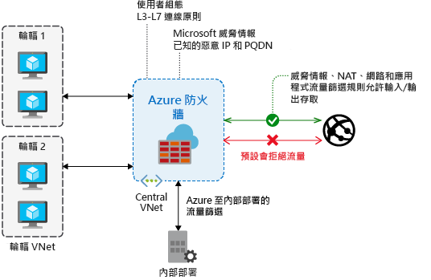

# Azure 防火牆功能

[Azure 防火牆](overview.md) 是受控的雲端式網路安全性服務，可保護您的 Azure 虛擬網路資源。

Azure 防火牆包含下列功能：

- [內建高可用性](#built-in-high-availability)
- [可用性區域](#availability-zones)
- [不受限制的雲端擴充性](#unrestricted-cloud-scalability)
- [應用程式 FQDN 篩選規則](#application-fqdn-filtering-rules)
- [網路流量篩選規則](#network-traffic-filtering-rules)
- [FQDN 標記](#fqdn-tags)
- [服務標籤](#service-tags)
- [威脅情報](#threat-intelligence)
- [輸出 SNAT 支援](#outbound-snat-support)
- [輸入 DNAT 支援](#inbound-dnat-support)
- [多個公用 IP 位址](#multiple-public-ip-addresses)
- [Azure 監視器記錄](#azure-monitor-logging)
- [強制通道](#forced-tunneling)
- [認證](#certifications)

## 內建高可用性

高可用性是內建的，因此不需要額外的負載平衡器，您也不需要進行任何設定。

## 可用性區域

Azure 防火牆可在部署期間進行設定，以跨越多個可用性區域來增加可用性。 透過可用性區域，您的可用性會增加到 99.99% 運作時間。 如需詳細資訊，請參閱 Azure 防火牆[服務等級協定 (SLA)](https://azure.microsoft.com/support/legal/sla/azure-firewall/v1_0/)。 選取兩個或多個可用性區域時，會提供 99.99% 運作時間 SLA。

您也可以單純基於鄰近性而將 Azure 防火牆關聯到特定區域，並使用服務標準的 99.95% SLA。

針對部署在「可用性區域」中的防火牆並不會產生額外費用。 不過，與可用性區域相關聯的輸入和輸出資料轉送會有額外成本。 如需詳細資訊，請參閱[頻寬價格詳細資料](https://azure.microsoft.com/pricing/details/bandwidth/)。

Azure 防火牆可用性區域可用於支援可用性區域的區域中。 如需詳細資訊，請參閱 [Azure 中支援可用性區域的區域](../availability-zones/az-region.md)

> [!NOTE]
> 可用性區域只能在部署期間進行設定。 您無法對現有的防火牆設定包含可用性區域。

如需可用性區域的詳細資訊，請參閱 [Azure 中的區域和可用性區域](../availability-zones/az-overview.md)

## 不受限制的雲端延展性

Azure 防火牆可以隨著您的需求擴大，以容納多變的網路流量，因此您不需要為尖峰流量編列預算。

## 應用程式 FQDN 篩選規則

您可以將輸出 HTTP/S 流量或 Azure SQL 流量限制為指定的完整功能變數名稱清單 (FQDN) 包含萬用字元。 這項功能不需要 TLS 終止。

## 網路流量篩選規則

您可以依據來源和目的地 IP 位址、連接埠及通訊協定，集中建立「允許」或「拒絕」網路篩選規則。 Azure 防火牆是完全具狀態的，因此能夠分辨不同連線類型的合法封包。 規則會橫跨多個訂用帳戶和虛擬網路強制執行及記錄。

## FQDN 標記

[FQDN 標籤](fqdn-tags.md)讓您輕鬆就能允許已知的 Azure 服務網路流量通過您的防火牆。 例如，假設您想要允許 Windows Update 網路流量通過您的防火牆。 您可以建立應用程式規則並包含 Windows Update 標籤。 來自 Windows Update 的網路流量現在就能通過您的防火牆。

## 服務標籤

[服務標籤](service-tags.md)表示一組 IP 位址前置詞，有助於降低建立安全性規則的複雜性。 您無法建立自己的服務標籤，也無法指定標籤中包含哪些 IP 位址。 Microsoft 會管理服務標籤包含的位址前置詞，並隨著位址變更自動更新服務標籤。

## 威脅情報

您可為防火牆啟用[威脅情報](threat-intel.md)型篩選，以警示並拒絕來自/傳向已知惡意 IP 位址和網域的流量。 IP 位址和網域來自 Microsoft 威脅情報摘要。

## 輸出 SNAT 支援

所有輸出虛擬網路流量 IP 位址都會轉譯成 Azure 防火牆公用 IP (來源網路位址轉譯)。 您可以識別源自您虛擬網路的流量，並且允許其流向遠端網際網路目的地。 目的地 IP 為 [IANA RFC 1918](https://tools.ietf.org/html/rfc1918) 的私人 IP 範圍時，Azure 防火牆不會進行 SNAT 轉譯。 

如果您的組織使用私人網路的公用 IP 位址範圍，Azure 防火牆會將流量 SNAT 轉譯到 AzureFirewallSubnet 其中一個防火牆私人 IP 位址。 您可以將 Azure 防火牆設定為 **不要** SNAT 公用 IP 位址範圍。 如需詳細資訊，請參閱 [Azure 防火牆 SNAT 私人 IP 位址範圍](snat-private-range.md)。

## 輸入 DNAT 支援

傳送到您防火牆公用 IP 位址的輸入網際網路流量會轉譯 (目的地網路位址轉譯)，並篩選至您虛擬網路上的私人 IP 位址。

## 多個公用 IP 位址

您可以將[多個公用 IP 位址](deploy-multi-public-ip-powershell.md) (最多 250 個) 與您的防火牆相關聯。

這適用於下列案例：

- **DNAT** - 您可以將多個標準連接埠執行個體轉譯到後端伺服器。 例如，如果您有兩個公用 IP 位址，您可以為這兩個 IP 位址轉譯 TCP 通訊埠 3389 (RDP)。
- **SNAT** - 其他連接埠可用於輸出 SNAT 連線，降低 SNAT 連接埠耗盡的可能性。 目前，Azure 防火牆會隨機選取來源公用 IP 位址以用於連線。 如果您的網路上有任何下游篩選，則您必須允許與防火牆相關聯的所有公用 IP 位址。 請考慮使用[公用 IP 位址首碼](../virtual-network/public-ip-address-prefix.md)來簡化此設定。

## Azure 監視器記錄

所有事件都會與 Azure 監視器整合，讓您可以將記錄封存至儲存體帳戶、將事件串流至事件中樞，或者將它們傳送到 Azure 監視器記錄。 如 Azure 監視器記錄範例，請參閱 [Azure 防火牆 Azure 監視器記錄](log-analytics-samples.md)。

如需詳細資訊，請參閱[教學課程：監視 Azure 防火牆記錄和計量](./firewall-diagnostics.md)。 

Azure 防火牆活頁簿為 Azure 防火牆資料分析提供了彈性的畫布。 您可以使用它，在 Azure 入口網站中建立豐富的視覺效果報表。 如需詳細資訊，請參閱 [使用 Azure 防火牆活頁簿監視記錄](firewall-workbook.md)。

## 強制通道

您可以設定 Azure 防火牆，將所有網際網路繫結流量路由傳送至指定的下一個躍點，而不是直接前往網際網路。 例如，您可能有內部部署邊緣防火牆或其他網路虛擬設備 (NVA) 能先處理網路流量，再將其傳遞至網際網路。 如需詳細資訊，請參閱 [Azure 防火牆強制通道](forced-tunneling.md)。

## 認證

Azure 防火牆符合支付卡產業 (PCI)、服務組織控制 (SOC)、國際標準化組織 (ISO) 規範和符合 ICSA 實驗室規範。 如需詳細資訊，請參閱 [Azure 防火牆合規性認證](compliance-certifications.md)。

## 後續步驟

- [Azure 防火牆規則處理邏輯](rule-processing.md)