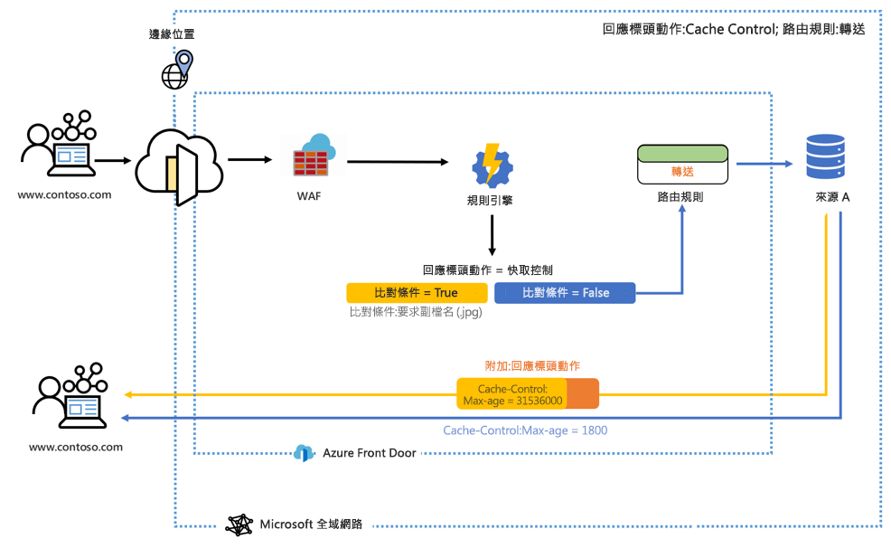
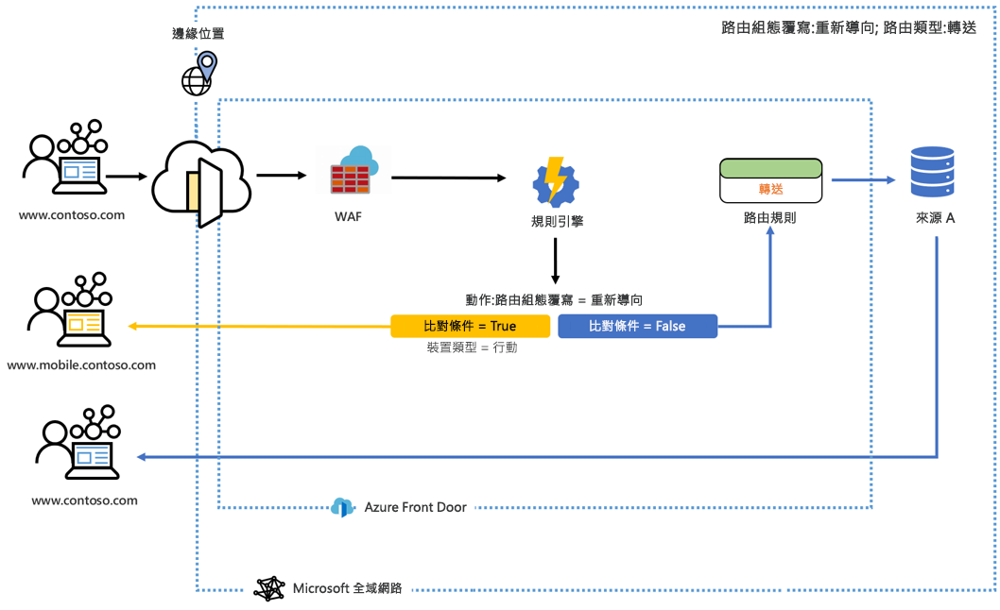

# Azure Front Door 的規則引擎是什麼？ 

規則引擎可讓您自訂在邊緣處理 HTTP 要求的方式，並且讓您更能充分掌控 Web 應用程式的行為。 Azure Front Door 的規則引擎包含數個重要功能，包括：

- 強制使用 HTTPS，確保所有使用者都能透過安全連線與您的內容互動。
- 實作安全性標頭可防止以瀏覽器為基礎的弱點，例如跨原始來源資源共用 (CORS) 案例的 HTTP Strict-Transport-Security (HSTS)、X-XSS-Protection、Content-Security-Policy、X-Frame-Options 以及 Access-Control-Allow-Origin 標頭。 以安全性為基礎的屬性也可以使用 Cookie 來定義。
- 根據要求標頭、Cookie 或查詢字串內容中的模式，將要求路由傳送至應用程式的行動或桌面版本。
- 使用重新導向功能將 301、302、307 和 308 重新導向傳回給用戶端，以重新導向至新的主機名稱、路徑或通訊協定。
- 根據傳入的要求，動態修改您路由的快取設定。
- 重寫要求 URL 路徑，並將要求轉送至已設定後端集區中的適當後端。

## 架構 

規則引擎會在邊緣處理要求。 設定規則引擎後，當要求達到您的 Front Door 端點時，會先執行 WAF，然後再執行與您的前端/網域相關聯的規則引擎組態。 執行規則引擎組態時，表示父代路由規則已經相符。 是否執行規則引擎組態中每個規則內的所有動作，受制於該規則內的所有比對條件都要符合。 如果要求不符合規則引擎組態中的任何條件，則會執行預設路由規則。 

例如，在以下組態中，規則引擎會設定為附加回應標頭，以在條件符合時，變更快取控制項的最大存留期。 

在另一個範例中，我們發現規則引擎已設定為在比對條件 (裝置類型) 為 True 時，將使用者傳送至行動版的網站。 

在這兩個範例中，若所有比對條件都不符合，則會執行所指定的路由規則。 

## 詞彙 

利用 AFD 規則引擎，您可建立一系列的規則引擎組態，而每個組態都是由一組規則所組成。 以下概述在設定規則引擎時，您將會遇到的一些實用術語。 

- *規則引擎組態*：已套用至單一路由規則的一組規則。 每個組態的限制為 25 個規則。 您最多可以建立 10 個組態。 
- *規則引擎規則*：最多由 10 個比對條件和 5 個動作所組成的規則。
- *比對條件*：有多個比對條件可用來剖析傳入要求。 一個規則最多可以包含 10 個比對條件。 比對條件會使用 **AND** 運算子進行評估。 您可以在[這裡](front-door-rules-engine-match-conditions.md)找到完整的比對條件清單。 
- *動作*：動作可決定傳入要求會發生什麼情況 - 要求 / 回應標頭動作、轉送、重新導向和重寫現在均可供使用。 一個規則最多可包含 5 個動作；不過，一個規則只能包含 1 個路由組態覆寫。  您可以在[這裡](front-door-rules-engine-actions.md)找到完整的動作清單。

## 後續步驟

- 了解如何設定您的第一個[規則引擎組態](front-door-tutorial-rules-engine.md)。 
- 了解如何[建立 Front Door](quickstart-create-front-door.md)。
- 了解 [Front Door 的運作方式](front-door-routing-architecture.md)。
