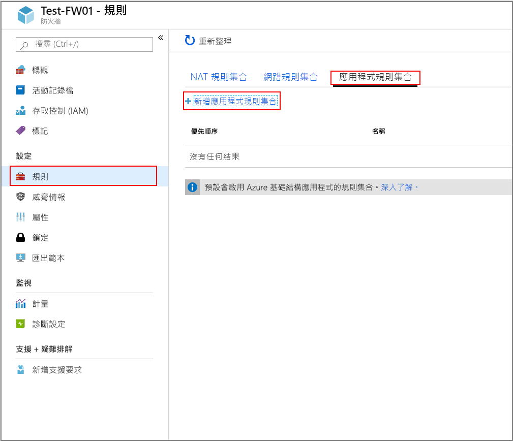
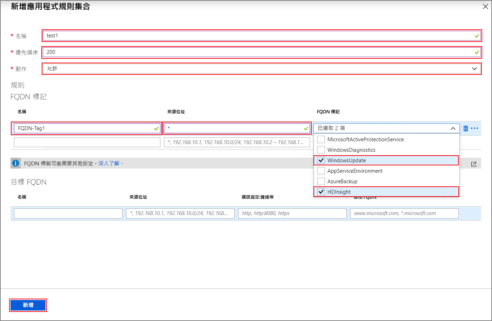
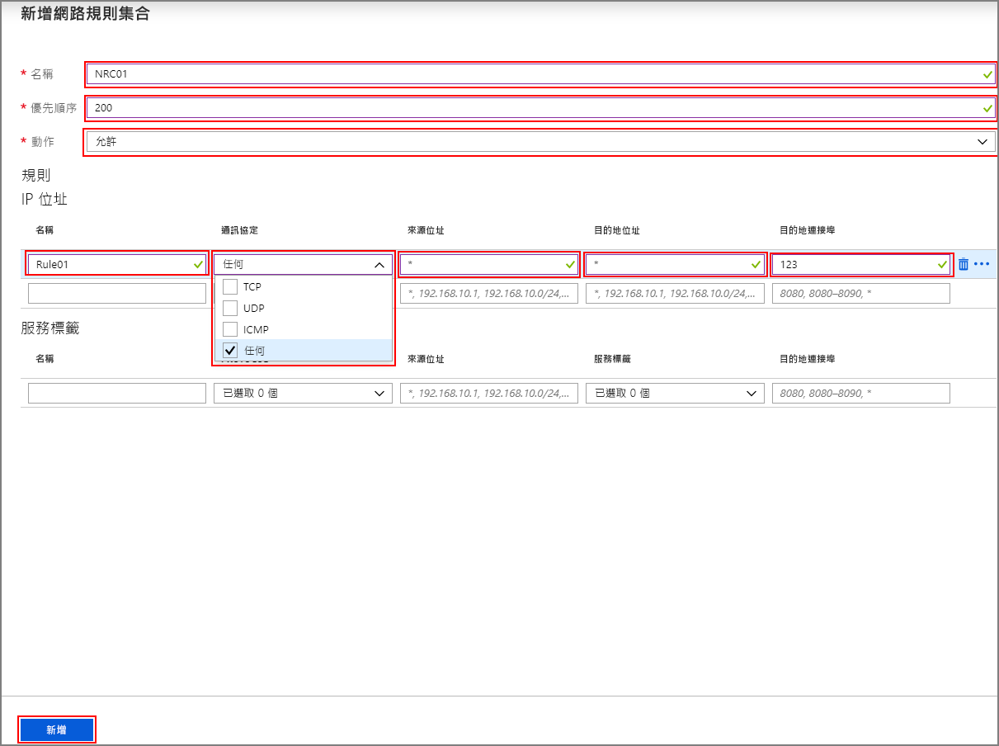

# <a name="configure-outbound-network-traffic-for-azure-hdinsight-clusters-using-firewall"></a>使用防火牆設定 Azure HDInsight 叢集的輸出網路流量

本文將逐步說明如何使用 Azure 防火牆保護來自 HDInsight 叢集的輸出流量。 下列步驟假設您要為現有的叢集設定 Azure 防火牆。 如果您要在防火牆後方部署新的叢集，請先建立您的 HDInsight 叢集和子網路。 接著，依照指南中的步驟進行。

## <a name="background"></a>背景

HDInsight 叢集通常會部署在虛擬網路中。 叢集在該虛擬網路外部的服務上具有相依性。

有數個需要輸入流量的相依性。 輸入的管理流量不能透過防火牆裝置傳送。 此流量的來源位址是已知的，而且會在[這裡](hdinsight-management-ip-addresses.md)發佈。 您也可以使用此資訊來建立網路安全性群組 (NSG) 規則，以保護叢集的輸入流量。

HDInsight 輸出流量相依性幾乎完全是以 FQDN 進行定義。 其後面沒有靜態 IP 位址。 缺少靜態位址表示網路安全性群組 (NSG) 無法鎖定來自叢集的輸出流量。 這些位址經常變更，使得無法根據目前的名稱解析和用法來設定規則。

使用防火牆來保護輸出位址，以根據網域名稱來控制輸出流量。 Azure 防火牆會根據目的地的 FQDN 或 [FQDN 標記](../firewall/fqdn-tags.md)來限制輸出流量。

## <a name="configuring-azure-firewall-with-hdinsight"></a>使用 HDInsight 設定 Azure 防火牆

使用 Azure 防火牆來鎖定現有 HDInsight 輸出流量的彙總步驟如下：

1. 建立子網路。
1. 建立防火牆。
1. 將應用程式規則新增至防火牆
1. 將網路規則新增至防火牆。
1. 建立路由表。

### <a name="create-new-subnet"></a>建立新的子網路

在您叢集所在的虛擬網路中建立名為 **AzureFirewallSubnet** 的子網路。

### <a name="create-a-new-firewall-for-your-cluster"></a>為叢集建立新的防火牆

使用＜**部署防火牆**＞中的步驟，建立名為 **Test-FW01** 的防火牆，請見[教學課程：使用 Azure 入口網站部署和設定 Azure 防火牆](../firewall/tutorial-firewall-deploy-portal.md#deploy-the-firewall)。

### <a name="configure-the-firewall-with-application-rules"></a>使用應用程式規則設定防火牆

建立應用程式規則集合，讓叢集能夠傳送和接收重要通訊。

1. 從 Azure 入口網站選取新的防火牆 **TEST-FW01**。

1. 瀏覽至 [設定] > [規則] > [應用程式規則集合] > [+ 新增應用程式規則集合]。

    

1. 在 [新增應用程式規則集合] 畫面上，提供下列資訊：

    **上方區段**

    | 屬性|  值|
    |---|---|
    |名稱| FwAppRule|
    |優先順序|200|
    |動作|Allow|

    **FQDN 標記區段**

    | 名稱 | 來源位址 | FQDN 標籤 | 注意 |
    | --- | --- | --- | --- |
    | Rule_1 | * | WindowsUpdate 和 HDInsight | HDI 服務的必要項目 |

    **目標 FQDN 區段**

    | 名稱 | 來源位址 | `Protocol:Port` | 目標 FQDN | 注意 |
    | --- | --- | --- | --- | --- |
    | Rule_2 | * | https:443 | login.windows.net | 允許 Windows 登入活動 |
    | Rule_3 | * | https:443 | login.microsoftonline.com | 允許 Windows 登入活動 |
    | Rule_4 | * | https:443,http:80 | storage_account_name.blob.core.windows.net | 以您實際的儲存體帳戶名稱取代 `storage_account_name`。 如果您的叢集是由 WASB 支援，請為 WASB 新增規則。 若只要使用 https 連線，請務必在儲存體帳戶上啟用 [[需要安全傳輸]](../storage/common/storage-require-secure-transfer.md)。 |

   

1. 選取 [新增]。

### <a name="configure-the-firewall-with-network-rules"></a>使用網路規則設定防火牆

建立網路規則，以正確設定您的 HDInsight 叢集。

1. 繼續進行先前的步驟，瀏覽至 [網路規則集合] > [+ 新增網路規則集合]。

1. 在 [新增網路規則集合] 畫面上，提供下列資訊：

    **上方區段**

    | 屬性|  值|
    |---|---|
    |名稱| FwNetRule|
    |優先順序|200|
    |動作|Allow|

    **IP 位址區段**

    | 名稱 | 通訊協定 | 來源位址 | 目的地位址 | 目的地連接埠 | 注意 |
    | --- | --- | --- | --- | --- | --- |
    | Rule_1 | UDP | * | * | 123 | 時間服務 |
    | Rule_2 | 任意 | * | DC_IP_Address_1、DC_IP_Address_2 | * | 如果您使用企業安全性套件 (ESP)，請在 [IP 位址] 區段中新增網路規則，以允許 ESP 叢集與 AAD-DS 通訊。 您可以在入口網站的 [AAD-DS] 區段中找到網域控制站的 IP 位址 |
    | Rule_3 | TCP | * | Data Lake Storage 帳戶的 IP 位址 | * | 如果您使用 Azure Data Lake Storage，則可以在 [IP 位址] 區段中新增網路規則，以解決 ADLS Gen1 和 Gen2 的 SNI 問題。 此選項會將流量路由至防火牆。 這可能會產生較高的大量資料載入成本，但流量會記錄下來，並且可以在防火牆記錄中進行稽核。 判斷 Data Lake Storage 帳戶的 IP 位址。 您可以使用 PowerShell 命令 (例如 `[System.Net.DNS]::GetHostAddresses("STORAGEACCOUNTNAME.blob.core.windows.net")`)，將 FQDN 解析為 IP 位址。|
    | Rule_4 | TCP | * | * | 12000 | (選擇性) 如果您使用的是 Log Analytics，請在 [IP 位址] 區段中建立網路規則，以允許與 Log Analytics 工作區進行通訊。 |

    **服務標記區段**

    | 名稱 | 通訊協定 | 來源位址 | 服務標記 | 目的地連接埠 | 注意 |
    | --- | --- | --- | --- | --- | --- |
    | Rule_7 | TCP | * | SQL | 1433 | 在 SQL 的 [服務標記] 區段中設定網路規則，讓您可以記錄和稽核 SQL 流量。 除非您已在 HDInsight 子網路上設定 SQL Server 的服務端點 (這麼做將會略過防火牆)。 |
    | Rule_8 | TCP | * | Azure 監視器 | * | (選擇性) 計畫使用「自動調整」功能的客戶應新增此規則。 |
    
   

1. 選取 [新增]。

### <a name="create-and-configure-a-route-table"></a>建立及設定路由資料表

建立包含下列項目的路由表：

* [健康情況和管理服務：所有區域](../hdinsight/hdinsight-management-ip-addresses.md#health-and-management-services-all-regions)中的所有 IP 位址，並以**網際網路**作為下一個躍點類型。

* 叢集建立所在區域的兩個 IP 位址 (如[健康情況和管理服務：特定區域](../hdinsight/hdinsight-management-ip-addresses.md#health-and-management-services-specific-regions)) 中所述，並以**網際網路**作為下一個躍點類型。

* IP 位址 0.0.0.0/0 的其中一個虛擬設備路由，並且以 Azure 防火牆私人IP 位址作為下一個躍點。

例如，如果叢集建立在美國的「美國東部」區域中，請使用使用下列步驟來為該叢集設定路由表：

1. 選取您的 Azure 防火牆 **Test-FW01**。 複製 [概觀] 頁面上所列的**私人 IP 位址**。 在此範例中，我們將使用**範例位址 10.0.2.4**。

1. 然後瀏覽至 [所有服務] > [網路] > [路由表] 和 [建立路由表]。

1. 從新的路由中，瀏覽至 [設定] > [路由] > [+ 新增]。 新增下列路由：

| 路由名稱 | 位址首碼 | 下一個躍點類型 | 下一個躍點位址 |
|---|---|---|---|
| 168.61.49.99 | 168.61.49.99/32 | Internet | NA |
| 23.99.5.239 | 23.99.5.239/32 | Internet | NA |
| 168.61.48.131 | 168.61.48.131/32 | Internet | NA |
| 138.91.141.162 | 138.91.141.162/32 | Internet | NA |
| 13.82.225.233 | 13.82.225.233/32 | Internet | NA |
| 40.71.175.99 | 40.71.175.99/32 | Internet | NA |
| 0.0.0.0 | 0.0.0.0/0 | 虛擬設備 | 10.0.2.4 |

完成路由表設定：

1. 在 [設定] 底下選取 [子網路]，將您建立的路由表指派給您的 HDInsight 子網路。

1. 選取 [+ 關聯]。

1. 在 [關聯子網路] 畫面上，選取其中已建立您叢集的虛擬網路。 以及用於 HDInsight 叢集的**子網路**。

1. 選取 [確定]。

## <a name="edge-node-or-custom-application-traffic"></a>邊緣節點或自訂應用程式流量

上述步驟可讓叢集在沒有問題的情況下運作。 但您仍然需要設定相依性，以配合邊緣節點上執行的自訂應用程式 (如果有的話)。

應用程式相依性必須能加以識別並新增至 Azure 防火牆或路由表。

必須為應用程式流量建立路由，以避免非對稱式路由問題。

如果您的應用程式有其他相依性，這些相依性必須新增至您的 Azure 防火牆。 建立應用程式規則來允許 HTTP/HTTPS 流量，以及建立網路規則來允許其他一切流量。

## <a name="logging-and-scale"></a>記錄與級別

Azure 防火牆可以將記錄傳送到幾個不同的儲存系統。 如需為防火牆設定記錄的指示，請遵循[教學課程：監視 Azure 防火牆記錄和計量](../firewall/tutorial-diagnostics.md)。

完成記錄設定後，如果您正在使用 Log Analytics，您可以使用下列查詢來檢視已封鎖的流量：

```Kusto
AzureDiagnostics | where msg_s contains "Deny" | where TimeGenerated >= ago(1h)
```

第一次執行應用程式時，將 Azure 防火牆與 Azure 監視器記錄整合將會十分實用。 特別是當您不知道所有應用程式相依性時。 您可以從[分析 Azure 監視器中的記錄資料](../azure-monitor/log-query/log-query-overview.md)深入了解 Azure 監視器記錄

若要深入了解 Azure 防火牆和要求增加的級別限制，請參閱[此文件](../azure-resource-manager/management/azure-subscription-service-limits.md#azure-firewall-limits)，或參閱[常見問題集](../firewall/firewall-faq.md)。

## <a name="access-to-the-cluster"></a>存取叢集

成功設定防火牆之後，您可以使用內部端點 (`https://CLUSTERNAME-int.azurehdinsight.net`) 從虛擬網路內部存取 Ambari。

若要使用公用端點 (`https://CLUSTERNAME.azurehdinsight.net`) 或 ssh 端點 (`CLUSTERNAME-ssh.azurehdinsight.net`)，請確定路由表中的路由正確並具有 NSG 規則，以避免[此處](../firewall/integrate-lb.md)所述的非對稱式路由問題。 具體而言，在此情況下，您必須允許輸入 NSG 規則中的用戶端 IP 位址，並將其新增至下一個躍點設定為 `internet` 的使用者定義路由表。 如果路由未正確設定，您會看到逾時錯誤。

## <a name="next-steps"></a>後續步驟

* [Azure HDInsight 虛擬網路架構](hdinsight-virtual-network-architecture.md)
* [設定網路虛擬設備](./network-virtual-appliance.md)
