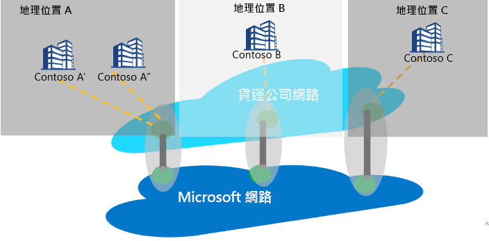

# 網際網路對等互連與對等互連服務

網際網路對等互連指的是 Microsoft 的全球網路 (AS8075) 與電訊廠商或服務提供者網路之間的任何相互連線。 服務提供者可以藉由實作以下所述的對等互連服務合作關係需求，透過從客戶到 Microsoft 網路的最佳路由，提供可靠且高效能的公用連線，而成為對等互連服務合作夥伴。

## 關於對等互連服務
對等互連服務是一項與重要服務提供者合作的方案，可為其企業使用者提供最佳的公用網際網路連線能力。 屬於此方案的合作夥伴將擁有直接、高可用性、異地備援的連線，以及對 Microsoft 的最佳路由。 對等互連服務是 Microsoft 連線能力組合的補強服務：
*   ExpressRoute 可用於對 IaaS 或 PaaS 資源的私人連線 (支援私人 IP 空間)
    *   以合作夥伴為基礎的連線能力
    *   對 Microsoft 的直接連線能力 (100G)
*   可透過網際網路的 IPSEC 可對雲端進行 VPN 連線
*   可透過虛擬 WAN 對 Azure 進行 SD-WAN 連線

對等互連服務的目標客層是願意在分支進行網際網路分組的 SaaS 連線、SD-WAN 客戶，以及任何擁有雙重策略 MPLS 和企業級網際網路的客戶。

連線至 Microsoft 雲端時的主要目標，應該是藉由縮短從使用者網站到 Microsoft 全球網路的來回時間 (RTT)，將延遲降到最低；Microsoft 全球網路是 Microsoft 的公用網路骨幹，可將所有 Microsoft 資料中心和多個雲端應用程式進入點連結在一起。 請參閱[在 Office 365 中取得最佳連線能力和效能](https://techcommunity.microsoft.com/t5/Office-365-Blog/Getting-the-best-connectivity-and-performance-in-Office-365/ba-p/124694)。

> [!div class="mx-imgBorder"]
> 

在上圖中，跨國企業的每個分公司都會透過合作夥伴的網路，盡可能連線至最接近的 Microsoft Edge 位置。

**對等互連服務的客戶權益：**
* 可透過網際網路以最佳公用路由連接 Microsoft 雲端服務，獲得最理想的效能和可靠性。
* 能夠選取慣用的 SP 連線至 Microsoft 雲端。
* 流量深入解析，例如延遲報告和首碼監視。
* Microsoft 雲端的最佳網路躍點 (AS 躍點)。
* 路由分析和統計資料 - 邊界閘道協定 ([BGP](https://en.wikipedia.org/wiki/Border_Gateway_Protocol)) 路由異常 (流失/劫持偵測) 和次佳路由的事件。

## 對等互連服務的合作關係需求
* 以最接近客戶的位置連線至 Microsoft 雲端。 合作夥伴服務提供者會將使用者流量路由至最接近使用者的 Microsoft Edge。 同樣地，將流量傳送給使用者時，Microsoft 會 (使用 BGP 標籤) 將流量路由至最接近使用者的邊緣位置，而 SP 會將流量傳遞給使用者。
* 合作夥伴與 Microsoft 全球網路之間將保有高可用性、高輸送量和異地備援的連線能力。
* 合作夥伴只要符合需求，即可使用其現有的對等互連來支援對等服務

## 常見問題集
如需常見問題集，請參閱[對等互連服務 - 常見問題集](service-faqs.md)。

## 後續步驟

* 深入了解[對等互連服務](https://docs.microsoft.com/azure/peering-service/)的客戶權益。
* 透過[對等互連服務夥伴逐步解說](walkthrough-peering-service-all.md)，深入了解為直接對等互連啟用對等互連服務的步驟。
