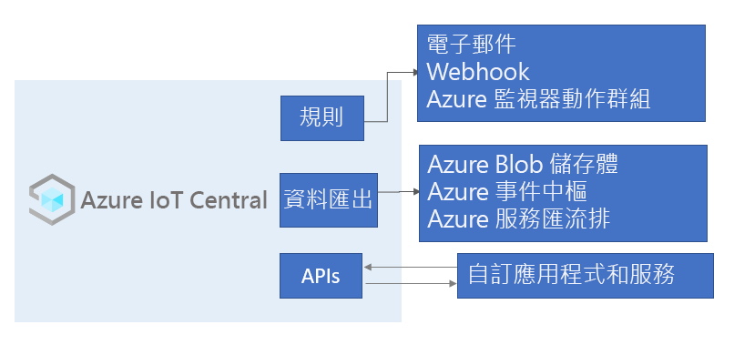

# 何謂 Azure IoT 中心？

IoT Central 是一個 IoT 應用程式平台，可降低開發、管理及維護企業級 IoT 解決方案的負擔和成本。 選擇使用 IoT Central 進行建置，可讓您有機會將時間、金錢和心力專注在 IoT 資料的企業轉型上，而不只是維護和更新複雜且不斷演進的 IoT 基礎結構。

Web UI 可讓您監視裝置狀況、建立規則，以及在數百萬個裝置的整個生命週期中管理裝置及其資料。 此外，它可讓您將 IoT 智慧擴充至企業營運應用程式，以根據裝置的深入解析採取行動。

本文針對 IoT Central 提供下列概述：

- 與專案相關聯的典型角色。
- 如何建立您的應用程式。
- 如何將裝置連線到您的應用程式。
- 如何管理您的應用程式。
- IoT Central 中的 Azure IoT Edge 功能。
- 如何將採用 Azure IoT Edge 執行階段的裝置連線至您的應用程式。

## 已知問題

- 連續資料匯出不支援 Avro 格式 (不相容)。
- 目前不支援 GeoJSON。
- 目前不支援地圖底圖。
- 作業不支援複雜類型。
- 不支援陣列結構描述類型。
- 僅支援 C 裝置 SDK 和 Node.js 裝置與服務 SDK。
- IoT Central 目前適用於美國、歐洲、亞太地區、澳大利亞、英國及日本地區。
- 您無法在英國和日本地區中使用**自訂應用程式 (舊版)** 的應用程式範本。
- 裝置功能模型必須具有在相同檔案中以內嵌方式定義的所有介面。
- [IoT 隨插即用](../../iot-pnp/overview-iot-plug-and-play.md) 為預覽版本，僅在數個區域中支援。

## 角色

IoT Central 文件提及四個會與 IoT Central 應用程式互動的角色：

- 「解決方案建置者」  負責定義連線至應用程式的裝置類型，以及為操作員自訂應用程式。
- 「操作員」  管理已連線到應用程式的裝置。
- 「管理員」  負責進行管理工作，例如管理應用程式內的[使用者角色和權限](howto-administer.md)。
- 「裝置開發人員」  會為連線到您應用程式的裝置或 IoT Edge 模組，建立可在其中執行的程式碼。

## 建立您的 IoT Central 應用程式

解決方案建置者可使用 IoT Central，為組織建立自訂、雲端裝載的 IoT 解決方案。 自訂 IoT 解決方案通常包括：

- 雲端式應用程式，可接收來您的裝置的遙測，並可讓您管理這些裝置。
- 多個裝置，這些裝置會執行已連線到雲端式應用程式的自訂程式碼。

您可以快速部署新的 IoT Central 應用程式，然後在瀏覽器中自訂它來滿足您的特定需求。 您可以從一般的「應用程式範本」  開始，或使用其中一個專注於特定業界、適用於[零售](../retail/overview-iot-central-retail-pnp.md)、[能源](../energy/overview-iot-central-energy.md)、[政府](../government/overview-iot-central-government.md)或[醫療保健](../healthcare/overview-iot-central-healthcare.md)的應用程式範本來開始。

身為解決方案建置者，您會使用 Web 型工具，為連線到您應用程式的裝置建立「裝置範本」  。 裝置範本是定義某種裝置之特性和行為的藍圖，例如：

- 它所傳送的遙測。
- 操作員可以修改的業務屬性。
- 由裝置設定而且在應用程式中唯讀的裝置屬性。
- 屬性由操作員所設定，會決定裝置的行為。

此裝置範本包含：

- 一個_裝置功能模型_，說明裝置所應實作的功能，例如它所傳送的遙測資料和它所報告的屬性。
- 未儲存在裝置上的雲端屬性。
- 屬於 IoT Central 應用程式一部分的自訂、儀表板和表單。

### 定價

您可以使用 7 天免費試用版或標準版定價方案來建立 IoT Central 應用程式。

- 使用「免費」  方案建立的應用程式可以免費試用七天，且最多可支援五個裝置。 您可以在到期前，隨時將其轉換為使用標準定價方案。
- 您使用「標準」  方案建立的應用程式會根據每個裝置來計費，您可以選擇**標準 1** 或**標準 2** 定價方案，而且前兩個裝置免費。 若要深入了解免費和標準定價方案，請參閱 [Azure IoT Central 定價頁面](https://azure.microsoft.com/pricing/details/iot-central/)。

### 建立裝置範本

[IoT 隨插即用 (預覽)](../../iot-pnp/overview-iot-plug-and-play.md) 可讓 IoT Central 整合裝置，您不需要撰寫任何內嵌的裝置程式碼。 IoT 隨插即用 (預覽) 的核心是說明裝置功能的裝置功能模型結構描述。 在 IoT Central 應用程式中，裝置範本會使用這些 IoT 隨插即用 (預覽) 裝置功能模型。

身為解決方案建置者，您可以利用數個選項來建立裝置範本：

- 從 [Azure IoT 認證裝置目錄](https://aka.ms/iotdevcat)匯入裝置功能模型，然後新增您的 IoT Central 應用程式所需的任何雲端屬性、自訂和儀表板。
- 在 IoT Central 中設計裝置範本，然後在您的裝置程式碼中實作其裝置功能模型。
- 使用 Visual Studio 程式碼建立裝置功能模型，然後將模型發佈至存放庫。 從模型實作您的裝置程式碼，並將您的裝置連線至 IoT Central 應用程式。 IoT Central 會從存放庫中尋找裝置功能模型，並為您建立簡單的裝置範本。
- 使用 Visual Studio Code 建立裝置功能模型。 從模型實作您的裝置程式碼。 手動將裝置功能模型匯入您的 IoT Central 應用程式中，然後新增您的 IoT Central 應用程式所需的任何雲端屬性、自訂和儀表板。

身為解決方案建置者，您可以使用 IoT Central 來產生測試裝置的程式碼，以驗證您的裝置範本。

### 自訂 UI

解決方案建置者也可以為負責應用程式日常使用的操作員，自訂 IoT Central 應用程式 UI。 解決方案建置者可以進行的自訂包括：

- 在裝置範本上定義屬性和設定的版面配置。
- 設定自訂儀表板，協助操作員更快發現見解及解決問題。
- 設定自訂分析，以探索來自已連線裝置的時間序列資料。

## 定價

您可以使用 7 天免費試用版或標準版定價方案來建立 IoT Central 應用程式。

- 使用「免費」  方案建立的應用程式可以免費試用七天，且最多可支援五個裝置。 您可以在到期前，隨時將其轉換為使用標準定價方案。
- 您使用「標準」  方案建立的應用程式會根據每個裝置來計費，您可以選擇**標準 1** 或**標準 2** 定價方案，而且前兩個裝置免費。 深入了解 [IoT Central 價格](https://aka.ms/iotcentral-pricing)。

## 連線您的裝置

Azure IoT Central 會使用 [Azure IoT 中樞裝置佈建服務 (DPS)](../../iot-dps/about-iot-dps.md) 來管理所有的裝置註冊和連線。

使用 DPS 可實現如下效果：

- 讓 IoT Central 支援大規模的裝置上線和連線。
- 讓您產生裝置認證並在離線狀態下設定裝置，而不需要透過 IoT Central UI 來註冊裝置。
- 讓裝置使用共用存取簽章來連線。
- 讓裝置使用業界標準的 X.509 憑證來連線。
- 讓您使用自己的裝置識別碼在 IoT Central 中註冊裝置。 使用自己的裝置識別碼可簡化與現有後台系統的整合。
- 讓您以單一且一致的方式將裝置連線到 IoT Central。

若要深入了解，請參閱[連線至 Azure IoT Central](./concepts-get-connected.md)。

### Azure IoT Edge 裝置

如同使用 [Azure IoT SDK](https://github.com/Azure/azure-iot-sdks) 建立的裝置，您也可以將 [Azure IoT Edge 裝置](../../iot-edge/about-iot-edge.md)連線到 IoT Central 應用程式。 Azure IoT Edge 可讓您直接在 IoT Central 所管理的 IoT 裝置上執行雲端智慧和自訂邏輯。 IoT Edge 執行階段可讓您：

- 在裝置上安裝和更新工作負載。
- 在裝置上維護 Azure IoT Edge 安全性標準。
- 確定 IoT Edge 模組始終在執行。
- 將模組健康情況報告至雲端，以便進行遠端監控。
- 管理下游分葉裝置與 IoT Edge 裝置之間、IoT Edge 裝置上的模組之間，以及 IoT Edge 裝置與雲端之間的通訊。

如需詳細資訊，請參閱 [Azure IoT Edge 裝置和 IoT Central](concepts-architecture.md#azure-iot-edge-devices)。

## 保持連線

IoT Central 應用程式完全由 Microsoft 裝載，可降低管理您的應用程式的系統管理負荷。

操作員可以使用 IoT Central 應用程式來管理您 IoT Central 解決方案中的裝置。 操作員會執行下列工作：

- 監視已連線到應用程式的裝置。
- 針對裝置問題進行移難排解並修復。
- 佈建新裝置。

身為解決方案建置者，您可以定義對來自所連線裝置之資料串流操作的自訂規則和動作。 操作員可以在裝置層級啟用或停用這些規則，以控制和自動執行應用程式內的工作。

管理員可以利用[使用者角色和權限](howto-administer.md)，管理對您應用程式的存取。

在使用專為大規模運作而設計的 IoT 解決方案時，結構化的裝置管理方法便顯得重要。 只是將裝置連線至雲端並不夠，您還必須讓裝置能夠保持連線且狀況良好。 操作員可以使用下列 IoT Central 功能，在整個應用程式生命週期中管理裝置：

### 儀表板 

內建[儀表板](./howto-set-up-template.md#generate-default-views)提供了可自訂的 UI 供您監視裝置的健康情況和遙測。 從[應用程式範本](howto-use-app-templates.md)中預先建置的儀表板來開始，或建立自己的儀表板以專門因應操作員的需要。 您可以與應用程式中的所有使用者共用儀表板，或讓儀表板保持私用狀態。

### 執行和動作 

根據裝置狀態和遙測來建立[自訂規則](tutorial-create-telemetry-rules.md)，以識別需要注意的裝置。 設定動作以通知適當人員，並確保能及時採取更正措施。

### 工作 

[作業](howto-run-a-job.md)可讓您藉由設定屬性或呼叫命令，將單一或大量更新套用至裝置。 

### 使用者角色和權限

[角色和權限](howto-manage-users-roles.md)可讓系統管理員為每位使用者量身打造使用體驗。 系統管理員會使用 Web UI 來建立角色並指派權限。

## 轉換 IoT 資料

作為應用程式平台，IoT Central 可讓您將 IoT 資料轉換成商業見解，以推動可行的結果。 [規則](./tutorial-create-telemetry-rules.md)、[資料匯出](./howto-export-data.md)及[公用 REST API](https://docs.microsoft.com/learn/modules/manage-iot-central-apps-with-rest-api/) 均是如何整合 IoT Central 與企業營運應用程式的範例：

### 使用規則來監視裝置的健康情況和作業

當裝置連線並傳送資料時，規則可以識別遇到問題或傳送錯誤訊息的裝置，以便您在最短的停機時間內加以修正。 IoT Central 應用程式中的建置規則可監視裝置傳來的遙測，並在計量超過閾值或裝置傳送特定訊息時對操作員發出警示。 規則的電子郵件動作和 Webhook 會通知適當人員和適當的下游系統。

### 對匯出的資料執行自訂分析和處理

您可以建置自訂分析管線來處理裝置的遙測並儲存結果，藉此來產生商業見解，例如判斷機器效率趨勢或預測工廠未來會使用多少能源。 在 IoT Central 應用程式中設定資料匯出，將遙測、裝置屬性變更和裝置範本變更匯出至其他服務，以供您使用慣用工具來分析、儲存及以視覺方式呈現資料。

### 使用 REST API 建置自訂的 IoT 解決方案和整合

建置如下的 IoT 解決方案：

- 可遠端設定和控制裝置的行動附屬應用程式。
- 可讓現有企業營運應用程式與 IoT 裝置和資料互動的自訂整合。
- 可用於裝置模型化、上線、管理和資料存取的裝置管理應用程式。

## 配額

每個 Azure 訂用帳戶都有預設配額，而此配額會對 IoT 解決方案的範圍造成影響。 目前，IoT Central 會將您可在訂用帳戶中部署的應用程式數目限制為 10 個。 如果您需要提高此限制，請連絡 [Microsoft 支援服務](https://azure.microsoft.com/support/options/)。

## 後續步驟

既然您已大致了解 IoT Central，以下是建議的後續步驟：

- 了解可用於[建立 IoT 解決方案的 Azure 技術和服務](../../iot-fundamentals/iot-services-and-technologies.md)。
- 熟悉 [Azure IoT 中心 UI](overview-iot-central-tour.md)。
- 從[建立 Azure IoT 中心應用程式](quick-deploy-iot-central.md)著手。
- 深入了解 [IoT 隨插即用 (預覽)](../../iot-pnp/overview-iot-plug-and-play.md)。
- 了解如何[讓 Azure IoT Edge 裝置連線](./tutorial-add-edge-as-leaf-device.md)。
- 深入了解 [Azure IoT 技術和服務](../../iot-fundamentals/iot-services-and-technologies.md)。
