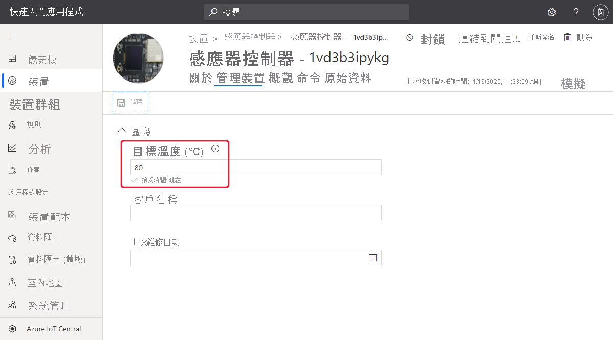

# 快速入門：使用 Azure IoT Central 監視您的裝置

*本文適用於操作員、建置員及系統管理員。*

本快速入門將為操作員說明如何使用 Microsoft Azure IoT Central 應用程式監視您的裝置和變更設定。

## Prerequisites

開始之前，請先完成[建立 Azure IoT Central 應用程式](./quick-deploy-iot-central.md)、[將模擬裝置新增至 IoT Central 應用程式](./quick-create-simulated-device.md)和[為您的裝置設定規則和動作](quick-configure-rules.md)這三個先前的快速入門。

## 接收通知

Azure IoT Central 會以電子郵件訊息傳送關於裝置的通知。 建置者已新增會在連線的裝置感應器溫度超出閾值時傳送通知的規則。 請查看傳送至建置者選擇要接收通知之帳戶的電子郵件。

開啟您在[為您的裝置設定規則和動作](quick-configure-rules.md)快速入門結束時收到的電子郵件訊息。 在電子郵件中，選取裝置的連結：

您在先前快速入門中所建立模擬裝置的 [概觀]  檢視，會在您的瀏覽器中開啟：

## 調查問題

身為操作員，您可以在 [概觀]  、[關於]  和 [命令]  檢視上檢視裝置的相關資訊。 建置者建立了 [管理裝置]  檢視，可供您編輯裝置資訊及設定裝置屬性。

儀表板上的圖表會顯示裝置溫度的繪圖。 您判定裝置溫度過高。

## 補救問題

若要對裝置進行變更，請使用 [管理裝置]  頁面。

將 [風扇速度]  變更為500，以冷卻裝置。 選擇 [儲存]  以更新裝置。 在裝置確認設定變更後，屬性的狀態會變更為 [已同步]  ：

## 後續步驟

在此快速入門中，您已了解如何：

* 接收通知
* 調查問題
* 補救問題

現在您已了解如何監視您的裝置，建議的下一個步驟是：

> [!div class="nextstepaction"]
> [建置和管理裝置範本](howto-set-up-template.md)。
