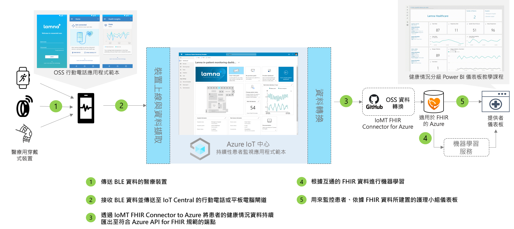

# 持續性患者監視架構

您可以使用隨附的應用程式範本，並以下列架構作為指導方針，來建立持續性患者監視解決方案。

>[!div class="mx-imgBorder"] 
>

1. 醫療裝置使用藍牙低功耗 (BLE) 進行通訊
1. 行動電話閘道接收 BLE 資料並傳送至 IoT Central
1. 將患者的健康情況資料持續匯出至 Azure API for FHIR&reg;
1. 根據互通的資料進行機器學習
1. 依據 FHIR 資料建置護理小組儀表板

## 詳細資料
本節將進一步詳述架構圖表的各個部分。

### BLE 醫療裝置
醫療保健 IoT 空間中使用的許多醫療穿戴式裝置都是藍牙低功耗裝置。 其無法直接與雲端通訊，而必須通過閘道來進行。 在此架構中，建議使用行動電話應用程式作為此閘道。 

### 行動電話閘道
行動電話應用程式的主要功能是從醫療裝置擷取 BLE 資料，並將其傳輸至 Azure IoT Central。 此外，應用程式可引導患者完成裝置設定和佈建流程，並協助他們查看其個人健康情況資料的檢視。 在醫院的病房內，其他解決方案可能會使用平板電腦閘道或靜態閘道來執行相同的通訊流程。 我們建立了適用於 Android 和 iOS 的開放原始碼範例行動應用程式，您可以將其當作起點，開始進行應用程式開發工作。 如需有關 IoT Central 持續性患者監視行動應用程式範例的詳細資訊，請參閱 [Azure 範例](https://docs.microsoft.com/samples/iot-for-all/iotc-cpm-sample/iotc-cpm-sample/) \(英文\)。

### 匯出至 Azure API for FHIR&reg;
Azure IoT Central 符合 HIPAA 規範，且已通過 HITRUST&reg; 認證，但您也可以將患者的健康情況相關資料傳送至 Azure API for FHIR。 [Azure API for FHIR](../../healthcare-apis/overview.md) 專為處理臨床健康情況資料而設計，是完全受控且符合規範的標準 API，可讓您建立新的健康情況資料處理系統。 它可讓您透過 FHIR API 快速交換資料，且在雲端中受到受控平台即服務 (PaaS) 供應項目的支援。 您可以使用 IoT Central 的 [連續資料匯出] 功能，透過[適用於 FHIR 的 Azure IoT 連接器](https://docs.microsoft.com/azure/healthcare-apis/iot-fhir-portal-quickstart) \(英文\)，將資料傳送至 Azure API for FHIR。

### 機器學習服務
在彙總資料並將其轉譯成 FHIR 格式之後，您可以建置機器學習模型，以擴充深入解析，並協助護理小組做出更明智的決策。 有多種不同的服務都可用來建置、定型和部署機器學習模型。 如需如何使用 Azure 機器學習供應項目的詳細資訊，請參閱我們的[機器學習文件](../../machine-learning/index.yml)。

### 提供者儀表板
位於 Azure API for FHIR 中的資料可用來建置患者深入解析儀表板，也可以直接整合到 EMR 中，以協助小組將患者的健康狀態視覺化。 護理小組可使用此儀表板來照顧需要協助的患者，並在病情惡化前及早發現警告徵兆。 若要了解如何建置 Power BI 即時提供者儀表板，請遵循我們的[操作說明指南](howto-health-data-triage.md)。

## 後續步驟
* [了解如何部署持續性患者監視應用程式範本](tutorial-continuous-patient-monitoring.md)