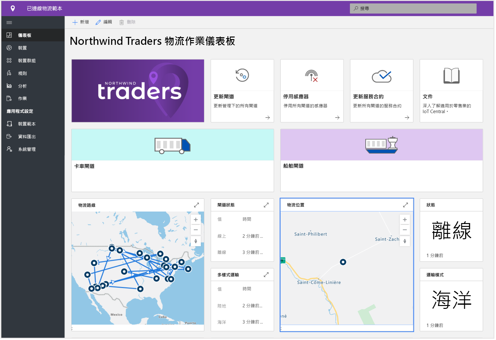
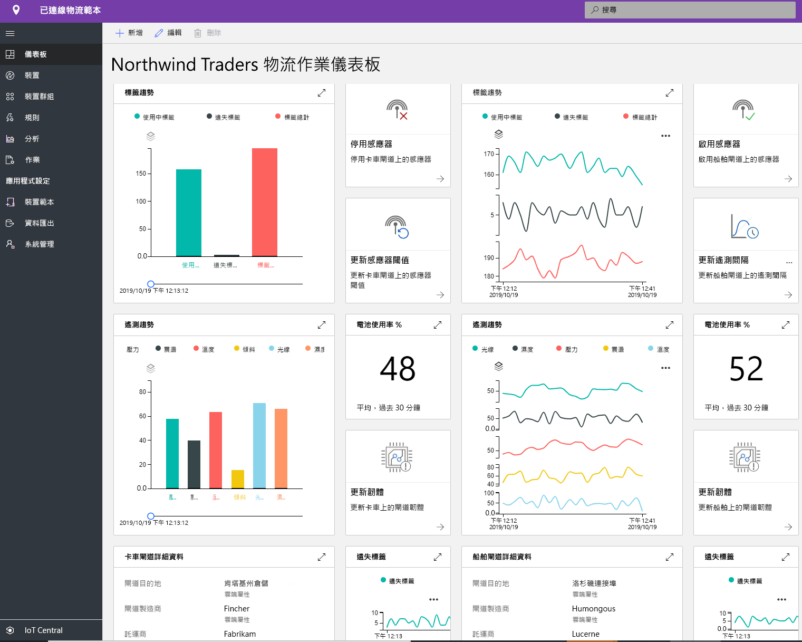

# 使用 Azure IoT Central 建置零售解決方案

Azure IoT Central 是一個 IoT 應用程式平台，可降低與開發、管理及維護企業級 IoT 解決方案相關的負擔和成本。 選擇使用 Azure IoT Central 進行建置，可讓您有機會將時間、金錢和心力專注在 IoT 資料的企業轉型上，而不只是維護和更新複雜且不斷演進的 IoT 基礎結構。

本文將說明幾個零售專用的 IoT Central 應用程式範本。 身為解決方案建置者，您可以使用這些範本來建立 IoT 解決方案，以將供應鏈最佳化、改善客戶的店內體驗，以及更有效地追蹤庫存。

> [!div class="mx-imgBorder"]
> 

以下各節將說明這些應用程式範本的功能：

## 連線物流

預計到了 2020 年，全球物流支出將達到 10.6 兆美元。 貨物運輸在這項支出中佔去了大半，且運輸服務供應商面臨龐大的競爭壓力和侷限。

您可以使用 IoT 感應器來收集和監視環境條件，例如貨物的溫度、濕度、傾斜度、衝擊力、光線和位置。 您可以將收集自 IoT 感應器和裝置的遙測資料與其他資料來源結合，例如雲端式商業智慧系統中的氣象和交通資訊。

聯網物流解決方案的優點包括：

* 透過即時追蹤和循跡進行貨物監視。 
* 能夠即時監視環境狀況的貨物完整性。
* 防範貨物遭竊、遺失或損壞。
* 地理柵欄、路線最佳化、車隊管理和車輛分析。
* 預測可預期的貨運出發和抵達時間。

下列螢幕擷取畫面顯示應用程式範本中的預設儀表板。 儀表板可進行全方位的自訂，以符合您特定的解決方案需求：

> [!div class="mx-imgBorder"]
> 

> [!div class="mx-imgBorder"]
> 

若要深入了解，請參閱 [部署並逐步執行聯網物流應用程式範本](./tutorial-iot-central-connected-logistics-pnp.md)教學課程。

## 數位配送中心

隨著製造商和零售商逐漸在全球開拓業務，其供應鏈已向外延伸，且日趨複雜。 如今，消費者希望有大量的產品可供選擇，而且這些商品能夠在購買後的一兩天內送達。 配送中心必須因應這些趨勢，同時克服現有的效率不彰狀況。 

配送中心目前過度依賴人工，其揀貨和包裝佔成本的 55-65%。 人工揀貨和包裝的速度通常比自動化系統慢，而快速波動的員工需求，也使得穩定供輸出貨量難度更形提高。 這種季節性波動會導致員工變動率升高，且發生高代價錯誤的可能性也會增加。

IoT 攝影機解決方案可以啟用數位回饋迴圈，藉此帶來轉型優勢。 從配送中心送來的資料提供了確實可行的深入解析，進而產生更有益的資料。

數位配送中心的優點包括：

* 攝影機能監視貨物透過輸送帶系統的送達和移動。
* 自動識別有問題的貨物。
* 有效追蹤訂單。
* 降低成本、提升生產力，並且將使用率最佳化。

下列螢幕擷取畫面顯示應用程式範本中的預設儀表板。 儀表板可進行全方位的自訂，以符合您特定的解決方案需求： 

> [!div class="mx-imgBorder"]
> 

若要深入了解，請參閱[部署並逐步執行數位配送中心應用程式範本](./tutorial-iot-central-digital-distribution-center-pnp.md)教學課程。

## 店內分析 - 條件監視

對許多零售商而言，商店內部的環境條件都是他們能否優於競爭對手的重要區隔。 零售商想要在其商店內保有怡人的條件，以確保其客戶的權益。  

身為解決方案建置者，您可以使用 IoT Central 的店內分析條件監視應用程式範本，來建置端對端解決方案。 應用程式範本可供您使用不同感應器裝置，以數位方式連線並監視零售商店環境。 這些感應器裝置會產生遙測資料，而您可以將其轉換成商業深入解析，以協助零售商降低營運成本，並且為其客戶創造絕佳的體驗。

使用應用程式範本可以：

* 將各種 IoT 感應器連線至 IoT Central 應用程式執行個體。
* 監視和管理環境中的感應器網路和任何閘道裝置的健康情況。
* 建立根據商店內的環境條件為商店經理觸發警示的自訂規則。
* 將商店內部環境條件轉換為可供零售商店團隊用來改善客戶體驗的深入解析。
* 將彙總的深入解析匯出至現有或全新的商務應用程式，為零售人員提供實用且及時的資訊。

應用程式範本隨附一組裝置範本，並使用一組模擬裝置來填入儀表板。 

下列螢幕擷取畫面顯示應用程式範本中的預設儀表板。 儀表板可進行全方位的自訂，以符合您特定的解決方案需求： 

> [!div class="mx-imgBorder"]
> 

若要深入了解，請參閱[在 Azure IoT Central 中建立店內分析應用程式](./tutorial-in-store-analytics-create-app-pnp.md)教學課程。

## 店內分析 - 結帳

對某些零售商而言，其商店內的結帳體驗是他們能否優於競爭對手的重要區隔。 零售商想要在其商店內提供順暢的結帳體驗，以促使客戶再次光顧。  

身為解決方案建置者，您可以使用 IoT Central 的店內分析結帳應用程式範本來建置解決方案，為零售員工提供有關於商店結帳環節的深入解析。 例如，感應器可提供與每個結帳通道的排隊長度和平均等候時間有關的資訊。

使用應用程式範本可以：

* 將各種 IoT 感應器連線至 IoT Central 應用程式執行個體。
* 監視和管理環境中的感應器網路和任何閘道裝置的健康情況。
* 建立根據商店內的結帳條件為零售人員觸發警示的自訂規則。
* 將商店內的結帳條件轉換為可供零售商店團隊用來改善客戶體驗的深入解析。
* 將彙總的深入解析匯出至現有或全新的商務應用程式，為零售人員提供實用且及時的資訊。

應用程式範本隨附一組裝置範本，並使用一組模擬裝置在儀表板中填入通道排隊人數資料。 

下列螢幕擷取畫面顯示應用程式範本中的預設儀表板。 儀表板可進行全方位的自訂，以符合您特定的解決方案需求： 

> [!div class="mx-imgBorder"]
> 

若要深入了解，請參閱[在 Azure IoT Central 中建立店內分析應用程式](./tutorial-in-store-analytics-create-app-pnp.md)教學課程。

## 智慧庫存管理

庫存是指零售商的商品存貨。 庫存管理是確保正確產品在正確時間送達正確地點的關鍵。 零售商必須權衡囤貨過多與存貨不足以符合需求之間的利弊得失。

從無線頻率識別 (RFID) 標籤、指標和相機產生的 IoT 資料，讓庫存管理程序有機會得以改善。 您可以將收集自 IoT 感應器和裝置的遙測資料與其他資料來源結合，例如雲端式商業智慧系統中的氣象和交通資訊。

智慧庫存管理的優點包括：

* 降低商品缺貨的風險，並確保能達到理想的客戶服務水準。 
* 近乎即時深入分析和了解庫存精確度。
* 利用工具決定足以因應客戶訂單的正確庫存量。

此應用程式範本著重於裝置連線能力，以及 RFID 和藍牙低功耗 (BLE) 讀取器裝置的設定和管理。

下列螢幕擷取畫面顯示應用程式範本中的預設儀表板。 儀表板可進行全方位的自訂，以符合您特定的解決方案需求：

> [!div class="mx-imgBorder"]
> 

若要深入了解，請參閱[部署和逐步執行智慧庫存管理應用程式範本](./tutorial-iot-central-smart-inventory-management-pnp.md)教學課程。

## 微型物流中心

在日益競爭的零售產業中，零售商時時刻刻都費盡心思要縮短需求和供貨之間的差距。 為了因應日益增加的消費者需求，近期形成了新趨勢，意在將庫存置於終端客戶及其所造訪的商店近端。

IoT Central 的微型物流中心應用程式範本可讓解決方案建置者全方位監視及管理其完全自動化的物流中心。 此範本包含一組模擬條件監視感應器和機器人載體，以利加速推動解決方案開發程序。 這些感應器裝置能夠擷取有意義的訊號，將這些訊號轉換為商業性的深入解析，讓零售商能夠降低營運成本，並創造令顧客滿意的體驗。

應用程式範本可讓您： 

- 將不同 IoT 感應器 (例如機器人或條件監視感應器) 緊密連線至 IoT Central 應用程式執行個體。
- 監視和管理環境中的感應器網路和任何閘道裝置的健康情況。
- 建立根據物流中心內的環境條件觸發適當警示的自訂規則。
- 將物流中心內部環境條件轉換為零售倉儲團隊可以運用的深入解析。
- 將彙總的深入解析匯出至現有或全新的商務應用程式，以提升零售人員的工作效率。

下列螢幕擷取畫面顯示應用程式範本中的預設儀表板。 儀表板可進行全方位的自訂，以符合您特定的解決方案需求：

> [!div class="mx-imgBorder"]
> 

若要深入了解，請參閱[部署並逐步執行微型物流中心應用程式範本](./tutorial-micro-fulfillment-center-pnp.md)教學課程。

## 後續步驟

若要開始建立零售解決方案：

* 開始使用[在 Azure IoT Central 中建立店內分析應用程式](./tutorial-in-store-analytics-create-app-pnp.md)教學課程，以逐步了解如何使用其中一個店內分析應用程式範本建置解決方案。
* [部署並逐步執行聯網物流應用程式範本](./tutorial-iot-central-connected-logistics-pnp.md)。
* [部署並逐步執行數位配送中心應用程式範本](./tutorial-iot-central-digital-distribution-center-pnp.md)。
* [部署並逐步執行智慧庫存管理應用程式範本](./tutorial-iot-central-smart-inventory-management-pnp.md)。
* [部署並逐步執行微型物流中心應用程式範本](./tutorial-micro-fulfillment-center-pnp.md)。
* 參閱 [IoT Central 概觀](../preview/overview-iot-central.md)以深入了解 IoT Central。
