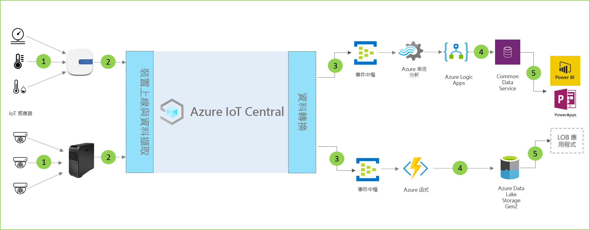

# 店內分析架構

店內分析解決方案可讓您監視零售商店環境內的各種狀況。 您可以利用 IoT Central 內的其中一個應用程式範本及下列架構作為指引，來建置這些解決方案。

- 將遙測資料傳送至閘道裝置的一組 IoT 感應器
- 將遙測資料和彙總的見解傳送至 IoT Central 的閘道裝置
- 連續資料匯出至所需的 Azure 服務以進行操作
- 資料可利用所需格式進行結構化，並傳送至儲存體服務
- 商務應用程式可以查詢資料，並產生支援零售營運的見解
 
讓我們看看經常在店內分析解決方案中扮演角色的主要元件。

## 狀況監視感應器

IoT 解決方案一開始會有一組感應器，可從零售商店環境內擷取有意義的信號。 這會透過上述架構圖最左邊的不同類型感應器來反映。

## 閘道裝置

許多 IoT 感應器都可將原始信號直接饋送到雲端或位於其附近的閘道裝置。 閘道裝置會在將摘要見解傳送到 IoT Central 應用程式之前，先在邊緣執行資料彙總。 閘道裝置也會負責將命令和控制作業轉送到感應器裝置 (如果適用)。 

## IoT Central 應用程式

Azure IoT Central 應用程式會內嵌來自零售商店環境內不同 IoT 感應器及閘道裝置的資料，並產生一組有意義的見解。

Azure IoT Central 也為店員提供量身打造的體驗，讓他們能夠從遠端監視和管理基礎結構裝置。

## 資料轉換
解決方案內的 Azure IoT Central 應用程式可設定為將原始或彙總的見解匯出至一組 Azure PaaS (平台即服務) 服務，這些服務可以執行資料操作，並且在將這些見解登陸到企業應用程式之前加以擴充。 

## 商務應用程式
IoT 資料可用來為零售環境內部署的不同類型商務應用程式提供強大的功能。 零售商店經理或員工成員可以使用這些應用程式來將商業見解視覺化，並即時採取有意義的動作。 若要了解如何為零售小組建置即時 Power BI 儀表板，請遵循此[教學課程](./tutorial-in-store-analytics-create-app-pnp.md)。

## 後續步驟
* 開始使用[店內分析簽出](https://aka.ms/checkouttemplate)和[店內分析狀況監視](https://aka.ms/conditiontemplate)應用程式範本。 
* 請參閱[端對端教學課程](https://aka.ms/storeanalytics-tutorial)，此教學課程會逐步引導您使用其中一個店內分析應用程式範本來建置解決方案。
