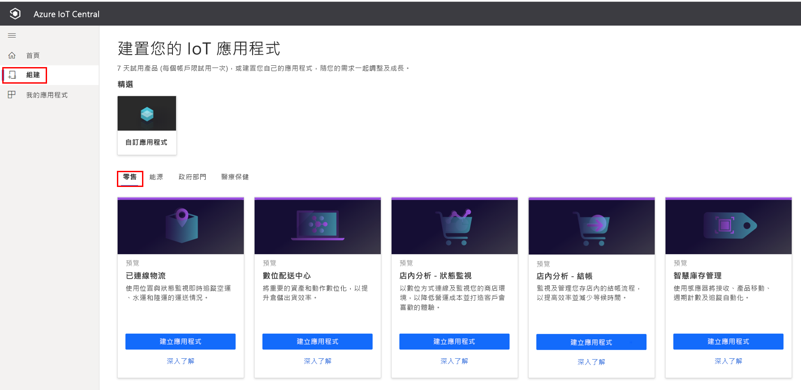
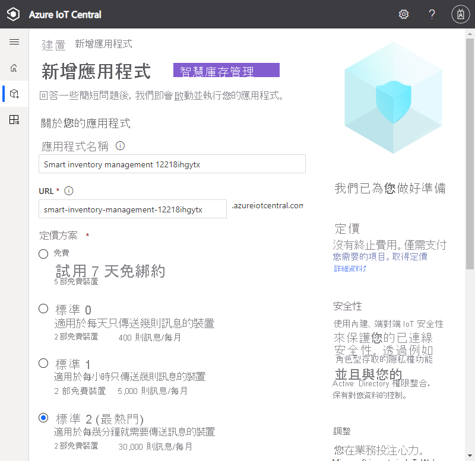
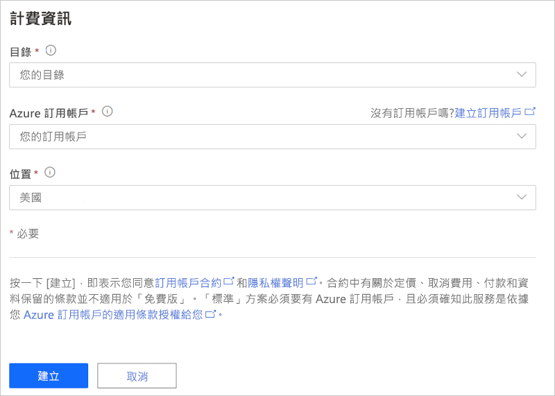
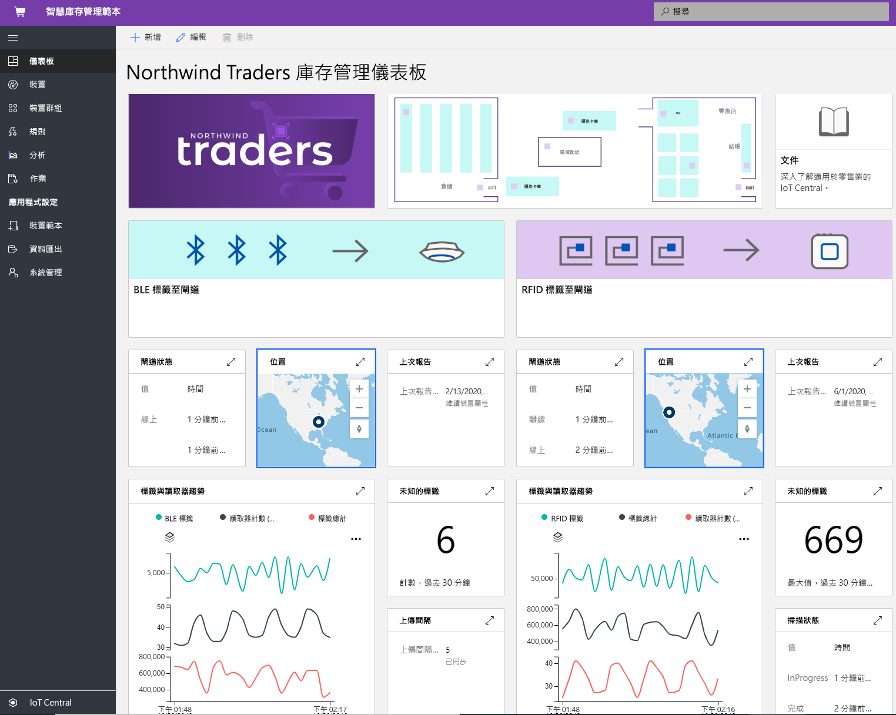
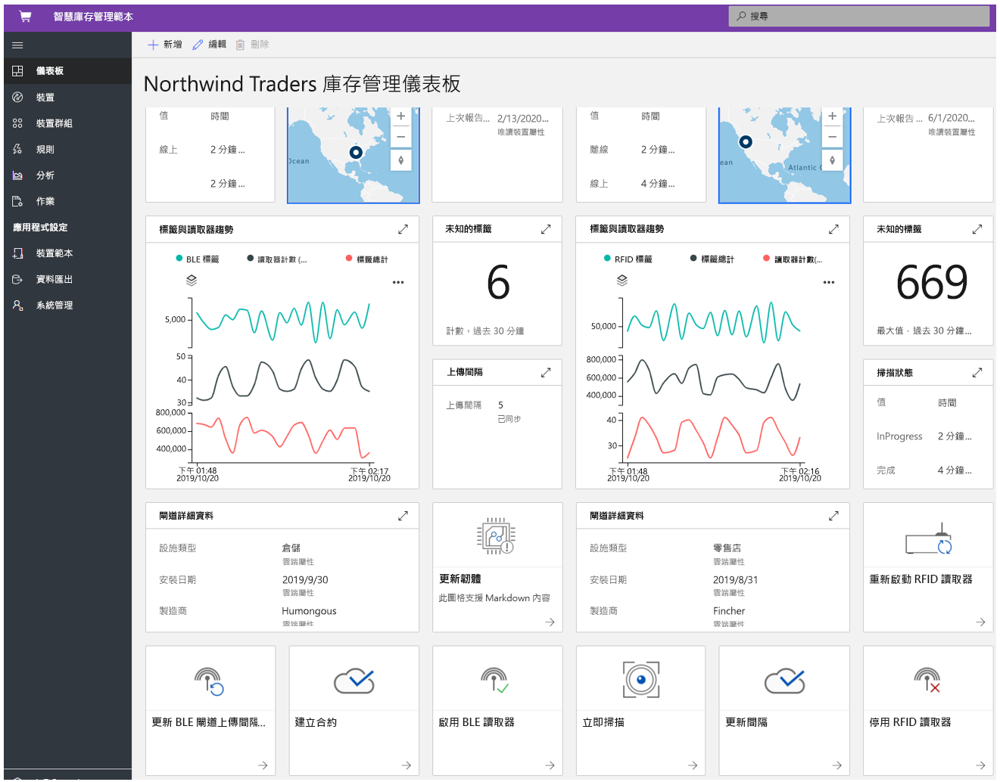
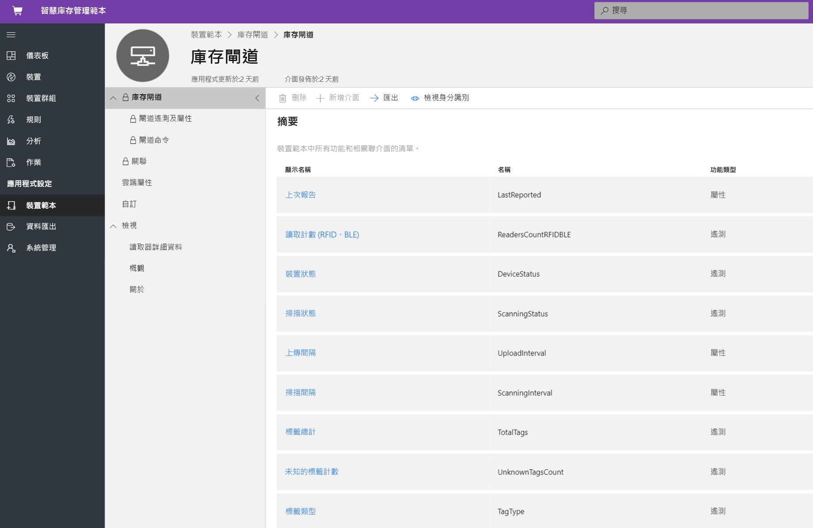
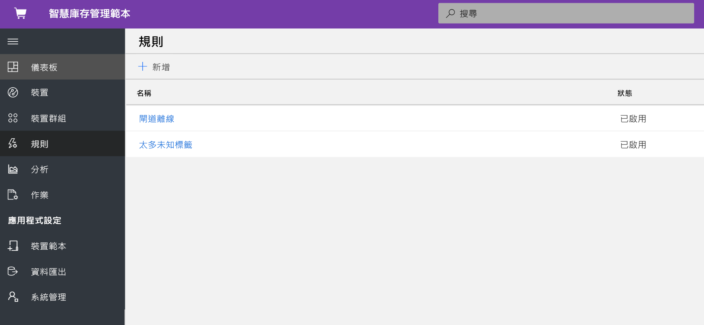
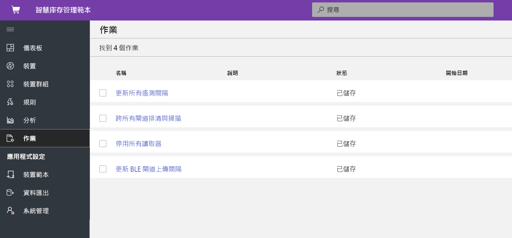
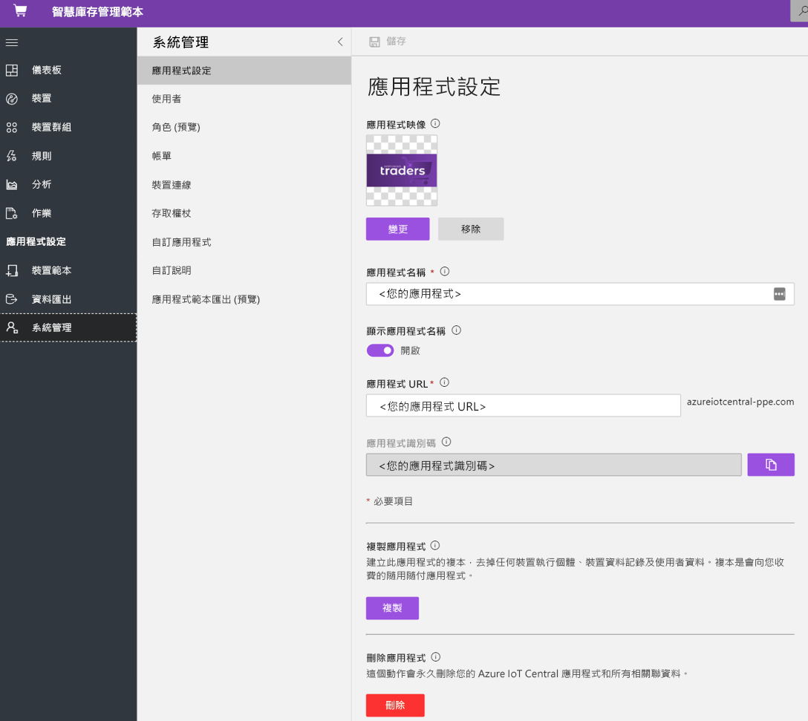

# 教學課程：部署和逐步執行智慧庫存管理應用程式範本

此教學課程示範如何開始部署 IoT Central **智慧庫存管理**應用程式範本。 您將了解如何部署範本、現成可用的項目，以及您接下來可能想要執行的動作。

在此教學課程中，您將了解如何： 
* 建立智慧庫存管理應用程式 
* 逐步執行應用程式 

## Prerequisites

* 部署此應用程式不需要特定的先決條件
* 建議具備 Azure 訂用帳戶，但您甚至不需訂用帳戶就能試用

## 建立智慧庫存管理應用程式範本

您可以使用下列步驟來建立應用程式

1. 瀏覽至 Azure IoT Central 應用程式管理員網站。 從左側導覽列選取 [建置]  ，然後按一下 [零售]  索引標籤。

    > [!div class="mx-imgBorder"]
    > 

2. 選取 [零售]  索引標籤，然後選取 [智慧庫存管理]  底下的 [建立應用程式]  。

3. [建立應用程式]  將開啟 [新增應用程式] 表單，並填寫要求的詳細資料，如下所示。
   **應用程式名稱**：您可以使用建議的預設名稱，或輸入易記應用程式名稱。
   **URL**：您可以使用建議的預設 URL，或輸入易記且獨特的 URL。 接下來，若您已經有 Azure 訂用帳戶，將建議預設設定。 您可以從 7 天免費試用定價方案開始，並隨時在免費試用到期之前選擇轉換成標準定價方案。
   **帳單資訊**：您需要目錄、Azure 訂用帳戶和區域詳細資料，才能佈建資源。
   **建立**：選取頁面底部的 [建立]，以部署您的應用程式。

    > [!div class="mx-imgBorder"]
    > 

    > [!div class="mx-imgBorder"]
    > 

## 逐步執行應用程式 

### 儀表板 

成功部署應用程式範本之後，您的預設儀表板是以智慧庫存管理操作員為主的入口網站。 Northwind Trader 是一家虛構的智慧庫存供應商，可使用藍牙低功耗 (BLE) 來管理倉儲，以及使用無線頻率識別 (RFID) 來管理零售商店。 在此儀表板中，您將看到兩個不同的閘道，其中提供有關庫存的遙測資料，以及您可以執行的相關聯命令、作業和動作。 此儀表板已預先設定來展示重要的智慧庫存管理裝置操作活動。
儀表板會以邏輯方式分成兩個不同的閘道裝置管理操作， 
   * 倉儲在平板上會以固定的 BLE 閘道與 BLE 標籤來部署，以追蹤較大型設施中的庫存
   * 零售商店會在個別項目層級使用固定的 RFID 閘道與 RFID 標籤來實作，以追蹤暢貨中心的存貨
   * 檢視閘道位置、狀態及相關詳細資料 

> [!div class="mx-imgBorder"]
> 

   * 您可以輕鬆地追蹤閘道、作用中和未知標籤的總數。
   * 您可以執行裝置管理操作，例如，更新韌體、停用感應器、啟用感應器、更新感應器閾值、更新遙測間隔，以及更新裝置服務合約。
   * 閘道裝置可以透過完整或增量掃描，依需求執行庫存管理。

> [!div class="mx-imgBorder"]
> 

## 裝置範本
按一下 [裝置範本] 索引標籤，您將看到閘道功能模型。 功能模型會以兩個不同的介面 [閘道遙測資料和屬性]  和 [閘道命令]  來結構化

**閘道遙測資料和屬性**：此介面代表所有與感應器、位置和裝置資訊相關的遙測資料，以及裝置對應項屬性功能，例如，感應器閾值和更新間隔。

> [!div class="mx-imgBorder"]
> 

**閘道命令**：此介面會組織所有閘道命令功能

> [!div class="mx-imgBorder"]
> 

## 規則
選取 [規則] 索引標籤，以查看存在於此應用程式範本中的兩個不同規則。 這些規則會設定為向操作員傳送電子郵件通知，以供進一步調查。

**閘道離線**：如果閘道長時間未向雲端回報，此規則將會觸發。 閘道可能因為電池模式電力不足、連線中斷、裝置健康情況而導致沒有回應。

**未知的標籤**：追蹤每個與資產相關聯的 RFID 和 BLE 標籤非常重要。 如果閘道偵測到太多未知的標籤，這就表示要使用標籤來源應用程式進行同步處理挑戰。

> [!div class="mx-imgBorder"]
> 

## 工作
選取 [作業] 索引標籤，以查看存在於此應用程式範本中的五個不同作業：您可以使用作業功能來執行整個解決方案的操作。 在這裡，庫存管理作業會使用裝置命令和對應項功能來執行如下的工作：
   * 停用所有閘道上的讀取器
   * 修改之間的遙測閾值 
   * 在整個解決方案中依需求執行庫存掃描。

> [!div class="mx-imgBorder"]
> 

## 清除資源

如果您不打算繼續使用此應用程式，請覽 [系統管理]   > [應用程式設定]  ，然後按一下 [刪除]  以刪除應用程式範本。

> [!div class="mx-imgBorder"]
> 

## 後續步驟
* 深入了解智慧庫存管理 
> [!div class="nextstepaction"]
> [智慧庫存管理概念](./architecture-smart-inventory-management.md)
* 深入了解其他 [IoT Central 零售範本](./overview-iot-central-retail.md)
* 若要深入了解 IoT Central，請參閱 [IoT Central 概觀](../core/overview-iot-central.md)