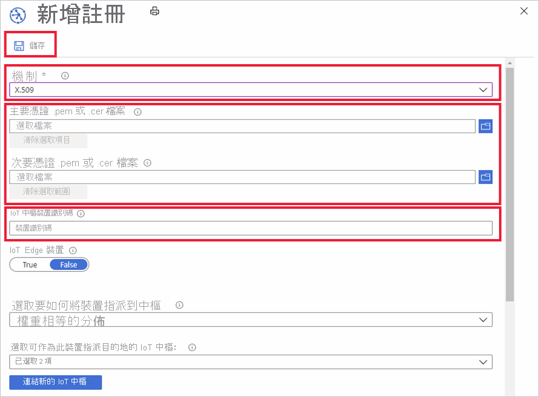

# 如何使用 Azure 入口網站管理裝置註冊

「裝置註冊」會建立單一裝置或裝置群組的記錄，這些裝置可能會在某個時間點向 Azure IoT 中樞裝置佈建服務進行註冊。 註冊記錄包含裝置 (s 的初始設定) 作為該註冊的一部分。 包含在設定中的是將指派裝置的 IoT 中樞，或從一組中樞設定中樞的配置原則。 本文說明如何管理佈建服務的裝置註冊。

## 建立裝置註冊

有兩種方式可供您向佈建服務註冊裝置：

* **註冊群組** 是共用通用證明機制之裝置群組的專案。 針對共用初始設定的大量裝置，或所有裝置都會進入相同的租使用者，我們建議使用註冊群組。 支援使用 [對稱金鑰](concepts-symmetric-key-attestation.md) 或 [x.509 憑證](concepts-x509-attestation.md) 的裝置。 

    如需有關建立和使用具有對稱金鑰之註冊群組的逐步指示，請參閱「 [使用對稱金鑰](how-to-legacy-device-symm-key.md) 布建裝置」教學課程。

    您可以使用下列步驟，在入口網站中為裝置群組建立註冊群組：

    1. 登入 Azure 入口網站，然後在左側功能表中按一下 [所有資源]。  
    1. 在資源清單中按一下要用來註冊裝置的裝置佈建服務。  
    1. 在您的布建服務中，按一下 [ **管理註冊**]，然後按一下頂端的 [ **新增註冊群組** ] 按鈕。  
     
        
        
    1. 當 [新增註冊群組] 面板出現時，請輸入您註冊的資訊，然後按一下 [ **儲存**]。  
     
        
        
        | 欄位 | 描述 |
        | :--- | :--- |
        | **群組名稱** | 裝置群組的必要名稱。 |
        | **證明類型** | 根據您的裝置將使用的證明方法，按一下證明類型的 [ **憑證** ] 或 [ **對稱金鑰** ]。 |
        | **憑證類型** | 如果您使用的是憑證證明，則可使用。 根據簽署您裝置憑證的憑證，選取 **CA 憑證** 或 **中繼** 。 |
        | **主要憑證** | 如果您要使用根 CA 憑證來簽署裝置憑證，該根 CA 憑證必須已完成 [擁有權證明](how-to-verify-certificates.md) 。 然後，您可以選取它作為裝置群組的 **主要憑證** 。  如果您要使用中繼憑證來簽署裝置憑證，您可以使用 [上傳] 按鈕，讓您上傳中繼憑證。 簽署中繼的憑證也必須有已完成的 [擁有權證明](how-to-verify-certificates.md) 。 |

        
    

* **個別註冊** 是可指派給 IoT 中樞的單一裝置專案。 支援使用 [對稱金鑰](concepts-symmetric-key-attestation.md)、 [X.509 憑證](concepts-x509-attestation.md)和 [TPM 證明](concepts-tpm-attestation.md) 的裝置。 

    您可以使用下列步驟在入口網站中建立個別註冊：

    1. 登入 Azure 入口網站，然後在左側功能表中按一下 [所有資源]。
    1. 在資源清單中按一下要用來註冊裝置的裝置佈建服務。
    1. 在您的布建服務中，按一下 [ **管理註冊**]，然後按一下頂端的 [ **新增個別註冊** ] 按鈕。   

       

    1. 當 [新增註冊] 面板出現時，請輸入個別裝置註冊的資訊，然後按一下 [ **儲存**]。 
     
        
    
        | 欄位 | 描述 |
        | :--- | :--- |
        | **機制** | 根據您裝置將使用的證明方法，選取要使用之證明機制的 **x.509**、 **TPM** 或 **對稱金鑰** 。 |
        | 證明設定 | 如需有關建立及使用具有對稱金鑰或 x.509 憑證之個別註冊的逐步指示，請參閱其中一個布建 [對稱裝置](quick-create-simulated-device-symmetric-key-java.md#create-a-device-enrollment) 或布建 [x.509 憑證裝置](quick-create-simulated-device-x509-java.md#create-a-self-signed-x509-device-certificate-and-individual-enrollment-entry) 快速入門。  如需有關使用 TPM 證明建立和使用個別註冊的逐步指示，請參閱其中一個布建 [模擬的 tpm 裝置](quick-create-simulated-device-tpm-java.md#create-a-device-enrollment-entry) 範例。|
        | **IoT 中樞裝置識別碼** |  此識別碼會代表您的裝置。 它必須遵循裝置識別碼的規則。 如需詳細資訊，請參閱 [裝置身分識別屬性](../iot-hub/iot-hub-devguide-identity-registry.md#device-identity-properties)。  使用 x.509 憑證時，此文字必須是您針對註冊所上傳之裝置憑證上的主體名稱。 該主體名稱必須符合裝置識別碼的規則。|
            

## 更新註冊項目
您可以使用下列步驟在入口網站中更新現有的註冊項目：

1. 在 Azure 入口網站中開啟裝置佈建服務，然後按一下 [管理註冊]。 
1. 瀏覽至您要修改的註冊項目。 按一下該項目，以開啟裝置註冊的摘要資訊。 
1. 在此頁面上，您可以修改安全性類型和認證以外的專案，例如裝置應連結的 IoT 中樞，以及裝置識別碼。 您也可以修改裝置對應項的初始狀態。 
1. 完成後，按一下 [儲存] 以更新裝置註冊。 

    

## 移除裝置註冊
如果您不需要將裝置佈建到任何 IoT 中樞，則可以使用下列步驟在入口網站中移除相關的註冊項目：

1. 在 Azure 入口網站中開啟裝置佈建服務，然後按一下 [管理註冊]。 
1. 瀏覽至您要移除的註冊項目並加以選取。 
1. 按一下頂端的 [刪除] 按鈕，然後在系統提示您確認時選取 [是]。 
1. 動作完成後，您會看到您的專案已從裝置註冊清單中移除。 
 
    