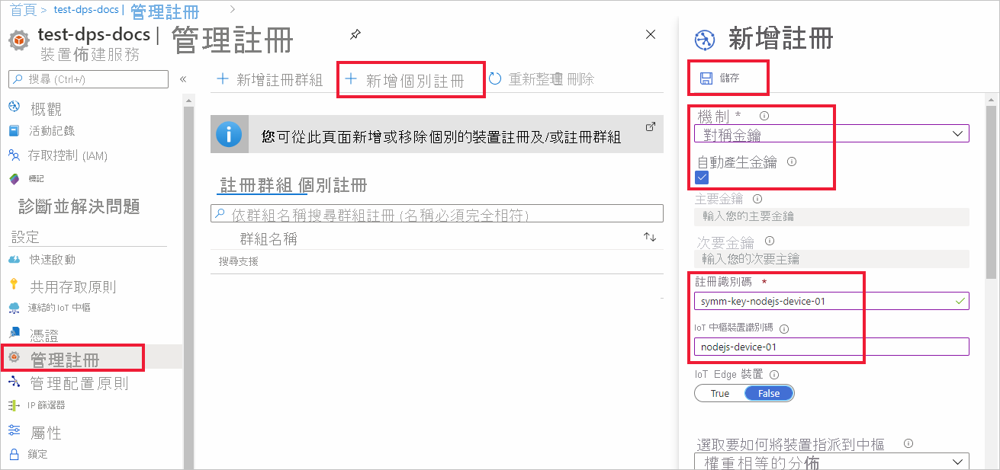
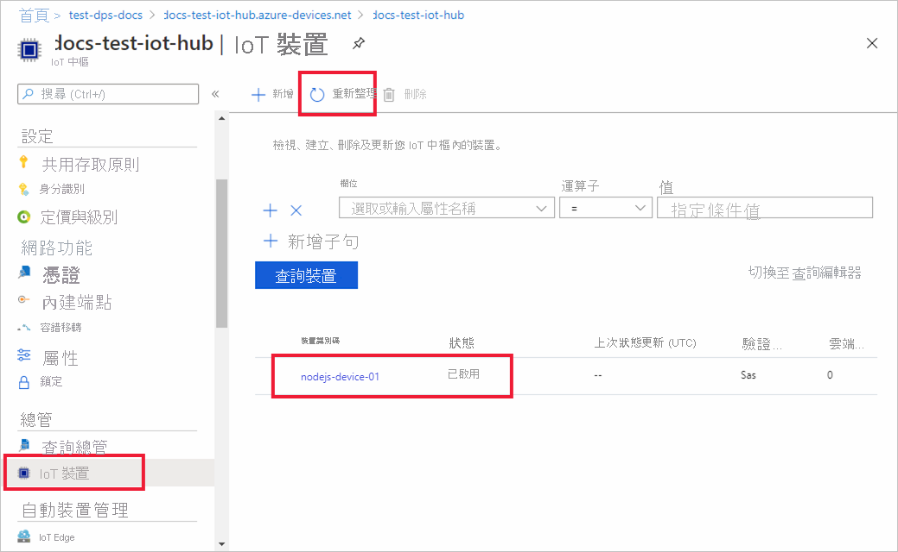

# <a name="quickstart-provision-a-symmetric-key-device-using-nodejs"></a>快速入門：使用 Node.js 佈建對稱金鑰裝置

在本快速入門中，您將了解如何使用 Node.js，將 Windows 開發機器當作裝置，佈建到 IoT 中樞。 此裝置將會使用對稱金鑰和個別註冊來搭配裝置佈建服務 (DPS) 執行個體進行驗證，以指派給 IoT 中樞。 [適用於 Node.js 的 Azure IoT SDK](https://github.com/Azure/azure-iot-sdk-node.git) 的範例程式碼將用來佈建裝置。 

雖然此文章示範如何使用個別註冊來佈建，但您也可以使用註冊群組。 使用註冊群組的過程會有一些差異。 例如，您必須使用具有裝置唯一註冊識別碼的衍生裝置金鑰。 [使用對稱金鑰佈建裝置](how-to-legacy-device-symm-key.md)提供註冊群組範例。 如需註冊群組詳細資訊，請參閱[對稱金鑰證明的群組註冊](concepts-symmetric-key-attestation.md#group-enrollments)。

如果您不熟悉自動佈建程序，請檢閱[佈建](about-iot-dps.md#provisioning-process)概觀。 

此外，繼續進行此快速入門之前，請務必完成[使用 Azure 入口網站設定 IoT 中樞裝置佈建服務](./quick-setup-auto-provision.md)中的步驟。 此快速入門要求您必須已建立您的裝置佈建服務執行個體。

此文章以 Windows 工作站為基礎來說明。 不過，您可以在 Linux 上執行上述程序。 如需 Linux 範例，請參閱[針對多組織用戶管理佈建](how-to-provision-multitenant.md)。


[!INCLUDE [quickstarts-free-trial-note](../../includes/quickstarts-free-trial-note.md)]


## <a name="prerequisites"></a>Prerequisites

- 熟悉[佈建](about-iot-dps.md#provisioning-process)概念。
- 完成[使用 Azure 入口網站設定 IoT 中樞裝置佈建服務](./quick-setup-auto-provision.md)。
- 具有有效訂用帳戶的 Azure 帳戶。 [建立免費帳戶](https://azure.microsoft.com/free/?ref=microsoft.com&utm_source=microsoft.com&utm_medium=docs&utm_campaign=visualstudio)。
- [Node.js v4.0+](https://nodejs.org)。
- [Git](https://git-scm.com/download/)。


## <a name="create-a-device-enrollment"></a>建立裝置註冊

1. 登入 [Azure 入口網站](https://portal.azure.com)，選取左側功能表上的 [所有資源] 按鈕，然後開啟您的裝置佈建服務 (DPS) 執行個體。

2. 選取 [管理註冊] 索引標籤，然後選取頂端的 [新增個別註冊] 按鈕。 

3. 在 [新增註冊] 面板中，輸入下列資訊，然後按 [儲存] 按鈕。

   - **機制** ：選取 [對稱金鑰] 作為身分識別證明「機制」。

   - **自動產生金鑰** ︰選取此方塊。

   - **註冊識別碼** ：輸入註冊識別碼以識別註冊。 只使用小寫英數字元與破折號 ('-') 字元。 例如， **symm-key-nodejs-device-01** 。

   - **IoT 中樞裝置識別碼：** 輸入裝置識別碼。 例如， **nodejs-device-01** 。

     

4. 一旦儲存您的註冊，將會產生 [主要金鑰] 與 [次要金鑰] 並新增到註冊項目。 您的對稱金鑰裝置註冊會在 [個別註冊] 索引標籤中的 [註冊識別碼] 欄下顯示為 **symm-key-nodejs-device-01** 。 

5. 開啟註冊並複製您產生之 [主要金鑰] 的值。 稍後當您新增要與裝置佈建範例程式碼搭配使用的環境變數時，將會使用此金鑰值和 **註冊識別碼** 。


## <a name="prepare-the-nodejs-environment"></a>準備 Node.js 環境 

1. 開啟 Git CMD 或 Git Bash 命令列環境。 使用下列命令複製[適用於 Node.js 的 Azure IoT SDK](https://github.com/Azure/azure-iot-sdk-node.git) GitHub 存放庫：

    ```cmd
    git clone https://github.com/Azure/azure-iot-sdk-node.git --recursive
    ```


<a id="firstbootsequence"></a>

## <a name="prepare-the-device-provisioning-code"></a>準備裝置佈建程式碼

在本節中，您將新增下列四個環境變數，作為對稱金鑰裝置的裝置佈建範例程式碼參數。 

* `PROVISIONING_HOST`
* `PROVISIONING_IDSCOPE`
* `PROVISIONING_REGISTRATION_ID`
* `PROVISIONING_SYMMETRIC_KEY`

佈建程式碼會根據這些變數來與 DPS 執行個體聯繫，以便驗證您的裝置。 然後，裝置會根據個別註冊組態，指派給已連結至 DPS 執行個體的 IoT 中樞。 佈建之後，範例程式碼會將一些測試遙測傳送至 IoT 中樞。

1. 在 [Azure 入口網站](https://portal.azure.com)的 [裝置佈建服務] 功能表上，選取 [概觀] 並且複製 [服務端點] 和 [識別碼範圍]。 您會將這些值用於 `PROVISIONING_HOST` 和 `PROVISIONING_IDSCOPE` 環境變數。

    

2. 開啟命令提示字元，執行 Node.js 命令，並瀏覽至下列佈建/裝置/範例目錄。

    ```cmd
    cd azure-iot-sdk-node/provisioning/device/samples
    ```

3. 在佈建/裝置/範例資料夾中，開啟 register_symkey.js 並檢閱程式碼。 

    請注意，範例程式碼會設定自訂承載...

    ```nodejs
    provisioningClient.setProvisioningPayload({a: 'b'});
    ```

    本快速入門無需使用此程式碼。 如果您想要使用自訂配置函式將裝置指派給 IoT 中樞，此程式碼就是設定自訂承載的範例。 如需詳細資訊，請參閱[教學課程：使用自訂配置原則](tutorial-custom-allocation-policies.md)。

    `provisioningClient.register()` 方法會嘗試註冊您的裝置。

    範例程式碼不需要進行任何變更，就能註冊您的裝置。

4. 在命令提示字元中，新增從上一節中個別註冊複製的佈建主機、識別碼範圍、註冊識別碼以及主要對稱金鑰等環境變數。  

    下列命令是顯示命令語法的範例。 請務必使用正確的值。

    ```console
    set PROVISIONING_HOST=test-dps-docs.azure-devices-provisioning.net
    ```

    ```console
    set PROVISIONING_IDSCOPE=0ne00000A0A
    ```

    ```console
    set PROVISIONING_REGISTRATION_ID=symm-key-nodejs-device-01
    ```

    ```console
    set PROVISIONING_SYMMETRIC_KEY=sbDDeEzRuEuGKag+kQKV+T1QGakRtHpsERLP0yPjwR93TrpEgEh/Y07CXstfha6dhIPWvdD1nRxK5T0KGKA+nQ==
    ```


4. 使用下列命令在本機建置和執行範例程式碼。

    ```console
    npm install
    ```

    ```console
    node register_symkey.js
    ```

5. 預期的輸出看起來應該像下面這樣，其中顯示根據個別註冊設定獲指派裝置的已連結 IoT 中樞。 系統會將 "Hello World" 字串傳送至中樞進行測試：

    ```output
    D:\Docs\test\azure-iot-sdk-node\provisioning\device\samples>node register_symkey.js
    registration succeeded
    assigned hub=docs-test-iot-hub.azure-devices.net
    deviceId=nodejs-device-01
    payload=undefined
    Client connected
    send status: MessageEnqueued    
    ```
    
6. 在 Azure 入口網站中，瀏覽到連結至您佈建服務的 IoT 中樞，並開啟 [IoT 裝置] 刀鋒視窗。 將對稱金鑰裝置成功佈建到中樞之後，會顯示裝置識別碼，且 [狀態] 為 [啟用]。 如果您在執行裝置範例程式碼之前開啟了刀鋒視窗，可能需要按下頂端的 [重新整理] 按鈕。 

     

> [!NOTE]
> 如果您在裝置的註冊項目中變更了 *初始裝置對應項狀態* (變更自預設值)，它即可從中樞提取所需的對應項狀態並採取適當的動作。 如需詳細資訊，請參閱[了解和使用 Azure IoT 中樞的裝置對應項](../iot-hub/iot-hub-devguide-device-twins.md)。
>


## <a name="clean-up-resources"></a>清除資源

如果您打算繼續使用並探索裝置用戶端範例，請勿清除在此快速入門中建立的資源。 如果您不打算繼續，請使用下列步驟來刪除本快速入門建立的所有資源。

1. 從 Azure 入口網站的左側功能表中，選取 [所有資源]，然後選取您的裝置佈建服務。 為您的服務開啟 [管理註冊]  ，然後選取 [個別註冊]  索引標籤。選取您在本快速入門中所註冊裝置的 [註冊識別碼]  旁的核取方塊，然後按窗格頂端的 [刪除]  按鈕。 
1. 從 Azure 入口網站的左側功能表中，選取 [所有資源]  ，然後選取您的 IoT 中樞。 開啟您中樞的 [IoT 裝置]  ，選取您在本快速入門所註冊裝置的 [裝置識別碼]  旁的核取方塊，然後按窗格頂端的 [刪除]  按鈕。

## <a name="next-steps"></a>後續步驟

在本快速入門中，您已使用 IoT 中樞裝置佈建服務，將以 Windows 為基礎的對稱金鑰裝置佈建到您的 IoT 中樞。 若要了解如何使用 Node.js 佈建 X.509 憑證裝置，請繼續下方適用於 X.509 裝置的快速入門。 

> [!div class="nextstepaction"]
> [Azure 快速入門 - 使用 DPS 和 Node.js 佈建 X.509 裝置](quick-create-simulated-device-x509-node.md)
