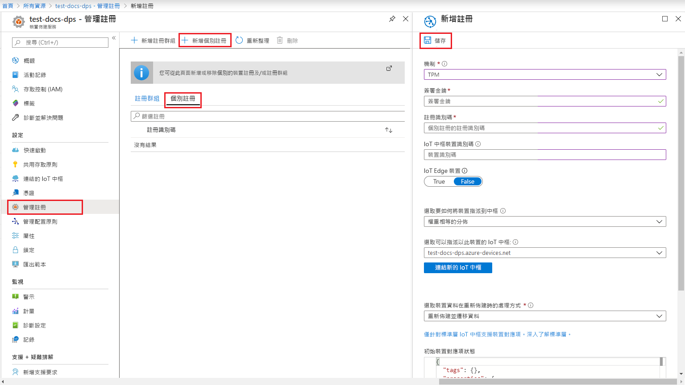
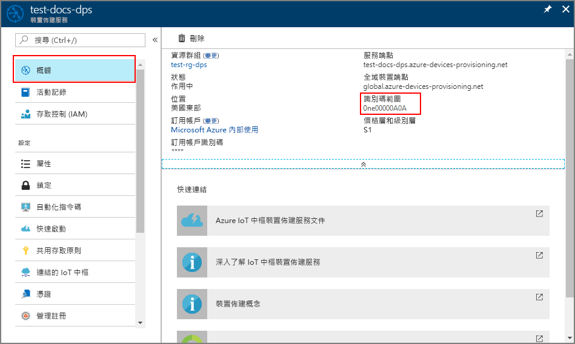

# <a name="quickstart-provision-a-simulated-tpm-device-using-the-azure-iot-c-sdk"></a>快速入門：使用 Azure IoT C SDK 佈建模擬 TPM 裝置

[!INCLUDE [iot-dps-selector-quick-create-simulated-device-tpm](../../includes/iot-dps-selector-quick-create-simulated-device-tpm.md)]

在本快速入門中，您將了解如何在 Windows 開發機器上建立和執行信賴平台模組 (TPM) 裝置模擬器。 您將使用裝置佈建服務執行個體，將此模擬裝置連線至 IoT 中樞。 來自 [Azure IoT C SDK](https://github.com/Azure/azure-iot-sdk-c) 的程式碼範例將協助您使用裝置佈建服務執行個體進行裝置註冊，以及用來模擬裝置的開機順序。

如果您不熟悉自動佈建程序，請檢閱[佈建](about-iot-dps.md#provisioning-process)概觀。 此外，繼續進行此快速入門之前，請務必完成[使用 Azure 入口網站設定 IoT 中樞裝置佈建服務](./quick-setup-auto-provision.md)中的步驟。 

Azure IoT 裝置佈建服務支援兩種類型的註冊：
- [註冊群組](concepts-service.md#enrollment-group)：用來註冊多個相關的裝置。
- [個別註冊](concepts-service.md#individual-enrollment)：用來註冊單一裝置。

本文將示範個別註冊。

[!INCLUDE [quickstarts-free-trial-note](../../includes/quickstarts-free-trial-note.md)]

## <a name="prerequisites"></a>Prerequisites

下列必要條件適用於 Windows 開發環境。 針對 Linux 或 macOS，請參閱 SDK 文件中[準備您的開發環境](https://github.com/Azure/azure-iot-sdk-c/blob/master/doc/devbox_setup.md)中的適當章節。

* [Visual Studio](https://visualstudio.microsoft.com/vs/) 2019 並啟用[使用 C++ 的桌面開發](https://docs.microsoft.com/cpp/ide/using-the-visual-studio-ide-for-cpp-desktop-development)工作負載。 也會支援 Visual Studio 2015 和 Visual Studio 2017。

* 已安裝最新版的 [Git](https://git-scm.com/download/)。

<a id="setupdevbox"></a>

## <a name="prepare-a-development-environment-for-the-azure-iot-c-sdk"></a>準備適用於 Azure IoT C SDK 的開發環境

在本節中，您會準備用來建置 [Azure IoT C SDK](https://github.com/Azure/azure-iot-sdk-c) 和 [TPM](https://docs.microsoft.com/windows/device-security/tpm/trusted-platform-module-overview) 裝置模擬器範例的開發環境。

1. 下載 [CMake 建置系統](https://cmake.org/download/)。

    在開始安裝 `CMake`**之前**，請務必將 Visual Studio 先決條件 (Visual Studio 和「使用 C++ 進行桌面開發」工作負載) 安裝在您的機器上。 在符合先決條件，並且驗證過下載項目之後，請安裝 CMake 建置系統。

2. 尋找[最新版本](https://github.com/Azure/azure-iot-sdk-c/releases/latest) SDK 的標籤名稱。

3. 開啟命令提示字元或 Git Bash 殼層。 執行下列命令以複製最新版的 [Azure IoT C SDK](https://github.com/Azure/azure-iot-sdk-c) GitHub 存放庫。 使用您在上一個步驟中找到的標籤作為 `-b` 參數的值：

    ```cmd/sh
    git clone -b <release-tag> https://github.com/Azure/azure-iot-sdk-c.git
    cd azure-iot-sdk-c
    git submodule update --init
    ```

    預期此作業需要幾分鐘的時間才能完成。

4. 在 git 存放庫的根目錄中建立 `cmake` 子目錄，並瀏覽至該資料夾。 從 `azure-iot-sdk-c` 目錄執行下列命令：

    ```cmd/sh
    mkdir cmake
    cd cmake
    ```

## <a name="build-the-sdk-and-run-the-tpm-device-simulator"></a>建置 SDK 並執行 TPM 裝置模擬器

在本節中，您將建置 Azure IoT C SDK，其中包括 TPM 裝置模擬器範例程式碼。 此範例提供透過共用存取簽章 (SAS) 權杖驗證的 TPM [證明機制](concepts-service.md#attestation-mechanism)。

1. 從您在 azure-iot-sdk-c git 存放庫中建立的 `cmake` 子目錄，執行下列命令以建置範例。 此建置命令也會產生模擬裝置的 Visual Studio 解決方案。

    ```cmd/sh
    cmake -Duse_prov_client:BOOL=ON -Duse_tpm_simulator:BOOL=ON ..
    ```

    如果 `cmake` 找不到 C++ 編譯，您在執行上述命令時，可能會收到建置錯誤。 如果發生這種情況，請嘗試在 [Visual Studio 命令提示字元](https://docs.microsoft.com/dotnet/framework/tools/developer-command-prompt-for-vs)中執行此命令。 

    建置成功後，最後幾行輸出會類似於下列輸出：

    ```cmd/sh
    $ cmake -Duse_prov_client:BOOL=ON -Duse_tpm_simulator:BOOL=ON ..
    -- Building for: Visual Studio 15 2017
    -- Selecting Windows SDK version 10.0.16299.0 to target Windows 10.0.17134.
    -- The C compiler identification is MSVC 19.12.25835.0
    -- The CXX compiler identification is MSVC 19.12.25835.0

    ...

    -- Configuring done
    -- Generating done
    -- Build files have been written to: E:/IoT Testing/azure-iot-sdk-c/cmake
    ```

2. 瀏覽至您所複製的 git 存放庫根資料夾，並使用以下顯示的路徑執行 [TPM](https://docs.microsoft.com/windows/device-security/tpm/trusted-platform-module-overview) 模擬器。 此模擬器會透過連接埠 2321 和 2322 上的通訊端來接聽。 請勿關閉此命令視窗；您必須讓此模擬器保持執行，直到此快速入門結束。 

   如果您是在 cmake** 資料夾中，請執行下列命令：

    ```cmd/sh
    cd ..
    .\provisioning_client\deps\utpm\tools\tpm_simulator\Simulator.exe
    ```

    您不會看到模擬器的任何輸出。 請讓它繼續執行 TPM 裝置的模擬。

<a id="simulatetpm"></a>

## <a name="read-cryptographic-keys-from-the-tpm-device"></a>從 TPM 裝置讀取密碼編譯金鑰

在本節中，您將建置並執行會從持續執行的 TPM 模擬器讀取簽署金鑰和註冊識別碼，並透過連接埠 2321 和 2322 來接聽的範例。 這些值將用來對您的裝置佈建服務執行個體進行裝置註冊。

1. 啟動 Visual Studio，並開啟名為 `azure_iot_sdks.sln` 的新解決方案檔案。 此解決方案檔案位於您先前在 azure-iot-sdk-c git 存放庫根目錄中建立的 `cmake` 資料夾內。

2. 在 Visual Studio 功能表中，選取 [建置]**** > [建置解決方案]****，以建置方案中的所有專案。

3. 在 Visual Studio 的 [方案總管]** 視窗中，瀏覽至 **Provision\_Tools** 資料夾。 以滑鼠右鍵按一下 **tpm_device_provision** 專案，然後選取 [設為起始專案]****。 

4. 在 Visual Studio 功能表中，選取 [偵錯]**** > [啟動但不偵錯]**** 以執行解決方案。 應用程式會讀取並顯示 [註冊識別碼]**__** 和 [簽署金鑰]**__**。 請記下或複製這些值。 這些值會在下一節用於裝置註冊。 


<a id="portalenrollment"></a>

## <a name="create-a-device-enrollment-entry-in-the-portal"></a>在入口網站中建立裝置註冊項目

1. 登入 Azure 入口網站，選取左側功能表上的 [所有資源]**** 按鈕，然後開啟您的裝置佈建服務。

1. 選取 [管理註冊]**** 索引標籤，然後選取頂端的 [新增個別註冊]**** 按鈕。 

1. 在 [新增註冊]**** 面板中，輸入下列資訊：
   - 選取 [TPM]**** 作為身分識別證明「機制」**。
   - 針對 TPM 裝置，輸入先前所記下的 [註冊識別碼]** 和 [簽署金鑰]** 值。
   - 選取與您的佈建服務連結的 IoT 中樞。
   - 您可以選擇性地提供下列資訊：
       - 輸入唯一的 [裝置識別碼]** (您可以使用建議的 **test-docs-device** 或提供自己的識別碼)。 替您的裝置命名時，務必避免使用敏感性資料。 如果您選擇不提供名稱，則會改用註冊識別碼來識別裝置。
       - 使用裝置所需的初始組態更新**初始裝置對應項狀態**。
   - 完成後，按 [儲存]**** 按鈕。 

        

      註冊成功時，您裝置的「登錄識別碼」** 將會出現在「個別註冊」** 索引標籤之下的清單中。 


<a id="firstbootsequence"></a>

## <a name="simulate-first-boot-sequence-for-the-device"></a>模擬裝置的第一個開機順序

在本節中，您將設定範例程式碼，以使用[進階訊息佇列通訊協定 (AMQP)](https://wikipedia.org/wiki/Advanced_Message_Queuing_Protocol) 將裝置的開機順序傳送至裝置佈建服務執行個體。 此開機順序會使裝置經過辨識，並指派給連結至裝置佈建服務執行個體的 IoT 中樞。

1. 在 Azure 入口網站中，選取您裝置佈建服務的 [概觀]**** 索引標籤，並複製 [識別碼範圍]**__** 值。

     

2. 在 Visual Studio 的 [方案總管]** 視窗中，瀏覽至 **Provision\_Samples** 資料夾。 展開名為 **prov\_dev\_client\_sample** 的範例專案。 展開 [來源檔案]****，然後開啟 **prov\_dev\_client\_sample.c**。

3. 在檔案頂端附近，從 `#define` 陳述式中找出每個裝置通訊協定，如下所示。 請確定只有 `SAMPLE_AMQP` 取消註解。

    目前並[不支援將 MQTT 通訊協定用於個別的 TPM 註冊](https://github.com/Azure/azure-iot-sdk-c#provisioning-client-sdk)。

    ```c
    //
    // The protocol you wish to use should be uncommented
    //
    //#define SAMPLE_MQTT
    //#define SAMPLE_MQTT_OVER_WEBSOCKETS
    #define SAMPLE_AMQP
    //#define SAMPLE_AMQP_OVER_WEBSOCKETS
    //#define SAMPLE_HTTP
    ```

4. 找出 `id_scope` 常數，並將其值取代為您先前複製的 [識別碼範圍]**** 值。 

    ```c
    static const char* id_scope = "0ne00002193";
    ```

5. 在相同的檔案中找出 `main()` 函式的定義。 請確定 `hsm_type` 變數已設為 `SECURE_DEVICE_TYPE_TPM`，而不是 `SECURE_DEVICE_TYPE_X509`，如下所示。

    ```c
    SECURE_DEVICE_TYPE hsm_type;
    hsm_type = SECURE_DEVICE_TYPE_TPM;
    //hsm_type = SECURE_DEVICE_TYPE_X509;
    ```

6. 以滑鼠右鍵按一下 **prov\_dev\_client\_sample** 專案，然後選取 [設定為起始專案]****。 

7. 在 Visual Studio 功能表中，選取 [偵錯]**** > [啟動但不偵錯]**** 以執行解決方案。 出現重新建置專案的提示時，選取 [是]****，以在執行前重新建置專案。

    下列輸出範例說明佈建裝置用戶端範例已成功啟動，並連線至佈建服務執行個體，以取得 IoT 中樞資訊並進行註冊：

    ```cmd
    Provisioning API Version: 1.2.7
    Provisioning Status: PROV_DEVICE_REG_STATUS_CONNECTED

    Registering... Press enter key to interrupt.

    Provisioning Status: PROV_DEVICE_REG_STATUS_CONNECTED
    Provisioning Status: PROV_DEVICE_REG_STATUS_ASSIGNING
    Provisioning Status: PROV_DEVICE_REG_STATUS_ASSIGNING

    Registration Information received from service:
    test-docs-hub.azure-devices.net, deviceId: test-docs-device
    ```

8. 佈建服務將模擬裝置佈建到 IoT 中樞後，裝置識別碼會連同中樞的 [IoT 裝置]**** 一起顯示。 

     


## <a name="clean-up-resources"></a>清除資源

如果您打算繼續使用並探索裝置用戶端範例，請勿清除在此快速入門中建立的資源。 如果您不打算繼續，請使用下列步驟來刪除本快速入門建立的所有資源。

1. 在您的電腦上關閉裝置用戶端範例輸出視窗。
2. 在您的電腦上關閉 TPM 模擬器視窗。
3. 從 Azure 入口網站的左側功能表中，選取 [所有資源]****，然後選取您的裝置佈建服務。 為您的服務開啟 [管理註冊]  ，然後選取 [個別註冊]  索引標籤。選取您在本快速入門中所註冊裝置的 [註冊識別碼]  旁的核取方塊，然後按窗格頂端的 [刪除]  按鈕。 
4. 從 Azure 入口網站的左側功能表中，選取 [所有資源]****，然後選取您的 IoT 中樞。 開啟您中樞的 [IoT 裝置]****，選取您在本快速入門所註冊裝置的 [裝置識別碼]** 旁的核取方塊，然後按窗格頂端的 [刪除]**** 按鈕。

## <a name="next-steps"></a>後續步驟

在本快速入門中，您已在電腦上建立 TPM 模擬裝置，並使用 IoT 中樞裝置佈建服務將其佈建到 IoT 中樞。 若要了解如何以程式設計方式註冊您的 TPM 裝置，請繼續閱讀以程式設計方式註冊 TPM 裝置的快速入門。 

> [!div class="nextstepaction"]
> [Azure 快速入門 - 向 Azure IoT 中樞裝置佈建服務註冊 TPM 裝置](quick-enroll-device-tpm-java.md)
