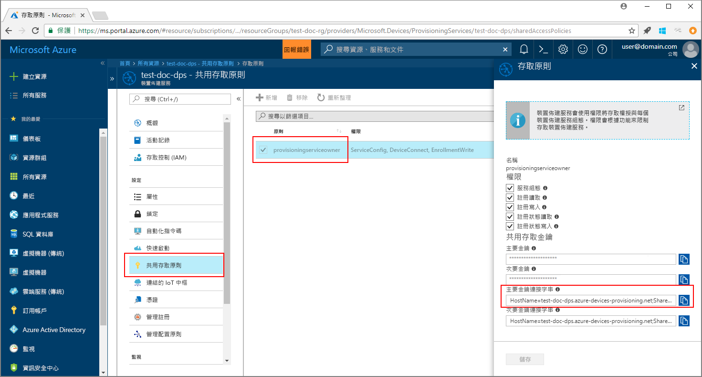
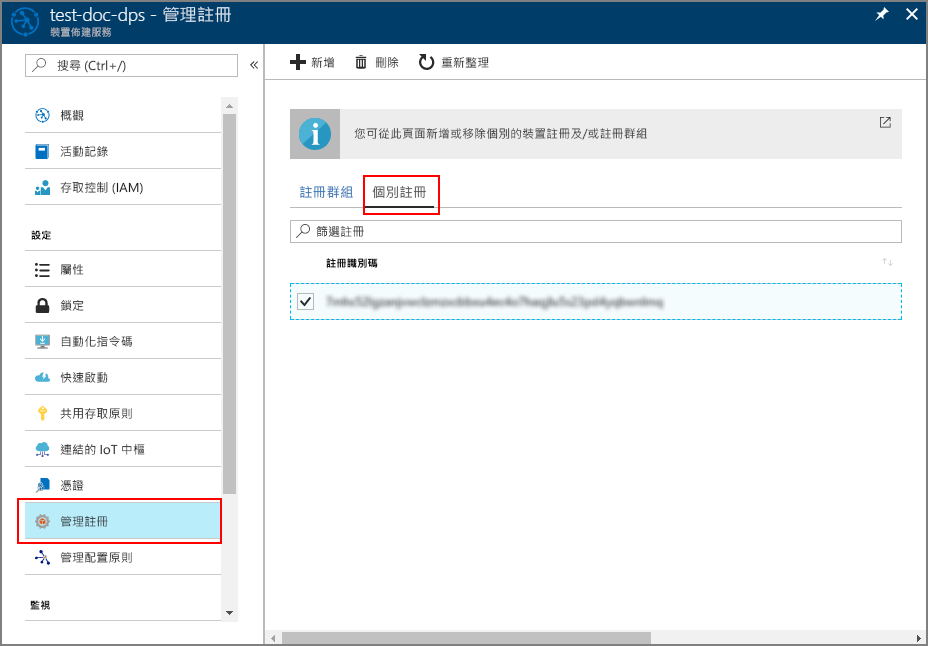

# <a name="quickstart-enroll-tpm-device-to-iot-hub-device-provisioning-service-using-java-service-sdk"></a>快速入門：使用 Java 服務 SDK 向 IoT 中樞裝置佈建服務註冊 TPM 裝置

[!INCLUDE [iot-dps-selector-quick-enroll-device-tpm](../../includes/iot-dps-selector-quick-enroll-device-tpm.md)]

在本快速入門中，您可以使用 Java 服務 SDK 和範例 Java 應用程式的輔助，以程式設計方式在 Azure IoT 中樞裝置佈建服務中建立模擬 TPM 裝置的個別註冊。

## <a name="prerequisites"></a>Prerequisites

- 完成[使用 Azure 入口網站設定 IoT 中樞裝置佈建服務](./quick-setup-auto-provision.md)。
- 完成[從 TPM 裝置讀取密碼編譯金鑰](quick-create-simulated-device.md#simulatetpm)。
- 具有有效訂用帳戶的 Azure 帳戶。 [建立免費帳戶](https://azure.microsoft.com/free/?ref=microsoft.com&utm_source=microsoft.com&utm_medium=docs&utm_campaign=visualstudio)。
- [Java SE 開發套件 8](https://aka.ms/azure-jdks)。 本快速入門會在下面安裝 [Java 服務 SDK](https://azure.github.io/azure-iot-sdk-java/master/service/)。 其同時適用於 Windows 和 Linux。 本快速入門會使用 Windows。
- [Maven 3](https://maven.apache.org/download.cgi)。
- [Git](https://git-scm.com/download/)。

<a id="setupdevbox"></a>

## <a name="prepare-the-development-environment"></a>準備開發環境 

1. 請確定您已在電腦上安裝 [Java SE 開發套件 8](https://aka.ms/azure-jdks)。 

2. 設定您 Java 安裝的環境變數。 `PATH` 變數應該包含 jdk1.8.x\bin  目錄的完整路徑。 如果這是您第一次在電腦上安裝 Java，請建立名為 `JAVA_HOME` 的新環境變數，並加以指向 jdk1.8.x  目錄的完整路徑。 在 Windows 電腦上，此目錄位於 C:\\Program Files\\Java\\  資料夾，您可以在 Windows 電腦的 [控制台]  上搜尋 [編輯系統環境變數]  來建立或編輯環境變數。 

   您可以在命令視窗中執行下列命令，查看 Java 是否在您的電腦上成功設定：

    ```cmd\sh
    java -version
    ```

3. 下載並擷取您電腦上的 [Maven 3](https://maven.apache.org/download.cgi)。 

4. 編輯環境變數 `PATH`，在擷取 Maven 的資料夾內，指向 apache-maven-3.x.x\\bin  資料夾。 您可以在命令視窗中執行此命令，來確認 Maven 已成功安裝：

    ```cmd\sh
    mvn --version
    ```

5. 確定 [git](https://git-scm.com/download/) 已安裝在電腦上，並已新增至環境變數 `PATH`。 


<a id="javasample"></a>

## <a name="download-and-modify-the-java-sample-code"></a>下載並修改 Java 範例程式碼

本節說明如何將 TPM 裝置的佈建詳細資料新增至範例程式碼。 

1. 開啟命令提示字元。 使用 [Java 服務 SDK](https://azure.github.io/azure-iot-sdk-java/master/service/) 來複製裝置註冊程式碼範例的 GitHub 存放庫：
    
    ```cmd\sh
    git clone https://github.com/Azure/azure-iot-sdk-java.git --recursive
    ```

2. 在下載的原始程式碼中，瀏覽至 _azure-iot-sdk-java/provisioning/provisioning-samples/service-enrollment-sample_  範例資料夾。 在您選擇的編輯器中開啟檔案 _/src/main/java/samples/com/microsoft/azure/sdk/iot/ServiceEnrollmentSample.java_  ，並新增下列詳細資料：

   1. 從入口網站針對佈建服務新增 `[Provisioning Connection String]`，如下所示：
       1. 在 [Azure 入口網站](https://portal.azure.com)中，瀏覽至您的佈建服務。 
       2. 開啟 [共用存取原則]  ，並選取具有 EnrollmentWrite  權限的原則。
       3. 複製 [主索引鍵連接字串]  。 

             

       4. 在範例程式碼檔案 _ServiceEnrollmentSample.java_  中，將 `[Provisioning Connection String]` 取代為 **主索引鍵連接字串** 。
    
           ```Java
           private static final String PROVISIONING_CONNECTION_STRING = "[Provisioning Connection String]";
           ```

   2. 新增 TPM 裝置詳細資料：
       1. 取得 TPM 裝置模擬的註冊識別碼  和 TPM 簽署金鑰  ，方法是遵循[模擬 TPM 裝置](quick-create-simulated-device.md#simulatetpm)一節的前置步驟。
       2. 使用上述步驟之輸出中的 [註冊識別碼]  和 [簽署金鑰]  ，來取代 **_ServiceEnrollmentSample.java_** 範例程式碼檔案中的 `[RegistrationId]` 和 `[TPM Endorsement Key]`：
        
           ```Java
           private static final String REGISTRATION_ID = "[RegistrationId]";
           private static final String TPM_ENDORSEMENT_KEY = "[TPM Endorsement Key]";
           ```

   3. (選擇性) 您可以透過範例程式碼來設定佈建服務：
      - 若要將此設定新增至範例，請遵循下列步驟：
        1. 在 [Azure 入口網站](https://portal.azure.com)中，瀏覽至連結到您佈建服務的 IoT 中樞。 開啟中樞的 [概觀]  索引標籤，並複製 [主機名稱]  。 將此 [主機名稱]  指派給 IOTHUB_HOST_NAME  參數。
            ```Java
            private static final String IOTHUB_HOST_NAME = "[Host name].azure-devices.net";
            ```
        2. 指派易記的名稱給 DEVICE_ID  參數，並保留 PROVISIONING_STATUS  作為預設的 ENABLED  值。 
    
      - 或者，如果您選擇不設定佈建服務，請確定在 _ServiceEnrollmentSample.java_ 檔案中，將下列陳述式標記為註解或刪除：
          ```Java
          // The following parameters are optional. Remove it if you don't need.
          individualEnrollment.setDeviceId(DEVICE_ID);
          individualEnrollment.setIotHubHostName(IOTHUB_HOST_NAME);
          individualEnrollment.setProvisioningStatus(PROVISIONING_STATUS);
          ```

   4. 研究範例程式碼。 它會建立、更新、查詢並刪除個別的 TPM 裝置註冊。 若要確認入口網站中的註冊成功，請在 _ServiceEnrollmentSample.java_ 檔案的結尾處，將下列幾行程式碼暫時標記為註解：
    
       ```Java
       // *********************************** Delete info of individualEnrollment ************************************
       System.out.println("\nDelete the individualEnrollment...");
       provisioningServiceClient.deleteIndividualEnrollment(REGISTRATION_ID);
       ```

   5. 儲存 _ServiceEnrollmentSample.java_ 檔案。

<a id="runjavasample"></a>

## <a name="build-and-run-the-java-sample-code"></a>建置並執行 Java 範例程式碼

1. 開啟命令視窗，並瀏覽至 **_azure-iot-sdk-java/provisioning/provisioning-samples/service-enrollment-sample_** 資料夾。

2. 使用此命令來建置範例程式碼：

    ```cmd\sh
    mvn install -DskipTests
    ```

   這個命令會將 Maven 套件 [`com.microsoft.azure.sdk.iot.provisioning.service`](https://www.mvnrepository.com/artifact/com.microsoft.azure.sdk.iot.provisioning/provisioning-service-client) 下載到您的電腦。 此套件包含範例程式碼需要建置 [Java 服務 SDK](https://azure.github.io/azure-iot-sdk-java/master/service/) 的二進位檔。 

3. 在命令視窗中使用這些命令來執行此範例：

    ```cmd\sh
    cd target
    java -jar ./service-enrollment-sample-{version}-with-deps.jar
    ```

4. 觀察成功註冊的輸出視窗。 

5. 在 Azure 入口網站中，瀏覽至您的佈建服務。 選取 [管理註冊]  ，然後選取 [個別註冊]  索引標籤。請注意，現在會列出您的模擬 TPM 裝置註冊識別碼  。 

      

## <a name="clean-up-resources"></a>清除資源
如果您打算探索 Java 服務範例，請勿清除在此快速入門中建立的資源。 如果您不打算繼續，請使用下列步驟來刪除本快速入門建立的所有資源。

1. 在您的電腦上關閉 Java 範例輸出視窗。
1. 將您所建立要模擬 TPM 裝置的 TPM 模擬器視窗關閉。
1. 在 Azure 入口網站中，瀏覽至您的裝置佈建服務，選取 [管理註冊]  ，然後選取 [個別註冊]  索引標籤。選取您使用本快速入門所建立註冊項目的 [註冊識別碼]  旁的核取方塊，然後按窗格頂端的 [刪除]  按鈕。

## <a name="next-steps"></a>後續步驟
在本快速入門中，您已向裝置佈建服務註冊模擬 TPM 裝置。 若要深入了解裝置佈建，請繼續在 Azure 入口網站中進行裝置佈建服務設定的教學課程。 

> [!div class="nextstepaction"]
> [Azure IoT 中樞裝置佈建服務教學課程](./tutorial-set-up-cloud.md)
