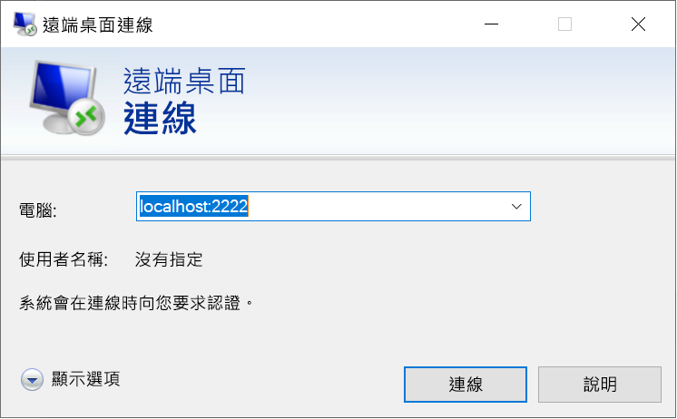

# <a name="quickstart-enable-ssh-and-rdp-over-an-iot-hub-device-stream-by-using-a-nodejs-proxy-application-preview"></a>快速入門：使用 Node.js Proxy 應用程式透過 IoT 中樞裝置串流進行 SSH 和 RDP 輸送 (預覽)

[!INCLUDE [iot-hub-quickstarts-4-selector](../../includes/iot-hub-quickstarts-4-selector.md)]

在本快速入門中，您可讓安全殼層 (SSH) 和遠端桌面通訊協定 (RDP) 流量透過裝置串流傳送至裝置。 Azure IoT 中樞裝置串流可讓服務和裝置應用程式以安全且便於設定防火牆的方式進行通訊。 本快速入門說明服務端上所執行 Node.js Proxy 應用程式的執行作業。 在公開預覽期間，Node.js SDK 僅支援服務端上的裝置串流。 因此，本快速入門僅提供執行裝置本機 Proxy 應用程式的指示。

## <a name="prerequisites"></a>Prerequisites

* 完成[使用 C Proxy 應用程式透過 IoT 中樞裝置串流進行 SSH 和 RDP 輸送](./quickstart-device-streams-proxy-c.md)或[使用 C# Proxy 應用程式透過 IoT 中樞裝置串流進行 SSH 和 RDP 輸送](./quickstart-device-streams-proxy-csharp.md)。

* 具有有效訂用帳戶的 Azure 帳戶。 [建立免費帳戶](https://azure.microsoft.com/free/?ref=microsoft.com&utm_source=microsoft.com&utm_medium=docs&utm_campaign=visualstudio)。

* [Node.js 10+](https://nodejs.org)。

* [範例 Node.js 專案](https://github.com/Azure-Samples/azure-iot-samples-node/archive/streams-preview.zip)。

您可以使用下列命令，確認開發電腦上目前的 Node.js 版本：

```cmd/sh
node --version
```

Microsoft Azure IoT 中樞目前支援裝置串流作為[預覽功能](https://azure.microsoft.com/support/legal/preview-supplemental-terms/)。

> [!IMPORTANT]
> 裝置串流的預覽版目前僅支援在下列區域建立的 IoT 中樞：
>
> * 美國中部
> * 美國中部 EUAP
> * 北歐
> * 東南亞
  
[!INCLUDE [cloud-shell-try-it.md](../../includes/cloud-shell-try-it.md)]

### <a name="add-azure-iot-extension"></a>新增 Azure IoT 擴充功能

執行下列命令，將適用於 Azure CLI 的 Azure IoT 擴充功能新增至您的 Cloud Shell 執行個體。 IoT 擴充功能可將 IoT 中樞、IoT Edge 和 IoT 裝置佈建服務 (DPS) 的特定命令新增至 Azure CLI。

```azurecli-interactive
az extension add --name azure-iot
```

[!INCLUDE [iot-hub-cli-version-info](../../includes/iot-hub-cli-version-info.md)]

## <a name="create-an-iot-hub"></a>建立 IoT 中樞

如果您已完成先前的[快速入門：將遙測從裝置傳送到 IoT 中樞](quickstart-send-telemetry-node.md)，則可以略過此步驟。

[!INCLUDE [iot-hub-include-create-hub](../../includes/iot-hub-include-create-hub.md)]

## <a name="register-a-device"></a>註冊裝置

如果您已完成[快速入門：將遙測從裝置傳送到 IoT 中樞](quickstart-send-telemetry-node.md)，則可以略過此步驟。

裝置必須向的 IoT 中樞註冊，才能進行連線。 在這一節中，您會使用 Azure Cloud Shell 來註冊模擬的裝置。

1. 若要建立裝置身分識別，請在 Cloud Shell 中執行下列命令：

   > [!NOTE]
   > * 以您為 IoT 中樞選擇的名稱取代 YourIoTHubName  預留位置。
   > * 如需您所註冊的裝置名稱，建議使用如下所示的 *MyDevice*。 如果您為裝置選擇不同的名稱，請在本文中使用該名稱，並先在應用程式範例中更新該裝置名稱，再執行應用程式。

    ```azurecli-interactive
    az iot hub device-identity create --hub-name {YourIoTHubName} --device-id MyDevice
    ```

1. 若要讓後端應用程式能夠連線到您的 IoT 中樞並擷取訊息，您也需要*服務連接字串*。 下列命令會為您的 IoT 中樞擷取字串：

   > [!NOTE]
   > 以您為 IoT 中樞選擇的名稱取代 YourIoTHubName  預留位置。

    ```azurecli-interactive
    az iot hub show-connection-string --policy-name service --name {YourIoTHubName} --output table
    ```

   請記下所傳回的服務連接字串，以供稍後在本快速入門中使用。 看起來會像下列範例：

   `"HostName={YourIoTHubName}.azure-devices.net;SharedAccessKeyName=service;SharedAccessKey={YourSharedAccessKey}"`

## <a name="ssh-to-a-device-via-device-streams"></a>透過裝置串流使用 SSH 連線至裝置

在本節中，您會建立端對端串流來以通道輸送 SSH 流量。

### <a name="run-the-device-local-proxy-application"></a>執行裝置本機 Proxy 應用程式

如先前所說明，IoT 中樞 Node.js SDK 僅支援服務端上的裝置串流。 對於裝置本機應用程式，請使用下列快速入門中可取得的裝置 Proxy 應用程式程式：

   * [使用 C Proxy 應用程式透過 IoT 中樞裝置串流進行 SSH 和 RDP 輸送](./quickstart-device-streams-proxy-c.md)
   * [使用 C# Proxy 應用程式透過 IoT 中樞裝置串流進行 SSH 和 RDP 輸送](./quickstart-device-streams-proxy-csharp.md) 

繼續進行下一個步驟前，請先確定裝置本機 Proxy 應用程式正在執行中。 如需設定的概觀，請參閱[本機 Proxy 範例](./iot-hub-device-streams-overview.md#local-proxy-sample-for-ssh-or-rdp)。

### <a name="run-the-service-local-proxy-application"></a>執行服務本機 Proxy 應用程式

本文說明 SSH 的設定 (使用連接埠 22)，接著說明如何針對 RDP 修改設定 (其使用連接埠 3389)。 由於裝置串流與應用程式或通訊協定無關，因此您可以修改相同的範例，以用於其他類型的主從應用程式流量 (通常藉由修改通訊連接埠)。

如果裝置本機 Proxy 應用程式正在執行中，請在本機終端視窗中依照下列步驟來執行以 Node.js 撰寫的服務本機 Proxy 應用程式：

1. 針對環境變數，提供您的服務認證、SSH 精靈執行所在的目標裝置識別碼，以及在裝置上執行的 Proxy 所使用的連接埠號碼。

   ```
   # In Linux
   export IOTHUB_CONNECTION_STRING="{ServiceConnectionString}"
   export STREAMING_TARGET_DEVICE="MyDevice"
   export PROXY_PORT=2222

   # In Windows
   SET IOTHUB_CONNECTION_STRING={ServiceConnectionString}
   SET STREAMING_TARGET_DEVICE=MyDevice
   SET PROXY_PORT=2222
   ```

   變更 ServiceConnectionString 預留位置以符合您的服務連接字串，如果您提供不同的名稱，則變更 **MyDevice**  以符合您的裝置識別碼。

1. 在解壓縮的專案資料夾中，瀏覽至 `Quickstarts/device-streams-service` 目錄。 使用下列程式碼來執行服務本機 Proxy 應用程式：

   ```
   cd azure-iot-samples-node-streams-preview/iot-hub/Quickstarts/device-streams-service

   # Install the preview service SDK, and other dependencies
   npm install azure-iothub@streams-preview
   npm install

   # Run the service-local proxy application
   node proxy.js
   ```

### <a name="ssh-to-your-device-via-device-streams"></a>透過裝置串流使用 SSH 連線至您的裝置

在 Linux 中，在終端機上使用 `ssh $USER@localhost -p 2222` 執行 SSH。 在 Windows 中，請使用您慣用的 SSH 用戶端 (例如 PuTTY)。

服務本機的主控台輸出會在 SSH 工作階段結束後建立 (服務本機 Proxy 應用程式會接聽連接埠 2222)：


SSH 用戶端應用程式的主控台輸出 (SSH 用戶端藉由連線至服務本機 Proxy 應用程式所接聽的連接埠 22 與 SSH 精靈通訊)：


### <a name="rdp-to-your-device-via-device-streams"></a>透過裝置串流使用 RDP 連線至您的裝置

現在，使用您的 RDP 用戶端應用程式並經由連接埠 2222 (您先前選擇的任意連接埠) 連線至服務本機。

> [!NOTE]
> 請確定您的裝置 Proxy 已正確設定 RDP，並且已設定 RDP 連接埠 3389。



## <a name="clean-up-resources"></a>清除資源

[!INCLUDE [iot-hub-quickstarts-clean-up-resources](../../includes/iot-hub-quickstarts-clean-up-resources-device-streams.md)]

## <a name="next-steps"></a>後續步驟

在本快速入門中，您會設定 IoT 中樞、註冊裝置並部署服務 Proxy 應用程式，以在 IoT 裝置上啟用 RDP 和 SSH。 RDP 和 SSH 流量將會透過 IoT 中樞透過裝置串流輸送。 這程序就不需要直接連線至裝置。

若要深入了解裝置串流，請參閱：

> [!div class="nextstepaction"]
> [裝置串流概觀](./iot-hub-device-streams-overview.md)
