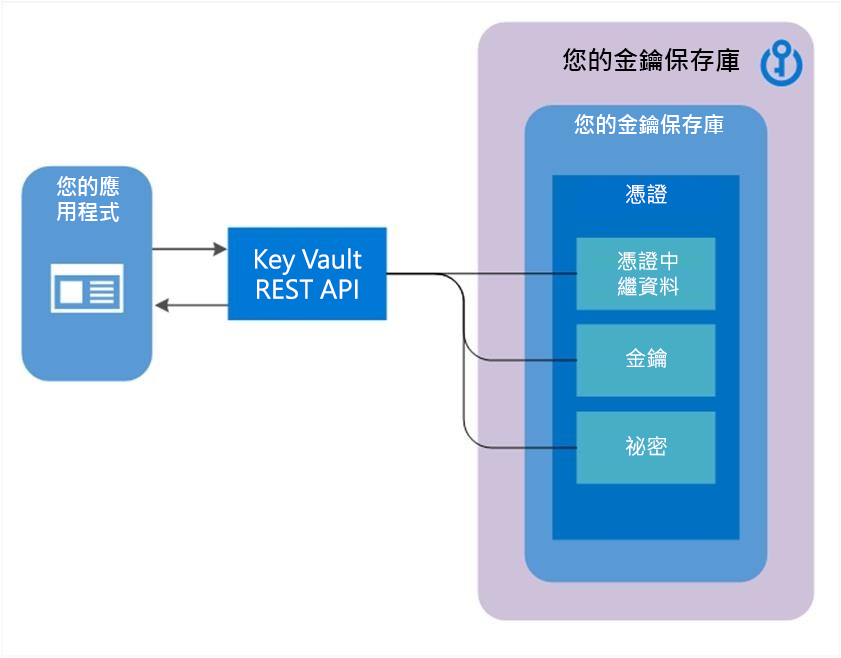

# 開始使用 Key Vault 憑證
下列情節概述 Key Vault 憑證管理服務的數個主要用法 (包括在金鑰保存庫中建立第一個憑證所需的其他步驟)。

概述下列資訊：
- 建立第一個 Key Vault 憑證
- 使用與 Key Vault 合作的憑證授權單位建立憑證
- 使用未與 Key Vault 合作的憑證授權單位建立憑證
- 匯入憑證

## 憑證是複雜物件
憑證是由連結在一起的三個相互關聯資源組成 Key Vault 憑證：憑證中繼資料、金鑰和祕密。

## 建立第一個 Key Vault 憑證  
 必須順利完成必備步驟 1 和 2，而且必須要有此使用者/組織的金鑰保存庫，才能在 Key Vault (KV) 中建立憑證。  

**步驟 1** - 憑證授權單位 (CA) 提供者  
-   以 IT 管理員、PKI 管理員或任何使用 CA 管理帳戶之人的身分上線，針對指定的公司 (例如 Contoso) 是使用 Key Vault 憑證的先決條件。  
    下列 CA 是使用 Key Vault 的目前合作提供者：  
    -   DigiCert - 密鑰保管庫提供帶有 DigiCert 的 OV TLS/SSL 證書。  
    -   全域標誌 - 密鑰保管庫提供具有全域標誌的 OV TLS/SSL 證書。  

**步驟 2** - CA 供應商的帳戶管理員創建憑據,供密鑰保管庫通過密鑰保管庫註冊、續訂和使用 TLS/SSL 證書。

**步驟 3** - Contoso 管理員與擁有憑證的 Contoso 員工 (Key Vault 使用者) (根據 CA 而定) 可以向管理員取得憑證或者直接向 CD 從帳戶取得憑證。  

- [設定憑證簽發者](/rest/api/keyvault/setcertificateissuer/setcertificateissuer)資源，開始將認證作業新增至金鑰保存庫。 憑證簽發者是 Azure Key Vault (KV) 中以 CertificateIssuer 資源表示的實體。 它用來提供 KV 憑證來源相關資訊；簽發者名稱、提供者、認證和其他系統管理詳細資訊。
  - 例如 MyDigiCertIssuer  
    -   提供者  
    -   認證 – CA 帳戶認證。 每個 CA 都有自己的特定資料。  

    如需使用 CA 提供者建立帳戶的詳細資訊，請參閱 [Key Vault 部落格](https://aka.ms/kvcertsblog)上的相關文章。  

**步驟 3.1** - 為通知設定[憑證連絡人](/rest/api/keyvault/setcertificatecontacts/setcertificatecontacts)。 這是 Key Vault 使用者的連絡人。 Key Vault 不會強制執行此步驟。  

附註 - 透過步驟 3.1 的這個流程是一次性作業。  

## 使用與 Key Vault 合作的 CA 建立憑證

**步驟 4** - 下列描述對應至上圖中的綠色編號步驟。  
  (1) - 在上圖中，您的應用程式即將建立憑證，內部流程始於在金鑰保存庫中建立金鑰。  
  (2) - 密鑰保管庫向 CA 發送 TLS/SSL 證書請求。  
  (3) - 您的應用程式會以迴圈和等待流程來輪詢 Key Vault，直到憑證完成。 Key Vault 收到含 x509 憑證的 CA 回應時，憑證建立工作即完成。  
  (4) - CA 使用 X509 TLS/SSL 憑證回應金鑰保管庫的 TLS/SSL 證書請求。  
  (5) - 您的新憑證建立是透過合併 CA 的 X509 憑證而完成。  

  Key Vault 使用者 – 指定原則來建立憑證

  -   請視需要重複  
  -   原則條件約束  
      -   X509 屬性  
      -   金鑰屬性  
      -   提供者參考 - > 例如 MyDigiCertIssure  
      -   更新資訊 - > 例如 到期之前的 90 天  

  - 憑證建立流程通常為非同步流程，並且包含輪詢金鑰保存庫中的建立憑證作業狀態。  
[取得憑證作業](/rest/api/keyvault/getcertificateoperation/getcertificateoperation)  
      -   狀態：已完成、失敗但有錯誤資訊，或已取消  
      -   因為延遲建立，所以可以起始取消作業。 取消不一定會有作用。  

## 匯入憑證  
 或者，可以將憑證匯入至 Key Vault – PFX 或 PEM。  

 匯入憑證 – 需要磁碟上有 PEM 或 PFX，並且具有私密金鑰。 
-   您必須指定：保存庫名稱和憑證名稱 (原則是選用項目)

-   PEM/PFX 檔案包含 KV 可剖析並用來填入憑證原則的屬性。 如果已指定憑證原則，則 KV 會嘗試比對 PFX/PEM 檔案中的資料。  

-   進行最後一次匯入之後，後續作業將會使用新原則 (新版本)。  

-   如果沒有進一步作業，則 Key Vault 要做的第一件事是傳送到期通知。 

-   此外，使用者可以編輯原則，而此原則是在匯入時作用，但包含匯入時未指定任何資訊的預設值。 例如 無簽發者資訊  

### 我們支援的匯入格式
我們支援以下類型的 PEM 檔案格式匯入。 單個 PEM 編碼憑證以及 PKCS_8編碼的未加密金鑰,具有以下內容

-----開始證書----- -----結束證書-----

-----BEGIN私密鑰----- -----結束私鑰-----

在證書合併時,我們支援 2 種基於 PEM 的格式。 您可以合併單個 PKCS_8 編碼證書或 base64 編碼 P7B 檔。 -----開始證書----- -----結束證書-----

我們目前不支援 PEM 格式的 EC 金鑰。

## 使用未與 Key Vault 合作的 CA 建立憑證  
 這種方法允許與 Key Vault 合作提供者以外的其他 CA 合作，這表示您的組織可以與它選擇的 CA 合作。  

  

 下列步驟描述對應至上圖中的綠色文字步驟。  

  (1) - 在上圖中，您的應用程式即將建立憑證，內部流程始於在金鑰保存庫中建立金鑰。  

  (2) - Key Vault 將憑證簽署要求 (CSR) 傳回應用程式。  

  (3) - 應用程式將 CSR 傳遞給您選擇的 CA。  

  (4) - 您選擇的 CA 回覆 X509 憑證。  

  (5) - 應用程式合併 CA 的 X509 憑證，來完成新憑證建立。

