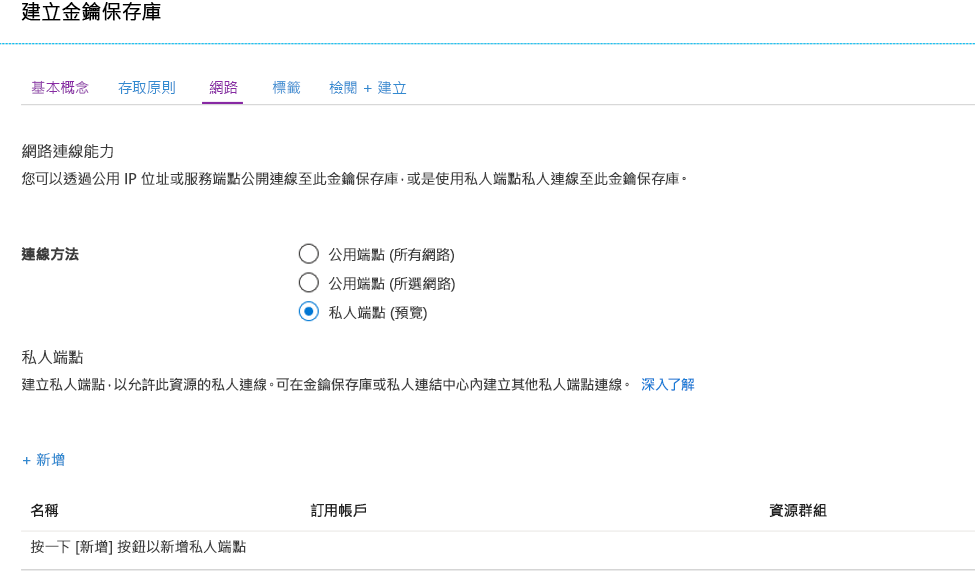
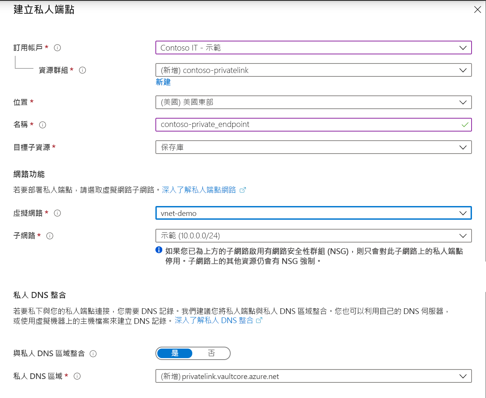
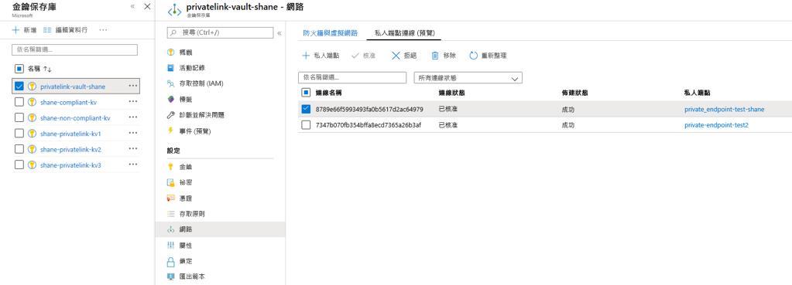

# <a name="integrate-key-vault-with-azure-private-link"></a>整合 Key Vault 與 Azure Private Link

Azure Private Link 服務可讓您透過虛擬網路中的私人端點存取各項 Azure 服務 (例如 Azure Key Vault、Azure 儲存體 和 Azure Cosmos DB)，以及 Azure 裝載的客戶/合作夥伴服務。

Azure 私人端點是一種網路介面，可讓您以私人且安全地方式連線至 Azure Private Link 所支援的服務。 私人端點會使用您 VNet 中的私人 IP 位址，有效地將服務帶入您的 VNet 中。 服務的所有流量都可以透過私人端點路由傳送，因此不需要閘道、NAT 裝置、ExpressRoute 或 VPN 連線或公用 IP 位址。 虛擬網路和服務間的流量會在通過 Microsoft 骨幹網路時隨之減少，降低資料在網際網路中公開的風險。 您可連線到 Azure 資源的執行個體，以取得最高層級的存取控制細微性。

如需詳細資訊，請參閱[何謂 Azure Private Link？](../../private-link/private-link-overview.md)

## <a name="prerequisites"></a>Prerequisites

若要整合金鑰保存庫與 Azure Private Link，您需要下列各項：

- 一個金鑰保存庫。
- Azure 虛擬網路。
- 虛擬網路中的子網路。
- 金鑰保存庫和虛擬網路的擁有者或參與者權限。

您的私人端點和虛擬網路必須位於相同區域。 當您使用入口網站選取私人端點的區域時，其只會自動篩選該區域中的虛擬網路。 您的金鑰保存庫可以位於不同區域。

您的私人端點會使用您虛擬網路中的私人 IP 位址。

## <a name="establish-a-private-link-connection-to-key-vault-using-the-azure-portal"></a>使用 Azure 入口網站建立 Key Vault 的私人連結連線 

首先，依照[使用 Azure 入口網站建立虛擬網路](../../virtual-network/quick-create-portal.md)中的步驟建立虛擬網路。

接著，您可以建立新的金鑰保存庫，或建立現有金鑰保存庫的私人連結連線。

### <a name="create-a-new-key-vault-and-establish-a-private-link-connection"></a>建立新的金鑰保存庫並建立私人連結連線

您可以遵循[使用 Azure 入口網站從 Azure Key Vault 設定和擷取祕密](../secrets/quick-create-portal.md)中的步驟，建立新的金鑰保存庫。

設定金鑰保存庫基本資料後，請選取 [網路] 索引標籤並遵循下列步驟：

1. 在 [網路] 索引標籤中選取 [私人端點] 選項按鈕。
1. 按一下 [+ 新增] 按鈕以新增私人端點。

    
 
1. 在 [建立私人端點] 刀鋒視窗的 [位置] 欄位中，選取您虛擬網路所在的區域。 
1. 在 [名稱] 欄位中，建立可讓您識別此私人端點的描述性名稱。 
1. 從下拉式功能表中選取您想要在其中建立此私人端點的虛擬網路和子網路。 
1. 讓 [與私人區域 DNS 整合] 選項保持不變。  
1. 選取 [確定]。

    
 
您現在能夠看到已設定的私人端點。 您現在可以選擇刪除和編輯此私人端點。 選取 [檢閱 + 建立] 按鈕並建立金鑰保存庫。 需要 5-10 分鐘的時間才能完成部署。 

### <a name="establish-a-private-link-connection-to-an-existing-key-vault"></a>建立現有金鑰保存庫的私人連結連線

如果您已經有金鑰保存庫，您可以遵循下列步驟來建立私人連結連線：

1. 登入 Azure 入口網站。 
1. 在搜尋列中輸入「金鑰保存庫」。
1. 從您要新增私人端點的清單中選取金鑰保存庫。
1. 選取 [設定] 底下的 [網路] 索引標籤。
1. 選取頁面頂端的 [私人端點連線] 索引標籤
1. 選取頁面頂端的 [+ 私人端點] 按鈕。

     

您可以選擇使用此刀鋒視窗為任何 Azure 資源建立私人端點。 您可以使用下拉式功能表來選取資源類型，並選取您目錄中的資源，或者可以使用資源識別碼來連線到任何 Azure 資源。 讓 [與私人區域 DNS 整合] 選項保持不變。  


## <a name="establish-a-private-link-connection-to-key-vault-using-cli"></a>使用 CLI 建立 Key Vault 的私人連結連線

### <a name="login-to-azure-cli"></a>登入 Azure CLI
```console
az login 
```
### <a name="select-your-azure-subscription"></a>選取您的 Azure 訂用帳戶 
```console
az account set --subscription {AZURE SUBSCRIPTION ID}
```
### <a name="create-a-new-resource-group"></a>建立新的資源群組 
```console
az group create -n {RG} -l {AZURE REGION}
```
### <a name="register-microsoftkeyvault-as-a-provider"></a>將 Microsoft.KeyVault 註冊為提供者 
```console
az provider register -n Microsoft.KeyVault
```
### <a name="create-a-new-key-vault"></a>建立新 Key Vault
```console
az keyvault create --name {KEY VAULT NAME} --resource-group {RG} --location {AZURE REGION}
```
### <a name="turn-on-key-vault-firewall"></a>開啟 Key Vault 防火牆
```console
az keyvault update --name {KEY VAULT NAME} --resource-group {RG} --location {AZURE REGION} --default-action deny
```
### <a name="create-a-virtual-network"></a>建立虛擬網路
```console
az network vnet create --resource-group {RG} --name {vNet NAME} --location {AZURE REGION}
```
### <a name="add-a-subnet"></a>新增子網路
```console
az network vnet subnet create --resource-group {RG} --vnet-name {vNet NAME} --name {subnet NAME} --address-prefixes {addressPrefix}
```
### <a name="disable-virtual-network-policies"></a>停用虛擬網路原則 
```console
az network vnet subnet update --name {subnet NAME} --resource-group {RG} --vnet-name {vNet NAME} --disable-private-endpoint-network-policies true
```
### <a name="add-a-private-dns-zone"></a>建立私人 DNS 區域 
```console
az network private-dns zone create --resource-group {RG} --name privatelink.vaultcore.azure.net
```
### <a name="link-private-dns-zone-to-virtual-network"></a>將私人 DNS 區域連結至虛擬網路 
```console
az network private-dns link vnet create --resoruce-group {RG} --virtual-network {vNet NAME} --zone-name privatelink.vaultcore.azure.net --name {dnsZoneLinkName} --registration-enabled true
```
### <a name="create-a-private-endpoint-automatically-approve"></a>建立私人端點 (自動核准) 
```console
az network private-endpoint create --resource-group {RG} --vnet-name {vNet NAME} --subnet {subnet NAME} --name {Private Endpoint Name}  --private-connection-resource-id "/subscriptions/{AZURE SUBSCRIPTION ID}/resourceGroups/{RG}/providers/Microsoft.KeyVault/vaults/ {KEY VAULT NAME}" --group-ids vault --connection-name {Private Link Connection Name} --location {AZURE REGION}
```
### <a name="create-a-private-endpoint-manually-request-approval"></a>建立私人端點 (手動要求核准) 
```console
az network private-endpoint create --resource-group {RG} --vnet-name {vNet NAME} --subnet {subnet NAME} --name {Private Endpoint Name}  --private-connection-resource-id "/subscriptions/{AZURE SUBSCRIPTION ID}/resourceGroups/{RG}/providers/Microsoft.KeyVault/vaults/ {KEY VAULT NAME}" --group-ids vault --connection-name {Private Link Connection Name} --location {AZURE REGION} --manual-request
```
### <a name="show-connection-status"></a>顯示連線狀態 
```console
az network private-endpoint show --resource-group {RG} --name {Private Endpoint Name}
```
## <a name="manage-private-link-connection"></a>管理私人連結連線

當您建立私人端點時，必須核准連線。 如果您要建立私人端點的資源位於您的目錄中，您就能夠核准該連線要求 (前提是您有足夠的權限)。如果您要連線到另一個目錄中的 Azure 資源，則必須等候該資源的擁有者核准您的連線要求。

佈建狀態有四種：

| 服務提供動作 | 服務取用者私人端點狀態 | 描述 |
|--|--|--|
| None | Pending | 連線會手動建立並等待 Private Link 資源擁有者進行核准。 |
| 核准 | 已核准 | 已自動或手動核准連線並可供使用。 |
| 拒絕 | 已拒絕 | 私人連結資源擁有者已拒絕連線。 |
| 移除 | 已中斷連接 | 私人連結資源擁有者已移除連線，而私人端點變成參考性，且應該刪除以進行清除。 |
 
###  <a name="how-to-manage-a-private-endpoint-connection-to-key-vault-using-the-azure-portal"></a>如何使用 Azure 入口網站管理 Key Vault 的私人端點連線 

1. 登入 Azure 管理入口網站。
1. 在搜尋列中輸入「金鑰保存庫」。
1. 選取您要管理的金鑰保存庫。
1. 選取 [網路] 索引標籤。
1. 如果有任何暫止的連線，您會在佈建狀態中看到以「暫止」列出的連線。 
1. 選取您想要核准的私人端點
1. 選取 [核准] 按鈕。
1. 如果您想拒絕任何私人端點連線 (不論是暫止要求或現有連線)，請選取連線，然後按一下 [拒絕] 按鈕。

    

##  <a name="how-to-manage-a-private-endpoint-connection-to-key-vault-using-azure-cli"></a>如何使用 Azure CLI 管理 Key Vault 的私人端點連線

### <a name="approve-a-private-link-connection-request"></a>核准 Private Link 連線要求
```console
az keyvault private-endpoint-connection approve --approval-description {"OPTIONAL DESCRIPTION"} --resource-group {RG} --vault-name {KEY VAULT NAME} –name {PRIVATE LINK CONNECTION NAME}
```

### <a name="deny-a-private-link-connection-request"></a>拒絕 Private Link 連線要求
```console
az keyvault private-endpoint-connection reject --rejection-description {"OPTIONAL DESCRIPTION"} --resource-group {RG} --vault-name {KEY VAULT NAME} –name {PRIVATE LINK CONNECTION NAME}
```

### <a name="delete-a-private-link-connection-request"></a>刪除 Private Link 連線要求
```console
az keyvault private-endpoint-connection delete --resource-group {RG} --vault-name {KEY VAULT NAME} --name {PRIVATE LINK CONNECTION NAME}
```

## <a name="validate-that-the-private-link-connection-works"></a>驗證私人連結連線是否正常運作

您應該驗證私人端點資源的相同子網路內的資源是否正透過私人 IP 位址連線到您的金鑰保存庫，而且其具有正確的私人 DNS 區域整合。

首先，依照[在 Azure 入口網站中建立 Windows 虛擬機器](../../virtual-machines/windows/quick-create-portal.md)中的步驟，建立虛擬機器。

在 [網路] 索引標籤中：

1. 指定虛擬網路和子網路。 您可以建立新的虛擬機器，或選取現有虛擬機器。 如果選取現有虛擬機器，請確定區域相符。
1. 建立公用 IP 資源。
1. 在 [NIC 網路安全性群組] 中，選取 [無]。
1. 在 [負載平衡] 中，選取 [否]。

開啟命令列並執行下列命令：

```console
nslookup <your-key-vault-name>.vault.azure.net
```

如果您執行 ns lookup 命令以透過公用端點解析金鑰保存庫的 IP 位址，您會看到如下所示的結果：

```console
c:\ >nslookup <your-key-vault-name>.vault.azure.net

Non-authoritative answer:
Name:    
Address:  (public IP address)
Aliases:  <your-key-vault-name>.vault.azure.net
```

如果您執行 ns lookup 命令以透過私人端點解析金鑰保存庫的 IP 位址，您會看到如下所示的結果：

```console
c:\ >nslookup your_vault_name.vault.azure.net

Non-authoritative answer:
Name:    
Address:  10.1.0.5 (private IP address)
Aliases:  <your-key-vault-name>.vault.azure.net
          <your-key-vault-name>.privatelink.vaultcore.azure.net
```

## <a name="limitations-and-design-considerations"></a>限制和設計考量

**價格**：如需定價資訊，請參閱 [Azure 私人連結定價](https://azure.microsoft.com/pricing/details/private-link/)。

**限制**：Azure Key Vault 的私人端點僅適用於 Azure 公用區域。

**每個金鑰保存庫的私人端點數目上限**：64。

**每個訂用帳戶具有私人端點的金鑰保存庫數目上限**：64。

如需詳細資訊，請參閱 [Azure Private Link 服務：限制](../../private-link/private-link-service-overview.md#limitations)

## <a name="next-steps"></a>後續步驟

- 深入了解 [Azure Private Link](../../private-link/private-link-service-overview.md)
- 深入了解 [Azure Key Vault](overview.md)
