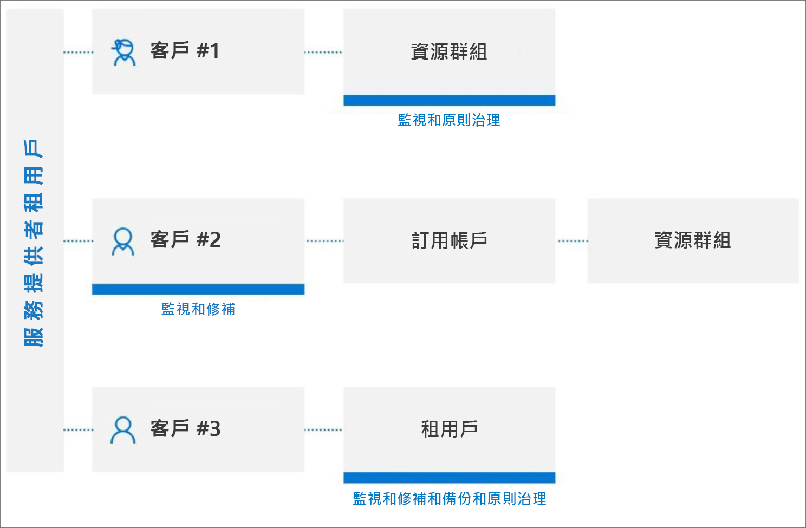

# 跨租用戶管理體驗

作為服務提供者，您可以使用 [Azure Lighthouse](../overview.md) ，從您自己的 Azure Active Directory (Azure AD) 租使用者中管理多個客戶的資源。 透過使用 [Azure 委派的資源管理](../concepts/azure-delegated-resource-management.md)，可以跨受控租使用者執行許多工和服務。

> [!TIP]
> Azure 委派的資源管理也可以用於[擁有多個 Azure AD 租用戶的企業內](enterprise.md)，以簡化跨租用戶管理。

## 瞭解租使用者和委派

Azure AD 租使用者是組織的標記法。 它是組織會在註冊 Azure、Microsoft 365 或其他服務，並與 Microsoft 建立關聯性時接收到的 Azure AD 專用執行個體。 每個 Azure AD 租用戶都不同，並與其他 Azure AD 租用戶分開，且具有自己的租用戶識別碼 (GUID)。 如需詳細資訊，請參閱[什麼是 Azure Active Directory？](../../active-directory/fundamentals/active-directory-whatis.md)

通常，服務提供者若要為客戶管理 Azure 資源，便必須使用與該客戶的租用戶相關聯的帳戶登入 Azure 入口網站，這要求客戶租用戶中的系統管理員必須為服務提供者建立並管理使用者帳戶。

使用 Azure Lighthouse 時，上執行緒序會指定服務提供者租使用者內的使用者，該使用者將能夠處理客戶租使用者中的委派訂用帳戶和資源群組。 這些使用者接著便可以使用自己的認證登入 Azure 入口網站。 在 Azure 入口網站內，他們可以管理屬於所有客戶，且其具有存取權的資源。 若要這樣做，請瀏覽 Azure 入口網站中的[我的客戶](../how-to/view-manage-customers.md)頁面，或是在 Azure 入口網站中或透過 API 直接在該客戶的訂用帳戶內容中工作。

Azure Lighthouse 可讓您更有彈性地管理多個客戶的資源，而不需要登入不同租使用者中的不同帳戶。 例如，某個服務提供者可能有兩個客戶，並針對他們都具有不同的責任和存取層級。 使用 Azure Lighthouse，授權的使用者可以登入服務提供者的租使用者，以存取這些資源。

## API 和管理工具支援

您可以直接在入口網站中，或是使用 API 與管理工具 (例如 Azure CLI 和 Azure PowerShell)，對委派的資源執行管理工作。 所有現有的 API 都可以在使用委派的資源時使用，但前提是，此功能支援跨租用戶管理，且使用者擁有適當的權限。

Azure PowerShell [>select-azsubscription 指令程式](/powershell/module/Az.Accounts/Get-AzSubscription) `HomeTenantId` 會顯示 `ManagedByTenantIds` 每個訂用帳戶的和屬性，可讓您識別所傳回的訂用帳戶屬於受管理的租使用者或您的管理租使用者。

同樣地，Azure CLI 的命令（例如 [az account list](/cli/azure/account#az-account-list) ）也會顯示 `homeTenantId` 和 `managedByTenants` 屬性。 在使用 Azure CLI 時，如果並未看到這些值，請嘗試執行 `az account clear` 並接著執行 `az login --identity` 清除快取。

在 Azure REST API 中，訂用帳戶 [-取得](/rest/api/resources/subscriptions/get) 和訂用帳戶 [-清單](/rest/api/resources/subscriptions/list) 命令也包括在內 `ManagedByTenant` 。

> [!NOTE]
> 除了與 Azure Lighthouse 相關的租使用者資訊外，這些 Api 所顯示的租使用者也可能會反映 Azure Databricks 或 Azure 受控應用程式的合作夥伴租使用者。

我們也提供執行 Azure Lighthouse 工作專屬的 Api。 如需詳細資訊，請參閱**參考**一節。

## 增強的服務與案例

大部分的工作和服務都可以對受控租用戶中委派的資源執行。 以下是跨租使用者管理特別有效的一些主要案例。

[Azure Arc](../../azure-arc/index.yml)：

- 在 [啟用規模 Azure Arc 的伺服器](../../azure-arc/servers/overview.md)上管理混合式伺服器：
  - 管理連線到 Azure 中委派的訂用帳戶和/或資源群組[之 azure 外部的 Windows Server 或 Linux 機器](../../azure-arc/servers/onboard-portal.md)
  - 使用 Azure 結構管理已連線的電腦，例如 Azure 原則和標記
  - 確定在客戶的混合式環境中套用相同的原則組
  - 使用 Azure 資訊安全中心來監視客戶的混合式環境之間的合規性
- 以大規模 [Azure Arc 啟用的 Kubernetes (preview) ](../../azure-arc/kubernetes/overview.md)管理混合式 Kubernetes 叢集：
  - [管理連線](../../azure-arc/kubernetes/connect-cluster.md) 到 Azure 中委派的訂用帳戶和/或資源群組的 Kubernetes 叢集
  - 針對已連線的叢集[使用 gitops) 將](../../azure-arc/kubernetes/use-gitops-connected-cluster.md)
  - 在連線的叢集之間強制執行原則

[Azure 自動化](../../automation/index.yml)：

- 使用自動化帳戶來存取和使用委派的資源

[Azure 備份](../../backup/index.yml)：

- [從內部部署工作負載、Azure vm、azure 檔案共用等](../..//backup/backup-overview.md#what-can-i-back-up)備份及還原客戶資料
- 使用[備份總管](../../backup/monitor-azure-backup-with-backup-explorer.md)可協助您查看備份專案的作業資訊 (包括尚未設定備份的 Azure 資源)，以及委派訂閱的監視資訊 (作業和警示)。 備份總管目前僅適用於 Azure VM 資料。
- 對多個委派訂用帳戶使用[備份報告](../../backup/configure-reports.md)可追蹤歷程記錄趨勢、分析備份儲存體耗用量，並且稽核備份和還原。

[Azure 藍圖](../../governance/blueprints/index.yml)：

- 使用 Azure 藍圖來協調資源範本和其他成品的部署， (需要 [額外的存取權](https://www.wesleyhaakman.org/preparing-azure-lighthouse-customer-subscriptions-for-azure-blueprints/) 才能準備客戶訂用帳戶) 

[Azure 成本管理 + 計費](../../cost-management-billing/index.yml)：

- 從管理租使用者，CSP 合作夥伴可以查看、管理及分析預先支付的耗用量成本 (不含購買) 適用于 Azure 方案下的客戶。 成本會以零售費率和 Azure 角色型存取控制為依據， (合作夥伴對客戶訂用帳戶所擁有的 Azure RBAC) 存取權。

[Azure Kubernetes Service (AKS)](../../aks/index.yml)：

- 管理託管的 Kubernetes 環境並部署及管理客戶租用戶內的容器化應用程式

[Azure Migrate](../../migrate/index.yml)：

- 在客戶租使用者中建立遷移專案並遷移 Vm

[Azure 監視器](../../azure-monitor/index.yml)：

- 檢視委派之訂用帳戶的警示，並能夠在所有訂用帳戶之間檢視警示
- 檢視委派之訂用帳戶的活動記錄詳細資料
- Log analytics：從多個租使用者中的遠端工作區查詢資料
- 在客戶租使用者中建立警示，以透過 webhook 在管理租使用者中觸發自動化（例如 Azure 自動化 runbook 或 Azure Functions）
- 在客戶租使用者中建立診斷設定，以將資源記錄傳送至管理租使用者中的工作區
- 針對 SAP 工作負載， [使用跨客戶租使用者的匯總視圖來監視 Sap 解決方案計量](https://techcommunity.microsoft.com/t5/running-sap-applications-on-the/using-azure-lighthouse-and-azure-monitor-for-sap-solutions-to/ba-p/1537293)

[Azure 網路](../../networking/networking-overview.md)：

- 在受控租使用者中部署和管理 [Azure 虛擬網路](../../virtual-network/index.yml) 和虛擬網路介面卡 (vnic) 
- 部署和設定 [Azure 防火牆](../../firewall/overview.md)，以保護客戶的虛擬網路資源
- 管理聯機服務，例如 [Azure 虛擬 WAN](../../virtual-wan/virtual-wan-about.md)、 [ExpressRoute](../../expressroute/expressroute-introduction.md)和 [VPN 閘道](../../vpn-gateway/vpn-gateway-about-vpngateways.md)
- 使用 Azure Lighthouse 支援 [Azure 網路 MSP 計畫](../../networking/networking-partners-msp.md)的重要使用情況

[Azure 原則](../../governance/policy/index.yml) \(部分機器翻譯\)：

- 顯示委派之訂用帳戶內的已指派原則詳細資料的合規性快照集
- 在委派的訂用帳戶內建立和編輯原則定義
- 在委派的訂用帳戶內指派客戶定義的原則定義
- 客戶會看到由服務提供者所撰寫的原則，以及他們自己撰寫的所有原則
- 可以 [補救 deployIfNotExists 或修改受管理租使用者內的指派](../how-to/deploy-policy-remediation.md)

[Azure Resource Graph](../../governance/resource-graph/index.yml) \(部分機器翻譯\)：

- 現在在傳回的查詢結果中包含租使用者識別碼，可讓您識別訂用帳戶是否屬於受管理的租使用者

[Azure 資訊安全中心](../../security-center/index.yml)：

- 跨租用戶可見性
  - 監視安全性原則的合規性，並確保安全性涵蓋範圍會涵蓋所有租用戶的資源
  - 單一視圖中跨多個租使用者的連續法規合規性監視
  - 透過安全分數計算對可採取動作的安全性建議進行監視、分級和設定優先權
- 跨租用戶安全性狀態管理
  - 管理安全性原則
  - 透過可採取動作的安全性建議對不符合規範的資源採取動作
  - 收集及儲存安全性相關的資料
- 跨租用戶威脅偵測和保護
  - 偵測租用戶資源上的威脅
  - 套用進階威脅防護控制措施，例如 Just-In-Time (JIT) VM 存取
  - 透過自適性網路強化來強化網路安全性群組設定
  - 透過自適性應用程式控制來確保伺服器只會執行適當的應用程式與處理序
  - 透過檔案完整性監視 (FIM) 來監視對重要檔案與登錄的變更
- 請注意，整個訂用帳戶必須委派給管理租使用者;委派的資源群組不支援 Azure 資訊安全中心案例

[Azure Sentinel](../../sentinel/multiple-tenants-service-providers.md)：

- 管理[客戶租用戶](../../sentinel/multiple-tenants-service-providers.md)中的 Azure Sentinel 資源
- [追蹤跨多個租使用者的攻擊和查看安全性警示](https://techcommunity.microsoft.com/t5/azure-sentinel/using-azure-lighthouse-and-azure-sentinel-to-monitor-across/ba-p/1043899)
- 跨租使用者跨多個 Sentinel 工作區[查看事件](../../sentinel/multiple-workspace-view.md)

[Azure 服務健康情況](../../service-health/index.yml)：

- 透過 Azure 資源健康情況來監視客戶資源的健康情況
- 追蹤客戶所使用之 Azure 服務的健康情況

[Azure Site Recovery](../../site-recovery/index.yml)：

- 在客戶租使用者中管理 Azure 虛擬機器的嚴重損壞修復選項 (請注意，您無法使用 `RunAs` 帳戶來複製 VM 延伸模組) 

[Azure 虛擬機器](../../virtual-machines/index.yml) \(部分機器翻譯\)：

- 使用虛擬機器擴充功能，在 Azure Vm 上提供部署後設定和自動化工作
- 使用開機診斷對 Azure Vm 進行疑難排解
- 使用序列主控台存取 Vm
- 使用 [受控識別透過原則](https://github.com/Azure/Azure-Lighthouse-samples/tree/master/templates/create-keyvault-secret)，將 vm 與密碼、秘密或密碼編譯金鑰的 Azure Key Vault 整合，以確保秘密儲存在受控租使用者的 Key Vault 中
- 請注意，您不能使用 Azure Active Directory 對 Vm 進行遠端登入

支援要求：

- 在委派資源的 Azure 入口網站中，從 [說明[ **+ 支援**] 開啟支援要求](../../azure-portal/supportability/how-to-create-azure-support-request.md#getting-started)， (選取可供委派範圍使用的支援方案) 

## 目前的限制

在所有案例中，請留意下列目前限制：

- 您可以使用 Azure Lighthouse 來執行 Azure Resource Manager 處理的要求。 這些要求的作業 URI 會以 `https://management.azure.com` 作為開頭。 不過，Azure Lighthouse 不支援 (資源類型的實例所處理的要求，例如 Key Vault 秘密存取或儲存體資料存取) 。 這些要求的作業 URI 通常會以您執行個體特有的位址作為開頭，例如 `https://myaccount.blob.core.windows.net` 或 `https://mykeyvault.vault.azure.net/`。 此外，後者通常是資料作業，而非管理作業。
- 角色指派必須使用 [Azure 內建角色](../../role-based-access-control/built-in-roles.md)。 除了擁有者或任何具有許可權的內建角色之外，Azure 委派的資源管理目前支援所有內建角色 [`DataActions`](../../role-based-access-control/role-definitions.md#dataactions) 。 只有在[將角色指派給受控識別](../how-to/deploy-policy-remediation.md#create-a-user-who-can-assign-roles-to-a-managed-identity-in-the-customer-tenant)時，才支援「使用者存取系統管理員」角色的有限用途。  此外，不支援自訂角色與[傳統訂用帳戶管理員角色](../../role-based-access-control/classic-administrators.md) \(部分機器翻譯\)。
- 雖然您可以讓使用 Azure Databricks 的訂用帳戶上線，但管理租用戶中的使用者目前無法在委派的訂閱上啟動 Azure Databricks 的工作區。
- 雖然您可以讓具有資源鎖定的訂用帳戶和資源群組上線，但這些鎖定不會防止使用者在管理租使用者中執行動作。 [拒絕指派](../../role-based-access-control/deny-assignments.md)可保護系統管理的資源，例如由 Azure 管理的應用程式或 Azure 藍圖所建立的資源 (系統指派的拒絕指派)，因此可防止管理租用戶中的使用者在這些資源上執行動作；不過，目前客戶租用戶中的使用者無法建立自己的拒絕指派 (使用者指派的拒絕指派)。

## 後續步驟

- [使用 Azure Resource Manager 範本](../how-to/onboard-customer.md)或將[私人或公用受控服務供應專案發佈至 Azure Marketplace](../how-to/publish-managed-services-offers.md)，讓您的客戶上線 Azure Lighthouse。
- 前往 Azure 入口網站中的 [我的客戶]，以[檢視及管理客戶](../how-to/view-manage-customers.md)。
