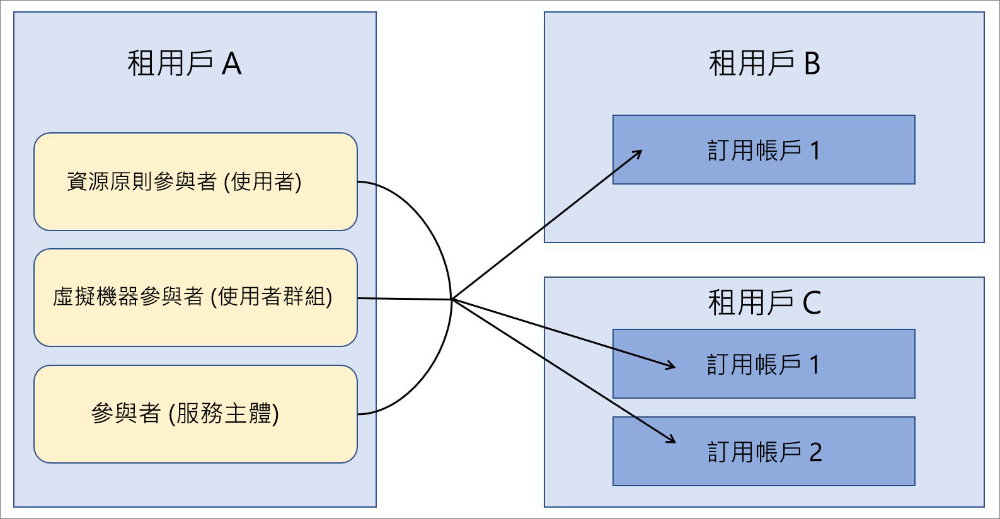

# Azure Lighthouse 在企業案例中的運用

[Azure 燈塔](../overview.md)的常見案例是在其客戶的 Azure Active Directory (Azure AD) 租使用者中管理資源的服務提供者。 不過，Azure 燈塔的功能也可以用來在使用多個 Azure AD 租使用者的企業內簡化跨租使用者管理。

## 單一與多個租用戶的比較

對於大部分的組織而言，單一 Azure AD 租用戶的管理比較輕鬆。 讓一個租用戶內的所有資源，都可由指定的使用者、使用者群組，或該租用戶內的服務主體集中進行管理工作。 我們建議盡可能讓貴組織使用一個租用戶。 不過，某些組織可能會有多個 Azure AD 的租使用者。 有時候，這可能是暫時性的情況，像是在進行收購時，還有長期的租使用者匯總策略尚未定義。 有時候，組織可能需要持續維護多個租使用者，因為完全獨立的子公司、地理或法律需求，或其他考慮。

在需要多租使用者架構的情況下，Azure 燈塔可協助集中化和簡化管理作業。 藉由使用[Azure 委派的資源管理](azure-delegated-resource-management.md)，一個管理租使用者中的使用者可以透過集中、可擴充的方式來執行[跨租使用者管理功能](cross-tenant-management-experience.md)。

## 租用戶管理架構

若要在企業中使用 Azure 燈塔，您必須判斷哪個租使用者將包含在其他租使用者上執行管理作業的使用者。 換句話說，您必須判斷哪個租使用者將是其他租使用者的管理租使用者。

例如，假設您的組織有一個租使用者，我們將會呼叫*租使用者 a*。您的組織接著會取得*租使用者 B*和*租使用者 C*，而且您有商業理由需要您將其維護為個別租使用者。

貴組織想要在所有租用戶中使用相同的原則定義、備份做法和安全性程序。 由於租使用者 A 已經包含負責這些工作的使用者，因此您可以在租使用者 B 和租使用者 C 內上線訂用帳戶，讓租使用者 A 中的相同使用者執行這些工作。

## 安全性和存取考量

在大部分的企業案例中，您會想要將完整訂用帳戶委派給 Azure 燈塔。 您也可以選擇只委派訂用帳戶內的特定資源群組。

無論如何，[在定義哪些使用者可以存取委派的資源時，請務必遵循最低許可權的原則](recommended-security-practices.md#assign-permissions-to-groups-using-the-principle-of-least-privilege)。 這麼做有助於確保使用者只擁有執行必要工作所需的權限，並可減少意外錯誤的機會。

Azure 燈塔只提供管理租使用者與受管理租使用者之間的邏輯連結，而不是實際移動資料或資源。 此外，存取一律只限單一方向：從管理租用戶到受控租用戶。  管理租用戶中的使用者和群組在對受控租用戶資源執行管理作業時，應繼續使用多重要素驗證。

具有內部或外部治理和合規性防護的企業可以使用 [Azure 活動記錄](../../azure-monitor/platform/platform-logs-overview.md)來符合其透明度需求。 當企業租使用者已建立管理和管理租使用者關聯性時，每個租使用者中的使用者都可以查看記錄的活動，以查看使用者在管理租使用者中所採取的動作。

## 上架考慮

訂用帳戶) 中 (或資源群組，可以藉由部署 Azure Resource Manager 範本，或透過發佈至 Azure Marketplace 的受控服務供應專案，來上架至 Azure 燈塔。

由於企業使用者通常可以直接存取企業的租使用者，而不需要市場或推廣管理供應專案，因此部署 Azure Resource Manager 範本通常會更快速、更直接。 雖然上線[指導](../how-to/onboard-customer.md)方針指的是服務提供者和客戶，但企業可以使用相同的程式來將其租使用者上架。

如果您想要，[將受控服務供應項目發佈至 Azure Marketplace](../how-to/publish-managed-services-offers.md)，即可在企業內將租用戶上架。 若要確保供應項目僅適用於適當的租用戶，請確定您的方案已標示為私人。 使用私人方案時，您會提供您打算上架之每個租使用者的訂用帳戶識別碼，而其他人將無法取得您的供應專案。

## 術語注意事項

對於企業內的跨租使用者管理，您可以瞭解 Azure 燈塔檔中的服務提供者參考，以套用至企業內的管理租使用者，也就是包含將透過 Azure 燈塔在其他租使用者中管理資源的使用者。 同樣地，您也可以瞭解對客戶的任何參考，將其委派給要透過管理租使用者中的使用者管理的資源。

例如，在上述範例中，可以將租用戶 A 視為服務提供者租用戶 (管理租用戶)，而租用戶 B 和租用戶 C 則被視為客戶租用戶。

在該範例中，具有適當權限的租用戶 A 使用者可以在 Azure 入口網站的 [我的客戶]**** 頁面中，[檢視和管理委派的資源](../how-to/view-manage-customers.md)。 同樣地，具有適當權限的租用戶 B 和租用戶 C 使用者可以在 Azure 入口網站的 [服務提供者]**** 頁面中，[檢視和管理已被委派的資源](../how-to/view-manage-service-providers.md)。

## 後續步驟

- 了解[跨租用戶管理體驗](cross-tenant-management-experience.md)。
- 了解 [Azure 委派的資源管理](azure-delegated-resource-management.md)。