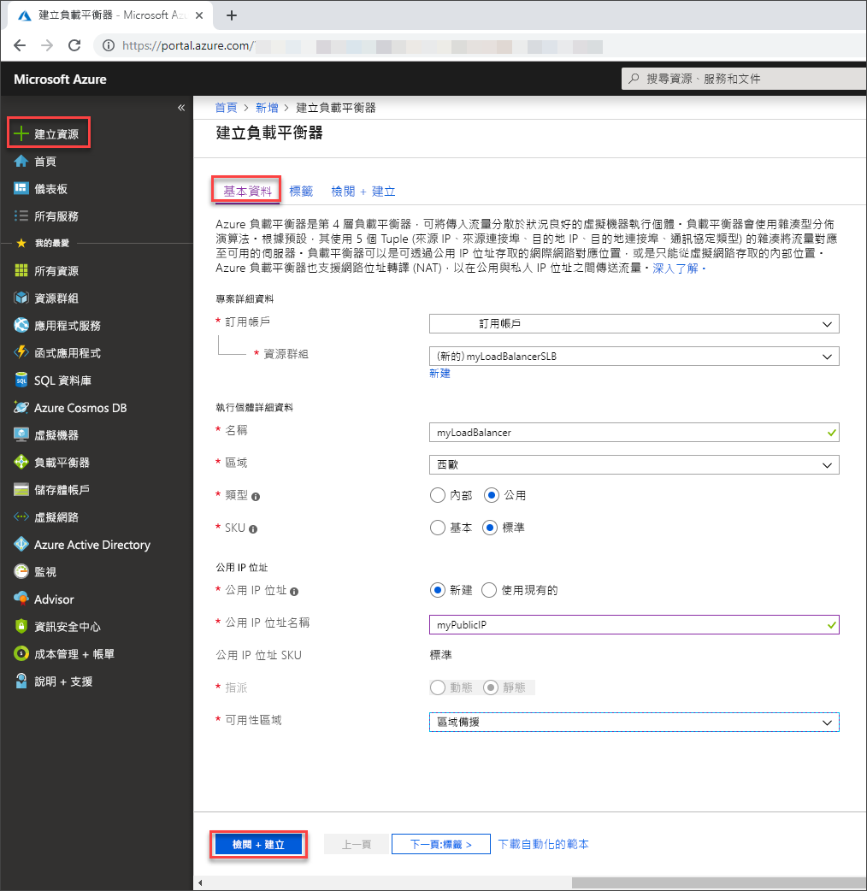

# 使用 Azure 門戶在標準負載等化器中配置負載平衡和出站規則

本文介紹如何使用 Azure 門戶在標準負載等化器中配置出站規則。  

負載等化器資源包含兩個前端及其關聯規則。 對於入站流量，您有一個前端，另一個前端用於出站流量。  

每個前端引用公共 IP 位址。 在這種情況下，入站流量的公共 IP 位址與出站流量的位址不同。   負載平衡規則僅提供入站負載平衡。 出站規則控制 VM 的出站網路位址轉譯 （NAT）。  

該方案使用兩個後端池：一個用於入站流量，一個用於出站流量。 這些池說明了功能，並為方案提供了靈活性。

如果您沒有 Azure 訂用帳戶，請在開始前建立[免費帳戶](https://azure.microsoft.com/free/?WT.mc_id=A261C142F)。 

## 登入 Azure

登錄到 中的[https://portal.azure.com](https://portal.azure.com)Azure 門戶。

## 建立負載平衡器

在本節中，您將創建一個負載等化器，用於負載平衡虛擬機器。 您可以創建公共負載等化器或內部負載等化器。 創建公共負載等化器時，將創建新的公共 IP 位址，該位址配置為負載等化器的前端。 預設情況下，前端將命名為 **"負載平衡器前端**"。

1. 在螢幕的左上角，選擇 **"創建資源** > **網路** > **負載平衡器**"。
2. 在 **"創建負載等化器**"頁的 **"基礎知識**"選項卡中，輸入或選擇以下資訊：

    | 設定                 | 值                                              |
    | ---                     | ---                                                |
    | 訂用帳戶               | 選取您的訂用帳戶。    |    
    | 資源群組         | 選取 [新建]****，並在文字方塊中輸入 **myResourceGroupSLB**。|
    | 名稱                   | **myLoadBalancer**                                   |
    | 區域         | 選取 [西歐]****。                                        |
    | 類型          | 選取 [公用]****。                                        |
    | SKU           | 選取 [標準]**** 或 [基本]****。 Microsoft 建議對生產工作負載使用「標準」。 |
    | 公用 IP 位址 | 選取 [建立新的]****。 如果您有要使用的現有公共 IP，請選擇"**使用現有**IP"。  現有公共 IP 必須是**標準**SKU。  基本公共 IP 與**標準**SKU 負載等化器不相容。  |
    | 公用 IP 位址名稱              | 在文字方塊中輸入 **myPublicIP**。|
    | 可用性區域 | 選擇**區域冗余**以創建彈性負載平衡器。 若要建立區域性 Load Balancer，請從 1、2 或 3 選取特定區域 |

3. 接受配置其餘部分的預設值。
4. 選擇 **"審閱" 創建**

    > [!IMPORTANT]
    > 此快速入門的其餘部分假定**標準**SKU 是在上述 SKU 選擇過程中選擇的。

5. 在 [檢閱 + 建立]**** 索引標籤中，選取 [建立]****。   

    

## 建立負載平衡器資源

在本節中，您會設定後端位址集區的負載平衡器設定、健康狀態探查，並指定平衡器規則。

### 建立後端集區

後端位址集區包含後端池中虛擬 NIC 的 IP 位址。 建立後端位址集區 **myBackendPool**，以包含用於平衡網際網路流量負載的虛擬機器。

1. 選取左側功能表中的 [所有服務]****、選取 [所有資源]****，然後從資源清單中選取 **myLoadBalancer**。
2. 在 [設定]**** 底下選取 [後端集區]****，然後選取 [新增]****。
3. 在 [新增後端集區]**** 頁面上，針對名稱輸入 **myBackEndPool** 作為後端集區的名稱，然後選取 [新增]****。

### 建立健康狀態探查

運行狀況探測器用於監視應用的狀態。 運行狀況探測根據對運行狀況檢查的回應從負載等化器中添加或刪除 VM。 建立健康狀態探查 myHealthProbe**** 以監視 VM 的健康狀態。

1. 選取左側功能表中的 [所有服務]****、選取 [所有資源]****，然後從資源清單中選取 **myLoadBalancer**。
2. 在 [設定]**** 底下選取 [健康狀態探查]****，然後選取 [新增]****。
    
    | 設定 | 值 |
    | ------- | ----- |
    | 名稱 | 輸入 **myHealthProbe**。 |
    | 通訊協定 | 選取 [HTTP]****。 |
    | 連接埠 | 輸入 **80**。|
    | 間隔 | 輸入 **15** 作為探查嘗試之間的 [間隔] **** 秒數。 |
    | 狀況不良臨界值 | 選取 [2]**** 作為 [狀況不良閾值]**** 的數值，或將 VM 視為狀況不良之前，必須達到的連續探查失敗次數。|
    | | |
4. 選取 [確定]****。

### 建立負載平衡器規則
負載平衡器規則用來定義如何將流量分散至 VM。 

定義：
 - 傳入流量的前端 IP 配置。
 - 接收流量的後端 IP 池。
 - 所需的源和目標埠。 

在以下部分中，您將創建一個：
 - 負載等化器規則**myHTTPRule**用於偵聽埠 80。
 - 前端**負載平衡前置**。
 - 後端位址集區**我的BackEnd池**也使用埠 80。 

1. 選取左側功能表中的 [所有服務]****、選取 [所有資源]****，然後從資源清單中選取 **myLoadBalancer**。
2. 在 [設定]**** 下選取 [負載平衡規則]****，然後選取 [新增]****。
3. 使用下列值來設定負載平衡規則：
    
    | 設定 | 值 |
    | ------- | ----- |
    | 名稱 | 輸入 **myHTTPRule**。 |
    | 通訊協定 | 選擇**TCP**。 |
    | 連接埠 | 輸入 **80**。|
    | 後端連接埠 | 輸入 **80**。 |
    | 後端集區 | 選取 [myBackendPool]****。|
    | 健全狀況探查 | 選取 [myHealthProbe]****。 |
    | 創建隱式出站規則 | 選取 [否]****。 我們將在後面的部分使用專用公共 IP 創建出站規則。 |
4. 保留其餘的預設值，然後選取 [確定]****。

## 創建出站規則配置
負載等化器出站規則為後端池中的 VM 配置出站 SNAT。 

### 創建出站公共 IP 位址和前端

1. 選取左側功能表中的 [所有服務]****、選取 [所有資源]****，然後從資源清單中選取 **myLoadBalancer**。

2. 在 **"設置"** 下，選擇 **"前端 IP 配置**"，然後選擇"**添加**"。

3. 使用以下值為出站配置前端 IP 配置：

    | 設定 | 值 |
    | ------- | ----- |
    | 名稱 | 輸入**負載平衡器前端出站**。 |
    | IP 版本 | 選取 [IPv4]****。 |
    | IP 類型 | 選擇**IP 位址**。|
    | 公用 IP 位址 | 選取 [建立新的]****。 在**添加公共 IP 位址中**，輸入**我的公共IP出站**。  選取 [確定]****。 |

4. 選取 [加入]****。

### 創建出站後端池

1. 選取左側功能表中的 [所有服務]****、選取 [所有資源]****，然後從資源清單中選取 **myLoadBalancer**。

2. 在 [設定]**** 底下選取 [後端集區]****，然後選取 [新增]****。

3. 在"**添加後端池**"頁上，請鍵入**myBackendPool出站**，作為後端池的名稱，然後選擇"**添加**"。

### 建立輸出規則

1. 選取左側功能表中的 [所有服務]****、選取 [所有資源]****，然後從資源清單中選取 **myLoadBalancer**。

2. 在 **"設置"** 下，選擇**出站規則**，然後選擇 **"添加**"。

3. 使用這些值配置出站規則：

    | 設定 | 值 |
    | ------- | ----- |
    | 名稱 | 輸入**我的出站規則**。 |
    | 前端 IP 位址 | 選擇**負載平衡器前端出站**。 |
    | 閒置逾時 (分鐘) | 將滑塊移動到 +15 分鐘。|
    | TCP 重置 | 選取 [已啟用]****。|
    | 後端集區 | 選擇**我的後端池出站** |
    | 埠分配 -> 埠分配 | 選擇**手動選擇出站埠數** |
    | 出站埠 -> 選擇 | **每個實例選擇埠** |
    | 出站埠 -每個實例>埠 | 輸入**10，000**。 |

4. 選取 [加入]****。

## 清除資源

若不再需要，可刪除資源群組、負載平衡器和所有相關資源。 選擇包含負載等化器的資源組**myResourceGroupSLB，** 然後選擇 **"刪除**"。

## 後續步驟

本文內容：
 - 您創建了一個標準負載等化器。
 - 已配置入站和出站負載平衡器流量規則。
 - 為後端池中的 VM 配置了運行狀況探測。 

要瞭解更多資訊，請繼續訪問[Azure 負載等化器](tutorial-load-balancer-standard-public-zone-redundant-portal.md)的教程。
