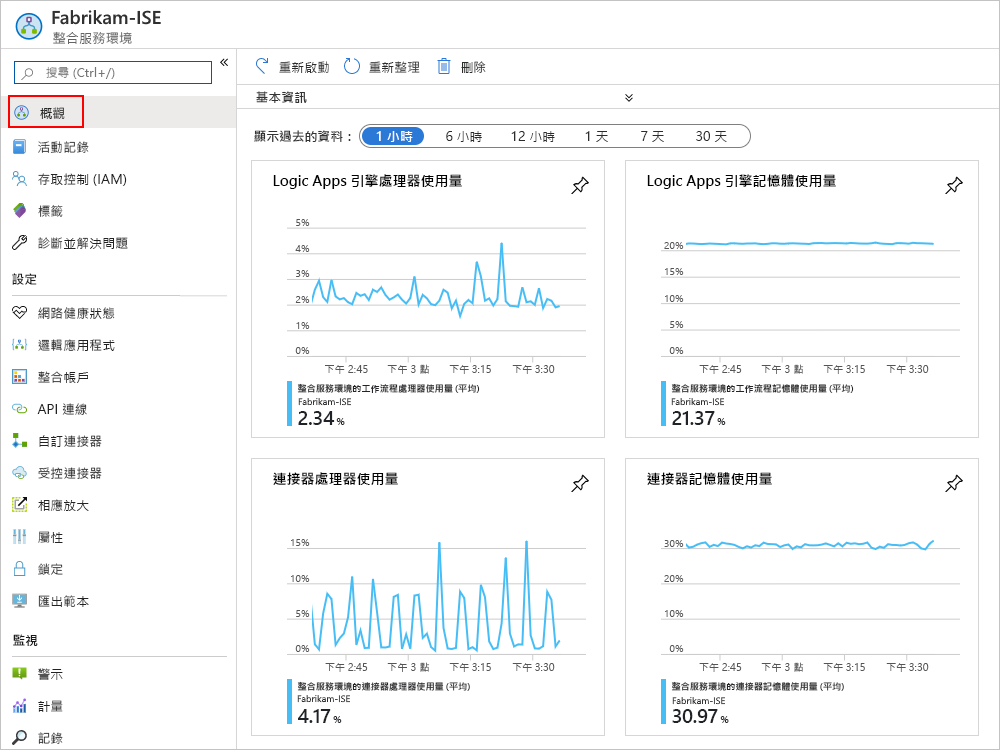

# 在 Azure Logic Apps 中管理您的整合服務環境 (ISE)

本文說明如何為您的 [整合服務環境 (ISE) ](../logic-apps/connect-virtual-network-vnet-isolated-environment-overview.md)執行管理工作，例如：

* 管理資源，例如您 ISE 中的邏輯應用程式、連線、整合帳戶和連接器。
* 檢查 ISE 的網路健康狀態。
* 請依照本主題中的步驟，新增容量、重新開機 ISE 或刪除您的 ISE。 若要將這些構件新增至 ISE，請參閱 [將構件新增至您的整合服務環境](../logic-apps/add-artifacts-integration-service-environment-ise.md)。

## 查看您的 ISE

1. 登入 [Azure 入口網站](https://portal.azure.com)。

1. 在入口網站的搜尋方塊中，輸入「整合服務環境」，然後選取 [ **整合服務環境**]。

   

1. 從結果清單中，選取您的整合服務環境。

   

1. 繼續閱讀下一節，以尋找您 ISE 中的邏輯應用程式、連線、連接器或整合帳戶。

## 檢查網路健康狀態

在 ISE 功能表的 [ **設定**] 底下，選取 [ **網路健康**情況]。 此窗格會顯示您子網的健康情況狀態，以及其他服務的輸出相依性。

## 管理您的邏輯應用程式

您可以查看和管理您 ISE 中的邏輯應用程式。

1. 在 ISE 功能表的 [ **設定**] 底下，選取 [ **邏輯應用程式**]。

   

1. 若要移除您在 ISE 中不再需要的邏輯應用程式，請選取這些邏輯應用程式，然後選取 [ **刪除**]。 若要確認您想要刪除，請選取 **[是]**。

> [!NOTE]
> 如果您刪除並重新建立子邏輯應用程式，則必須重新儲存父邏輯應用程式。 重新建立的子應用程式將會有不同的中繼資料。
> 如果您未在重新建立父邏輯應用程式之後重新儲存它的子系，您對子邏輯應用程式的呼叫將會失敗，並出現「未經授權」的錯誤。 此行為適用于父子式邏輯應用程式，例如使用整合帳戶中的成品或呼叫 Azure 函式的應用程式。

## 管理 API 連接

您可以查看和管理在 ISE 中執行的邏輯應用程式所建立的連接。

1. 在 ISE 功能表的 [ **設定**] 底下，選取 [ **API**連線]。

   

1. 若要移除您在 ISE 中不再需要的連接，請選取這些連線，然後選取 [ **刪除**]。 若要確認您想要刪除，請選取 **[是]**。

## 管理 ISE 連接器

您可以查看和管理部署至 ISE 的 API 連接器。

1. 在 ISE 功能表的 [ **設定**] 底下，選取 [ **受管理的連接器**]。

   

1. 若要移除您不想要在 ISE 中使用的連接器，請選取這些連接器，然後選取 [ **刪除**]。 若要確認您想要刪除，請選取 **[是]**。

## 管理自訂連接器

您可以查看和管理您部署至 ISE 的自訂連接器。

1. 在 ISE 功能表的 [ **設定**] 底下，選取 [ **自訂連接器**]。

   

1. 若要移除您在 ISE 中不再需要的自訂連接器，請選取這些連接器，然後選取 [ **刪除**]。 若要確認您想要刪除，請選取 **[是]**。

## 管理整合帳戶

1. 在 ISE 功能表的 [ **設定**] 底下，選取 [ **整合帳戶**]。

   

1. 若要在不再需要時從 ISE 移除整合帳戶，請選取這些整合帳戶，然後選取 [ **刪除**]。

## 新增 ISE 容量

Premium ISE 基礎單位有固定容量，因此如果您需要更多的輸送量，您可以在建立期間或之後新增更多縮放單位。 開發人員 SKU 不包含新增縮放單位的功能。

1. 在 [Azure 入口網站](https://portal.azure.com)中，移至您的 ISE。

1. 若要檢查 ISE 的使用方式和效能計量，請在 ISE 功能表上選取 **[總覽**]。

   

1. 在 [ **設定**] 底下，選取 [ **相應**放大]。在 [ **設定** ] 窗格中，從下列選項中選取：

   * [**手動調整**](#manual-scale)：根據您要使用的處理單位數目來調整規模。
   * [**自訂自動**](#custom-autoscale)調整：選取各種準則並指定符合準則的閾值條件，以根據效能計量進行調整。

   ![螢幕擷取畫面，顯示已選取 [手動調整規模] 的 [Scale out] 頁面。](./media/ise-manage-integration-service-environment/select-scale-out-options.png)

### 手動調整

1. 選取 [ **手動調整**] 之後，請針對 [ **額外容量**] 選取您要使用的縮放單位數目。

   

1. 完成時，選取 [儲存]。

### 自訂自動調整

1. 選取 [ **自訂自動**調整] 之後，在 [ **自動調整設定名稱**] 中，為您的設定提供名稱，並選擇性地選取設定所屬的 Azure 資源群組。

   

1. 針對 **預設** 條件，請選取 [ **根據度量調整規模** ] 或 [ **調整為特定實例計數**]。

   * 如果您選擇 [以實例為基礎]，請輸入處理單位的數目，也就是從0到10的值。

   * 如果您選擇 [以度量為基礎]，請遵循下列步驟：

     1. 在 [ **規則** ] 區段中，選取 [ **新增規則**]。

     1. 在 [ **調整規模規則** ] 窗格中，設定要在規則引發時採取的準則和動作。

     1. 在 [ **實例限制**] 中，指定下列值：

        * **最小值**：要使用的處理單位數目下限
        * **最大值**：要使用的處理單位數目上限
        * **預設值**：如果在讀取資源計量時發生任何問題，而且目前的容量低於預設容量，自動調整會相應放大為預設的處理單位數目。 不過，如果目前的容量超過預設容量，自動調整規模將不會縮小。

1. 若要新增另一個條件，請選取 [ **新增調整規模條件**]。

1. 當您完成自動調整設定之後，請儲存您的變更。

## 重新開機 ISE

如果您變更 DNS 伺服器或 DNS 伺服器設定，則必須重新啟動您的 ISE，讓 ISE 能夠收取這些變更。 重新開機 Premium SKU ISE 不會造成停機，因為回收期間一次重新開機一個的冗余和元件。 不過，開發人員的 SKU ISE 因為沒有冗余存在而發生停機。 如需詳細資訊，請參閱 [ISE sku](../logic-apps/connect-virtual-network-vnet-isolated-environment-overview.md#ise-level)。

1. 在 [Azure 入口網站](https://portal.azure.com)中，移至您的 ISE。

1. 在 ISE 功能表上，選取 **[總覽**]。 在 [總覽] 工具列上， **重新開機**。

   

## 刪除 ISE

在刪除您不再需要的 ISE 或包含 ISE 的 Azure 資源群組之前，請確認您在包含這些資源的 Azure 資源群組或您的 Azure 虛擬網路上沒有任何原則或鎖定，因為這些專案可以封鎖刪除。

刪除 ISE 之後，您可能必須等候最多9小時，才能嘗試刪除您的 Azure 虛擬網路或子網。

## 後續步驟

* [將資源新增到整合服務環境](../logic-apps/add-artifacts-integration-service-environment-ise.md)