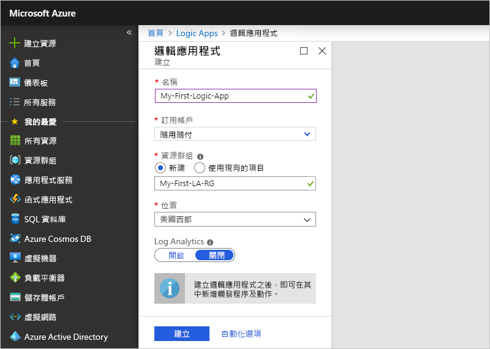
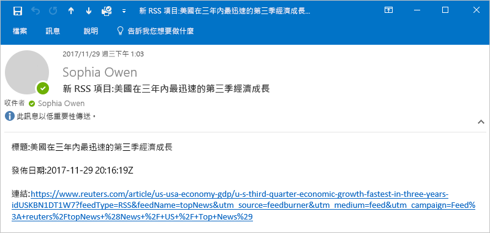

# 快速入門：建立第一個 Logic Apps 工作流程 - Azure 入口網站

本快速入門說明如何透過 [Azure 入口網站](https://portal.azure.com)，在 [Azure Logic Apps](logic-apps-overview.md) 中建立您的第一個工作流程。 本簡介指南也會說明 Logic Apps 服務的基本概念，包括如何建立新的邏輯應用程式、將觸發程式和動作新增至邏輯應用程式，以及測試邏輯應用程式。 請遵循此快速入門來建立範例邏輯應用程式，以定期檢查 RSS 摘要並傳送新專案的電子郵件通知。 下列螢幕擷取畫面顯示此範例邏輯應用程式的高階工作流程：

如果要了解如何透過其他介面和應用程式來建立和管理第一個邏輯應用程式，請參閱下列其他 Logic Apps 快速入門： 

* [使用 Azure 命令列介面 (Azure CLI) 建立並管理邏輯應用程式](quickstart-logic-apps-azure-cli.md)
* [在 Visual Studio Code 中建立及管理邏輯應用程式](quickstart-create-logic-apps-visual-studio-code.md)
* [在 Visual Studio 中建立及管理邏輯應用程式](quickstart-create-logic-apps-with-visual-studio.md)

## Prerequisites

* Azure 訂用帳戶。 如果您沒有訂用帳戶，請[註冊免費 Azure 帳戶](https://azure.microsoft.com/free/?WT.mc_id=A261C142F)。
* Logic Apps 支援的服務電子郵件帳戶 (例如 Office 365 Outlook 或 Outlook.com) 所提供的電子郵件帳戶。 對於其他支援的電子郵件提供者，請[檢閱連接器清單](/connectors/)。

    > [!IMPORTANT]
    > 如果要使用[ Gmail 連接器](/connectors/gmail/)，請注意只有 G-Suite 帳戶可以在 Logic Apps 中使用此連接器，而不受限制。 如果您有 Gmail 取用者帳戶，您只能使用此連接器搭配特定的 Google 核准服務，除非您[建立 Google 用戶端應用程式，以用來向 Gmail 連接器進行驗證](/connectors/gmail/#authentication-and-bring-your-own-application)。 如需詳細資訊，請參閱 [Azure Logic Apps 中 Google 連接器的資料安全性和隱私權原則](../connectors/connectors-google-data-security-privacy-policy.md)。

## 建立邏輯應用程式

1. 使用您的 Azure 帳戶認證登入 [Azure 入口網站](https://portal.azure.com)。

1. 在 Azure 入口網站搜尋方塊中輸入 `logic apps`，然後選取 [Logic Apps]。

   

1. 在 [邏輯應用程式] 頁面上，選取 [新增]。

   

1. 在 **Logic Apps** 窗格中，提供邏輯應用程式的基本詳細資料和設定。 基於此範例邏輯應用程式，建立新的[資源群組](../azure-resource-manager/management/overview.md#terminology)。
    
   | 屬性 | 值 | 描述 |
   |----------|-------|-------------|
   | **名稱** | <*logic-app-name*> | 邏輯應用程式的名稱，在所有區域中必須是唯一的。 名稱只能包含字母、數字、連字號 (`-`)、底線 (`_`)、括弧(`(`、`)`) 和句點 (`.`)。 此範例使用 "My-First-Logic-App"。 |
   | **訂用帳戶** | <*Azure-subscription-name*> | Azure 訂用帳戶的名稱。 |
   | **資源群組** | <*Azure-resource-group-name*> | 您要在其中建立邏輯應用程式之 [Azure 資源群組](../azure-resource-manager/management/overview.md#terminology) 的名稱。 資源群組的名稱在所有區域中必須是唯一的。 此範例使用 "My-First-LA-RG"。 |
   | **位置** | <*Azure-region*> | 用來存放邏輯應用程式資訊的 Azure 區域。 此範例使用「美國西部」。 |
   | **Log Analytics** | 關閉 | 診斷記錄的設定，預設為 **關閉** 。 在此範例中，請保留 **關閉** 設定。 |
   ||||

   

1. 準備好時，選取 [檢閱 + 建立]。 確認您提供的詳細資料，然後選取 [建立]。

1. 在 Azure 成功部署您的應用程式後，選取 [移至資源]。 或者，您可以在搜尋方塊中輸入名稱，以尋找並選取您的邏輯應用程式。

   

   Logic Apps 設計工具會開啟並顯示含有簡介影片和常用觸發程序的頁面。 在 [範本] 底下，選取 [空白邏輯應用程式]。

   

接下來，[將觸發程序新增至邏輯應用程式](#add-rss-trigger)。

## 新增 RSS 觸發程序

每個邏輯應用程式都必須使用[觸發程序](../logic-apps/logic-apps-overview.md#how-do-logic-apps-work)啟動，而該觸發程序會在特定事件發生或符合特定條件時引發。 每次找到新項目時，都會引發觸發程序且Logic Apps 引擎會建立邏輯應用程式執行個體，啟動並執行您的工作流程。 如果觸發程序找不到新項目，就不會引發，也不會建立執行個體或在此檢查中執行工作流程。

在此快速入門範例中[建立邏輯應用程式](#create-your-logic-app)後，您可以新增觸發程序來檢查 RSS 摘要中的新項目，並在有新項目時引發。 您也可以使用不同類型的觸發程序來建立邏輯應用程式，例如[建立自動核准型工作流程](tutorial-process-mailing-list-subscriptions-workflow.md)的教學課程。

1. 在 [邏輯應用程式設計工具] 的 [搜尋] 方塊底下，選取 [全部]。

1. 在搜尋方塊中，輸入 `rss` 以尋找 RSS 連接器。 從 **觸發程序** 清單中，選取 [摘要項目發佈時] 的 RSS 觸發程序。

   

1. 提供觸發程序的 RSS 摘要 URL。 然後，藉由設定間隔和頻率來定義觸發程序的排程。

   | 屬性 | 值 | 描述 |
   | -------- | ----- | ----------- |
   | **RSS 摘要 URL** | <*RSS-feed-URL*> | 您想要監視的 RSS 摘要 URL。 這個範例會使用 `https://feeds.a.dj.com/rss/RSSMarketsMain.xml` 的華爾街日報 RSS 摘要。 不過在此範例中，您可以使用任何不需要 HTTP 授權的 RSS 摘要。 選擇經常發佈的 RSS 摘要，以便您稍後可以輕鬆地測試邏輯應用程式。 |
   | **間隔** | 1 | RSS 摘要檢查之間所要等待的間隔數。 這個範例會使用 1 分鐘的間隔。 |
   | **頻率** | Minute | RSS 摘要檢查之間每個間隔的時間單位。 這個範例會使用 1 分鐘的間隔。 |
   ||||

   

1. 請在觸發程序標題列中按一下以摺疊觸發程序詳細資料。

   

1. 選取設計工具工具列上的 [儲存]，以儲存邏輯應用程式。

邏輯應用程式目前啟用中，但不會執行檢查 RSS 摘要以外的任何其他作業。 接下來，[新增動作](#add-email-action)以定義觸發程序引發時會發生的情況。

## 新增 [傳送電子郵件] 動作

在[為邏輯應用程式新增觸發程序後](#add-rss-trigger)，您必須在邏輯應用程式檢查 RSS 摘要並出現新項目時，新增[動作](../logic-apps/logic-apps-overview.md#logic-app-concepts)以決定回應。 您也可以建立具有更複雜動作的邏輯應用程式，例如在[使用 Logic Apps、Azure Functions 和 Azure 儲存體中處理電子郵件](/tutorial-process-email-attachments-workflow.md)教學課程中提到的內容。

> [!NOTE]
> 此範例使用 Office 365 Outlook 作為電子郵件服務。 如果您在邏輯應用程式中使用其他支援的電子郵件服務，使用者介面看起來可能不同。 不過，與另一個電子郵件服務連線的基本概念仍然相同。

1. 在 [摘要項目發佈時] 觸發程序下方，選取 [新增步驟]。

   

1. 在 [選擇動作] 和搜尋方塊中，選取 [全部]。

1. 在搜尋方塊中，輸入 `send an email` 以便尋找可提供此動作的連接器。 若要篩選特定應用程式或服務的動作清單，您可以先選取該應用程式或服務。

   例如，如果您使用的是 Microsoft 公司或學校帳戶，而且想要使用 Office 365 Outlook，請選取 [Office 365 Outlook]。 或者，如果您使用個人 Microsoft 帳戶，可以選取 Outlook.com。 此範例會繼續使用 Office 365 Outlook：

   

   您現在可以更輕鬆地找到並選取要使用的動作，例如 `send an email`：

   

1. 如果您選取的電子郵件連接器提示您驗證身分識別，請立即完成該步驟。 您必須建立邏輯應用程式與電子郵件服務之間的連線，才能正常執行此範例。 

    > [!NOTE]
    > 此範例會示範如何手動驗證 Office 365 Outlook 連接器。 不過，其他連接器可能支援不同的驗證類型。
    > 您也可以用不同的方式處理邏輯應用程式的驗證，視您的使用案例而定。 例如，當您使用 Azure Resource Manager 範本部署時，可以將您要經常變更的輸入項目 (例如連線資訊) 參數化，以提高輸入資料的安全性。 如需詳細資訊，請參閱下列主題：
   > * [部署的範本參數](../logic-apps/logic-apps-azure-resource-manager-templates-overview.md#template-parameters)
   > * [授權 OAuth 連接](../logic-apps/logic-apps-deploy-azure-resource-manager-templates.md#authorize-oauth-connections)
   > * [使用受控識別驗證存取權](../logic-apps/create-managed-service-identity.md)
   > * [驗證邏輯應用程式部署的連線](../logic-apps/logic-apps-azure-resource-manager-templates-overview.md#authenticate-connections)

1. 在 **傳送電子郵件** 動作中，指定要包含在電子郵件通知中的資料。

   1. 在 [收件者] 方塊中，輸入收件者的電子郵件地址。 在此範例中，請使用您的電子郵件地址。

        > [!NOTE]
        > 當您在 **收件人** 方塊內按一下時，會出現 **新增動態內容** 清單，以及 Logic Apps 設計工具中的其他輸入方塊。 此範例會在稍後的步驟中使用動態內容。 **新增動態內容** 清單會顯示上一個步驟中的任何可用輸出，您可以將其作為目前動作的輸入。

   1. 在 **主旨** 方塊中，輸入電子郵件通知的主旨。 在此範例中，輸入下列文字並在尾端加上空格：`New RSS item: `

      

   1. 從 **新增動態內容** 清單中，選取 [摘要標題]，這是 **摘要項目發佈時** 觸發程序的輸出。 您的電子郵件通知會使用此輸出來取得 RSS 項目的標題。

      

      > [!TIP]
      > 在動態內容清單中，如果 **摘要項目發佈時** 觸發程序沒有出現任何輸出，請選取 [查看更多]。
      > 
      > 

      當您完成時，電子郵件主旨看起來如下列範例：

      

      如果 "For each" 迴圈出現在設計工具上，表示您選取了陣列的權杖，例如 **categories-item** 權杖。 對於這類權杖，設計工具會自動對參考該權杖的動作新增此迴圈。 如此一來，邏輯應用程式會在每個陣列項目上執行相同動作。 若要移除迴圈，請選取迴圈標題列上的 **省略符號** ( **...** )，然後選取 [刪除]。

   1. 在 **內文** 方塊中，輸入電子郵件內文的內容。 在此範例中，內容包含三個具有描述性文字的屬性，分別為：`Title:`，也就是 **摘要標題** 屬性;`Date published:`； **發佈的摘要** 屬性以及 `Link:`，也就是 **主要摘要連結** 屬性。 若要在編輯方塊中新增空白的行，請按 Shift + Enter。

      | 屬性 | 描述 |
      |----------|-------------|
      | **摘要標題** | 項目的標題 |
      | **摘要發佈時間** | 項目的發佈日期和時間 |
      | **主要摘要連結** | 項目的 URL |
      |||

      

1. 儲存您的邏輯應用程式。 選取設計工具功能表中的 [儲存]。

接下來，[測試邏輯應用程式是否可正常運作](#test-logic-app)。

## 執行邏輯應用程式

建立範例邏輯應用程式後，請確認您的工作流程已正確設定。 您可以等候邏輯應用程式根據指定的排程來檢查您的 RSS 摘要。 或者，您也可以在 Logic Apps 設計工具工具列上選取 [執行]，以手動方式執行邏輯應用程式，如下列螢幕擷取畫面所示。 

如果 RSS 摘要有新的項目，邏輯應用程式會針對每個新的項目傳送電子郵件。 否則，邏輯應用程式會等到下一個間隔，再次檢查 RSS 摘要。 

下列螢幕擷取畫面顯示來自此範例邏輯應用程式的範例電子郵件通知。 此電子郵件包含在設計工具中選取之每個 RSS 摘要項目的詳細資料，以及為每個項目新增的描述性文字。

如果您未如預期從邏輯應用程式收到通知電子郵件：

* 檢查您電子郵件帳戶的垃圾郵件資料夾，以免不小心將訊息篩選掉。
* 請確定您所使用的 RSS 摘要在上次排程或手動檢查之後已發佈項目。

## 清除資源

完成測試此範例邏輯應用程式時，請刪除您為此範例建立的資源群組，以清除邏輯應用程式和任何相關資源。

> [!NOTE]
> 當您[刪除邏輯應用程式](manage-logic-apps-with-azure-portal.md#delete-logic-apps)後，就不會具現化新的執行。 所有進行中和擱置的執行都會取消。 如果您有數千個執行，加以取消可能需要很長的時間。

1. 在 Azure 搜尋方塊中輸入 `resource groups`，然後選取 [資源群組]。

   

1. 尋找並選取邏輯應用程式的資源群組。 在 [概觀] 窗格上，選取 [刪除資源群組]。

   

1. 當 [確認] 窗格出現時，輸入資源群組名稱，然後選取 [刪除]。

   

## 後續步驟

在本快速入門中，您已在 Azure 入口網站中建立第一個邏輯應用程式，以根據排程檢查 RSS 摘要以進行更新，並傳送有關每個新摘要項目的電子郵件通知。 

若要了解如何在 Logic Apps 中建立更多以排程為基礎的工作流程，請參閱下列教學課程：

> [!div class="nextstepaction"]
> [使用以排程為基礎的邏輯應用程式檢查流量](../logic-apps/tutorial-build-schedule-recurring-logic-app-workflow.md)
