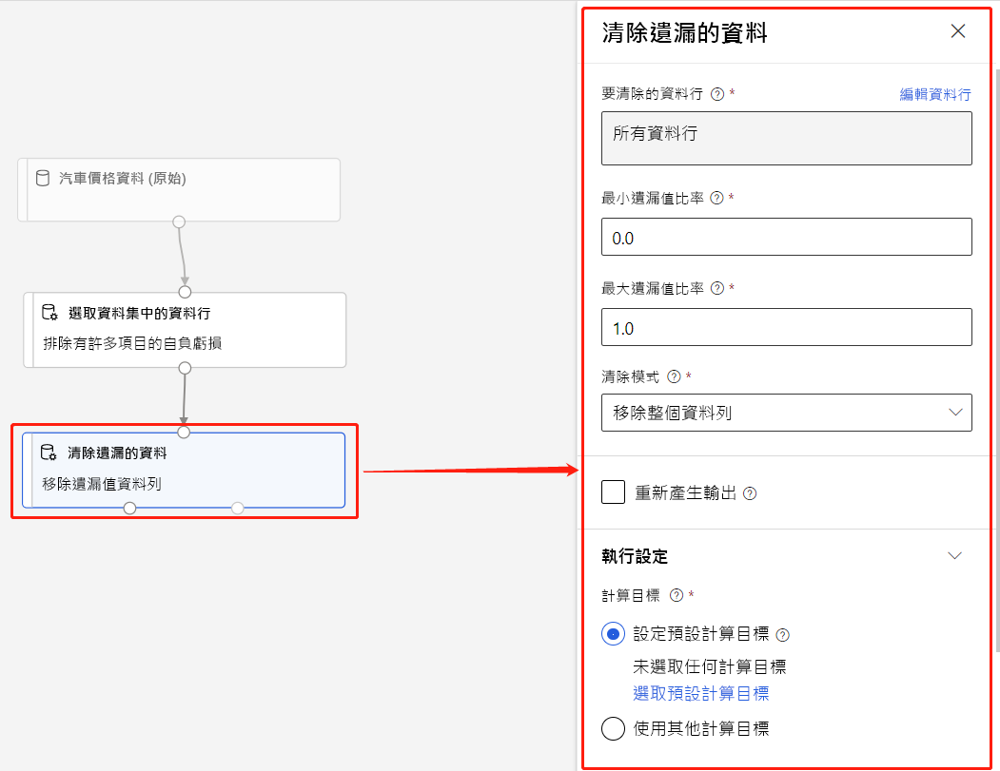

# 什麼是 Azure Machine Learning 設計工具 (預覽)？ 
[!INCLUDE [applies-to-skus](../../includes/aml-applies-to-enterprise-sku.md)]

Azure Machine Learning 設計工具可讓您以視覺化方式連接互動式畫布上的[資料集](#datasets)和[模組](#module)，以建立機器學習模型。 若要瞭解如何開始使用設計工具，請參閱[教學課程：使用設計工具預測汽車價格](tutorial-designer-automobile-price-train-score.md)

設計工具會使用您的 Azure Machine Learning[工作區](concept-workspace.md)來組織共用資源，例如：

+ [管線](#pipeline)
+ [資料集](#datasets)
+ [計算資源](#compute)
+ [已註冊的模型](concept-azure-machine-learning-architecture.md#models)
+ [已發佈管線](#publish)
+ [即時端點](#deploy)

## 模型定型和部署

設計工具會提供您建立、測試及部署機器學習模型的視覺化畫布。 使用設計工具，您可以：

+ 將[資料集](#datasets)和[模組](#module)拖放到畫布上。
+ 將模組連接在一起，以建立[管線草稿](#pipeline-draft)。
+ 使用 Azure Machine Learning 工作區中的計算資源提交[管線執行](#pipeline-run)。
+ 將您的**定型管線**轉換成**推斷管線**。
+ 將管線[發佈](#publish)至 REST**管線端點**，以使用不同的參數和資料集來提交新的管線執行。
    + 發行**定型管線**以重複使用單一管線，在變更參數和資料集時，將多個模型定型。
    + 發行**批次推斷管線**，以使用先前定型的模型對新資料進行預測。
+ 將**即時推斷管線**[部署](#deploy)至即時端點，以即時預測新的資料。

## 管線

[管線](concept-azure-machine-learning-architecture.md#ml-pipelines)包含資料集和分析模組，您可以將它們連接在一起。 管線有許多用途：您可以製作一個管線來定型單一模型，或是用來訓練多個模型的管道。 您可以建立管線，以即時或批次方式進行預測，或建立只清除資料的管線。 管線可讓您重複使用工作及組織您的專案。

### 管線草稿

當您在設計工具中編輯管線時，您的進度會儲存為**管線草稿**。 您可以在任何時間點編輯管線草稿，方法是新增或移除模組、設定計算目標、建立參數等等。

有效的管線具有下列特性：

* 資料集只能連接到模組。
* 模組只能連接到資料集或其他模組。
* 模組的所有輸入埠都必須有資料流程的一些連接。
* 必須設定每個模組的所有必要參數。

當您準備好要執行管線草稿時，您會提交管線執行。

### 管線執行

每次執行管線時，管線和其結果的設定都會以**管線執行**的形式儲存在您的工作區中。 您可以回到任何管線執行，檢查它是否有問題，以進行疑難排解或進行審核。 **複製**管線執行，以建立新的管線草稿供您編輯。

管線執行會分組到[實驗](concept-azure-machine-learning-architecture.md#experiments)中，以組織執行歷程記錄。 您可以設定每個管線執行的實驗。 

## 資料集

機器學習資料集可讓您輕鬆地存取和使用您的資料。 有一些範例資料集會包含在設計工具中，供您進行實驗。 您可以視需要[註冊](how-to-create-register-datasets.md)更多資料集。

## Module

模組是指您在資料上可執行的演算法。 設計工具有許多模組，範圍從資料輸入功能到定型、評分和驗證程式。

模組可能有一組參數可用來設定模組的內部演算法。 當您在畫布上選取模組時，模組的參數會顯示在畫布右邊的 [屬性]  窗格中。 您可以在此窗格中修改參數來調整模型。 您可以在設計工具中設定個別模組的計算資源。 

如需流覽可用機器學習服務演算法程式庫的協助，請參閱[演算法 & 模組參考總覽](algorithm-module-reference/module-reference.md)。 如需選擇演算法的協助，請參閱[Azure Machine Learning 演算法](algorithm-cheat-sheet.md)功能提要。

## 計算資源

使用您工作區中的計算資源來執行管線，並將部署的模型裝載為即時端點或管線端點（適用于批次推斷）。 支援的計算目標包括：

| 計算目標 | 訓練 | 部署 |
| ---- |:----:|:----:|
| Azure Machine Learning Compute | ✓ | |
| Azure Machine Learning 計算執行個體 | ✓ | |
| Azure Kubernetes Service | | ✓ |

計算目標會附加至您的[Azure Machine Learning 工作區](concept-workspace.md)。 您會在[Azure Machine Learning studio](https://ml.azure.com)的工作區中管理計算目標。

## 部署

若要執行即時推斷，您必須將管線部署為**即時端點**。 即時端點會在外部應用程式和您的評分模型之間建立介面。 即時端點的呼叫會即時將預測結果傳回到應用程式。 若要對即時端點進行呼叫，請傳遞部署端點時所建立的 API 金鑰。 端點是以 REST 為基礎，這是 web 程式設計專案的熱門架構選擇。

即時端點必須部署到 Azure Kubernetes Service 叢集。

若要瞭解如何部署您的模型，請參閱[教學課程：使用設計工具部署機器學習服務模型](tutorial-designer-automobile-price-deploy.md)。

## 發佈

您也可以將管線發佈至**管線端點**。 與即時端點類似，管線端點可讓您使用 REST 呼叫從外部應用程式提交新的管線執行。 不過，您無法使用管線端點即時傳送或接收資料。

已發佈的管線具有彈性，可以用來定型或重新訓練模型、[執行批次推斷](how-to-run-batch-predictions-designer.md)、處理新的資料，以及其他更多作業。 您可以將多個管線發行至單一管線端點，並指定要執行哪個管線版本。

已發佈的管線會在您于每個模組的管線草稿中定義的計算資源上執行。

設計工具會建立與 SDK 相同的[PublishedPipeline](https://docs.microsoft.com/python/api/azureml-pipeline-core/azureml.pipeline.core.graph.publishedpipeline?view=azure-ml-py)物件。

## 從視覺化介面移至設計工具

視覺介面（預覽）已更新，現在已 Azure Machine Learning 設計工具（預覽）。 設計工具已重新架構為使用管線型後端，可完全與 Azure Machine Learning 的其他功能整合。 

由於這些更新的結果，視覺介面的一些概念和詞彙已變更或重新命名。 請參閱下表，以瞭解最重要的概念變更。 

| 設計工具中的概念 | 先前在視覺化介面中 |
| ---- |:----:|
| 管線草稿 | 實驗 |
| 即時端點 | Web 服務 |

### 遷移至設計工具

您可以在設計工具中，將現有的視覺化介面實驗和 web 服務轉換成管線和即時端點。 使用下列步驟來遷移您的視覺化介面資產：

[!INCLUDE [migrate from the visual interface](../../includes/aml-vi-designer-migration.md)]

## 後續步驟

* 透過以下教學課程，了解預測性分析和機器學習的基本概念：[教學課程：使用設計工具預測汽車價格](tutorial-designer-automobile-price-train-score.md)來試用設計工具
* 了解如何修改現有的[設計工具範例](samples-designer.md)，以符合您的需求。

