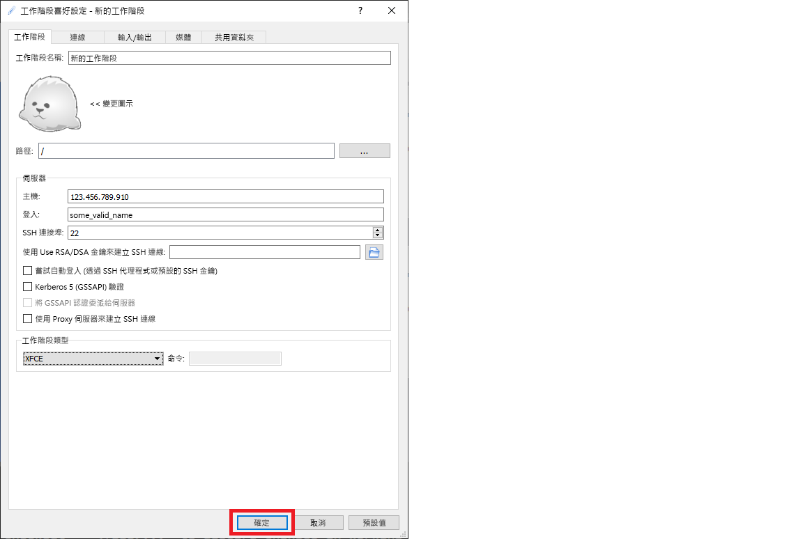

# <a name="quickstart-set-up-the-data-science-virtual-machine-for-linux-ubuntu"></a>快速入門：設定適用於 Linux (Ubuntu) 的資料科學虛擬機器

啟動並執行 Ubuntu 18.04 資料科學虛擬機器。

## <a name="prerequisites"></a>必要條件

若要建立 Ubuntu 18.04 資料科學虛擬機器，您必須具有 Azrue 訂用帳戶。 [免費試用 Azure](https://azure.com/free)。

>[!NOTE]
>Azure 免費帳戶不支援已啟用 GPU 的虛擬機器 SKU。

## <a name="create-your-data-science-virtual-machine-for-linux"></a>建立 Linux 適用的資料科學虛擬機器

建立資料科學虛擬機器 Ubuntu 18.04 執行個體的步驟如下：

1. 移至 [Azure 入口網站](https://portal.azure.com)。 如果您尚未登入 Azure 帳戶，系統可能會提示您登入。
1. 在 [資料科學虛擬機器] 中輸入並選取 [資料科學虛擬機器 - Ubuntu 18.04]，以尋找虛擬機器清單

1. 在下一個視窗中選取 [建立]。

1. 您應會重新導向至 [建立虛擬機器] 刀鋒視窗。
   
1. 輸入下列資訊以設定精靈的每個步驟：

    1. **基本**：
    
       * 訂用帳戶：如果您有多個訂用帳戶，請選取要在其中建立機器及計費的訂用帳戶。 您必須有此訂用帳戶的資源建立權限。
       * **資源群組**：建立新的群組或使用現有群組。
       * **虛擬機器名稱**：輸入虛擬機器的名稱。 Azure 入口網站中將會使用此名稱。
       * **區域**：選取最適合的資料中心。 如需最快速的網路存取，請選取擁有您大部分資料或是最接近您實際位置的資訊中心。 深入了解 [Azure 區域](https://azure.microsoft.com/global-infrastructure/regions/)。
       * **映像**：保留預設值。
       * **Size**：此選項應會自動填入適合一般工作負載的大小。 深入了解 [Azure 中的 Linux VM 大小](../../virtual-machines/linux/sizes.md)。
       * **驗證類型**：如需更快速的設定，請選取 [密碼]。 
         
         > [!NOTE]
         > 如果您想要使用 JupyterHub，請務必選取 [密碼]，因為 JupyterHub「未」設定為使用 SSH 公開金鑰。

       * **使用者名稱**：輸入系統管理員的使用者名稱。 您將使用此使用者名稱登入您的虛擬機器。 此使用者名稱不需要與您的 Azure 使用者名稱相同。 請「勿」使用大寫字母。
         
         > [!IMPORTANT]
         > 如果您的使用者名稱使用大寫字母，JupyterHub 將無法運作，而且您會遇到 500 內部伺服器錯誤。

       * **密碼**：輸入您將用來登入虛擬機器的密碼。    
    
   1. 選取 [檢閱 + 建立]。
   1. **檢閱 + 建立**
      * 請確認您輸入的所有資訊都正確無誤。 
      * 選取 [建立]。
    
    佈建大約需要 5 分鐘。 狀態會顯示在 Azure 入口網站中。

## <a name="how-to-access-the-ubuntu-data-science-virtual-machine"></a>如何存取 Ubuntu 智慧資料科學虛擬機器

您可透過下列其中一種方式來存取 Ubuntu DSVM：

  * SSH (如果是終端機工作階段)
  * X2Go (如果是圖形化工作階段)
  * JupyterHub 和 JupyterLab (如果是 Jupyter 筆記本)

您也可以將資料科學虛擬機器連結至 Azure Notebooks，以在 VM 上執行 Jupyter Notebook，並忽略免費服務層的限制。 如需詳細資訊，請參閱[管理和設定 Azure Notebooks 專案](../../notebooks/configure-manage-azure-notebooks-projects.md#compute-tier)。

### <a name="ssh"></a>SSH

如果您已使用 SSH 驗證來設定 VM，則可以使用您在文字殼層介面步驟 3 的 [基本資料] 區段中所建立的帳號認證來登入。 您可以在 Windows 上下載 SSH 用戶端工具，例如 [PuTTy](https://www.putty.org)。 如果您偏好圖形化桌面 (X Windows 系統)，可以在 PuTTy 上使用 X11 轉送。

> [!NOTE]
> 在測試中，X2Go 用戶端的效能優於 X11 轉寄。 我們建議您使用 X2Go 用戶端作為圖形化桌面介面。

### <a name="x2go"></a>X2Go

Linux VM 已佈建了 X2Go 伺服器，且已可接受用戶端連線。 若要連線到 Linux VM 圖形化桌面，請在用戶端上完成下列程序：

1. 從 [X2Go](https://wiki.x2go.org/doku.php/doc:installation:x2goclient)下載並安裝您用戶端平台適用的 X2Go 用戶端。
1. 請記下虛擬機器的公用 IP 位址，您可以開啟您建立的虛擬機器，在 Azure 入口網站中加以尋找。

   

1. 執行 X2Go 用戶端。 如果 [新增工作階段] 視窗並未自動顯示，請移至 [工作階段] -> [新增工作階段]。

1. 在所產生的組態視窗中，輸入下列組態參數：
   * **[工作階段] 索引標籤**：
     * **主機**：輸入您先前所記下的 VM IP 位址。
     * **登入**：在 Linux VM 上輸入使用者名稱。
     * **SSH 連接埠**：保留預設值 22。
     * **工作階段類型**：將值變更為 **XFCE**。 Linux VM 目前僅支援 XFCE 桌面。
   * **媒體索引標籤**：如果您不需要使用聲音支援和用戶端列印，可關閉這些功能。
   * **共用資料夾**︰使用此索引標籤可新增您想要在 VM 上掛接的用戶端電腦目錄。 

   
1. 選取 [確定]。
1. 按一下 X2Go 視窗右窗格中的方塊，以顯示您 VM 的登入畫面。
1. 輸入您 VM 的密碼。
1. 選取 [確定]。
1. 您可能必須賦予 X2Go 略過您防火牆的權限，才能完成連線。
1. 您現在應會看到 Ubuntu DSVM 的圖形化介面。 


### <a name="jupyterhub-and-jupyterlab"></a>JupyterHub 和 JupyterLab

Ubuntu DSVM 會執行 [JupyterHub](https://github.com/jupyterhub/jupyterhub)，這是一個多使用者的 Jupyter 伺服器。 若要連線，請執行下列步驟：

   1. 請記下您 VM 的公用 IP 位址，方法是在 Azure 入口網站中搜尋並選取您的 VM。
      

   1. 從您的本機電腦，開啟網頁瀏覽器並瀏覽至 https:\//your-vm-ip:8000，並以您先前所記下的 IP 位址取代 "your-vm-ip"。
   1. 您的瀏覽器可能會讓您無法直接開啟頁面，並告訴您有憑證錯誤。 DSVM 會透過自我簽署憑證來提供安全性。 大部分的瀏覽器都可讓您在此警告之後進行點按。 許多瀏覽器會繼續在整個 Web 工作階段中提供有關憑證的某種視覺警告。
   1. 請輸入您用來建立 VM 的使用者名稱和密碼，然後登入。 

      

>[!NOTE]
> 如果您在這個階段收到 500 錯誤，原因很可能是您的使用者名稱中使用了大寫字母。 這是 Jupyter 中樞與其使用的 PAMAuthenticator 之間的已知互動。 

   1. 瀏覽許多可用的範例筆記本。

也提供 JupyterLab (新一代的 Jupyter 筆記本) 與 JupyterHub。 若要加以存取，請登入 JupyterHub，然後瀏覽至 URL https:\//your-vm-ip:8000/user/your-username/lab，並以您在設定 VM 時所選擇的使用者名稱取代 "your-username"。 同樣地，您可能一開始會因為憑證錯誤而無法存取網站。

您可以在 `/etc/jupyterhub/jupyterhub_config.py` 中加入下面這一行，將 JupyterLab 設定為預設的 Notebook 伺服器：

```python
c.Spawner.default_url = '/lab'
```

## <a name="next-steps"></a>後續步驟

以下是如何繼續進行學習和探索的方式：

* [適用於 Linux 的資料科學虛擬機器上的資料科學](linux-dsvm-walkthrough.md)逐步解說會說明如何使用此處佈建的 Linux DSVM 來執行數項常見的資料科學工作。 
* 試試本文中說明的工具，在 DSVM 上探索各種資料科學工具。 您也可以在虛擬機器內的殼層上執行 `dsvm-more-info`，以獲得與 VM 上安裝的工具有關的基本簡介和詳細資訊指標。  
* 了解如何使用 [Team Data Science Process](https://aka.ms/tdsp) 以系統化方式建置分析解決方案。
* 瀏覽 [Azure AI 資源庫](https://gallery.azure.ai/)，可取得使用 Azure AI 服務的機器學習和資料分析範例。
* 請參閱此虛擬機器的適當[參考文件](./reference-ubuntu-vm.md)。
