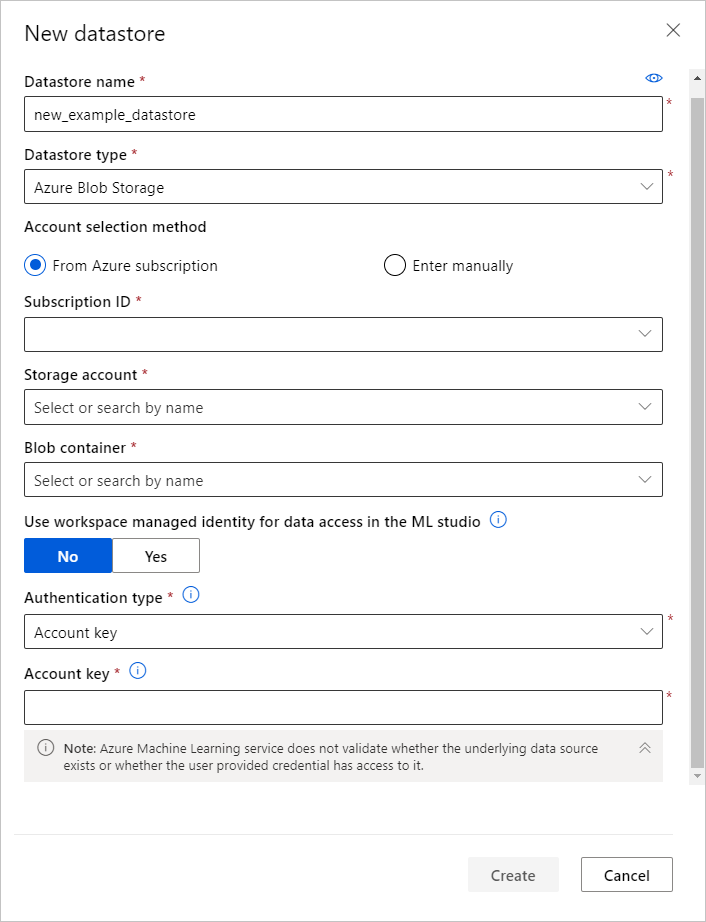

# <a name="connect-to-azure-storage-services"></a>連接到 Azure 存儲服務
[!INCLUDE [aml-applies-to-basic-enterprise-sku](../../includes/aml-applies-to-basic-enterprise-sku.md)]

在本文中，瞭解如何通過 Azure 機器學習資料存儲連接到 Azure 存儲服務。 資料存儲在與工作區關聯的[金鑰保存庫中](https://azure.microsoft.com/services/key-vault/)存儲連接資訊，如訂閱 ID 和權杖授權，因此您可以安全地訪問存儲，而無需在腳本中硬編碼它們。

可以從[這些 Azure 存儲解決方案](#matrix)創建資料存儲。 對於不受支援的存儲解決方案，以及為了在機器學習實驗期間節省資料出口成本，我們建議您[將資料移動到](#move)支援的 Azure 存儲解決方案。 

## <a name="prerequisites"></a>Prerequisites

您需要：
- Azure 訂用帳戶。 如果您沒有 Azure 訂用帳戶，請在開始前先建立免費帳戶。 嘗試[Azure 機器學習的免費或付費版本](https://aka.ms/AMLFree)。

- 具有 Azure blob[容器](https://docs.microsoft.com/azure/storage/blobs/storage-blobs-overview)或[Azure 檔共用](https://docs.microsoft.com/azure/storage/files/storage-files-introduction)的 Azure 存儲帳戶。

- 用於 Python 的[Azure 機器學習 SDK](https://docs.microsoft.com/python/api/overview/azure/ml/intro?view=azure-ml-py)或訪問 Azure[機器學習工作室](https://ml.azure.com/)。

- Azure Machine Learning 工作區。
  
  [創建 Azure 機器學習工作區](how-to-manage-workspace.md)或通過 Python SDK 使用現有工作區。 導入`Workspace`和`Datastore`類，並使用 函數`config.json``from_config()`從檔載入訂閱資訊。 預設情況下，這將查找目前的目錄中的 JSON 檔，但您也可以指定路徑參數以使用 指向`from_config(path="your/file/path")`該檔。

   ```Python
   import azureml.core
   from azureml.core import Workspace, Datastore
        
   ws = Workspace.from_config()
   ```
<a name="matrix"></a>

## <a name="supported-data-storage-service-types"></a>支援的資料存儲服務類型

資料存儲當前支援將連接資訊存儲到以下矩陣中列出的存儲服務。 此時，不支援 Azure 資料倉儲。 

| 存儲&nbsp;類型 | 身份驗證&nbsp;類型 | [Azure&nbsp;&nbsp;機器學習工作室](https://ml.azure.com/) | [Azure&nbsp;&nbsp;機器學習&nbsp;Python SDK](https://docs.microsoft.com/python/api/overview/azure/ml/intro?view=azure-ml-py) |  [Azure&nbsp;&nbsp;機器學習 CLI](reference-azure-machine-learning-cli.md) | [Azure&nbsp;&nbsp;機器學習&nbsp;休息 API](https://docs.microsoft.com/rest/api/azureml/)
---|---|---|---|---|---
[Azure&nbsp;&nbsp;Blob 存儲](https://docs.microsoft.com/azure/storage/blobs/storage-blobs-overview)| 帳戶金鑰 <br> SAS 權杖 | ✓ | ✓ | ✓ |✓
[Azure&nbsp;&nbsp;檔共用](https://docs.microsoft.com/azure/storage/files/storage-files-introduction)| 帳戶金鑰 <br> SAS 權杖 | ✓ | ✓ | ✓ |✓
[Azure&nbsp;資料存儲&nbsp;第&nbsp;1 代](https://docs.microsoft.com/azure/data-lake-store/)| 服務主體| ✓ | ✓ | ✓ |✓
[Azure&nbsp;資料存儲&nbsp;第&nbsp;2 代](https://docs.microsoft.com/azure/storage/blobs/data-lake-storage-introduction)| 服務主體| ✓ | ✓ | ✓ |✓
[Azure&nbsp;&nbsp;SQL 資料庫](https://docs.microsoft.com/azure/sql-database/sql-database-technical-overview)| SQL 驗證 <br>服務主體| ✓ | ✓ | ✓ |✓
[Azure&nbsp;PostgreSQL](https://docs.microsoft.com/azure/postgresql/overview) | SQL 驗證| ✓ | ✓ | ✓ |✓
[MySQL&nbsp;&nbsp;的 Azure&nbsp;資料庫](https://docs.microsoft.com/azure/mysql/overview) | SQL 驗證|  | ✓* | ✓* |✓*
[資料磚&nbsp;檔案系統&nbsp;](https://docs.microsoft.com/azure/databricks/data/databricks-file-system)| 不需要驗證 | | ✓** | ✓ ** |✓** 

*MySQL 僅支援管道[資料傳輸步驟](https://docs.microsoft.com/python/api/azureml-pipeline-steps/azureml.pipeline.steps.datatransferstep?view=azure-ml-py)。 <br>
*僅支援管道[資料磚步驟的資料磚](https://docs.microsoft.com/python/api/azureml-pipeline-steps/azureml.pipeline.steps.databricks_step.databricksstep?view=azure-ml-py)

### <a name="storage-guidance"></a>儲存體指引

我們建議為[Azure Blob 容器](https://docs.microsoft.com/azure/storage/blobs/storage-blobs-introduction)創建資料存儲。 標準和高級存儲都可用於 Blob。 儘管高級存儲成本更高，但其更快的輸送量速度可能會提高訓練運行速度，尤其是在針對大型資料集進行訓練時。 有關存儲帳戶成本的資訊，請參閱[Azure 定價計算機](https://azure.microsoft.com/pricing/calculator/?service=machine-learning-service)。

[Azure 資料湖存儲 Gen2](https://docs.microsoft.com/azure/storage/blobs/data-lake-storage-introduction?toc=/azure/storage/blobs/toc.json)構建在 Azure Blob 存儲之上，專為企業大資料分析而設計。 Data Lake Storage Gen2 的基礎部分是新增至 Blob 儲存體的[階層命名空間](https://docs.microsoft.com/azure/storage/blobs/data-lake-storage-namespace)。 階層命名空間會將物件/檔案組織成目錄階層，讓資料存取更有效率。

創建工作區時，Azure Blob 容器和 Azure 檔共用將自動註冊到工作區。 它們分別被命名`workspaceblobstore`和`workspacefilestore`。 `workspaceblobstore`用於存儲工作區工件和機器學習實驗日誌。 `workspacefilestore`用於存儲通過[計算實例](https://docs.microsoft.com/azure/machine-learning/concept-compute-instance#accessing-files)授權的筆記本和 R 腳本。 容器`workspaceblobstore`設置為預設資料存儲。

> [!IMPORTANT]
> 在設計器主頁中打開示例時，Azure 機器學習設計器（預覽版）將自動創建名為**azureml_globaldatasets**的資料存儲。 此資料存儲僅包含示例資料集。 **請不要**使用此資料存儲進行任何機密資料訪問！
> 

<a name="access"></a>

## <a name="create-and-register-datastores"></a>創建和註冊資料存儲

將 Azure 存儲解決方案註冊為數據存儲時，將自動創建該資料存儲並將其註冊到特定工作區。 可以使用 Python SDK 或 Azure 機器學習工作室創建資料存儲並將其註冊到工作區。

>[!IMPORTANT]
> 作為初始資料存儲創建和註冊過程的一部分，Azure 機器學習驗證基礎存儲服務是否存在，並且使用者提供的委託（使用者名、服務主體或 SAS 權杖）是否有權訪問該存儲。 但是，對於 Azure 資料存儲第 1 代和第 2 代資料存儲，此驗證將在以後調用[`from_files()`](https://docs.microsoft.com/python/api/azureml-core/azureml.data.dataset_factory.filedatasetfactory?view=azure-ml-py)資料[`from_delimited_files()`](https://docs.microsoft.com/python/api/azureml-core/azureml.data.dataset_factory.tabulardatasetfactory?view=azure-ml-py#from-parquet-files-path--validate-true--include-path-false--set-column-types-none--partition-format-none-)存取方法時進行。 
<br><br>
創建資料存儲後，僅對需要訪問基礎存儲容器的方法執行此驗證，**而不是**每次檢索資料存儲物件。 例如，如果要從資料存儲下載檔案，則進行驗證;但是，如果您只想更改預設資料存儲，則不會發生驗證。

### <a name="python-sdk"></a>Python SDK

所有寄存器方法都在類上[`Datastore`](https://docs.microsoft.com/python/api/azureml-core/azureml.core.datastore(class)?view=azure-ml-py)，並且具有表單。 `register_azure_*`

您可以在 Azure`register()`[門戶](https://portal.azure.com)上找到填充方法所需的資訊。
選擇左側窗格中的**存儲帳戶**，然後選擇要註冊的存儲帳戶。 **"概述"** 頁提供帳戶名稱、容器和檔共用名稱稱等資訊。 

* 對於身份驗證項（如帳戶金鑰或 SAS 權杖），轉到 **"設置"** 窗格上的**帳戶金鑰**。 

* 對於服務主體專案（如租戶 ID 和用戶端 ID），請轉到**應用註冊**並選擇要使用的應用。 其相應的 **"概述"** 頁將包含這些專案。

> [!IMPORTANT]
> 如果您的存儲帳戶位於虛擬網路中，則僅支援**通過 SDK**創建 Blob、檔共用、ADLS 第 1 代和 ADLS 第 2 代資料存儲。 要授予工作區對存儲帳戶的存取權限，請將參數`grant_workspace_access`設置為`True`。

以下示例演示如何將 Azure Blob 容器、Azure 檔共用和 Azure 資料存儲第 2 代作為資料存儲註冊。 有關其他存儲服務，請參閱[適用`register_azure_*`方法的參考文檔](https://docs.microsoft.com/python/api/azureml-core/azureml.core.datastore.datastore?view=azure-ml-py#methods)。

#### <a name="blob-container"></a>Blob 容器

要將 Azure Blob 容器註冊為數據存儲，[`register_azure_blob-container()`](https://docs.microsoft.com/python/api/azureml-core/azureml.core.datastore(class)?view=azure-ml-py#register-azure-blob-container-workspace--datastore-name--container-name--account-name--sas-token-none--account-key-none--protocol-none--endpoint-none--overwrite-false--create-if-not-exists-false--skip-validation-false--blob-cache-timeout-none--grant-workspace-access-false--subscription-id-none--resource-group-none-)請使用 。

以下代碼創建`blob_datastore_name`資料存儲並將註冊到`ws`工作區。 此資料存儲通過使用提供的帳戶金鑰`my-container-name`訪問存儲帳戶上的`my-account-name`Blob 容器。

```Python
blob_datastore_name='azblobsdk' # Name of the datastore to workspace
container_name=os.getenv("BLOB_CONTAINER", "<my-container-name>") # Name of Azure blob container
account_name=os.getenv("BLOB_ACCOUNTNAME", "<my-account-name>") # Storage account name
account_key=os.getenv("BLOB_ACCOUNT_KEY", "<my-account-key>") # Storage account key

blob_datastore = Datastore.register_azure_blob_container(workspace=ws, 
                                                         datastore_name=blob_datastore_name, 
                                                         container_name=container_name, 
                                                         account_name=account_name,
                                                         account_key=account_key)
```

#### <a name="file-share"></a>檔案共用

要將 Azure 檔共用註冊為數據存儲，請使用[`register_azure_file_share()`](https://docs.microsoft.com/python/api/azureml-core/azureml.core.datastore(class)?view=azure-ml-py#register-azure-file-share-workspace--datastore-name--file-share-name--account-name--sas-token-none--account-key-none--protocol-none--endpoint-none--overwrite-false--create-if-not-exists-false--skip-validation-false-)。 

以下代碼創建`file_datastore_name`資料存儲並將註冊到`ws`工作區。 此資料存儲通過使用提供的帳戶金鑰`my-fileshare-name`訪問存儲帳戶上`my-account-name`的檔共用。

```Python
file_datastore_name='azfilesharesdk' # Name of the datastore to workspace
file_share_name=os.getenv("FILE_SHARE_CONTAINER", "<my-fileshare-name>") # Name of Azure file share container
account_name=os.getenv("FILE_SHARE_ACCOUNTNAME", "<my-account-name>") # Storage account name
account_key=os.getenv("FILE_SHARE_ACCOUNT_KEY", "<my-account-key>") # Storage account key

file_datastore = Datastore.register_azure_file_share(workspace=ws,
                                                     datastore_name=file_datastore_name, 
                                                     file_share_name=file_share_name, 
                                                     account_name=account_name,
                                                     account_key=account_key)
```

#### <a name="azure-data-lake-storage-generation-2"></a>Azure 資料存儲第 2 代

對於 Azure 資料湖存儲第 2 代 （ADLS 第 2 代） 資料存儲，請使用[register_azure_data_lake_gen2（）](https://docs.microsoft.com/python/api/azureml-core/azureml.core.datastore.datastore?view=azure-ml-py#register-azure-data-lake-gen2-workspace--datastore-name--filesystem--account-name--tenant-id--client-id--client-secret--resource-url-none--authority-url-none--protocol-none--endpoint-none--overwrite-false-)註冊連接到 Azure DataLake 第 2 代存儲的憑據資料存儲，並具有[服務主體許可權](https://docs.microsoft.com/azure/active-directory/develop/howto-create-service-principal-portal)。 為了利用服務主體，您需要[註冊應用程式](https://docs.microsoft.com/azure/active-directory/develop/app-objects-and-service-principals)，並授予服務主體正確的資料存取權限。 詳細瞭解為[ADLS 第 2 代設置的存取控制](https://docs.microsoft.com/azure/storage/blobs/data-lake-storage-access-control)。 

以下代碼創建`adlsgen2_datastore_name`資料存儲並將註冊到`ws`工作區。 此資料存儲通過使用提供的服務主體憑據訪問存儲`test`帳戶上的`account_name`檔案系統。

```python 
adlsgen2_datastore_name = 'adlsgen2datastore'

subscription_id=os.getenv("ADL_SUBSCRIPTION", "<my_subscription_id>") # subscription id of ADLS account
resource_group=os.getenv("ADL_RESOURCE_GROUP", "<my_resource_group>") # resource group of ADLS account

account_name=os.getenv("ADLSGEN2_ACCOUNTNAME", "<my_account_name>") # ADLS Gen2 account name
tenant_id=os.getenv("ADLSGEN2_TENANT", "<my_tenant_id>") # tenant id of service principal
client_id=os.getenv("ADLSGEN2_CLIENTID", "<my_client_id>") # client id of service principal
client_secret=os.getenv("ADLSGEN2_CLIENT_SECRET", "<my_client_secret>") # the secret of service principal

adlsgen2_datastore = Datastore.register_azure_data_lake_gen2(workspace=ws,
                                                             datastore_name=adlsgen2_datastore_name,
                                                             account_name=account_name, # ADLS Gen2 account name
                                                             filesystem='test', # ADLS Gen2 filesystem
                                                             tenant_id=tenant_id, # tenant id of service principal
                                                             client_id=client_id, # client id of service principal
                                                             client_secret=client_secret) # the secret of service principal
```

### <a name="azure-machine-learning-studio"></a>Azure Machine Learning Studio 

在 Azure 機器學習工作室中，通過幾個步驟創建新的資料存儲：

> [!IMPORTANT]
> 如果您的存儲帳戶位於虛擬網路中，則僅支援[通過 SDK](#python-sdk)創建資料存儲。 

1. 登入 [Azure Machine Learning Studio](https://ml.azure.com/)。
1. 在 **"管理**"下選擇左側窗格上的**資料存儲**。
1. 選擇 **= 新的資料存儲**。
1. 填寫新資料存儲的表單。 表單根據 Azure 存儲類型和身份驗證類型的選擇自行更新。
  
您可以在[Azure 門戶](https://portal.azure.com)上找到填充表單所需的資訊。 選擇左側窗格中的**存儲帳戶**，然後選擇要註冊的存儲帳戶。 **"概述"** 頁提供帳戶名稱、容器和檔共用名稱稱等資訊。 

* 對於身份驗證項（如帳戶金鑰或 SAS 權杖），轉到 **"設置"** 窗格上的**帳戶金鑰**。 

* 對於服務主體專案（如租戶 ID 和用戶端 ID），請轉到**應用註冊**並選擇要使用的應用。 其相應的 **"概述"** 頁將包含這些專案。 

下面的示例演示了創建 Azure Blob 資料存儲時表單的外觀： 
    



<a name="get"></a>

## <a name="get-datastores-from-your-workspace"></a>從工作區獲取資料存儲

要在當前工作區中註冊特定資料存儲，請使用 類上的[`get()`](https://docs.microsoft.com/python/api/azureml-core/azureml.core.datastore(class)?view=azure-ml-py#get-workspace--datastore-name-)`Datastore`靜態方法：

```Python
# Get a named datastore from the current workspace
datastore = Datastore.get(ws, datastore_name='your datastore name')
```
要獲取在給定工作區中註冊的資料存儲清單，可以在工作區物件上使用 屬性[`datastores`](https://docs.microsoft.com/python/api/azureml-core/azureml.core.workspace%28class%29?view=azure-ml-py#datastores)：

```Python
# List all datastores registered in the current workspace
datastores = ws.datastores
for name, datastore in datastores.items():
    print(name, datastore.datastore_type)
```

要獲取工作區的預設資料存儲，請使用此行：

```Python
datastore = ws.get_default_datastore()
```

<a name="up-and-down"></a>
## <a name="upload-and-download-data"></a>上傳及下載資料

以下[`upload()`](https://docs.microsoft.com/python/api/azureml-core/azureml.data.azure_storage_datastore.azureblobdatastore?view=azure-ml-py#upload-src-dir--target-path-none--overwrite-false--show-progress-true-)示例中[`download()`](https://docs.microsoft.com/python/api/azureml-core/azureml.data.azure_storage_datastore.azureblobdatastore?view=azure-ml-py#download-target-path--prefix-none--overwrite-false--show-progress-true-)介紹的 和 方法特定于[AzureBlob 資料存儲](https://docs.microsoft.com/python/api/azureml-core/azureml.data.azure_storage_datastore.azureblobdatastore?view=azure-ml-py)和[AzureFileDatastore](https://docs.microsoft.com/python/api/azureml-core/azureml.data.azure_storage_datastore.azurefiledatastore?view=azure-ml-py)類，並且操作相同。

### <a name="upload"></a>上傳

使用 Python SDK 將目錄或單個檔上載到資料存儲：

```Python
datastore.upload(src_dir='your source directory',
                 target_path='your target path',
                 overwrite=True,
                 show_progress=True)
```

參數`target_path`指定要上載的檔共用（或 blob 容器）中的位置。 它預設為`None`，因此資料上載到 root。 如果`overwrite=True`， 上`target_path`的任何現有資料將被覆蓋。

還可以通過 方法`upload_files()`將單個檔的清單上載到資料存儲。

### <a name="download"></a>下載

將資料從資料存儲下載到本地檔案系統：

```Python
datastore.download(target_path='your target path',
                   prefix='your prefix',
                   show_progress=True)
```

參數`target_path`是要將資料下載到的本地目錄的位置。 若要指定檔案共用 (或 Blob 容器) 中資料夾的路徑以進行下載，請在 `prefix` 中提供該路徑。 如果是`prefix``None`，將下載檔案共用（或 blob 容器）的所有內容。

<a name="train"></a>

## <a name="access-your-data-during-training"></a>在培訓期間訪問您的資料

要與資料存儲中的資料進行交互，或將資料打包到用於機器學習任務的可消耗物件（如培訓）時，[請創建 Azure 機器學習資料集](how-to-create-register-datasets.md)。 資料集提供將表格資料載入到熊貓或 Spark 資料幀中的函數。 資料集還提供從 Azure Blob 存儲、Azure 檔、Azure 資料存儲第 1 代、Azure 資料存儲第 2 代、Azure SQL 資料庫和 PostgreSQL Azure 資料庫下載或裝載任何格式的檔的功能。 [詳細瞭解如何使用資料集進行訓練](how-to-train-with-datasets.md)。

### <a name="accessing-source-code-during-training"></a>在培訓期間訪問原始程式碼

Azure Blob 存儲的輸送量比 Azure 檔共用高，並將擴展到並行啟動的大量作業。 因此，我們建議將回合組態為使用 Blob 存儲來傳輸原始程式碼檔。

以下代碼示例在回合組態中指定用於原始程式碼傳輸的 Blob 資料存儲。

```python 
# workspaceblobstore is the default blob storage
run_config.source_directory_data_store = "workspaceblobstore" 
```

## <a name="access-data-during-scoring"></a>評分期間訪問資料

Azure 機器學習提供了幾種使用模型進行評分的方法。 其中一些方法不提供對資料存儲的訪問。 使用下表瞭解哪些方法允許您在評分期間訪問資料存儲：

| 方法 | 資料存儲訪問 | 描述 |
| ----- | :-----: | ----- |
| [批次預測](how-to-use-parallel-run-step.md) | ✔ | 以非同步的方式對大量資料進行預測。 |
| [Web 服務](how-to-deploy-and-where.md) | &nbsp; | 將模型部署為 Web 服務。 |
| [Azure IoT 邊緣模組](how-to-deploy-and-where.md) | &nbsp; | 將模型部署到 IoT 邊緣設備。 |

對於 SDK 不提供對資料存儲的訪問的情況，您可能能夠使用相關的 Azure SDK 來訪問資料來創建自訂代碼。 例如[，Python 的 Azure 存儲 SDK](https://github.com/Azure/azure-storage-python)是用戶端庫，可用於訪問存儲在 blob 或檔中的資料。

<a name="move"></a>

## <a name="move-data-to-supported-azure-storage-solutions"></a>將資料移動到受支援的 Azure 存儲解決方案

Azure 機器學習支援從 Azure Blob 存儲、Azure 檔、Azure 資料存儲第 1 代、Azure 資料存儲第 2 代、Azure SQL 資料庫和用於 PostgreSQL 的 Azure 資料庫訪問資料。 如果使用不支援的存儲，我們建議您使用[Azure 資料工廠和這些步驟](https://docs.microsoft.com/azure/data-factory/quickstart-create-data-factory-copy-data-tool)將資料移動到受支援的 Azure 存儲解決方案。 將資料移動到支援的存儲可説明您在機器學習實驗期間節省資料出口成本。 

Azure 資料工廠提供高效且具有彈性的資料傳輸，具有 80 多個預構建連接器，無需額外費用。 這些連接器包括 Azure 資料服務、本地資料來源、Amazon S3 和 Redshift 以及 Google BigQuery。

## <a name="next-steps"></a>後續步驟

* [創建 Azure 機器學習資料集](how-to-create-register-datasets.md)
* [訓練模型](how-to-train-ml-models.md)
* [部署模型](how-to-deploy-and-where.md)
