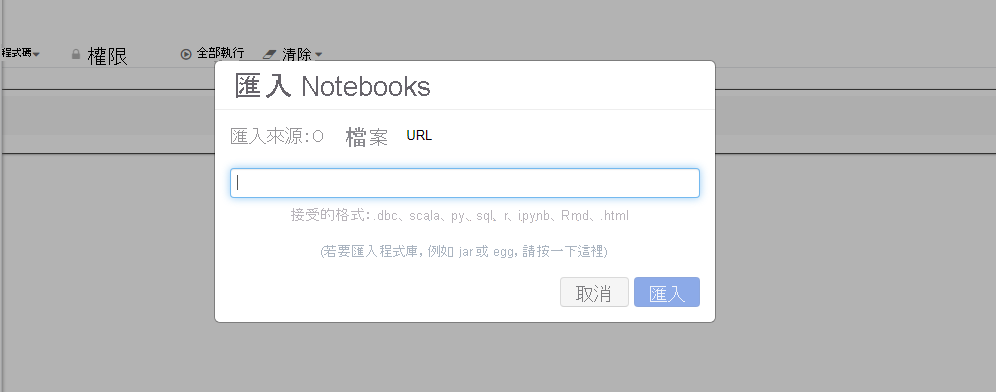
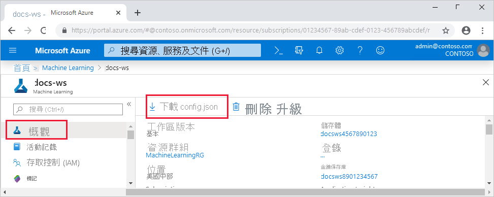

# <a name="configure-a-development-environment-for-azure-machine-learning"></a>設定 Azure Machine Learning 的開發環境
[!INCLUDE [applies-to-skus](../../includes/aml-applies-to-basic-enterprise-sku.md)]

在本文中，您將瞭解如何配置開發環境以使用 Azure 機器學習。 Azure 機器學習與平臺無關。 開發環境的唯一硬要求是 Python 3。 還建議使用孤立環境，如 Anaconda 或 Virtualenv。

下表顯示了本文涵蓋的每個開發環境，以及優缺點。

| 環境 | 優點 | 缺點 |
| --- | --- | --- |
| [基於雲的 Azure 機器學習計算實例（預覽）](#compute-instance) | 入門最簡單的方法。 整個 SDK 已安裝在工作區 VM 中，筆記本教程已預克隆並可供運行。 | 對開發環境和依賴項缺乏控制。 Linux VM 產生的額外成本（在不使用時可以停止 VM 以避免費用）。 請參閱[定價詳細資訊](https://azure.microsoft.com/pricing/details/virtual-machines/linux/)。 |
| [本機環境](#local) | 完全控制您的開發環境和依賴關係。 使用您選擇的任何生成工具、環境或 IDE 運行。 | 需要更長的時間才能開始。 必須安裝必要的 SDK 包，如果還沒有，則必須安裝環境。 |
| [Azure Databricks](#aml-databricks) | 非常適合在可擴展的 Apache Spark 平臺上運行大型密集型機器學習工作流。 | 用於實驗性機器學習或小規模實驗和工作流的超殺。 Azure 資料塊產生的額外費用。 請參閱[定價詳細資訊](https://azure.microsoft.com/pricing/details/databricks/)。 |
| [資料科學虛擬機器 （DSVM）](#dsvm) | 與基於雲的計算實例類似（已預先安裝 Python 和 SDK），但預先安裝了其他流行的資料科學和機器學習工具。 易於擴展，並與其他自訂工具和工作流結合。 | 與基於雲的計算實例相比，入門體驗較慢。 |

本文還提供了以下工具的其他使用提示：

* [朱皮特筆記本](#jupyter)：如果您已經在使用 Jupyter 筆記本，SDK 會安裝一些附加功能。

* [視覺化工作室代碼](#vscode)：如果使用視覺化工作室代碼[，Azure 機器學習擴展](https://marketplace.visualstudio.com/items?itemName=ms-toolsai.vscode-ai)包括對 Python 的廣泛語言支援以及使使用 Azure 機器學習更加方便和高效的功能。

## <a name="prerequisites"></a>Prerequisites

Azure Machine Learning 工作區。 要創建工作區，請參閱[創建 Azure 機器學習工作區](how-to-manage-workspace.md)。 工作區是使用自己的[基於雲的筆記本伺服器](#compute-instance)[、DSVM](#dsvm)或[Azure 資料磚入門所需的全部功能](#aml-databricks)。

要為[本地電腦](#local)[、Jupyter 筆記本伺服器](#jupyter)或[視覺化工作室代碼](#vscode)安裝 SDK 環境，您還需要：

- [要麼是阿納康達](https://www.anaconda.com/download/)，要麼是[Miniconda](https://conda.io/miniconda.html)包裹經理。

- 在 Linux 或 macOS 上，您需要 bash 殼層。

    > [!TIP]
    > 如果您使用的是 Linux 或 macOS 並使用 bash 以外的殼層 (例如，zsh)，則在執行一些命令時可能會收到錯誤。 若要解決此問題，請使用 `bash` 命令啟動新的 bash 殼層，並在其中執行命令。

- 在 Windows 上，您需要命令提示字元或 Anaconda 提示字元 (由 Anaconda 和 Miniconda 安裝)。

## <a name="your-own-cloud-based-compute-instance"></a><a id="compute-instance"></a>您自己的基於雲的計算實例

Azure 機器學習[計算實例（預覽）](concept-compute-instance.md)是一個安全的基於雲的 Azure 工作站，為數據科學家提供 Jupyter 筆記本電腦伺服器、JupyterLab 和完全準備好的 ML 環境。

計算實例無需安裝或配置任何內容。  隨時在 Azure 機器學習工作區中創建一個。 僅提供名稱並指定 Azure VM 類型。 現在試試本教程[：設置環境和工作區](tutorial-1st-experiment-sdk-setup.md)。

瞭解有關[計算實例的更多。](concept-compute-instance.md)

要停止產生計算費用[，應停止計算實例](tutorial-1st-experiment-sdk-train.md#clean-up-resources)。

## <a name="data-science-virtual-machine"></a><a id="dsvm"></a>資料科學虛擬機器

DSVM 是自訂的虛擬機器 (VM) 映像。 它是針對使用下列項目預先設定的資料科學工作而設計：

  - TensorFlow、PyTorch、Scikit-learn、XGBoost 及 Azure Machine Learning SDK 等套件
  - Spark 獨立版和 Drill 等常用的資料科學工具
  - Azure CLI、AzCopy 及儲存體總管等 Azure 工具
  - Visual Studio Code 和 PyCharm 等整合式開發環境 (IDE)
  - Jupyter Notebook 伺服器

Azure Machine Learning SDK 適用於 Ubuntu 或 Windows版本的 DSVM。 但如果您也打算使用 DSVM 作為計算目標，則僅支援 Ubuntu。

要將 DSVM 用作開發環境，請使用以下環境：

1. 在下列其中一個環境中建立 DSVM：

    * Azure 入口網站：

        * [建立 Ubuntu 資料科學虛擬機器](https://docs.microsoft.com/azure/machine-learning/data-science-virtual-machine/dsvm-ubuntu-intro)

        * [建立 Windows 資料科學虛擬機器](https://docs.microsoft.com/azure/machine-learning/data-science-virtual-machine/provision-vm)

    * Azure CLI：

        > [!IMPORTANT]
        > * 使用 Azure CLI 時，您必須先使用 `az login` 命令來登入您的 Azure 訂用帳戶。
        >
        > * 使用此步驟中的命令時，您必須提供資源群組名稱、VM 名稱、使用者名稱及密碼。

        * 若要建立「Ubuntu 資料科學虛擬機器」，請使用下列命令：

            ```azurecli-interactive
            # create a Ubuntu DSVM in your resource group
            # note you need to be at least a contributor to the resource group in order to execute this command successfully
            # If you need to create a new resource group use: "az group create --name YOUR-RESOURCE-GROUP-NAME --location YOUR-REGION (For example: westus2)"
            az vm create --resource-group YOUR-RESOURCE-GROUP-NAME --name YOUR-VM-NAME --image microsoft-dsvm:linux-data-science-vm-ubuntu:linuxdsvmubuntu:latest --admin-username YOUR-USERNAME --admin-password YOUR-PASSWORD --generate-ssh-keys --authentication-type password
            ```

        * 若要建立「Windows 資料科學虛擬機器」，請使用下列命令：

            ```azurecli-interactive
            # create a Windows Server 2016 DSVM in your resource group
            # note you need to be at least a contributor to the resource group in order to execute this command successfully
            az vm create --resource-group YOUR-RESOURCE-GROUP-NAME --name YOUR-VM-NAME --image microsoft-dsvm:dsvm-windows:server-2016:latest --admin-username YOUR-USERNAME --admin-password YOUR-PASSWORD --authentication-type password
            ```

2. Azure Machine Learning SDK 已安裝在 DSVM 上。 若要使用包含該 SDK 的 Conda 環境，請使用下列命令之一：

    * Ubuntu DSVM：

        ```bash
        conda activate py36
        ```

    * Windows DSVM：

        ```bash
        conda activate AzureML
        ```

1. 若要確認您是否可以存取 SDK 並檢查版本，請使用下列 Python 程式碼：

    ```python
    import azureml.core
    print(azureml.core.VERSION)
    ```

1. 要將 DSVM 配置為使用 Azure 機器學習工作區，請參閱[創建工作區設定檔](#workspace)部分。

如需詳細資訊，請參閱[資料科學虛擬機器](https://azure.microsoft.com/services/virtual-machines/data-science-virtual-machines/)。

## <a name="local-computer"></a><a id="local"></a>本機電腦

當您使用本地電腦（可能也是遠端虛擬機器）時，創建 Anaconda 環境並安裝 SDK。 以下是範例：

1. 下載並安裝[Anaconda（Python](https://www.anaconda.com/distribution/#download-section) 3.7版本），如果你還沒有它。

1. 打開 Anaconda 提示，創建具有以下命令的環境：

    運行以下命令以創建環境。

    ```bash
    conda create -n myenv python=3.6.5
    ```

    然後啟動環境。

    ```bash
    conda activate myenv
    ```

    此示例使用 python 3.6.5 創建環境，但可以選擇任何特定的子版本。 某些主要版本（建議使用 3.5+）可能無法保證 SDK 相容性，如果您遇到錯誤，建議在 Anaconda 環境中嘗試其他版本/顛覆。 建立環境可能需要幾分鐘的時間，因為需要下載元件和套件。

1. 在新環境中運行以下命令，以啟用特定于環境的 IPython 內核。 這將確保在 Anaconda 環境中使用 Jupyter 筆記本時的預期內核和包導入行為：

    ```bash
    conda install notebook ipykernel
    ```

    然後運行以下命令以創建內核：

    ```bash
    ipython kernel install --user --name myenv --display-name "Python (myenv)"
    ```

1. 使用以下命令安裝包：

    此命令使用筆記本和其他`automl`功能安裝基本 Azure 機器學習 SDK。 額外的`automl`是大型安裝，如果您不打算運行自動機器學習實驗，則可以從支架中刪除。 額外的`automl`還包括 Azure 機器學習資料準備 SDK 預設情況下作為依賴項。

    ```bash
    pip install azureml-sdk[notebooks,automl]
    ```

   > [!NOTE]
   > * 如果顯示訊息表示無法解除安裝 PyYAML ，請改用下列命令：
   >
   >   `pip install --upgrade azureml-sdk[notebooks,automl] --ignore-installed PyYAML`
   >
   > * 從 macOS Catalina 開始，預設登入殼層和互動式殼層皆為 zsh (Z 殼層)。 在 zsh 中，請使用下列命令，並以 "\\" (反斜線) 逸出括號：
   >
   >   `pip install --upgrade azureml-sdk\[notebooks,automl\]`

   安裝 SDK 需要幾分鐘時間。 有關安裝選項的詳細資訊，請參閱[安裝指南](https://docs.microsoft.com/python/api/overview/azure/ml/install?view=azure-ml-py)。

1. 為機器學習實驗安裝其他套裝軟體。

    使用以下任一命令，並將*\<新包>* 替換為要安裝的包。 通過`conda install`安裝包需要包是當前通道的一部分（可以在 Anaconda 雲中添加新通道）。

    ```bash
    conda install <new package>
    ```

    或者，您可以通過 安裝包`pip`。

    ```bash
    pip install <new package>
    ```

### <a name="jupyter-notebooks"></a><a id="jupyter"></a>Jupyter 筆記本

Jupyter Notebook 是 [Jupyter 專案](https://jupyter.org/)的一部分。 它們提供互動式程式碼撰寫體驗，讓您用來建立混合即時程式碼與敘述文字和圖形的文件。 Jupyter Notebook 也是與其他人共用結果的好方法，因為您可以將程式碼區段的輸出儲存在文件中。 您可以在各種不同的平台上安裝 Jupyter Notebook。

["本地電腦](#local)"部分中的過程安裝必要的元件，用於在 Anaconda 環境中運行 Jupyter 筆記本。

要在 Jupyter 筆記本環境中啟用這些元件，請進行以下工作：

1. 打開 Anaconda 提示並啟動您的環境。

    ```bash
    conda activate myenv
    ```

1. 克隆一組示例筆記本的[GitHub 存儲庫](https://aka.ms/aml-notebooks)。

    ```bash
    git clone https://github.com/Azure/MachineLearningNotebooks.git
    ```

1. 使用以下命令啟動 Jupyter 筆記本伺服器：

    ```bash
    jupyter notebook
    ```

1. 要驗證 Jupyter 筆記本是否可以使用 SDK，請**創建新筆記本，** 選擇**Python 3**作為內核，然後在筆記本儲存格中運行以下命令：

    ```python
    import azureml.core
    azureml.core.VERSION
    ```

1. 如果在導入模組並收到問題時`ModuleNotFoundError`遇到 ，請確保 Jupyter 內核通過在筆記本單元中運行以下代碼連接到環境的正確路徑。

    ```python
    import sys
    sys.path
    ```

1. 要將 Jupyter 筆記本配置為使用 Azure 機器學習工作區，請轉到["創建工作區設定檔"](#workspace)部分。

### <a name="visual-studio-code"></a><a id="vscode"></a>Visual Studio Code

Visual Studio Code 是一款非常受歡迎的跨平臺代碼編輯器，通過[Visual Studio 市場](https://marketplace.visualstudio.com/vscode)提供的擴展支援一組廣泛的程式設計語言和工具。 [Azure 機器學習擴展](https://marketplace.visualstudio.com/items?itemName=ms-toolsai.vscode-ai)將安裝用於在所有類型的 Python 環境（虛擬、Anaconda 等）進行編碼的[Python 擴展](https://marketplace.visualstudio.com/items?itemName=ms-python.python)。 此外，它還提供了使用 Azure 機器學習資源和運行 Azure 機器學習實驗的便捷功能，而無需離開 Visual Studio 代碼。

要使用視覺化工作室代碼進行開發：

1. 安裝 Visual Studio 代碼的 Azure 機器學習擴展，請參閱[Azure 機器學習](https://marketplace.visualstudio.com/items?itemName=ms-toolsai.vscode-ai)。

    如需詳細資訊，請參閱[使用適用於 Visual Studio Code 的 Azure Machine Learning](tutorial-setup-vscode-extension.md)。

1. 瞭解如何將 Visual Studio 代碼用於任何類型的 Python 開發，請參閱[在 VSCode 中開始使用 Python。](https://code.visualstudio.com/docs/python/python-tutorial)

    - 要選擇包含 SDK 的 SDK Python 環境，請打開 VS 代碼，然後選擇 Ctrl_Shift_P（Linux 和 Windows）或命令_Shift_P （Mac）。
        - 命令__調色板__將打開。

    - 輸入__Python：選擇解譯器__，然後選擇適當的環境

1. 要驗證是否可以使用 SDK，請創建一個包含以下代碼的新 Python 檔 （.py）：

    ```python
    #%%
    import azureml.core
    azureml.core.VERSION
    ```
    按一下"運行儲存格"CodeLens 或簡單地按移位輸入來運行此代碼。
<a name="aml-databricks"></a>

## <a name="azure-databricks"></a>Azure Databricks
Azure 資料塊是 Azure 雲中基於 Apache Spark 的環境。 它提供了一個基於筆記本的協作環境，具有 CPU 或基於 GPU 的計算群集。

Azure 資料塊如何與 Azure 機器學習配合使用：
+ 您可以使用 Spark MLlib 訓練模型，並將模型從 Azure 資料塊中部署到 ACI/AKS。
+ 您還可以在特殊的 Azure ML SDK 中使用具有 Azure 資料塊的[自動機器學習](concept-automated-ml.md)功能。
+ 可以使用 Azure 資料塊作為[Azure 機器學習管道](concept-ml-pipelines.md)的計算目標。

### <a name="set-up-your-databricks-cluster"></a>設置資料磚塊群集

創建[資料磚塊群集](https://docs.microsoft.com/azure/azure-databricks/quickstart-create-databricks-workspace-portal)。 僅當在 Databricks 上安裝用於自動機器學習的 SDK 時，才會應用某些設置。
**建立叢集將需要幾分鐘的時間。**

使用下列設定：

| 設定 |適用於| 值 |
|----|---|---|
| 叢集名稱 |always| yourclustername |
| Databricks 執行階段 |always|非 ML 運行時 6.0 （scala 2.11， 火花 2.4.3） |
| Python 版本 |always| 3 |
| 背景工作角色 |always| 2 個以上 |
| 背景工作節點 VM 類型 <br>（確定併發反覆運算的最大 #） |自動化 ML<br>向| 建議使用已記憶體最佳化的 VM |
| 啟用自動調整 |自動化 ML<br>向| 取消選取 |

請靜候至叢集運作，再繼續操作。

### <a name="install-the-correct-sdk-into-a-databricks-library"></a>將正確的 SDK 安裝到資料磚塊庫中
群集運行後，[創建一個庫](https://docs.databricks.com/user-guide/libraries.html#create-a-library)，將相應的 Azure 機器學習 SDK 包附加到群集。

1. 按右鍵要存儲庫的當前工作區資料夾。 選擇 **"創建** > **庫**"。

1. **僅選擇一個選項**（不支援其他 SDK 安裝）

   |SDK&nbsp;&nbsp;包附加功能|來源|皮皮&nbsp;名稱&nbsp;&nbsp;&nbsp;&nbsp;&nbsp;&nbsp;|
   |----|---|---|
   |對於資料磚| 上傳 Python Egg 或 PyPI | azureml-sdk[databricks]|
   |對於資料磚 - 與<br> 自動 ML 功能| 上傳 Python Egg 或 PyPI | azureml-sdk[自動ml]|

   > [!Warning]
   > 無法安裝其他 SDK 附加功能。 僅選擇上述選項之一 [資料磚] 或 [自動ml]。

   * 不要選擇**自動附加到所有群集**。
   * 選擇 **"附加到**群集名稱"。

1. 監視錯誤，直到狀態更改為**附加**，這可能需要幾分鐘時間。  如果此步驟失敗：

   請嘗試重新開機群集：
   1. 在左窗格中，選取 [叢集]****。
   1. 請選取表格中您的叢集名稱。
   1. 在 [程式庫]**** 索引標籤上，選取 [重新啟動]****。

   還要考慮：
   + 在自動ML配置中，使用 Azure 資料塊時添加以下參數：
       1. ```max_concurrent_iterations```基於群集中的工作節點數。
        2. ```spark_context=sc```基於預設火花上下文。
   + 或者，如果您有舊的 SDK 版本，請將其從群集安裝的 libs 中取消選擇，然後移動到垃圾堆中。 安裝新版 SDK，並重新啟動叢集。 如果重新開機後出現問題，請分離並重新連接群集。

如果安裝成功，導入的庫應類似于以下庫之一：

資料磚**_SDK，無需_** 自動機器學習

資料磚 SDK**與**自動機器學習

### <a name="start-exploring"></a>開始探索

現在就試試看：
+ 雖然許多示例筆記本可用，**但只有[這些示例筆記本](https://github.com/Azure/MachineLearningNotebooks/blob/master/how-to-use-azureml/azure-databricks)使用 Azure 資料塊。**

+ 直接從工作區導入這些示例。 請參閱以下內容：


+ 瞭解如何[創建使用資料磚塊作為訓練計算的管道](how-to-create-your-first-pipeline.md)。

## <a name="create-a-workspace-configuration-file"></a><a id="workspace"></a>建立工作區組態檔

工作區設定檔是一個 JSON 檔，該檔告訴 SDK 如何與 Azure 機器學習工作區進行通信。 檔案名稱為 *config.json*，其格式如下：

```json
{
    "subscription_id": "<subscription-id>",
    "resource_group": "<resource-group>",
    "workspace_name": "<workspace-name>"
}
```

這個 JSON 檔案必須位於包含您的 Python 指令碼或 Jupyter Notebook 的目錄結構中。 可以位於相同的目錄，名為 *aml_config* 的子目錄，或位於父目錄。

要使用程式碼中的此檔案，請使用 `ws=Workspace.from_config()`。 此程式碼會從檔案載入資訊，並連接到您的工作區。

您可以透過三種方式建立組態檔：

* **使用[ws.write_config](https://docs.microsoft.com/python/api/overview/azure/ml/intro?view=azure-ml-py)**： 編寫*config.json*檔。 此檔案包含您工作區的組態資訊。 您可以將此 *config.json* 下載或複製到其他開發環境。

* **下載檔案**：在[Azure 門戶](https://ms.portal.azure.com)中，從工作區的 **"概述"** 部分選擇 **"下載 config.json"。**

     

* **以程式設計方式創建檔**：在以下程式碼片段中，通過提供訂閱 ID、資源組和工作區名稱連接到工作區。 接著，它會將工作區組態儲存至檔案：

    ```python
    from azureml.core import Workspace

    subscription_id = '<subscription-id>'
    resource_group  = '<resource-group>'
    workspace_name  = '<workspace-name>'

    try:
        ws = Workspace(subscription_id = subscription_id, resource_group = resource_group, workspace_name = workspace_name)
        ws.write_config()
        print('Library configuration succeeded')
    except:
        print('Workspace not found')
    ```

    此代碼將設定檔寫入 *.azureml/config.json*檔。

## <a name="next-steps"></a>後續步驟

- 使用 MNIST 資料集在 Azure 機器學習上[訓練模型](tutorial-train-models-with-aml.md)
- 檢視[適用於 Python 的 Azure Machine Learning SDK](https://docs.microsoft.com/python/api/overview/azure/ml/intro?view=azure-ml-py) \(英文\) 參考
