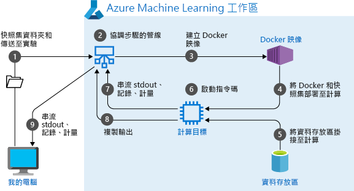
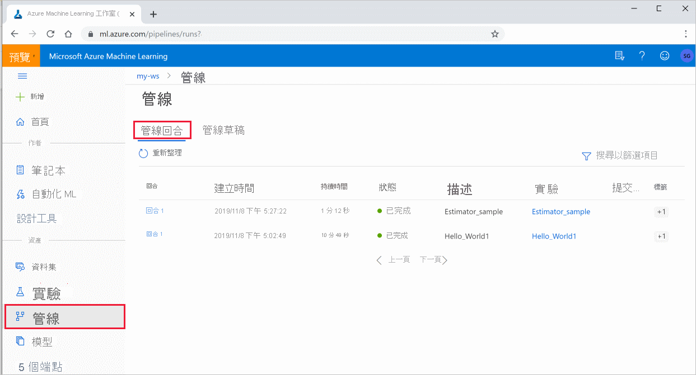

# <a name="create-and-run-machine-learning-pipelines-with-azure-machine-learning-sdk"></a>使用 Azure 機器學習 SDK 創建和運行機器學習管道
[!INCLUDE [applies-to-skus](../../includes/aml-applies-to-basic-enterprise-sku.md)]

在本文中，您將了解如何使用 [Azure Machine Learning SDK](https://docs.microsoft.com/python/api/overview/azure/ml/intro?view=azure-ml-py) 來建立、發佈、執行及追蹤[機器學習管線](concept-ml-pipelines.md)。  使用**ML 管道**創建將各種 ML 階段拼接在一起的工作流，然後將該管道發佈到 Azure 機器學習工作區，以便稍後訪問或與他人共用。  ML 管道非常適合批次處理評分方案，使用各種計算，重用步驟，而不是重新運行這些步驟，以及與他人共用 ML 工作流。

雖然可以使用不同類型的管道（稱為[Azure 管道](https://docs.microsoft.com/azure/devops/pipelines/targets/azure-machine-learning?context=azure%2Fmachine-learning%2Fservice%2Fcontext%2Fml-context&view=azure-devops&tabs=yaml)）實現 ML 任務的 CI/CD 自動化，但這種類型的管道永遠不會存儲在工作區中。 [比較這些不同的管道](concept-ml-pipelines.md#which-azure-pipeline-technology-should-i-use)。

ML 管道的每個階段（如資料準備和模型培訓）可以包括一個或多個步驟。

您創建的 ML 管道對 Azure 機器學習[工作區](how-to-manage-workspace.md)的成員可見。 

ML 管道使用遠端計算目標進行計算，並存儲與該管道關聯的中間資料和最終資料。 他們可以讀取和寫入資料，並從受支援的[Azure 存儲位置讀取](https://docs.microsoft.com/azure/storage/)和寫入資料。

如果您沒有 Azure 訂用帳戶，請在開始前先建立一個免費帳戶。 嘗試[Azure 機器學習的免費或付費版本](https://aka.ms/AMLFree)。

## <a name="prerequisites"></a>Prerequisites

* 建立 [Azure Machine Learning 工作區](how-to-manage-workspace.md)以保存您的所有管線資源。

* [將開發環境配置為](how-to-configure-environment.md)安裝 Azure 機器學習 SDK，或使用已安裝 SDK 的[Azure 機器學習計算實例（預覽）。](concept-compute-instance.md)

首先附加工作區：

```Python
import azureml.core
from azureml.core import Workspace, Datastore

ws = Workspace.from_config()
```


## <a name="set-up-machine-learning-resources"></a>設定機器學習資源

創建運行 ML 管道所需的資源：

* 設定用來存取管線步驟中所需資料的資料存放區。

* 設定 `DataReference` 物件，以指向位於資料存放區中或可在資料存放區中存取的資料。

* 設定將作為您管線步驟執行位置的[計算目標](concept-azure-machine-learning-architecture.md#compute-targets)。

### <a name="set-up-a-datastore"></a>設定資料存放區

資料存放區會儲存可供管線存取的資料。 每個工作區都有一個預設的資料存放區。 您可以註冊額外的資料存放區。 

創建工作區時[，Azure 檔和](https://docs.microsoft.com/azure/storage/files/storage-files-introduction) [Azure Blob 存儲](https://docs.microsoft.com/azure/storage/blobs/storage-blobs-introduction)將附加到工作區。 將註冊預設資料存儲以連接到 Azure Blob 存儲。 若要深入了解，請參閱[決定何時使用 Azure 檔案、Azure Blob 或 Azure 磁碟](https://docs.microsoft.com/azure/storage/common/storage-decide-blobs-files-disks)。 

```python
# Default datastore 
def_data_store = ws.get_default_datastore()

# Get the blob storage associated with the workspace
def_blob_store = Datastore(ws, "workspaceblobstore")

# Get file storage associated with the workspace
def_file_store = Datastore(ws, "workspacefilestore")

```

請將資料檔案或目錄上傳至資料存放區，以便能夠從您的管線存取這些資料檔案或目錄。 此示例使用 Blob 存儲作為資料存儲：

```python
def_blob_store.upload_files(
    ["./data/20news.pkl"],
    target_path="20newsgroups",
    overwrite=True)
```

管線會由一或多個步驟所組成。 步驟是在計算目標上執行的單位。 步驟可能會取用資料來源並產生「中繼」資料。 步驟可以建立資料 (例如模型)、含有模型和相依檔案的目錄，或是暫存資料。 此資料接著便可供管線中稍後的其他步驟使用。

要瞭解有關將管道連接到資料有關，請參閱[文章"如何訪問資料](how-to-access-data.md)[以及如何註冊資料集](how-to-create-register-datasets.md)"。 

### <a name="configure-data-reference"></a>設定資料參考

您剛建立一個可在管線中當作某個步驟的輸出來參考的資料來源。 管線中的資料來源會由 [DataReference](https://docs.microsoft.com/python/api/azureml-core/azureml.data.data_reference.datareference) 物件代表。 `DataReference` 物件會指向位於資料存放區中或可從資料存放區存取的資料。

```python
from azureml.data.data_reference import DataReference

blob_input_data = DataReference(
    datastore=def_blob_store,
    data_reference_name="test_data",
    path_on_datastore="20newsgroups/20news.pkl")
```

中繼資料 (或步驟的輸出) 會由 [PipelineData](https://docs.microsoft.com/python/api/azureml-pipeline-core/azureml.pipeline.core.pipelinedata?view=azure-ml-py) 物件代表。 `output_data1` 會產生為步驟的輸出，並用來作為一或多個未來步驟的輸入。 `PipelineData` 會在步驟之間導入資料相依性，並在管線中建立隱含的執行順序。 稍後創建管道步驟時將使用此物件。

```python
from azureml.pipeline.core import PipelineData

output_data1 = PipelineData(
    "output_data1",
    datastore=def_blob_store,
    output_name="output_data1")
```

### <a name="configure-data-using-datasets"></a>使用資料集配置資料

如果將表格資料存儲在檔或檔集中，則[表格資料集](https://docs.microsoft.com/python/api/azureml-core/azureml.data.tabulardataset?view=azure-ml-py)是 的有效`DataReference`替代方法。 `TabularDataset`物件支援版本控制、差異和摘要統計資訊。 `TabularDataset`s 是懶惰的評估（如 Python 產生器），通過拆分或篩選來對其進行子集是有效的。 該`FileDataset`類提供表示一個或多個檔的類似拉蒂計算的資料。 

創建一個`TabularDataset`使用的方法，如[from_delimited_files。](https://docs.microsoft.com/python/api/azureml-core/azureml.data.dataset_factory.tabulardatasetfactory?view=azure-ml-py#from-delimited-files-path--validate-true--include-path-false--infer-column-types-true--set-column-types-none--separator------header-true--partition-format-none-)

```python
from azureml.data import TabularDataset

iris_tabular_dataset = Dataset.Tabular.from_delimited_files([(def_blob_store, 'train-dataset/tabular/iris.csv')])
```

 使用`FileDataset`[from_files](https://docs.microsoft.com/python/api/azureml-core/azureml.data.dataset_factory.filedatasetfactory?view=azure-ml-py#from-files-path--validate-true-)創建 一個 。

 您可以瞭解有關使用"[添加&寄存器資料集](how-to-create-register-datasets.md)或[此示例筆記本](https://aka.ms/train-datasets)）的資料集。

## <a name="set-up-compute-target"></a>設定計算目標

在 Azure 機器學習中，術語__計算__（或__計算目標__）是指在機器學習管道中執行計算步驟的電腦或群集。   如需完整的計算目標清單，以及了解如何建立這些目標並將其連結至您的工作區，請參閱[用於模型定型的計算目標](how-to-set-up-training-targets.md)。  不論您是要將模型定型還是執行管線步驟，建立和/或連結計算目標的程序都相同。 在您建立並連結計算目標之後，請在您的[管線步驟](#steps)中使用 `ComputeTarget` 物件。

> [!IMPORTANT]
> 不支援從遠端作業內部對計算目標執行管理作業。 由於機器學習管線會作為遠端作業提交，因此請勿從管線內對計算目標使用管理作業。

以下是為下列項目建立並連結計算目標的範例：

* Azure Machine Learning Compute
* Azure Databricks 
* Azure Data Lake Analytics

### <a name="azure-machine-learning-compute"></a>Azure Machine Learning Compute

您可以建立用來執行步驟的 Azure Machine Learning Compute。

```python
from azureml.core.compute import ComputeTarget, AmlCompute

compute_name = "aml-compute"
vm_size = "STANDARD_NC6"
if compute_name in ws.compute_targets:
    compute_target = ws.compute_targets[compute_name]
    if compute_target and type(compute_target) is AmlCompute:
        print('Found compute target: ' + compute_name)
else:
    print('Creating a new compute target...')
    provisioning_config = AmlCompute.provisioning_configuration(vm_size=vm_size,  # STANDARD_NC6 is GPU-enabled
                                                                min_nodes=0,
                                                                max_nodes=4)
    # create the compute target
    compute_target = ComputeTarget.create(
        ws, compute_name, provisioning_config)

    # Can poll for a minimum number of nodes and for a specific timeout.
    # If no min node count is provided it will use the scale settings for the cluster
    compute_target.wait_for_completion(
        show_output=True, min_node_count=None, timeout_in_minutes=20)

    # For a more detailed view of current cluster status, use the 'status' property
    print(compute_target.status.serialize())
```

### <a name="azure-databricks"></a><a id="databricks"></a>Azure Databricks

Azure Databricks 是 Azure 雲端中的 Apache Spark 型環境。 它可與 Azure Machine Learning 管線搭配使用作為計算目標。

使用 Azure Databricks 之前，請先建立其工作區。 要創建工作區資源，請參閱在[Azure 資料磚塊文檔中運行 Spark 作業](https://docs.microsoft.com/azure/azure-databricks/quickstart-create-databricks-workspace-portal)。

若要連結 Azure Databricks 作為計算目標，請提供下列資訊：

* __資料磚計算名稱__：要分配給此計算資源的名稱。
* __資料塊工作區名稱__：Azure 資料塊工作區的名稱。
* __資料磚訪問權杖__：用於對 Azure 資料磚塊進行身份驗證的訪問權杖。 若要產生存取權杖，請參閱[驗證](https://docs.azuredatabricks.net/dev-tools/api/latest/authentication.html)文件。

以下代碼演示如何將 Azure 資料塊附加到 Azure 機器學習 SDK 的計算目標（__資料磚工作區需要與 AML 工作區位於同一訂閱中__）：

```python
import os
from azureml.core.compute import ComputeTarget, DatabricksCompute
from azureml.exceptions import ComputeTargetException

databricks_compute_name = os.environ.get(
    "AML_DATABRICKS_COMPUTE_NAME", "<databricks_compute_name>")
databricks_workspace_name = os.environ.get(
    "AML_DATABRICKS_WORKSPACE", "<databricks_workspace_name>")
databricks_resource_group = os.environ.get(
    "AML_DATABRICKS_RESOURCE_GROUP", "<databricks_resource_group>")
databricks_access_token = os.environ.get(
    "AML_DATABRICKS_ACCESS_TOKEN", "<databricks_access_token>")

try:
    databricks_compute = ComputeTarget(
        workspace=ws, name=databricks_compute_name)
    print('Compute target already exists')
except ComputeTargetException:
    print('compute not found')
    print('databricks_compute_name {}'.format(databricks_compute_name))
    print('databricks_workspace_name {}'.format(databricks_workspace_name))
    print('databricks_access_token {}'.format(databricks_access_token))

    # Create attach config
    attach_config = DatabricksCompute.attach_configuration(resource_group=databricks_resource_group,
                                                           workspace_name=databricks_workspace_name,
                                                           access_token=databricks_access_token)
    databricks_compute = ComputeTarget.attach(
        ws,
        databricks_compute_name,
        attach_config
    )

    databricks_compute.wait_for_completion(True)
```

有關更詳細的示例，請參閱 GitHub 上[的示例筆記本](https://aka.ms/pl-databricks)。

### <a name="azure-data-lake-analytics"></a><a id="adla"></a>Azure Data Lake Analytics

Azure Data Lake Analytics 是 Azure 雲端中的巨量資料分析平台。 它可與 Azure Machine Learning 管線搭配使用作為計算目標。

在使用 Azure Data Lake Analytics 之前，請先建立其帳戶。 若要建立此資源，請參閱[開始使用 Azure Data Lake Analytics](https://docs.microsoft.com/azure/data-lake-analytics/data-lake-analytics-get-started-portal) 文件。

若要連結 Data Lake Analytics 來作為計算目標，您必須使用 Azure Machine Learning SDK，並提供下列資訊：

* __計算名稱__：您想要指派給這個計算資源的名稱。
* __資源組__：包含資料湖分析帳戶的資源組。
* __帳戶名稱__：資料湖分析帳戶名稱。

下列程式碼示範如何連結 Data Lake Analytics 來作為計算目標：

```python
import os
from azureml.core.compute import ComputeTarget, AdlaCompute
from azureml.exceptions import ComputeTargetException


adla_compute_name = os.environ.get(
    "AML_ADLA_COMPUTE_NAME", "<adla_compute_name>")
adla_resource_group = os.environ.get(
    "AML_ADLA_RESOURCE_GROUP", "<adla_resource_group>")
adla_account_name = os.environ.get(
    "AML_ADLA_ACCOUNT_NAME", "<adla_account_name>")

try:
    adla_compute = ComputeTarget(workspace=ws, name=adla_compute_name)
    print('Compute target already exists')
except ComputeTargetException:
    print('compute not found')
    print('adla_compute_name {}'.format(adla_compute_name))
    print('adla_resource_id {}'.format(adla_resource_group))
    print('adla_account_name {}'.format(adla_account_name))
    # create attach config
    attach_config = AdlaCompute.attach_configuration(resource_group=adla_resource_group,
                                                     account_name=adla_account_name)
    # Attach ADLA
    adla_compute = ComputeTarget.attach(
        ws,
        adla_compute_name,
        attach_config
    )

    adla_compute.wait_for_completion(True)
```

有關更詳細的示例，請參閱 GitHub 上[的示例筆記本](https://aka.ms/pl-adla)。

> [!TIP]
> Azure Machine Learning 管線只能使用 Data Lake Analytics 帳戶的預設資料存放區中所儲存的資料來運作。 如果需要使用的資料位於非預設存儲中，則可以使用[`DataTransferStep`](https://docs.microsoft.com/python/api/azureml-pipeline-steps/azureml.pipeline.steps.data_transfer_step.datatransferstep?view=azure-ml-py)在培訓前複製資料。

## <a name="construct-your-pipeline-steps"></a><a id="steps"></a>建構您的管線步驟

建立計算目標並將其連結至您的工作區之後，您便已做好定義管線步驟的準備。 透過 Azure Machine Learning SDK，有許多內建的步驟可供使用。 這些步驟中最基本的步驟是[PythonScriptStep，](https://docs.microsoft.com/python/api/azureml-pipeline-steps/azureml.pipeline.steps.python_script_step.pythonscriptstep?view=azure-ml-py)它運行在指定的計算目標中的 Python 腳本：

```python
from azureml.pipeline.steps import PythonScriptStep

trainStep = PythonScriptStep(
    script_name="train.py",
    arguments=["--input", blob_input_data, "--output", output_data1],
    inputs=[blob_input_data],
    outputs=[output_data1],
    compute_target=compute_target,
    source_directory=project_folder
)
```

在協作環境中使用管道`allow_reuse`時，重用以前的結果 （ ） 是關鍵，因為消除不必要的重新運行可提供敏捷性。 當script_name、輸入和步驟的參數保持不變時，重用是預設行為。 重用步驟的輸出時，作業不會提交到計算，相反，上一個運行的結果將立即可用於下一步的運行。 如果`allow_reuse`設置為 false，則始終在管道執行期間會為此步驟生成新的運行。 

定義步驟之後，您必須使用這些步驟中的部分或全部步驟來建置管線。

> [!NOTE]
> 定義步驟或生成管道時，不會將任何檔或資料上載到 Azure 機器學習。

```python
# list of steps to run
compareModels = [trainStep, extractStep, compareStep]

from azureml.pipeline.core import Pipeline

# Build the pipeline
pipeline1 = Pipeline(workspace=ws, steps=[compareModels])
```

下列範例會使用稍早建立的 Azure Databricks 計算目標： 

```python
from azureml.pipeline.steps import DatabricksStep

dbStep = DatabricksStep(
    name="databricksmodule",
    inputs=[step_1_input],
    outputs=[step_1_output],
    num_workers=1,
    notebook_path=notebook_path,
    notebook_params={'myparam': 'testparam'},
    run_name='demo run name',
    compute_target=databricks_compute,
    allow_reuse=False
)
# List of steps to run
steps = [dbStep]

# Build the pipeline
pipeline1 = Pipeline(workspace=ws, steps=steps)
```

### <a name="use-a-dataset"></a>使用資料集 

要使用 管道`TabularDataset`或`FileDataset`管道中的 a，您需要通過調用[as_named_input（名稱）](https://docs.microsoft.com/python/api/azureml-core/azureml.data.abstract_dataset.abstractdataset?view=azure-ml-py#as-named-input-name-)將其轉換為[資料集消耗配置](https://docs.microsoft.com/python/api/azureml-core/azureml.data.dataset_consumption_config.datasetconsumptionconfig?view=azure-ml-py)物件。 將此`DatasetConsumptionConfig`物件作為管道`inputs`步驟之一傳遞給管道。 

從 Azure Blob 存儲、Azure 檔、Azure 資料存儲第 1 代、Azure 資料存儲第 2 代、Azure SQL 資料庫和用於 PostgreSQL 的 Azure 資料庫創建的資料集可用作任何管道步驟的輸入。 除了將輸出寫入[資料傳輸步驟](https://docs.microsoft.com/python/api/azureml-pipeline-steps/azureml.pipeline.steps.datatransferstep?view=azure-ml-py)或[資料磚塊步驟](https://docs.microsoft.com/python/api/azureml-pipeline-steps/azureml.pipeline.steps.databricks_step.databricksstep?view=azure-ml-py)外，輸出[資料（管道資料](https://docs.microsoft.com/python/api/azureml-pipeline-core/azureml.pipeline.core.pipelinedata?view=azure-ml-py)）只能寫入 Azure Blob 和 Azure 檔共用資料存儲。

```python
dataset_consuming_step = PythonScriptStep(
    script_name="iris_train.py",
    inputs=[iris_tabular_dataset.as_named_input("iris_data")],
    compute_target=compute_target,
    source_directory=project_folder
)
```

然後，使用[Run.input_datasets](https://docs.microsoft.com/python/api/azureml-core/azureml.core.run.run?view=azure-ml-py#input-datasets)字典檢索管道中的資料集。

```python
# iris_train.py
from azureml.core import Run, Dataset

run_context = Run.get_context()
iris_dataset = run_context.input_datasets['iris_data']
dataframe = iris_dataset.to_pandas_dataframe()
```

有關詳細資訊，請參閱 azure[管道步驟包](https://docs.microsoft.com/python/api/azureml-pipeline-steps/?view=azure-ml-py)和[管道類](https://docs.microsoft.com/python/api/azureml-pipeline-core/azureml.pipeline.core.pipeline%28class%29?view=azure-ml-py)引用。

## <a name="submit-the-pipeline"></a>提交管線

提交管道時，Azure 機器學習會檢查每個步驟的依賴項，並上載您指定的原始目錄的快照。 如果未指定來源目錄，則會上傳目前的本機目錄。 快照也會作為實驗的一部分存儲在工作區中。

> [!IMPORTANT]
> 要防止檔包含在快照中，請在目錄中創建[.gitignore](https://git-scm.com/docs/gitignore) `.amlignore`或檔，並將檔添加到其中。 該檔`.amlignore`使用與[.gitignore](https://git-scm.com/docs/gitignore)檔相同的語法和模式。 如果兩個檔都存在，`.amlignore`則檔優先。
>
> 如需詳細資訊，請參閱[快照集](concept-azure-machine-learning-architecture.md#snapshots)。

```python
from azureml.core import Experiment

# Submit the pipeline to be run
pipeline_run1 = Experiment(ws, 'Compare_Models_Exp').submit(pipeline1)
pipeline_run1.wait_for_completion()
```

當您第一次執行管線時，Azure Machine Learning 會：

* 從與工作區相關的 Blob 儲存體，將專案快照集下載到計算目標。
* 建置與管線中的每個步驟相對應的 Docker 映像。
* 將每個步驟的 Docker 映射從容器註冊表下載到計算目標。
* 如果在步驟中指定了物件，`DataReference`則裝載資料存儲。 如果不支援掛接，則會改為將資料複製到計算目標。
* 在步驟定義中指定的計算目標內執行步驟。 
* 建立步驟所指定的成品，例如記錄、stdout 和 stderr、計量及輸出。 這些成品會接著上傳到使用者的預設資料存放區，並保存在該處。



有關詳細資訊，請參閱[實驗類](https://docs.microsoft.com/python/api/azureml-core/azureml.core.experiment.experiment?view=azure-ml-py)引用。

### <a name="view-results-of-a-pipeline"></a>查看管道的結果

在演播室中查看所有管道及其運行詳細資訊的清單：

1. 登入 [Azure Machine Learning Studio](https://ml.azure.com)。

1. [查看工作區](how-to-manage-workspace.md#view)。

1. 在左側，選擇**管道**以查看所有管道運行。
 
 
1. 選取特定管線以查看執行結果。

## <a name="git-tracking-and-integration"></a>Git 跟蹤和集成

當您啟動訓練運行時，原始目錄是本地 Git 存儲庫時，有關存儲庫的資訊存儲在執行歷程記錄中。 有關詳細資訊，請參閱[Azure 機器學習的 Git 集成](concept-train-model-git-integration.md)。

## <a name="publish-a-pipeline"></a>發佈管線

您可以發佈管線以稍後使用不同的輸入來執行它。 若要讓已發佈之管線的 REST 端點接受參數，您必須在發佈管線前將其參數化。

1. 若要建立管線參數，請使用 [PipelineParameter](https://docs.microsoft.com/python/api/azureml-pipeline-core/azureml.pipeline.core.graph.pipelineparameter?view=azure-ml-py) 物件搭配預設值。

   ```python
   from azureml.pipeline.core.graph import PipelineParameter
   
   pipeline_param = PipelineParameter(
     name="pipeline_arg",
     default_value=10)
   ```

2. 將這個 `PipelineParameter` 物件以參數形式新增至管線中的任何步驟，如下所示：

   ```python
   compareStep = PythonScriptStep(
     script_name="compare.py",
     arguments=["--comp_data1", comp_data1, "--comp_data2", comp_data2, "--output_data", out_data3, "--param1", pipeline_param],
     inputs=[ comp_data1, comp_data2],
     outputs=[out_data3],
     compute_target=compute_target,
     source_directory=project_folder)
   ```

3. 發佈這個將在被叫用時接受參數的管線。

   ```python
   published_pipeline1 = pipeline_run1.publish_pipeline(
        name="My_Published_Pipeline",
        description="My Published Pipeline Description",
        version="1.0")
   ```

### <a name="run-a-published-pipeline"></a>執行已發佈的管線

所有已發佈的管線都有 REST 端點。 此端點可從外部系統 (例如非 Python 用戶端) 叫用管線執行。 此端點可在批次評分和重新訓練案例中，提供「受控的可重複性」。

要調用前一個管道的運行，需要 Azure 活動目錄身份驗證標頭權杖，如[AzureCli 身份驗證類](https://docs.microsoft.com/python/api/azureml-core/azureml.core.authentication.azurecliauthentication?view=azure-ml-py)引用中所述，或在 Azure[機器學習筆記本中的身份驗證中](https://aka.ms/pl-restep-auth)獲取更多詳細資訊。

```python
from azureml.pipeline.core import PublishedPipeline
import requests

response = requests.post(published_pipeline1.endpoint,
                         headers=aad_token,
                         json={"ExperimentName": "My_Pipeline",
                               "ParameterAssignments": {"pipeline_arg": 20}})
```

## <a name="create-a-versioned-pipeline-endpoint"></a>創建版本化管道終結點
您可以創建一個包含多個已發佈管道的管道終結點。 這可以像已發佈的管道一樣使用，但在反覆運算和更新 ML 管道時為您提供一個固定的 REST 終結點。

```python
from azureml.pipeline.core import PipelineEndpoint

published_pipeline = PublishedPipeline.get(workspace="ws", name="My_Published_Pipeline")
pipeline_endpoint = PipelineEndpoint.publish(workspace=ws, name="PipelineEndpointTest",
                                            pipeline=published_pipeline, description="Test description Notebook")
```

### <a name="submit-a-job-to-a-pipeline-endpoint"></a>將作業提交到管道終結點
您可以將作業提交到管道終結點的預設版本：
```python
pipeline_endpoint_by_name = PipelineEndpoint.get(workspace=ws, name="PipelineEndpointTest")
run_id = pipeline_endpoint_by_name.submit("PipelineEndpointExperiment")
print(run_id)
```
您還可以將作業提交到特定版本：
```python
run_id = pipeline_endpoint_by_name.submit("PipelineEndpointExperiment", pipeline_version="0")
print(run_id)
```

使用 REST API 也可以實現相同的任務：
```python
rest_endpoint = pipeline_endpoint_by_name.endpoint
response = requests.post(rest_endpoint, 
                         headers=aad_token, 
                         json={"ExperimentName": "PipelineEndpointExperiment",
                               "RunSource": "API",
                               "ParameterAssignments": {"1": "united", "2":"city"}})
```

### <a name="use-published-pipelines-in-the-studio"></a>在工作室中使用已發佈的管道

您還可以從工作室運行已發佈的管道：

1. 登入 [Azure Machine Learning Studio](https://ml.azure.com)。

1. [查看工作區](how-to-manage-workspace.md#view)。

1. 在左側，選擇**終結點**。

1. 在頂部，選擇**管道終結點**。
 

1. 選擇要運行、使用或查看以前運行的管道終結點的結果的特定管道。


### <a name="disable-a-published-pipeline"></a>禁用已發佈的管道

要從已發佈的管道清單中隱藏管道，請在工作室或 SDK 中禁用管道：

```
# Get the pipeline by using its ID from Azure Machine Learning studio
p = PublishedPipeline.get(ws, id="068f4885-7088-424b-8ce2-eeb9ba5381a6")
p.disable()
```

您可以使用 再次啟用它`p.enable()`。 有關詳細資訊，請參閱[發佈管道類](https://docs.microsoft.com/python/api/azureml-pipeline-core/azureml.pipeline.core.publishedpipeline?view=azure-ml-py)引用。


## <a name="caching--reuse"></a>緩存&重用  

為了優化和自訂管道的行為，您可以圍繞緩存和重用執行一些操作。 例如，您可以選擇：
+ 通過在[步驟定義](https://docs.microsoft.com/python/api/azureml-pipeline-steps/?view=azure-ml-py)期間設置`allow_reuse=False`，**關閉步驟運行輸出的預設重用**。 在協作環境中使用管道時，重用是關鍵，因為消除不必要的運行可提供敏捷性。 但是，您可以退出宣告重用。
+ **強制運行中所有步驟的輸出再生**`pipeline_run = exp.submit(pipeline, regenerate_outputs=False)`

預設情況下，`allow_reuse`為步驟啟用，`source_directory`並雜湊步驟定義中指定的步驟。 因此，如果給定步驟的腳本保持不變（、`script_name`輸入和參數），並且未` source_directory`更改 其他步驟，則重用上一步運行的輸出，將不將作業提交到計算中，並且上一個運行的結果將立即可用於下一步。

```python
step = PythonScriptStep(name="Hello World",
                        script_name="hello_world.py",
                        compute_target=aml_compute,
                        source_directory=source_directory,
                        allow_reuse=False,
                        hash_paths=['hello_world.ipynb'])
```

## <a name="next-steps"></a>後續步驟

- 使用 [GitHub 上的這些 Jupyter Notebook](https://aka.ms/aml-pipeline-readme) 來進一步探索機器學習管線。
- 請參閱[Azureml 管道核心](https://docs.microsoft.com/python/api/azureml-pipeline-core/?view=azure-ml-py)包和[azureml 管道步驟](https://docs.microsoft.com/python/api/azureml-pipeline-steps/?view=azure-ml-py)包的 SDK 參考說明。
- 有關調試和故障排除管道的提示，請參閱[操作方法](how-to-debug-pipelines.md)。

[!INCLUDE [aml-clone-in-azure-notebook](../../includes/aml-clone-for-examples.md)]
